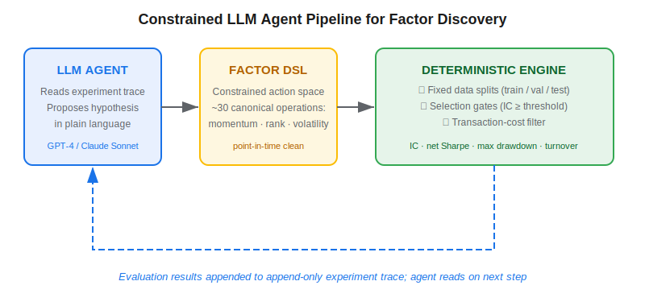
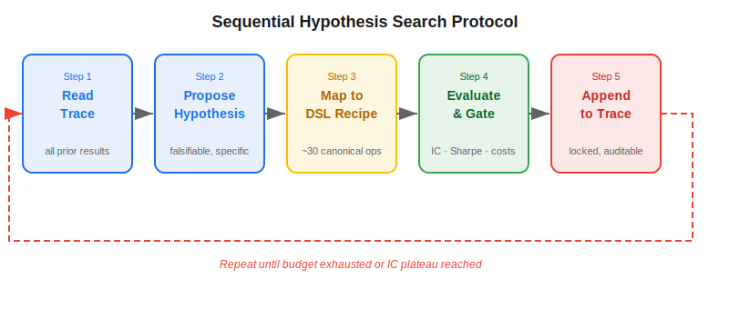

**Automated factor discovery** with large language models is a systematic protocol in which an AI agent iterates through the hypothesis-backtest cycle that has traditionally required human researchers — proposing a new alpha signal, mapping it to executable code, evaluating it against strict statistical gates, and using the result to inform the next hypothesis. The technique emerges from a simple observation: LLMs are excellent brainstormers but dangerous optimizers. Without hard constraints, an agent exploring thousands of factor combinations is indistinguishable from data mining. A constrained-agent framework first applied to cryptocurrency markets by Chen et al. (2025) shows how to capture the creative power of frontier models while preserving the statistical discipline that makes factors tradeable.

## Table of Contents

## What Is Automated Factor Discovery?

In traditional quant research, a researcher forms a hypothesis ("earnings revision momentum correlates with 20-day forward returns"), codes the signal, validates it on a held-out sample, and adds it to the strategy library or discards it. A full cycle takes days to weeks. At any mid-sized quant fund, researchers might evaluate 50–200 factor ideas per quarter, of which perhaps 5–15% survive to production — a low yield from a high-cost process.

**Automated factor discovery** automates the ideation and initial evaluation steps using an AI agent. The agent maintains a running log of prior experiments and proposes the next hypothesis by reasoning over what has and has not worked. This connects to the broader literature on [feature importance in financial ML](https://paperswithbacktest.com/wiki/feature-importance-financial-ml) but flips the paradigm: rather than ranking a fixed set of pre-specified features, the agent generates candidate features from scratch.

The risk in any automated discovery process is uncontrolled search. An agent free to write arbitrary code can trivially find patterns that fit history perfectly but predict nothing out-of-sample — the same [overfitting and data mining](https://paperswithbacktest.com/wiki/backtesting-pitfalls-overfitting) problem that afflicts manual research, now operating at machine speed. Solving this requires architecture, not just discipline.

## How the Constrained Agent Works

The framework has three interlocking layers: a reasoning layer (the LLM), an action layer (a factor domain-specific language), and an evaluation layer (a deterministic engine).

**Reasoning layer — the append-only experiment trace.** At every step, the LLM receives the complete history of prior experiments as read-only context. This trace records each hypothesis proposed, each factor computed, and each portfolio test result — including failures. Because the trace is append-only, the agent cannot revise or omit prior experiments. Every dead end is on record alongside every success, making the full search path auditable and reproducible.

**Action layer — the factor DSL.** The agent does not write arbitrary Python or SQL. Its output is constrained to a vocabulary of canonical point-in-time operations: momentum lookbacks, cross-sectional ranks, rolling correlations, volume normalizations, volatility adjustments, and similar building blocks. This restriction has two benefits: it eliminates hallucination of non-existent data fields, and it ensures every proposed factor is computable in a fully point-in-time-clean pipeline — a prerequisite for realistic backtesting.

**Evaluation layer — the deterministic engine.** Once the agent produces a DSL recipe, the engine takes over entirely:
- **Fixed data splits** — train, validation, and out-of-sample test windows are defined before the first agent run and cannot be modified mid-search.
- **Selection gates** — a factor must achieve a minimum information coefficient (typically IC ≥ 0.02–0.04) on the validation split before it is evaluated on the held-out test set. This prevents the agent from surfacing factors that happen to work on the test set by chance.
- **Transaction-cost accounting** — every portfolio simulation applies round-trip costs calibrated to the asset class. For liquid crypto tokens, 10–40 bps per round turn is typical; for large-cap equities, 2–8 bps. Factors are ranked by net-of-cost Sharpe, not gross IC.
- **Portfolio tests** — surviving factors are evaluated in a long-short, dollar-neutral portfolio with position limits, producing a realistic Sharpe ratio, maximum drawdown, and turnover estimate.

## The Sequential Hypothesis Search Protocol

The loop connecting these layers is what the framework calls **sequential hypothesis search**.

1. **Read** — The agent ingests the full experiment trace: all prior hypotheses, DSL recipes, IC scores, portfolio test results, and gate outcomes.
2. **Propose** — Based on the trace, the agent generates a falsifiable hypothesis in plain language. For example: "A 14-day momentum signal normalized by realized volatility and cross-sectionally ranked should have positive IC on 5-day forward returns, because the trace shows raw momentum decaying while volatility-adjusted signals survive."
3. **Map** — The agent translates the hypothesis into a DSL recipe: `rank(momentum(close, 14) / realizedVol(close, 14), cross_section=True)`.
4. **Evaluate** — The deterministic engine executes the recipe, applies the selection gate, computes portfolio statistics, and records the full result.
5. **Append** — The result — whether success or failure — is appended to the trace in a structured format.
6. **Repeat** — The agent reads the updated trace and proposes the next hypothesis, building on what it has learned.

A typical search budget ranges from 100 to 1,000 iterations. Beyond a few hundred iterations, marginal IC gains tend to plateau as the agent exhausts obvious variations within the DSL. The append-only constraint is the architectural guarantee against [alternative data overfitting](https://paperswithbacktest.com/wiki/alternative-data-overfitting-pitfalls): with no ability to cherry-pick which experiments to report, every hypothesis that reached the test set is counted, including the failures.

## Constrained Agents vs Classical Factor Research

| Dimension | Classical Research | Constrained LLM Agent |
|---|---|---|
| Hypothesis generation | Human researcher | LLM (from experiment trace) |
| Action space | Arbitrary code | Restricted DSL vocabulary (~30 ops) |
| Data split enforcement | Convention / discipline | Hard-enforced by engine |
| Multiple-testing correction | Manual (Bonferroni, BH) | Selection gates on validation |
| Transaction costs | Often deferred to late evaluation | Applied at every iteration |
| Speed | Days–weeks per factor | Minutes per factor |
| Audit trail | Lab notebooks (often incomplete) | Append-only trace (tamper-evident) |
| Researcher degrees of freedom | High | Low (constrained to DSL) |

The key advantage of the constrained approach is not raw speed — it is the systematic elimination of researcher degrees of freedom. A human researcher who tests 50 factor variations but reports only the 3 that survived is conducting implicit multiple testing. An agent using an append-only trace and pre-defined selection gates cannot engage in this behaviour, because every test is on record and every gate threshold was set before the search began.

## Practical Considerations for Algo Trading

**Transaction costs determine survivorship.** In cryptocurrency markets, bid-ask spreads and market impact can consume 20–60 bps on a round trip for mid-cap tokens at meaningful position sizes. A factor with an information coefficient of 0.03 but 30 bps daily average turnover cost will generate negative net alpha. Applying cost accounting at the evaluation stage — rather than as an afterthought — ensures that only factors with realistic live-trading economics survive the search. [LLM trading agents](https://paperswithbacktest.com/wiki/llm-trading-agents) face the same cost dynamics when deciding which signals to act on.

**Regime stability matters more than raw IC.** Crypto factor premia are shorter-lived than equity premia. Momentum signals with 7–14 day lookbacks have delivered annualized Sharpe ratios of 0.8–1.6 in crypto backtests from 2018–2023, but many decay within 6–18 months as the trade becomes crowded. A high IC over the training window does not guarantee persistence. Out-of-sample monitoring and planned factor rotation are essential components of any production deployment.

**DSL expressiveness requires careful calibration.** A narrow DSL reduces overfitting risk but also limits the search space. An overly narrow vocabulary rediscovers known factors; an overly broad one reintroduces the hallucination and multiple-testing problems the constraint was meant to prevent. The cryptocurrency implementation described in Chen et al. (2025) uses approximately 30 canonical operations covering price, volume, and volatility features — a practical starting point for equity or futures applications.

**LLM inference costs are manageable.** Running a frontier model to propose 500 factor hypotheses costs roughly $5–$25 in API fees depending on trace length and context size. For most research teams, this is negligible compared to analyst time — but the cost grows with universe size and iteration count. Teams can reduce cost by using smaller fine-tuned models for the hypothesis-generation step while reserving frontier models for reasoning over complex trace patterns.

**Integration with portfolio construction.** Discovered factors plug naturally into existing [hierarchical risk parity](https://paperswithbacktest.com/wiki/hierarchical-risk-parity-hrp) or mean-variance frameworks. Each factor's autocorrelation structure and IC decay profile inform how it combines with others. Factors with high IC but high autocorrelation (slow-moving signals) require different position-management logic than low-autocorrelation, high-turnover signals. The [agentic AI architecture](https://paperswithbacktest.com/wiki/agentic-ai-finance-copilots-vs-agents) described in this framework naturally extends to portfolio construction: once a factor library exists, a second agent layer can optimize weighting and rebalancing rules.

## Conclusion

Constrained LLM agents for factor discovery represent a credible, production-ready approach to accelerating systematic research without sacrificing the statistical rigour that makes factors tradeable. The framework's core innovation is the architecture that channels LLM creativity through a narrow DSL, enforces honest bookkeeping via an append-only trace, and mandates transaction-cost accounting from the first iteration. As traditional factor libraries become increasingly crowded, the ability to run disciplined, automated discovery at scale — and across less-explored asset classes like cryptocurrencies or derivatives — will be a growing source of edge for quant teams prepared to invest in the supporting infrastructure.

## References & Further Reading

[1]: [From Hypotheses to Factors: Constrained LLM Agents in Cryptocurrency Markets (Chen et al., 2025)](https://arxiv.org/abs/2604.26747v1)
[2]: [Feature Importance in Financial Machine Learning](https://paperswithbacktest.com/wiki/feature-importance-financial-ml)
[3]: [Backtesting Pitfalls and Overfitting in Quantitative Trading](https://paperswithbacktest.com/wiki/backtesting-pitfalls-overfitting)
[4]: [Alternative Data Overfitting Pitfalls](https://paperswithbacktest.com/wiki/alternative-data-overfitting-pitfalls)
[5]: [LLM Trading Agents Explained](https://paperswithbacktest.com/wiki/llm-trading-agents)
[6]: [Agentic AI in Finance: From Copilots to Autonomous Trading Systems](https://paperswithbacktest.com/wiki/agentic-ai-finance-copilots-vs-agents)
