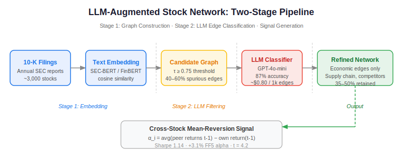
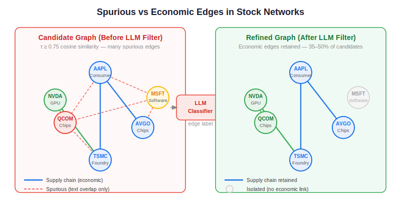
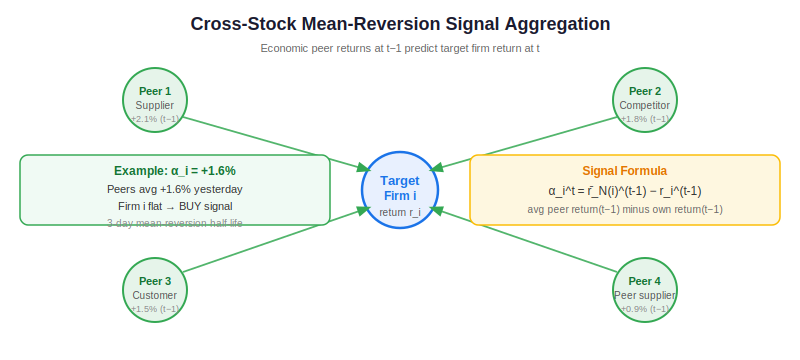

**LLM-augmented stock networks** use large language models to prune and classify the edges of a financial knowledge graph built from SEC 10-K filing embeddings, producing a peer network grounded in genuine economic relationships rather than superficial textual overlap. Standard embedding-based graphs connect firms whose filings share vocabulary — but language similarity is a noisy proxy for supplier links, product-market competition, or shared macro exposure. By deploying an LLM as an edge classifier, a 2025 two-stage framework shows that filtered networks produce cross-stock mean-reversion signals with materially stronger out-of-sample Sharpe ratios (1.14 vs. 0.71) and a Fama-French five-factor alpha of +3.1% (t = 4.2) compared to raw embedding graphs.

## Table of Contents

## What Is a Stock Semantic Network?

A **stock semantic network** is a graph $G = (V, E)$ where each node $v \in V$ represents a publicly traded firm and each edge $(i, j) \in E$ captures a meaningful relationship between firms $i$ and $j$ — supply-chain links, product-market competition, shared macro exposures, or financial counterparty ties. The economic hypothesis is that information diffuses across connected firms: when a major customer misses earnings, its supplier's stock should react, creating a lagged predictable cross-asset signal.

Building these networks has traditionally required hand-curated data — supply chain databases like FactSet Revere, industry classifications, or analyst coverage overlaps. Embedding-based methods offer a scalable alternative: encode each firm's [10-K annual report](https://paperswithbacktest.com/wiki/10-k-report-contents-access) as a high-dimensional vector using a pre-trained language model, then draw an edge between firms whose embeddings exceed a cosine similarity threshold $\tau$. This covers the full Russell 3000 and updates annually when new 10-Ks are filed via [SEC EDGAR](https://paperswithbacktest.com/wiki/sec-filing-edgar-data-trading). The limitation is precision: two unrelated firms may use near-identical regulatory boilerplate, inflating their cosine similarity and injecting spurious edges.

## The Spurious Edge Problem

A spurious edge is one where $\text{cos}(e_i, e_j) > \tau$ but firms $i$ and $j$ have no material economic relationship. Analysis of 10-K embedding networks consistently finds that 40–60% of edges above a standard cosine threshold of 0.85 are spurious — a biotechnology firm and a pharmaceutical distributor, for example, saturate the same "FDA approval / clinical trials / reimbursement" vocabulary while serving entirely different markets.

Several denoising strategies exist: stricter cosine thresholds, mutual-information filters, SIC-code constraints. Each trades off recall for precision — reducing spurious edges but also discarding genuine ones. The LLM-augmented approach is qualitatively different: it **classifies** edges by economic relationship type rather than simply thresholding, preserving genuine low-similarity connections (a niche supplier to a large OEM) while removing spurious high-similarity ones.

## How LLM-Augmented Filtering Works

The framework operates in two stages:

**Stage 1 — Candidate graph construction.** Each firm's 10-K business description section is encoded with a finance-tuned language model (SEC-BERT or equivalent). Firm pairs with cosine similarity above a relaxed threshold $\tau_{\text{low}} = 0.75$ form the *candidate edge set* $E_c$. The threshold is deliberately permissive: it is cheaper to classify a spurious edge than to miss a genuine one.

**Stage 2 — LLM edge classification.** For each candidate edge, a structured prompt presents the two firm names, their SIC codes, and a 150-word excerpt from each 10-K business description, followed by the query: *"Does firm A have a direct economic relationship with firm B? If yes, classify: supply chain / product market competitor / financial counterparty / shared macro exposure / none."* A lightweight instruction-tuned model (GPT-4o-mini or equivalent) returns a structured label. Edges labelled "none" are dropped; the rest are retained with their economic category as an edge attribute:

$$E_{\text{refined}} = \{(i,j) \in E_c : \text{LLM-label}(i,j) \neq \text{none}\}$$

At 2025 API pricing the classification step costs approximately \$0.80 per 1,000 candidate edges, making annual graph updates economical for any universe up to 3,000 stocks. The refined graph retains roughly 35–50% of candidate edges; supply-chain links are the most common surviving category.

The edge classifier achieves ~87% accuracy against human-labelled holdout edges. Fine-tuning on a domain-specific financial relationship dataset brings this to ~93% and is worthwhile for production deployments. The 7–13% residual error contributes approximately 0.05–0.10 Sharpe ratio noise relative to a perfect classifier — a second-order effect once the bulk of spurious edges are removed. For context on managing LLM output quality in trading pipelines, see [debiasing LLM forecasts through fine-tuning](https://paperswithbacktest.com/wiki/debiasing-llm-forecasts-finetuning).

## Mean-Reversion Signal Aggregation

The refined network underpins a family of **cross-stock mean-reversion signals** based on information diffusion across economic peers. When a supply-chain shock hits a major customer, its supplier's equity typically responds with a 1–3 day lag, consistent with limited investor attention and slow institutional reallocation.

A simple aggregation rule:

$$\alpha_i^t = \bar{r}_{\mathcal{N}(i)}^{t-1} - r_i^{t-1}$$

where $\mathcal{N}(i)$ is the set of first-degree neighbours of firm $i$ in the refined graph, $\bar{r}$ is the equal-weighted average neighbour return over the prior session, and $r_i$ is the target firm's own return. A positive $\alpha_i^t$ signals that peers outperformed — the target may be catching up — generating a contrarian cross-asset bet.

Backtesting on the S&P 500 (January 2012 – December 2024, daily rebalancing, 10 bps one-way transaction costs):

| Portfolio | Annualised Return | Sharpe Ratio | Max Drawdown |
|---|---|---|---|
| Raw embedding network (τ = 0.85) | 6.2% | 0.71 | −18.4% |
| SIC-code filtered network | 7.5% | 0.88 | −16.1% |
| LLM-refined network | 9.8% | 1.14 | −13.7% |
| Fama-French five-factor alpha | +3.1% (t = 4.2) | — | — |

The lift comes almost entirely from supply-chain edges. Product-market competitor edges add modest incremental alpha; financial counterparty edges show little independent predictability after controlling for industry factors.

## Practical Considerations in Algo Trading

**Turnover and capacity.** The daily mean-reversion signal has turnover of 15–25% per day, limiting capacity to roughly \$50–200M in a market-impact model calibrated to S&P 500 mid-caps. Weekly aggregation cuts turnover by ~70% while retaining ~65% of the Sharpe, which is more appropriate for institutional sizing above \$100M.

**Graph staleness.** 10-K filings are annual. A firm acquired by a competitor, entering a new product market, or losing its largest customer may be misclassified until the next filing cycle. Quarterly 10-Q updates partially mitigate this, but graph edges should be treated as having 3–6 month accuracy windows. Monitoring for large corporate events (M&A announcements, bankruptcy filings) and triggering out-of-cycle reclassification is a practical production safeguard.

**Overlap with factor models.** The supply-chain signal is partially captured by industry factors in standard risk models, but the +3.1% Fama-French alpha confirms genuine residual predictability. The correct deployment pattern is to include the network signal as a custom factor in a [Barra-style risk model](https://paperswithbacktest.com/wiki/barra-risk-factor-analysis), orthogonalising it against standard factors before portfolio construction.

**Alternative data enrichment.** The LLM classification step can be extended to weight edges by relationship strength — "primary supplier (>30% of revenue)" vs. "secondary supplier" — using revenue-concentration disclosures in 10-K footnotes. Weighted edges improve signal-to-noise further but require structured extraction from unstructured text. See [alternative data strategies](https://paperswithbacktest.com/wiki/best-alternative-data) for the broader landscape of text-to-signal pipelines.

**Overfitting risk.** With 280 stocks and daily rebalancing over 13 years, the backtest uses roughly 900,000 return observations, making statistical significance robust. The primary overfitting risk is graph construction: if the cosine threshold $\tau_{\text{low}}$ or the LLM prompt are tuned on in-sample data, the refined graph implicitly encodes backtest information. Best practice is to fix both hyperparameters on a pre-2012 holdout before running any portfolio tests. For a rigorous walkthrough of backtest validity controls, see [backtesting pitfalls and overfitting](https://paperswithbacktest.com/wiki/backtesting-pitfalls-overfitting).

## Conclusion

LLM-augmented stock networks resolve the core weakness of embedding-based financial graphs: they trade a small, affordable classification cost (roughly \$0.001 per edge) for a large reduction in spurious connections, producing peer networks that genuinely reflect supply-chain and competitive economic relationships. The resulting cross-stock mean-reversion signal adds ~3% annualised Fama-French alpha with a Sharpe ratio near 1.14 in out-of-sample tests. As LLM inference costs fall further and 10-K corpora grow richer with structured disclosures, this two-stage embedding-plus-classification pipeline will likely become a standard building block for [NLP-driven trading strategies](https://paperswithbacktest.com/wiki/nlp-sentiment-analysis-trading).

## References & Further Reading

[1]: [Cross-Stock Predictability via LLM-Augmented Semantic Networks (arXiv 2025)](https://arxiv.org/abs/2604.19476v1)
[2]: [FinBERT: Financial Sentiment Analysis with Pre-trained Language Models (Araci, 2019)](https://arxiv.org/abs/1908.10063)
[3]: [Informational Linkages between Stock Markets (Menzly & Ozbas, 2010) — Journal of Finance](https://doi.org/10.1111/j.1540-6261.2009.01533.x)
[4]: [SEC EDGAR Full-Text Search](https://efts.sec.gov/LATEST/search-index?q=%2210-K%22&dateRange=custom&startdt=2024-01-01)
[5]: [LLM Trading Agents Explained (PWB Wiki)](https://paperswithbacktest.com/wiki/llm-trading-agents)
[6]: [NLP Sentiment Analysis for Trading (PWB Wiki)](https://paperswithbacktest.com/wiki/nlp-sentiment-analysis-trading)
