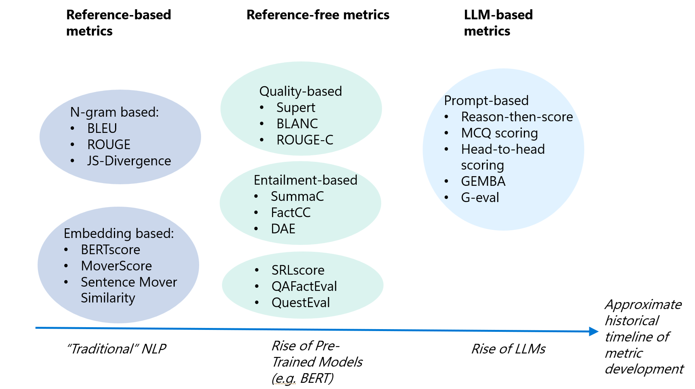

## Table of Contents

## What are LLM Evaluations (Evals) in machine learning?

LLM Evaluations, or Evals, are a way to check how well large language models (LLMs) are doing. They help us see if the models can understand and create text like a human would. Evals look at things like how correct the model's answers are, how well it follows instructions, and how natural its language sounds. By using Evals, we can find out what the model is good at and where it needs to improve.

There are different kinds of Evals, like ones that test the model on specific tasks or ones that look at how the model does overall. For example, we might use Evals to see how well a model can answer questions about history or how well it can write a story. These tests help us make the models better by showing us what to focus on. In the end, Evals help make sure that the language models we use are helpful and reliable.

## Why are LLM Evaluations important for developing machine learning models?

LLM Evaluations are important because they help us understand how well a language model is working. By testing the model with different tasks, we can see if it gives correct answers, follows instructions well, and sounds natural when it talks or writes. This helps us find out what the model is good at and where it needs to get better. Without Evals, we wouldn't know if the model is ready to use or if it needs more training.

Using Evals also helps us make sure the model is safe and fair. We can check if the model gives the same good answers to everyone, no matter who they are. This is important because we want the model to be helpful to all people. By doing these checks, we can keep improving the model until it works well for everyone. In the end, Evals make sure that the language models we use are both useful and reliable.

## How do LLM Evaluations differ from traditional model evaluation methods?

LLM Evaluations are different from traditional model evaluation methods because they focus on how well a language model can understand and create text like a human. Traditional methods often look at things like accuracy and error rates using numbers and formulas, like $$ \text{Accuracy} = \frac{\text{Number of correct predictions}}{\text{Total number of predictions}} $$. But LLM Evals go beyond just numbers. They check how well the model follows instructions, how natural its language sounds, and if it can do tasks that need understanding and creating text.

Another way LLM Evals are different is that they often use human judgment to see how good the model's answers are. Traditional methods might use set rules or automatic checks to see if a model is right or wrong. But with LLM Evals, people might read what the model writes and say if it sounds right or if it makes sense. This helps us see if the model can really talk and write like a person. By using both human checks and special tests, LLM Evals give us a fuller picture of how well the model works in real life.

## What are the key components of an LLM Evaluation framework?

The key components of an LLM Evaluation framework include the tasks or datasets used for testing, the metrics used to measure performance, and the methods for evaluating the model's outputs. Tasks or datasets are carefully chosen to represent the kinds of things the model will need to do in the real world, like answering questions or writing stories. Metrics are important because they help us see how well the model is doing. For example, we might use accuracy $$ \text{Accuracy} = \frac{\text{Number of correct predictions}}{\text{Total number of predictions}} $$ to see if the model's answers are right, but we also use other metrics like how well it follows instructions or how natural its language sounds.

The methods for evaluating the model's outputs can be automatic or involve human judgment. Automatic methods use computer programs to check the model's answers quickly, but they might miss things that only a person would notice. Human judgment is important because people can tell if the model's answers make sense and sound like something a person would say. By combining these different components, an LLM Evaluation framework gives us a full picture of how well the model works and where it needs to improve.

## Can you explain the process of conducting an LLM Evaluation?

Conducting an LLM Evaluation starts with choosing the right tasks or datasets. These should match the kinds of things the model will need to do in the real world. For example, if the model is meant to answer questions, we might use a dataset of questions and their correct answers. Once we have the tasks, we run the model on these tasks and collect its outputs. This could be the model's answers to questions, or the stories it writes.

Next, we need to check how well the model did using different metrics. We might use accuracy to see if the model's answers are right, calculated as $$ \text{Accuracy} = \frac{\text{Number of correct predictions}}{\text{Total number of predictions}} $$. But we also look at other things like how well the model follows instructions or how natural its language sounds. We can use automatic methods to check the model's answers quickly, but for a fuller picture, we often use human judgment too. People can read what the model writes and say if it makes sense and sounds like something a person would say. By combining these different ways of checking, we get a good idea of how well the model is doing and where it needs to improve.

## What metrics are commonly used in LLM Evaluations?

In LLM Evaluations, we often use accuracy to see if the model's answers are right. Accuracy is calculated as $$ \text{Accuracy} = \frac{\text{Number of correct predictions}}{\text{Total number of predictions}} $$. This helps us know how many times the model got the right answer out of all the times it tried. But accuracy is just one part of the story. We also look at how well the model follows instructions. This means checking if the model does what we ask it to do, like answering a question in a certain way or writing a story with specific details.

Another important metric is how natural the model's language sounds. We want the model to talk and write like a real person, so we check if its answers make sense and sound right. Sometimes, we use special scores like BLEU or ROUGE to see how similar the model's text is to what a human might write. But these scores don't tell the whole story, so we often ask people to read the model's answers and give their opinion. By using all these different metrics, we get a good idea of how well the model is doing and where it needs to improve.

## How can biases be identified and mitigated through LLM Evaluations?

Biases in large language models can be identified during LLM Evaluations by looking at how the model responds to different groups of people. We can use special datasets that include examples from many different backgrounds and see if the model treats everyone the same. For example, we might check if the model gives the same good answers to questions about history no matter who is asking. If the model's answers change based on things like race, gender, or age, that's a sign of bias. We can also ask people to read the model's answers and say if they think the model is being fair or if it's showing favoritism.

To mitigate biases, we can use the information from the evaluations to make the model better. If we find that the model is biased, we can add more examples to its training data that show a wider range of people and situations. We might also change how the model learns from its data to make sure it doesn't pick up on biases. By doing more evaluations after these changes, we can keep checking if the model is getting better at treating everyone fairly. This way, we can keep working on the model until it gives helpful and fair answers to everyone.

## What are some challenges faced when performing LLM Evaluations?

One challenge when performing LLM Evaluations is figuring out the right tasks and datasets to use. We need to make sure the tasks are like what the model will do in real life. If we pick the wrong tasks, the evaluation won't tell us much about how well the model will work for people. Also, it can be hard to find datasets that cover all the different kinds of people and situations the model might see. If the datasets are not diverse enough, the model might seem to work well but then fail when it meets new kinds of questions or people.

Another challenge is choosing the right metrics to measure how well the model is doing. Accuracy, calculated as $$ \text{Accuracy} = \frac{\text{Number of correct predictions}}{\text{Total number of predictions}} $$, is important, but it doesn't tell the whole story. We also need to check if the model follows instructions well and if its language sounds natural. Using human judgment to evaluate the model can help, but it takes a lot of time and can be hard to do the same way every time. Balancing automatic checks with human reviews is tricky but important for getting a full picture of the model's performance.

## How do LLM Evaluations contribute to model improvement and iteration?

LLM Evaluations help us make language models better by showing us what they are good at and where they need to improve. When we test the model with different tasks, we can see if it gives the right answers, follows instructions well, and sounds natural. For example, we might use accuracy, calculated as $$ \text{Accuracy} = \frac{\text{Number of correct predictions}}{\text{Total number of predictions}} $$, to see how often the model gets things right. But we also look at other things like how well it understands what we're asking and how it puts words together. By doing these checks, we can find out exactly where the model is struggling and focus on fixing those parts.

Once we know what needs to be improved, we can change the model's training data or how it learns to make it better. For example, if the model is having trouble with certain types of questions, we can add more examples of those questions to its training data. Or if the model's answers don't sound natural, we might change how it learns to make its language sound more like a person's. After making these changes, we run the evaluations again to see if the model is doing better. This cycle of testing, improving, and retesting helps us keep making the model better until it works well for everyone.

## What role do human evaluators play in LLM Evaluations?

Human evaluators are important in LLM Evaluations because they help check if the model's answers make sense and sound like something a person would say. They read what the model writes and give their opinion on how good it is. This is different from automatic checks that just look at numbers like accuracy, which is calculated as $$ \text{Accuracy} = \frac{\text{Number of correct predictions}}{\text{Total number of predictions}} $$. Human evaluators can see things that computers might miss, like if the model's answers are fair or if they follow instructions well.

By using human evaluators, we get a fuller picture of how well the model works. They can tell us if the model's language sounds natural and if it understands what we're asking. This helps us find out where the model needs to improve. After we make changes to the model, human evaluators check again to see if it's doing better. This way, we can keep working on the model until it gives helpful and fair answers to everyone.

## Can you discuss advanced techniques used in LLM Evaluations for fine-tuning models?

Advanced techniques in LLM Evaluations for fine-tuning models include using specialized datasets that are carefully chosen to focus on areas where the model needs improvement. For example, if the model struggles with answering questions about science, we might use a dataset full of science questions to help it get better. We can also use techniques like active learning, where the model picks out the examples it's not sure about, and we add more of those to the training data. This helps the model learn from its mistakes and improve faster. Another technique is adversarial training, where we try to trick the model with hard or tricky questions to make it stronger. By using these advanced methods, we can fine-tune the model to be better at specific tasks and handle a wider range of questions.

Human evaluators play a big role in these advanced techniques. They read the model's answers and tell us if they sound right and make sense. This is important because even if the model gets the right answer, it might not explain it well or use language that sounds natural. Human evaluators can also help us check if the model is fair and doesn't show bias towards any group of people. By combining these human checks with the special datasets and training methods, we can keep improving the model until it works well for everyone.

## How are LLM Evaluations evolving with the latest advancements in machine learning?

LLM Evaluations are getting better thanks to new ideas in [machine learning](/wiki/machine-learning). One big change is using special datasets that focus on areas where the model needs to improve. For example, if the model is not good at answering science questions, we might use a dataset full of science questions to help it get better. We also use techniques like active learning, where the model picks out the examples it's not sure about, and we add more of those to the training data. This helps the model learn from its mistakes and improve faster. Another technique is adversarial training, where we try to trick the model with hard or tricky questions to make it stronger. By using these advanced methods, we can fine-tune the model to be better at specific tasks and handle a wider range of questions.

Human evaluators are still very important in these new evaluation methods. They read the model's answers and tell us if they sound right and make sense. This is important because even if the model gets the right answer, it might not explain it well or use language that sounds natural. Human evaluators can also help us check if the model is fair and doesn't show bias towards any group of people. By combining these human checks with the special datasets and training methods, we can keep improving the model until it works well for everyone.