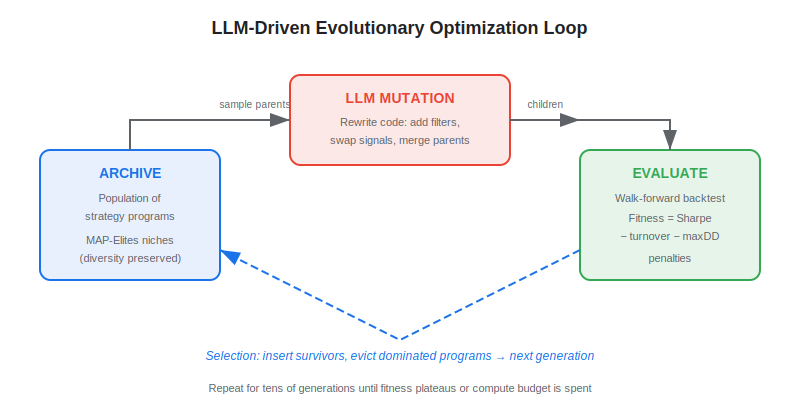
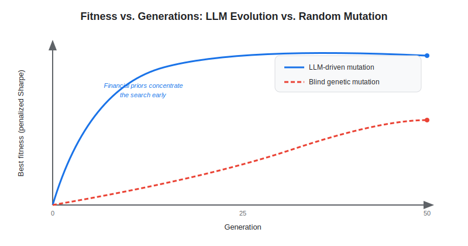

**LLM-driven evolutionary optimization** is a strategy-search technique that puts a large language model inside the mutation step of an evolutionary algorithm: instead of randomly perturbing parameters, the LLM rewrites the *code* of a candidate trading strategy — its features, signals, and risk rules — guided by the performance of previous generations. The approach generalizes DeepMind's AlphaEvolve to quantitative finance, with the 2026 MadEvolve framework demonstrating that an LLM-in-the-loop evolutionary engine can evolve feature sets, signal logic, and position-sizing rules that beat hand-tuned baselines on Bitcoin trading. This article explains how the loop works, how it differs from classical genetic programming, and what it means in live-trading reality.

## Table of Contents

## What Is LLM-Driven Evolutionary Optimization?

Evolutionary optimization is an old idea in quantitative finance: maintain a *population* of candidate strategies, evaluate each one's *fitness* (typically risk-adjusted return), keep the best, and breed the next generation through mutation and crossover. Classical implementations — genetic algorithms (GAs) and genetic programming (GP) — represent a strategy as a vector of parameters or an expression tree and mutate it with blind, rule-based operators. They explore enormous search spaces but are sample-hungry and tend to discover brittle, over-fit expressions.

LLM-driven evolutionary optimization replaces the blind mutation operator with a language model. Inspired by DeepMind's **AlphaEvolve** (2025), which used Gemini models to evolve algorithms for open mathematical and engineering problems, the MadEvolve framework (Riquelme et al., 2026) applies the same recipe to trading. The LLM receives the source code of one or more parent strategies, their backtest metrics, and a natural-language objective, then proposes a semantically meaningful edit — adding a volatility filter, swapping an indicator, reframing an entry condition — rather than a random byte flip.

Because the mutation is guided by the model's prior knowledge of finance and code, the search concentrates probability mass on plausible strategies, so useful variants appear in tens of generations rather than thousands. The trade-off is cost: every mutation is an LLM call, and every candidate still needs a full backtest.

## How It Works

The engine repeats a four-stage generational loop. Each generation produces a new batch of candidate programs, scores them, and feeds the survivors back as parents.

- **Sample parents** — Draw one or more high-fitness programs from an archive. MadEvolve, like AlphaEvolve, keeps a *MAP-Elites*-style archive that preserves diversity across behavioral niches (e.g., high-turnover vs. low-turnover strategies) so the search does not collapse onto a single local optimum.
- **LLM mutation** — Prompt the model with the parent code, its metrics, and a few elite exemplars. The model returns a diff or a full rewrite. Crossover is natural here: the prompt can show two parents and ask the model to merge their best ideas.
- **Evaluate** — Compile and backtest each child on held-out data, computing a fitness score. A typical objective blends return and risk, for example a penalized Sharpe ratio:

$$ \text{fitness} = \frac{\mathbb{E}[r_p]}{\sigma_p} - \lambda \cdot \text{turnover} - \gamma \cdot \text{maxDD} $$

where $\lambda$ and $\gamma$ penalize transaction-cost-heavy churn and deep drawdowns.

- **Select** — Insert children into the archive, evicting dominated programs. The cycle repeats until the fitness plateaus or a compute budget is exhausted.

A critical design choice is the **evaluation guardrail**. Because the LLM optimizes whatever metric it is shown, the fitness function must already discount look-ahead bias, survivorship, and trading costs — otherwise the model will dutifully evolve a strategy that exploits the leak rather than a real edge. This connects directly to well-known [backtesting pitfalls and overfitting](https://paperswithbacktest.com/wiki/backtesting-pitfalls-overfitting): an LLM evolver is an exceptionally efficient overfitting machine if the scorer is sloppy.

## LLM Evolution vs. Classical Genetic Programming

Both methods are population-based search, but they differ in the unit of mutation and the prior that guides it.

| Dimension | Genetic Programming | LLM-Driven Evolution |
|---|---|---|
| Mutation unit | Expression tree / parameter vector | Source code (functions, features, rules) |
| Mutation operator | Random, syntax-bound | Semantic edit from a learned prior |
| Domain knowledge | None (blind search) | Encoded in the model's weights |
| Generations to converge | Thousands | Tens to low hundreds |
| Cost per mutation | Negligible | One LLM inference call |
| Output readability | Often opaque expressions | Human-readable, commented code |
| Risk of overfitting | High | High (faster, so arguably higher) |

The headline advantage is *sample efficiency*: by injecting financial common sense, the LLM avoids the vast regions of the search space that GP wastes cycles on. The headline risk is unchanged — neither method protects you from data-snooping. Treating LLM evolution as a more powerful search engine, not a smarter scientist, keeps expectations honest. The same discipline applies as in any [trading strategy optimization](https://paperswithbacktest.com/wiki/trading-strategy-optimization) effort: the optimizer is only as trustworthy as the validation protocol wrapped around it.

This places the technique adjacent to other AI-for-alpha methods such as [LLM agents for factor discovery](https://paperswithbacktest.com/wiki/llm-agents-factor-discovery) and [reinforcement learning for portfolio management](https://paperswithbacktest.com/wiki/reinforcement-learning-portfolio-management). Where RL learns a policy by interacting with a market simulator, evolutionary search edits explicit, inspectable strategy code — an attractive property for teams that need auditable logic.

## Practical Considerations in Algo Trading

The MadEvolve results — significant improvements across feature evolution, signal generation, and parameter tuning on a Bitcoin backtest — are encouraging but carry the usual caveats of a single-asset, simulation-based study. Before allocating capital, several realities dominate.

**Validation cost is the binding constraint.** Every generation requires backtesting an entire population, and to resist overfitting each candidate should be scored with [walk-forward optimization](https://paperswithbacktest.com/wiki/walk-forward-optimization) or combinatorial purged cross-validation, not a single in-sample run. Running 50 generations of 30 candidates means ~1,500 rigorous backtests plus 1,500 LLM calls — non-trivial in both wall-clock time and API spend.

**Capacity and costs erode evolved edges fast.** Strategies that look brilliant in a frictionless backtest often evaporate once realistic slippage, fees, and market impact are charged. Penalizing turnover inside the fitness function (the $\lambda$ term above) is essential; an LLM left to maximize raw Sharpe will happily evolve a strategy that trades hundreds of times a day.

**Expect modest, decaying Sharpe in live trading.** Academic backtests routinely report Sharpe ratios of 2+, but live, cost-adjusted, out-of-sample performance for systematic equity and crypto strategies more commonly lands in the 0.5–1.2 range. Evolved strategies are no exception and may decay faster because the search optimizes hard against the specific history it was shown.

**Diversity preservation pays off.** Keeping a MAP-Elites archive rather than a single elite reduces the chance the engine converges on one fragile motif, and it yields a portfolio of low-correlation candidates that can be ensembled — a more robust outcome than betting on the single highest-fitness program.

**Reproducibility requires fixing the model.** Because LLM outputs are stochastic, pin the model version and temperature, and log every prompt and diff so an evolved strategy can be regenerated and audited later.

## Conclusion

LLM-driven evolutionary optimization reframes strategy discovery as guided code evolution: the language model supplies financial priors that make the search dramatically more sample-efficient than blind genetic programming, while the evolutionary scaffold keeps the output as explicit, testable strategy code. It is best understood as a force-multiplier on search, not a substitute for rigorous validation — its very efficiency makes a careless fitness function more dangerous, not less. As frontier models grow cheaper and faster, expect this AlphaEvolve-style loop to become a standard tool in the quant research stack, sitting alongside [systematic trading strategies](https://paperswithbacktest.com/wiki/systematic-trading-strategies) and reinforcement learning as complementary routes to durable alpha.

## References & Further Reading

[1]: [MadEvolve: Evolutionary Optimization of Trading Systems with Large Language Models](https://arxiv.org/abs/2605.23007v1)
[2]: [AlphaEvolve: A coding agent for scientific and algorithmic discovery (DeepMind, 2025)](https://deepmind.google/discover/blog/alphaevolve-a-gemini-powered-coding-agent-for-designing-advanced-algorithms/)
[3]: [Illuminating search spaces by mapping elites (Mouret & Clune, 2015)](https://arxiv.org/abs/1504.04909)
[4]: [Genetic Programming: On the Programming of Computers by Means of Natural Selection (Koza, 1992)](https://mitpress.mit.edu/9780262111706/genetic-programming/)
