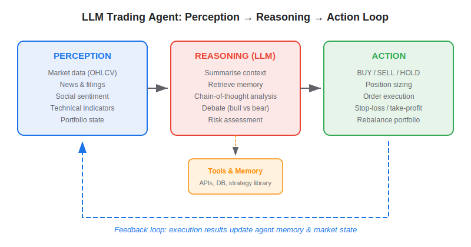
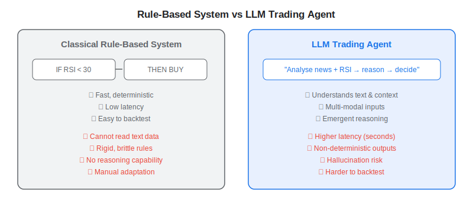
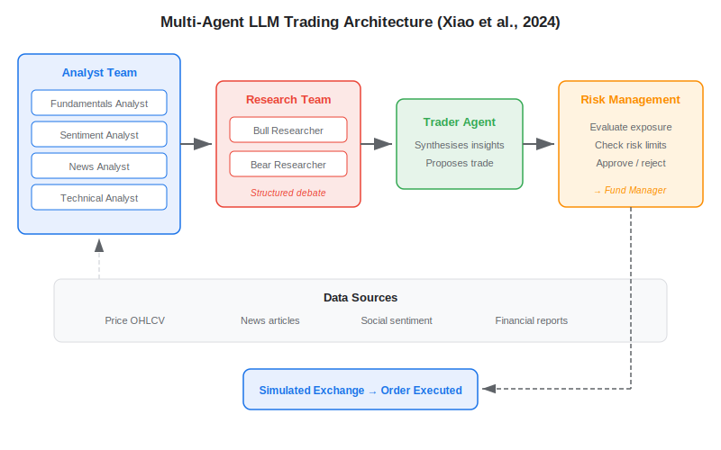
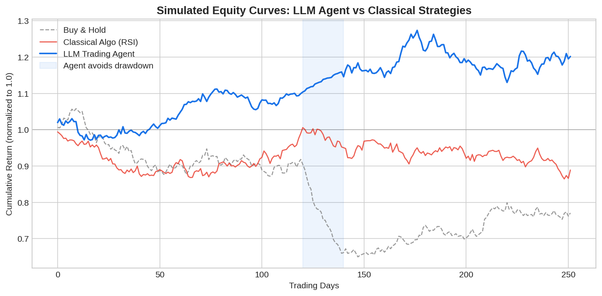

An **LLM trading agent** is an autonomous system that uses a large language model as its reasoning core to perceive market data, analyse it in natural language, and output concrete trading decisions — buy, sell, or hold — with position sizing and risk controls. Unlike classical algorithmic trading systems that execute hard-coded rules (e.g., "buy when RSI < 30"), an AI trading agent can read earnings transcripts, parse breaking news, weigh conflicting signals through chain-of-thought reasoning, and adapt its behaviour without rewriting a single line of code. The rapid improvement of foundation models in 2023-2025, combined with open-source agent frameworks such as LangChain, LangGraph, and smolagents, has made this architecture accessible to individual quant developers — not just hedge-fund engineering teams.

## What Is an LLM Trading Agent?

At its simplest, an LLM trading agent wraps a large language model inside a **perception → reasoning → action** loop that repeats at every decision interval (daily, hourly, or per tick). The concept is grounded in the ReAct (Reasoning + Acting) paradigm: the model observes the environment, thinks step-by-step, chooses a tool or action, observes the result, and iterates.



The three stages break down as follows:

**Perception** — The agent ingests multi-modal data: OHLCV price bars, technical indicators, news articles, SEC filings, social-media sentiment scores, and the current portfolio state. Each data source is typically handled by a dedicated *tool* the LLM can call.

**Reasoning** — The LLM processes the gathered context. It may summarise overnight news, retrieve relevant memories from past sessions, run a chain-of-thought analysis comparing bullish and bearish arguments, and finally propose an action with a confidence estimate.

**Action** — The output is a structured trading decision — often JSON — specifying ticker, direction, quantity, and order type. A downstream execution module validates the order against risk limits before routing it to a broker or simulated exchange.

This loop maps directly onto the agent architectures surveyed by Ding et al. (2024) in their comprehensive review of LLM agents in financial trading, which categorises designs into *LLM-as-Trader* (the model outputs orders directly) and *LLM-as-Alpha-Miner* (the model discovers signals that feed a separate execution engine).

## How LLM Trading Agents Differ from Rule-Based Systems

Classical [systematic trading](https://paperswithbacktest.com/wiki/systematic-trading) strategies encode market logic as explicit if/then rules applied to numerical data. They are fast, deterministic, and straightforward to backtest. An LLM agent, by contrast, trades off speed for flexibility: it can reason over unstructured text, handle ambiguous situations, and adapt its logic through prompt changes rather than code changes.



| Dimension | Rule-Based Algo | LLM Trading Agent |
|---|---|---|
| Input data | Numeric (price, volume, indicators) | Numeric + text (news, filings, sentiment) |
| Decision logic | Hard-coded IF/THEN rules | Emergent chain-of-thought reasoning |
| Adaptability | Requires code change | Modify prompt or in-context examples |
| Latency | Microseconds–milliseconds | Seconds (LLM inference) |
| Determinism | Fully deterministic | Stochastic (temperature > 0) |
| Backtesting | Standard backtest engines | Requires LLM-in-the-loop simulation |
| Explainability | Transparent rules | Natural-language rationale per trade |

The key insight is that these approaches are **complementary**. A well-designed agent can call rule-based strategies as tools — for instance, querying a momentum signal library for ranked tickers — while the LLM layer handles the higher-level portfolio reasoning that is difficult to express in fixed rules. PWB's strategy library provides battle-tested signal logic that serves as the knowledge base these agents reason over.

## Multi-Agent Architectures: TradingAgents

The most ambitious open-source effort to date is **TradingAgents** by Xiao et al. (2024), which mirrors the organisational structure of a real trading firm. Instead of one monolithic LLM, it deploys seven specialised agents — fundamental analyst, sentiment analyst, news analyst, technical analyst, bull researcher, bear researcher, and trader — coordinated by a risk-management team and a fund manager who approves final orders.



The bull and bear researchers engage in a structured debate before the trader synthesises their conclusions. The risk-management team continuously evaluates portfolio exposure and can veto trades that breach predefined limits. In backtests covering January–March 2024, TradingAgents demonstrated improved cumulative returns, Sharpe ratio, and maximum drawdown compared to single-agent baselines and classical strategies like MACD and RSI. The framework is built on **LangGraph** and supports multiple LLM providers including OpenAI, Anthropic, and open-source models via Ollama.

## Python Skeleton: Building a Minimal LLM Trading Agent

Below is a simplified but runnable skeleton using **smolagents** (Hugging Face's lightweight agent library) that illustrates the core perception → reasoning → action loop. It fetches a daily price series, computes a simple technical indicator, and asks the LLM to decide.

```python
from smolagents import CodeAgent, LiteLLMModel, tool
import yfinance as yf
import pandas as pd

# --- Tools (perception layer) ---
@tool
def get_price_and_rsi(ticker: str, period: str = "3mo") -> str:
    """Fetch recent OHLCV data and 14-day RSI for a given ticker.

    Args:
        ticker: Stock ticker symbol (e.g. 'AAPL').
        period: Look-back window for yfinance (e.g. '3mo').

    Returns:
        str: Latest price, 14-day RSI, and 5-day return.
    """
    df = yf.download(ticker, period=period, progress=False)
    close = df["Close"].squeeze()
    delta = close.diff()
    gain = delta.where(delta > 0, 0.0).rolling(14).mean()
    loss = (-delta.where(delta < 0, 0.0)).rolling(14).mean()
    rs = gain / loss
    rsi = 100 - (100 / (1 + rs))
    latest = close.iloc[-1]
    ret_5d = (close.iloc[-1] / close.iloc[-6] - 1) * 100
    return (
        f"Ticker: {ticker} | Price: {latest:.2f} | "
        f"RSI(14): {rsi.iloc[-1]:.1f} | 5d Return: {ret_5d:.2f}%"
    )

# --- LLM backbone (reasoning layer) ---
model = LiteLLMModel(
    model_id="anthropic/claude-sonnet-4-20250514",
    temperature=0.2,
)

# --- Agent (action layer) ---
agent = CodeAgent(
    tools=[get_price_and_rsi],
    model=model,
    system_prompt=(
        "You are a disciplined trading agent. "
        "Analyse the data from your tools, reason step-by-step, "
        "then output a JSON decision: "
        '{"ticker": "...", "action": "BUY|SELL|HOLD", '
        '"confidence": 0.0-1.0, "rationale": "..."}'
    ),
)

decision = agent.run("Should I trade NVDA today?")
print(decision)
```

This skeleton is deliberately minimal. A production agent would add news-retrieval tools, a portfolio-state tracker, memory across sessions, risk-management guardrails, and a proper execution layer connected to a broker API. Frameworks like TradingAgents and FinMem show how to scale this pattern into a full multi-agent system.

## Performance: What the Research Shows

Survey evidence compiled by Ding et al. (2024) across multiple studies indicates that LLM-powered trading agents have achieved annualised excess returns of roughly 15%–30% over the strongest baselines in backtesting on real market data. However, several caveats apply:

| Metric | Typical Finding |
|---|---|
| Cumulative return | Outperforms buy-and-hold and simple momentum in most studies |
| Sharpe ratio | 1.2–2.5 range in controlled backtests |
| Maximum drawdown | Lower than single-signal strategies, especially with risk-management agents |
| Out-of-sample decay | Significant — most studies use short test windows (3–6 months) |



These results are promising but should be interpreted cautiously. Most studies rely on closed-source models like GPT-4, use relatively short backtesting windows, and do not account for realistic transaction costs, slippage, or market impact at scale.

## Limitations and Risks

**Latency** — LLM inference takes seconds, making these agents unsuitable for high-frequency trading. They work best at daily or intraday (hourly) decision horizons.

**Non-determinism** — The same prompt can produce different outputs across calls. This complicates backtesting: you must either fix the random seed, run Monte Carlo simulations over many passes, or use temperature-zero decoding.

**Hallucination** — The model may fabricate facts about a company, invent statistics, or misinterpret data. Structured output validation (JSON schema enforcement) and tool-grounded retrieval help mitigate this.

**Cost** — Running a frontier LLM hundreds of times per day across a universe of tickers adds up. Smaller open-source models (Llama, Mistral) or distilled specialist models can reduce cost at the expense of reasoning quality.

**Regulatory opacity** — Explaining to a compliance team *why* an LLM decided to sell is harder than pointing to a deterministic rule. The natural-language rationale helps, but regulators may require stricter audit trails.

**Over-reliance on closed-source models** — Most published research uses GPT-3.5/GPT-4, raising concerns about data privacy and reproducibility. Open-weight alternatives are catching up quickly but still trail on complex reasoning tasks.

As with any approach in [quantitative trading using neural networks](https://paperswithbacktest.com/wiki/how-are-neural-networks-used-in-quantitative-trading), rigorous out-of-sample validation and realistic simulation are non-negotiable before deploying real capital.

## Conclusion

LLM trading agents represent a genuine architectural shift: instead of encoding market intelligence as rules, you provide the agent with tools and data, and let the language model reason its way to a decision. The perception → reasoning → action loop, amplified by multi-agent debate and memory, produces systems that can process richer inputs and adapt faster than classical algos. The trade-off is latency, cost, and non-determinism — which means these agents complement rather than replace well-backtested systematic strategies. For practitioners, the most pragmatic path forward is to use LLM agents as an orchestration layer on top of proven quantitative signals, combining the rigour of rule-based systems with the flexibility of natural-language reasoning.

---

**Explore further on PapersWithBacktest:**
- Browse [backtested trading strategies](https://paperswithbacktest.com/strategies) with Python code and performance metrics
- Access [clean historical market data](https://paperswithbacktest.com/datasets) for equities, crypto, and futures
- Take the [algo trading course](https://paperswithbacktest.com/course) — 60+ video lessons and notebooks
- Related wiki pages: [How Are Neural Networks Used in Quantitative Trading?](https://paperswithbacktest.com/wiki/how-are-neural-networks-used-in-quantitative-trading) · [Systematic Trading Strategies](https://paperswithbacktest.com/wiki/systematic-trading)
