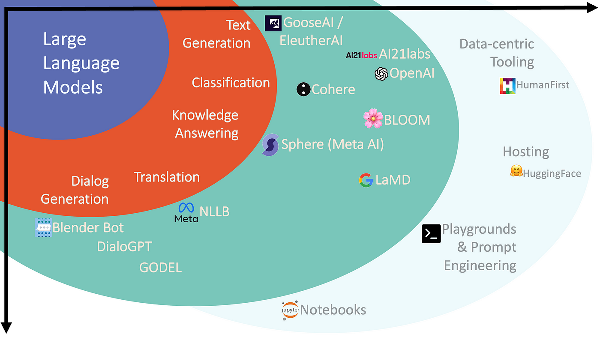

## Table of Contents

## What is LLM in the context of machine learning?

LLM stands for Large Language Model. It is a type of artificial intelligence model that is trained on a huge amount of text data to understand and generate human-like language. These models use deep learning techniques, specifically a type of neural network called a transformer, to process and produce text. The more data an LLM is trained on, the better it gets at understanding and generating language that sounds natural to humans.

One famous example of an LLM is ChatGPT, developed by OpenAI. When you ask ChatGPT a question, it uses its training to predict what the next word should be, one word at a time, until it forms a complete response. This process is based on the patterns it learned from the data it was trained on. LLMs are used in many applications, like writing assistants, customer service bots, and even in creating content for websites. They are powerful tools but can sometimes make mistakes or generate incorrect information, so it's important to use them carefully.

## How does LLM differ from other machine learning models?

Large Language Models (LLMs) differ from other machine learning models mainly in their size, training data, and the tasks they are designed to perform. LLMs are huge, often containing billions of parameters, which are the internal settings that the model uses to make predictions. This size allows them to handle a wide range of language tasks, like understanding and generating text, better than smaller models. They are trained on massive amounts of text data from the internet, books, and other sources, which helps them learn the patterns of human language. In contrast, other machine learning models might be smaller and trained on more specific datasets for tasks like image recognition or predicting stock prices.

Another key difference is how LLMs work. They use a type of [neural network](/wiki/neural-network) called a transformer, which is particularly good at understanding the context of words in a sequence. This allows LLMs to generate coherent and contextually relevant text. Other [machine learning](/wiki/machine-learning) models might use different architectures, like convolutional neural networks for image processing or recurrent neural networks for time series data. While these models can be very effective for their specific tasks, they don't have the same broad language understanding capabilities as LLMs.

## What are the basic components of an LLM?

The basic components of a Large Language Model (LLM) include the transformer architecture, which is the core of how LLMs work. The transformer is made up of layers of interconnected nodes called neurons, and it uses a mechanism called attention to understand the relationships between words in a sentence. This attention mechanism helps the model focus on different parts of the input text as it processes it, which is crucial for understanding context and generating coherent responses.

Another key component is the model's parameters, which are the values that the model learns during training. These parameters, often numbering in the billions, are what allow the LLM to make predictions about what word should come next in a sequence. The model is trained on a huge dataset of text, and through a process called backpropagation, it adjusts these parameters to minimize the difference between its predictions and the actual text it was trained on.

The final component is the tokenizer, which breaks down the input text into smaller units called tokens. These tokens can be words, parts of words, or even punctuation marks. The tokenizer helps the model process the text more efficiently by converting it into a format that the transformer can work with. Together, these components allow LLMs to understand and generate human-like language.

## What types of data can LLMs process?

Large Language Models (LLMs) can process many types of text data. This includes written language from [books](/wiki/algo-trading-books), articles, websites, and social media posts. They can also handle different languages and can understand and generate text in those languages. LLMs can even process code, which is a special type of text used to write computer programs. When you give an LLM a piece of text, it breaks it down into smaller parts called tokens, which helps the model understand and work with the text more easily.

LLMs are also good at handling structured data that is written in text form. For example, they can process data from tables or databases if it's converted into text. This means they can understand information like names, dates, and numbers when they are written out. However, LLMs are not as good at processing other types of data, like images or sounds, unless those are converted into text first. For instance, an image can be described in words, and then the LLM can process that description.

## How is training data prepared for an LLM?

Training data for a Large Language Model (LLM) is prepared by collecting a huge amount of text from various sources like books, websites, and social media. This text is then cleaned to remove any errors or irrelevant information. For example, they might take out strange symbols or fix spelling mistakes. After cleaning, the text is broken down into smaller pieces called tokens. These tokens could be words, parts of words, or even punctuation marks. This process helps the LLM understand and work with the text more easily.

Once the text is tokenized, it is organized into a format that the LLM can use for training. This often involves creating sequences of tokens that the model can learn from. The data is split into two parts: one part for training the model and another part for testing how well the model has learned. The training part is used to adjust the model's parameters so it can predict the next word in a sequence accurately. The testing part helps check if the model is doing a good job without overfitting, which means it's not just memorizing the training data but actually understanding the language.

## What are common algorithms used in LLMs?

The main algorithm used in Large Language Models (LLMs) is called the transformer. Transformers work by using something called attention, which helps the model focus on different parts of the text it's reading. This attention mechanism lets the LLM understand how words relate to each other in a sentence. The transformer is made up of layers, and each layer has many small parts called neurons. These neurons work together to process the text and learn from it. During training, the LLM adjusts the values of its parameters to get better at predicting what word should come next in a sequence.

Another important algorithm used in LLMs is backpropagation. This is how the model learns from its mistakes. When the LLM makes a prediction and it's wrong, backpropagation helps figure out how to change the model's parameters to make better predictions next time. This process is repeated many times with lots of text data, which helps the LLM get better and better at understanding and generating language. Backpropagation is a key part of how LLMs are trained to perform well on tasks like answering questions or writing text.

## How do you evaluate the performance of an LLM?

Evaluating the performance of a Large Language Model (LLM) involves using different methods to see how well it understands and generates text. One common way is to use benchmark datasets, which are collections of text with questions and answers. The LLM tries to answer the questions, and its answers are compared to the correct answers. If the LLM's answers match the correct ones a lot, it means the model is doing well. Another way to evaluate an LLM is by using metrics like perplexity. Perplexity is a number that shows how surprised the model is by the text it's trying to predict. A lower perplexity means the model is better at predicting the next word in a sentence.

Another important part of evaluating an LLM is looking at how it performs in real-world tasks. This can include things like writing essays, answering customer service questions, or even helping with coding. People might read the text the LLM generates and rate it based on how helpful, accurate, and natural it sounds. Sometimes, they use special tests to see if the LLM can understand and follow instructions or if it can keep a conversation going in a natural way. By combining these different methods, we can get a good idea of how well an LLM is working and where it might need to improve.

## What are some typical applications of LLMs?

Large Language Models (LLMs) are used in many different ways to help people with tasks that involve understanding and creating text. One common use is in writing assistants, where LLMs help people write emails, reports, or even stories by suggesting words or sentences. They can also be found in customer service, where they answer questions and solve problems for customers through chatbots. Another important use is in translation, where LLMs help translate text from one language to another quickly and accurately.

LLMs are also used in education to help students learn by providing explanations and answering their questions. In the world of coding, LLMs can help programmers by suggesting code or fixing errors. They are even used in creating content for websites, like writing articles or summaries. By understanding and generating human-like text, LLMs make many tasks easier and more efficient for people in different fields.

## What are the challenges faced when scaling LLMs?

Scaling Large Language Models (LLMs) comes with many challenges. One big challenge is the need for a lot of computing power. As LLMs get bigger, they need more powerful computers to train them. This can be very expensive and not everyone can afford it. Another challenge is the need for huge amounts of data. LLMs need to be trained on lots of text to work well, and finding and cleaning all that data can be hard. Also, bigger models can take longer to train, which means they might not be ready to use as quickly as smaller models.

Another challenge is making sure the LLM works well even as it gets bigger. Sometimes, when a model grows, it can start to make mistakes or become less accurate. This is called overfitting, where the model learns the training data too well and doesn't work as well on new data. Keeping the model from overfitting while still making it bigger is tricky. Also, bigger models can be harder to understand and fix if something goes wrong. All these challenges make scaling LLMs a difficult but important task.

## How can LLMs be fine-tuned for specific tasks?

Fine-tuning a Large Language Model (LLM) for a specific task means training it a bit more with data that's focused on that task. You start with a big LLM that's already been trained on a lot of text. Then, you give it more training with text that's related to what you want it to do. For example, if you want the LLM to help with customer service, you'd train it with customer service questions and answers. This helps the LLM learn the language and style of customer service better, so it can give more accurate and helpful responses.

To fine-tune an LLM, you need to prepare the right kind of data. This means finding text that's similar to the task you want the LLM to do. You might need to clean this data to make sure it's good quality. Then, you use this data to train the LLM again, but this time, you adjust the model's settings just a little bit. This process helps the LLM get better at the specific task without forgetting what it already knows. By doing this, the LLM can become very good at tasks like writing emails, answering questions, or even helping with coding.

## What ethical considerations should be taken into account when using LLMs?

When using Large Language Models (LLMs), it's important to think about ethical issues. One big concern is bias. LLMs learn from huge amounts of text, and if that text has biases, like treating some groups of people unfairly, the LLM can learn those biases too. This means the LLM might give answers that are not fair or right. Another ethical issue is privacy. LLMs can sometimes use personal information from the text they were trained on, which can be a problem if that information is shared without permission.

Another thing to consider is how LLMs can be used to spread false information. Because they can generate text that looks real, they might be used to create fake news or misleading content. This can be harmful to society. It's also important to think about how LLMs might affect jobs. If they are used to do tasks that people used to do, like writing or customer service, some people might lose their jobs. So, it's important to use LLMs in a way that is fair and doesn't harm anyone.

## What are the latest advancements in LLM research?

Recent advancements in Large Language Model (LLM) research have focused on making these models more efficient and effective. One big step forward is the development of smaller LLMs that can still do a lot of the same things as bigger ones. Researchers have found ways to make these smaller models by using special techniques like quantization, which means making the numbers the model uses smaller, and pruning, which means removing parts of the model that aren't needed as much. These smaller models use less computer power and can be trained faster, which makes them easier to use for more people.

Another important advancement is in how LLMs understand and use context better. New methods like chain-of-thought prompting help LLMs think through problems step by step, which makes their answers more accurate and helpful. For example, if you ask an LLM a math problem, it can show its work and explain each step, not just give the final answer. Researchers are also working on making LLMs better at understanding different languages and cultures, so they can be more useful around the world. These improvements are helping LLMs become more versatile and reliable tools for many different tasks.

## References & Further Reading

[1]: Vaswani, A., Shazeer, N., Parmar, N., Uszkoreit, J., Jones, L., Gomez, A. N., Kaiser, Ł., & Polosukhin, I. (2017). ["Attention is All You Need."](https://arxiv.org/abs/1706.03762) arXiv preprint arXiv:1706.03762.

[2]: Devlin, J., Chang, M. W., Lee, K., & Toutanova, K. (2019). ["BERT: Pre-training of Deep Bidirectional Transformers for Language Understanding."](https://arxiv.org/abs/1810.04805) arXiv preprint arXiv:1810.04805.

[3]: Radford, A., Narasimhan, K., Salimans, T., & Sutskever, I. (2018). ["Improving Language Understanding by Generative Pre-Training."](https://cdn.openai.com/research-covers/language-unsupervised/language_understanding_paper.pdf) OpenAI.

[4]: Brown, T. B., Mann, B., Ryder, N., Subbiah, M., Kaplan, J., Dhariwal, P., ... & Amodei, D. (2020). ["Language Models are Few-Shot Learners."](https://arxiv.org/abs/2005.14165) arXiv preprint arXiv:2005.14165.

[5]: Wolf, T., Debut, L., Sanh, V., Chaumond, J., Delangue, C., Moi, A., ... & Rush, A. M. (2020). ["Transformers: State-of-the-Art Natural Language Processing."](https://arxiv.org/abs/1910.03771) arXiv preprint arXiv:1910.03771.

[6]: ["Deep Learning"](https://en.wikipedia.org/wiki/Deep_learning) by Ian Goodfellow, Yoshua Bengio, and Aaron Courville

[7]: Raffel, C., Shazeer, N., Roberts, A., Lee, K., Narang, S., Matena, M., ... & Liu, P. J. (2020). ["Exploring the Limits of Transfer Learning with a Unified Text-to-Text Transformer."](https://arxiv.org/abs/1910.10683) Journal of Machine Learning Research.