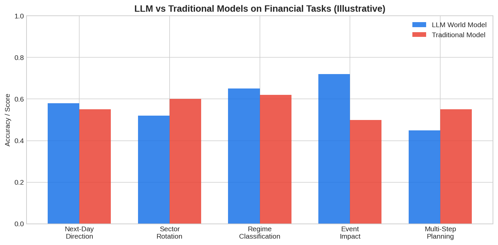

The question of whether **large language models (LLMs) function as world models for finance** is one of the most active frontiers in AI-driven trading. LLMs like GPT-4 and Claude have been trained on vast corpora that include financial news, earnings reports, economic analyses, and academic papers. The hypothesis is that these models have implicitly learned a "world model" of economic relationships — understanding how rate hikes affect equities, how earnings surprises move stocks, and how macro shocks propagate across markets — even though they were never explicitly trained on financial time series data.

## What Would an LLM World Model Look Like?

A true world model predicts the next state of the environment given the current state and an action. For finance, this means:

$$\hat{s}_{t+1} = f_{\text{LLM}}(s_t, \text{event}_t)$$

If an LLM has internalized a world model, it should be able to: predict the directional impact of news events on asset prices, understand causal chains (rate hike → stronger dollar → weaker EM equities), forecast how different economic scenarios affect different sectors, and reason about second-order effects that simple models miss.

## Evidence For and Against

| Capability | LLM Performance | Traditional Model |
|-----------|----------------|------------------|
| News sentiment analysis | Strong | Weak (requires NLP pipeline) |
| Causal reasoning about macro | Moderate | Strong (structural models) |
| Quantitative forecasting | Weak | Strong (statistical models) |
| Multi-step reasoning | Moderate | Depends on model |
| Adapting to new information | Instant (in-context) | Requires re-estimation |
| Handling ambiguity | Strong | Weak |

Research from papers like "Can LLMs Forecast Economic Indicators?" and "Trading-R1" shows that LLMs outperform traditional methods on qualitative tasks (sentiment, event classification) but underperform on precise numerical forecasting. The emerging consensus is that LLMs are best used as **qualitative world models** that complement quantitative models.



## Practical Applications for Traders

**Event impact analysis**: Feed an LLM a news event and ask it to predict the directional impact across asset classes. Use this as one input in a multi-signal framework alongside quantitative models.

**Scenario generation**: Ask an LLM to generate plausible economic scenarios and trace their implications — similar to using a macro model but with more nuance and the ability to incorporate qualitative factors.

**Research synthesis**: LLMs can process hundreds of research papers and analyst reports, extracting relevant trading signals that would take a human analyst weeks to compile.

**Strategy ideation**: Use LLMs to brainstorm strategy hypotheses, which are then validated with quantitative [backtesting](https://paperswithbacktest.com/wiki/backtesting-with-python).

## Python Example: LLM-Augmented Trading Signal

```python
import numpy as np

def simulate_llm_signal(event_text, traditional_signal):
    """
    Combine a simulated LLM sentiment signal with a traditional
    quantitative signal for a blended trading decision.
    """
    # In production, this would call an LLM API
    # Here we simulate the LLM's directional prediction
    np.random.seed(hash(event_text) % 2**32)
    llm_direction = np.random.choice([-1, 0, 1], p=[0.3, 0.2, 0.5])
    llm_confidence = np.random.uniform(0.4, 0.9)
    
    # Blend: weight LLM by its confidence, traditional by inverse
    llm_weight = 0.3 * llm_confidence
    trad_weight = 1 - llm_weight
    
    blended = llm_weight * llm_direction + trad_weight * traditional_signal
    return np.clip(blended, -1, 1)

# Example events
events = [
    ("Fed raises rates by 50bps, hawkish guidance", -0.3),
    ("Tech earnings beat across the board", 0.6),
    ("Oil prices spike on supply disruption", -0.1),
    ("Unemployment drops to 3.5%", 0.4),
]

for event, trad_signal in events:
    blended = simulate_llm_signal(event, trad_signal)
    print(f"Event: {event[:45]:45s} | Trad: {trad_signal:+.1f} | Blended: {blended:+.2f}")
```

## The Future: LLM Trading Agents

The next frontier is [LLM trading agents](https://paperswithbacktest.com/wiki/llm-trading-agents) that combine language understanding with quantitative execution — using the LLM's "world model" for high-level strategic reasoning while delegating execution to traditional algorithms. Systems like Trading-R1 demonstrate that fine-tuned LLMs with reinforcement learning can produce structured investment theses aligned with trading principles.

## Limitations and Risks

LLMs hallucinate — they can generate plausible-sounding but factually wrong financial analysis. They lack access to real-time data unless explicitly connected to data feeds. Their training data has a cutoff, making them blind to recent events without retrieval augmentation. Most critically, correlation in language does not equal causation in markets.

## Conclusion

LLMs represent a qualitatively new kind of world model for finance — one that understands natural language, captures complex causal narratives, and reasons about economic dynamics in ways that complement traditional quantitative models. The optimal approach is hybrid: use LLMs for qualitative analysis and scenario generation, and traditional models for quantitative forecasting and execution.

---

**Explore further on PapersWithBacktest:**
- Browse [backtested AI-driven strategies](https://paperswithbacktest.com/strategies) with Python code and performance metrics
- Access [clean historical market data](https://paperswithbacktest.com/datasets) for equities, crypto, and futures
- Take the [algo trading course](https://paperswithbacktest.com/course) — 60+ video lessons and notebooks
- Related wiki pages: [LLM Trading Agents](https://paperswithbacktest.com/wiki/llm-trading-agents) · [Neural Networks in Quantitative Trading](https://paperswithbacktest.com/wiki/how-are-neural-networks-used-in-quantitative-trading) · [News Trading](https://paperswithbacktest.com/wiki/news-trading)
