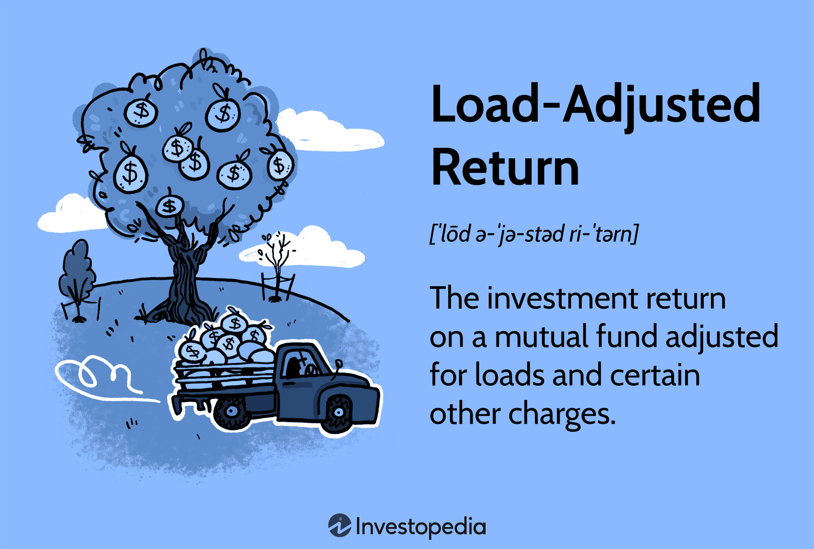

## Table of Contents

## What is load-adjusted return?

Load-adjusted return is a way to measure how well an investment does after taking into account the fees you pay to buy or sell it. These fees are called "loads." When you invest in something like a mutual fund, you might have to pay a fee when you buy it (front-end load) or when you sell it (back-end load). These fees can make your investment worth less than if you didn't have to pay them. So, load-adjusted return helps you see the true performance of your investment by subtracting these fees from the total return.

Understanding load-adjusted return is important because it gives you a clearer picture of what you're really earning from your investment. If you only look at the total return without considering the loads, you might think your investment is doing better than it actually is. By using load-adjusted return, you can make better decisions about whether an investment is worth the fees you have to pay. This way, you can compare different investments more fairly and choose the ones that will give you the best value for your money.

## How does load-adjusted return differ from simple return?

Load-adjusted return and simple return are two ways to look at how well an investment is doing, but they consider different things. Simple return is just the basic way to see how much your investment has grown. It's the percentage increase or decrease in the value of your investment over a certain time, without taking any fees into account. For example, if you put $100 into an investment and it grows to $110, your simple return is 10%.

Load-adjusted return, on the other hand, takes into account the fees you have to pay when you buy or sell an investment, like mutual funds. These fees, called "loads," can lower your overall return. So, if you paid a $5 fee to buy that same $100 investment, your load-adjusted return would be calculated after subtracting that fee. In this case, your load-adjusted return would be lower than your simple return because it reflects the real cost of the investment. This makes load-adjusted return a more accurate measure of how well your investment is actually performing for you.

## What are the types of loads that affect load-adjusted return?

Loads are fees you pay when you buy or sell certain investments, like mutual funds. There are two main types of loads: front-end loads and back-end loads. A front-end load is a fee you pay when you buy the investment. For example, if you want to invest $1,000 in a mutual fund with a 5% front-end load, you'll pay $50 as a fee, and only $950 will actually go into the investment. This fee reduces the amount you have to invest right from the start.

A back-end load, also known as a deferred sales charge, is a fee you pay when you sell the investment. This fee often goes down the longer you keep the investment. For instance, if you sell your investment after a year and the back-end load is 3%, you'll pay a fee based on the value of your investment at the time of sale. Both front-end and back-end loads can lower your load-adjusted return because they take money away from your investment's growth.

## How do front-end loads impact the load-adjusted return?

Front-end loads are fees you pay when you buy an investment, like a mutual fund. They take money away from what you're planning to invest. For example, if you want to invest $1,000 and there's a 5% front-end load, you'll pay $50 as a fee. That means only $950 actually goes into your investment. This fee reduces the amount of money you have to start with, which can make a big difference in how much your investment grows over time.

Because of this, front-end loads lower your load-adjusted return. Load-adjusted return looks at how well your investment did after taking out any fees. So, if your investment grows from $950 to $1,045, your simple return might look like it's 4.5% ($45/$1,000). But after subtracting the $50 front-end load, your load-adjusted return is actually lower because you started with less money. This shows that front-end loads can make your investment seem less profitable than it would be without the fee.

## Can you explain the effect of back-end loads on load-adjusted return?

Back-end loads are fees you pay when you sell your investment, like a mutual fund. They can be a percentage of the value of your investment at the time you sell it. For example, if you sell your investment for $1,000 and there's a 2% back-end load, you'll pay $20 as a fee. This fee comes out of the money you get from selling your investment, so it lowers the amount of money you take home.

Because back-end loads take money away from your investment when you sell it, they reduce your load-adjusted return. Load-adjusted return shows how well your investment did after taking out any fees. If your investment grew from $1,000 to $1,100, your simple return would be 10% ($100/$1,000). But after paying a $20 back-end load, your load-adjusted return would be lower because you end up with less money than you thought. This means back-end loads can make your investment seem less profitable when you consider the fees you have to pay.

## What role do ongoing fees play in calculating load-adjusted return?

Ongoing fees are costs you pay while you own an investment, like a mutual fund. These fees are usually a small percentage of the money you have invested each year. They can include things like management fees, which pay the people who run the fund, and other expenses like administrative costs. These ongoing fees come out of your investment's value over time, so they can lower how much your investment grows.

When you calculate the load-adjusted return, you need to take these ongoing fees into account along with any front-end or back-end loads. If your investment makes money, but you have to pay ongoing fees every year, those fees will reduce your total return. So, to get a true picture of how well your investment did, you subtract both the loads and the ongoing fees from the investment's growth. This gives you a more accurate idea of what you really earned from your investment.

## How is load-adjusted return calculated?

Load-adjusted return is a way to see how much money you really made from your investment after paying all the fees. To calculate it, you start with the simple return of your investment, which is just the percentage increase or decrease in its value. Then, you subtract the fees you paid to buy and sell the investment, which are called loads. There are two types of loads: front-end loads, which you pay when you buy the investment, and back-end loads, which you pay when you sell it. You also need to take away any ongoing fees you paid while you owned the investment, like management fees.

For example, if you invested $1,000 in a mutual fund and it grew to $1,100, your simple return would be 10%. But if you paid a $50 front-end load to buy the fund and a $20 back-end load to sell it, plus $10 in ongoing fees while you owned it, you would subtract these fees from your total return. So, you would start with $1,000, but after the front-end load, you'd have $950 invested. When it grows to $1,100, and you sell it, you pay the back-end load of $20, leaving you with $1,080. After subtracting the $10 in ongoing fees, you end up with $1,070. Your load-adjusted return is then calculated as ($1,070 - $1,000) / $1,000, which equals 7%. This shows you the true return on your investment after all fees.

## What are the common misconceptions about load-adjusted return?

One common misconception about load-adjusted return is that it's the same as the simple return of an investment. People sometimes think that if their investment grows by a certain percentage, that's what they actually earned. But load-adjusted return is different because it takes away the fees you pay to buy, sell, or own the investment. These fees can make a big difference in how much money you really make. So, if you only look at the simple return, you might think your investment did better than it actually did.

Another misunderstanding is that load-adjusted return is only important for certain types of investments, like mutual funds with loads. But load-adjusted return can be useful for any investment that has fees. Even if an investment doesn't have front-end or back-end loads, it might still have ongoing fees that affect your return. By looking at the load-adjusted return, you get a clearer picture of how well your investment is doing after all the costs. This helps you compare different investments more fairly and make better choices about where to put your money.

## How can load-adjusted return be used to compare different investment options?

Load-adjusted return helps you compare different investment options by showing you how much money you really made after paying all the fees. When you look at the simple return, you might think an investment did really well, but if it had big fees, it might not be as good as it seems. By using load-adjusted return, you can see which investments give you more money in the end, after taking away the costs of buying, selling, and owning them. This way, you can choose investments that are worth the fees and give you the best value for your money.

For example, if you're comparing two mutual funds, one might have a higher simple return but also higher fees. The other might have a lower simple return but lower fees. When you calculate the load-adjusted return for both, you might find that the one with the lower simple return actually gives you more money in the end because its fees are smaller. This helps you make a smarter choice about where to invest your money, focusing on what you really earn after all the costs.

## What are the limitations of using load-adjusted return as a performance metric?

Load-adjusted return is a good way to see how much money you really made from your investment after paying fees. But it has some limitations. One big problem is that it can be hard to figure out all the fees. Some fees are easy to see, like front-end and back-end loads, but others, like ongoing fees, can be hidden in the fine print. If you don't know about all the fees, your load-adjusted return might not be right.

Another issue is that load-adjusted return only looks at the money you made and the fees you paid. It doesn't tell you about other important things, like how risky the investment is or how easy it is to sell. Two investments might have the same load-adjusted return, but one might be much riskier or harder to get out of. So, if you only look at load-adjusted return, you might miss these other important details and make a choice you could regret later.

## How does tax consideration affect load-adjusted return?

Taxes can change how much money you really make from your investment. When you earn money from an investment, you might have to pay taxes on it. These taxes can lower your load-adjusted return because they take away some of the money you made. For example, if you made $100 from your investment but have to pay $20 in taxes, your load-adjusted return will be less because you get to keep less money.

It's important to think about taxes when you figure out your load-adjusted return. Different investments can have different tax rules. Some investments might have special tax benefits, like tax-free bonds, which can make your load-adjusted return higher because you don't have to pay as much in taxes. By understanding how taxes affect your investments, you can make better choices and see the true value of your money after all costs and taxes.

## What advanced strategies can investors use to optimize load-adjusted return?

One way to boost your load-adjusted return is by choosing investments with lower fees. Some mutual funds and other investments have high front-end or back-end loads, which can eat into your returns. By [picking](/wiki/asset-class-picking) investments with no loads or lower ongoing fees, you keep more of your money working for you. Another strategy is to look for funds that offer fee waivers or discounts if you invest a certain amount of money. This can help reduce the costs you pay and improve your load-adjusted return.

Another smart move is to pay attention to how long you keep your investment. Some back-end loads go down the longer you hold onto your investment. If you can wait it out, you might pay less in fees when you sell. Also, think about tax strategies. Investing in tax-efficient options, like index funds or tax-free bonds, can help you keep more of your returns after taxes. By understanding how taxes work with your investments, you can plan better and increase your load-adjusted return.

## What is the understanding of Financial Analysis and Investment Performance Metrics?

Financial analysis is fundamental in evaluating investment performance, providing investors with a comprehensive framework for assessing the viability and potential profitability of different investment strategies. Central to this analysis are key metrics such as the Sharpe Ratio, Maximum Drawdown, and Win Rate, each playing a distinct role in evaluating the effectiveness of an investment portfolio.

The Sharpe Ratio is a widely used metric for understanding risk-adjusted returns. It measures the average return earned in excess of the risk-free rate per unit of [volatility](/wiki/volatility-trading-strategies) or total risk. The formula for the Sharpe Ratio is:

$$

\text{Sharpe Ratio} = \frac{{R_p - R_f}}{{\sigma_p}}
$$

where $R_p$ is the expected portfolio return, $R_f$ is the risk-free rate of return, and $\sigma_p$ is the standard deviation of the portfolio's excess return. A higher Sharpe Ratio indicates that a portfolio is yielding a better return per unit of risk, making it a crucial tool for investors seeking to balance returns with risk.

Maximum Drawdown is another critical metric, offering insights into the potential downside risk of an investment strategy. It represents the maximum observed loss from a peak to a trough before a new peak is achieved. This metric is particularly valuable for understanding the worst-case scenarios for a portfolio, helping investors to manage and mitigate risk. Monitoring Maximum Drawdown allows investors to assess the resilience of their portfolios during adverse market conditions.

Win Rate, the third key metric, measures the percentage of profitable trades out of the total number of trades. This metric provides a straightforward but effective way to gauge the success rate of an investment strategy. While it is not a comprehensive measure on its own, a high Win Rate can indicate a strategy's ability to identify and capitalize on profitable opportunities. However, it is important to consider Win Rate in conjunction with other metrics like the Sharpe Ratio to ensure a holistic assessment of performance.

Collectively, these metrics enable investors to discern the strengths and weaknesses of their investment portfolios, providing valuable insights necessary for optimizing performance. By understanding and applying these performance measures, investors can better align their strategies with their financial goals and risk tolerance, ultimately enhancing their decision-making processes and investment outcomes.

## What are Load-Adjusted Returns and how can we explore them?

Load-adjusted returns provide insight into mutual fund performance by factoring in the fees and charges that impact an investor's actual gains. These adjustments take into account front-end loads, back-end loads, and any other associated fees, which when not acknowledged can distort the apparent success of an investment.

A mutual fund’s advertised return often doesn't portray the reality faced by investors due to these incurred costs. The nominal return is what is commonly presented, reflecting the percentage change in the value of the fund over a given period before the subtraction of fees. However, nominal returns can be misleading, especially in actively managed funds that tend to have higher fees than their passively managed counterparts. 

For example, consider a mutual fund with a nominal annual return of 8%. If the fund is subject to a front-end load of 5% and an annual management fee of 1.5%, the load-adjusted return reflects these deductions:

$$
\text{Load-adjusted Return} = \left(1 + \text{Nominal Return} - \text{Annual Fees}\right) \times \left(1 - \text{Front-end Load}\right) - 1
$$

Substituting the provided values:

$$
\text{Load-adjusted Return} = \left(1 + 0.08 - 0.015\right) \times \left(1 - 0.05\right) - 1
$$
$$
= 0.065 \times 0.95 - 1
$$
$$
= 0.06175 \text{ or } 6.175\%
$$

This calculation highlights a significant reduction from the nominal return to the load-adjusted return. Thus, accounting for fees is indispensable for correctly evaluating investment profitability. This understanding becomes crucial in making informed decisions and accurately comparing different funds or investment strategies, especially when considering actively managed funds, which generally involve higher fees due to their actively managed nature.

In scenarios where investors seek to amplify returns, neglecting the impact of these fees could lead to suboptimal investment choices. As such, understanding load-adjusted returns is fundamental for accurately assessing profitability and for strategic investment planning. This framework also facilitates a more transparent comparison of various investments, aligning investor expectations with practical outcomes.

## What are the key metrics in algorithmic trading?

Algorithmic trading performance hinges on a comprehensive evaluation of multiple metrics that collectively assess the risk and return profile of different strategies. These metrics help provide transparency into the effectiveness of the trading algorithms in delivering consistent and competitive returns.

The **Sharpe Ratio** stands out as a fundamental metric in this evaluation. Defined as the average return earned in excess of the risk-free rate per unit of volatility (or total risk), the Sharpe Ratio is calculated using the formula:

$$

S = \frac{\bar{R} - R_f}{\sigma}
$$

where $S$ is the Sharpe Ratio, $\bar{R}$ represents the average return of the strategy, $R_f$ is the risk-free rate, and $\sigma$ is the standard deviation of the strategy's returns. A higher Sharpe Ratio indicates better risk-adjusted returns, which is crucial for algorithms designed to manage volatility effectively.

Complementing the Sharpe Ratio is the **Sortino Ratio**, which focuses only on downside risk. This metric differs by considering only the negative deviation of returns. The Sortino Ratio is expressed as:

$$

\text{Sortino Ratio} = \frac{\bar{R} - R_f}{\sigma_d}
$$

Here, $\sigma_d$ represents the downside deviation, providing a more targeted analysis where returns are volatile, but overall negative deviation is low. This metric is particularly useful for strategies where upward volatility is frequent and beneficial, while dampening downside risks.

The **Calmar Ratio** further enriches performance assessment by analyzing the relationship between return and drawdown, where greater emphasis is placed on capital preservation. It is defined as:

$$

\text{Calmar Ratio} = \frac{\text{Average Annual Return}}{\text{Maximum Drawdown}}
$$

This formula highlights how effectively a trading strategy generates returns relative to the worst run of losses over a specific period. A higher Calmar Ratio reflects a strategy capable of generating returns with minimal exposure to significant downturns.

In [algorithmic trading](/wiki/algorithmic-trading), these metrics are not merely theoretical; they have practical applications that significantly influence strategy development and refinement. By continuously monitoring and analyzing these metrics, traders can calibrate their algorithms to not only achieve optimal returns but also ensure the risk exposure remains within acceptable limits. This adaptability is key to maintaining a competitive edge in the fast-evolving trading environment. 

Python scripts often facilitate the calculation and visualization of these metrics, offering analysts a robust platform to iterate and enhance their trading strategies:

```python
import numpy as np

def sharpe_ratio(returns, risk_free_rate):
    excess_returns = returns - risk_free_rate
    return excess_returns.mean() / excess_returns.std()

def sortino_ratio(returns, risk_free_rate):
    downside_deviation = returns[returns < risk_free_rate].std()
    expected_return = returns.mean() - risk_free_rate
    return expected_return / downside_deviation

def calmar_ratio(annual_returns, max_drawdown):
    return annual_returns / max_drawdown
```

Utilizing such computations allows for real-time strategic adjustments and adoption of the most robust trading algorithms tailored to current market conditions.

## What is the conclusion?

The integration of load-adjusted returns with algorithmic trading provides a comprehensive framework for improving investment performance. By considering the fees and charges in load-adjusted returns, investors obtain a more accurate depiction of actual returns, which is fundamental in assessing the true value of their investments. Algorithmic trading, with its capacity for rapid and precise trade execution, offers a significant advantage in capturing market opportunities that align with these accurate assessments.

Incorporating effective financial analysis tools and metrics enhances an investor's ability to achieve superior risk-adjusted returns, crucially lowering potential financial setbacks. Metrics such as the Sharpe Ratio and Sortino Ratio allow investors to evaluate the performance of their strategies, balancing potential returns against the inherent risks and ensuring that their investment decisions are grounded in sound financial principles. For example, the Sharpe Ratio is calculated as:

$$

\text{Sharpe Ratio} = \frac{E[R_p] - R_f}{\sigma_p} 
$$

where $E[R_p]$ is the expected portfolio return, $R_f$ is the risk-free rate, and $\sigma_p$ is the standard deviation of portfolio returns. This measure helps determine how much excess return is received for the extra volatility endured by holding a riskier asset.

The future of investment performance evaluation is increasingly reliant on the synthesis of traditional financial principles and cutting-edge technological advancements. Algorithmic trading strategies equipped with superior analytical capabilities allow for the continuous refinement of trading processes, adapting to market changes and investor needs. Such synergetic approaches enable investors to maintain a competitive edge, ensuring that their strategies are robust and adaptable in a constantly evolving financial landscape. As technology continues to advance, investors who leverage these developments are better positioned to enhance their overall investment performance, achieving their financial goals with greater efficiency and reduced risk.

## References & Further Reading

[1]: Bergstra, J., Bardenet, R., Bengio, Y., & Kégl, B. (2011). ["Algorithms for Hyper-Parameter Optimization."](https://dl.acm.org/doi/10.5555/2986459.2986743) Advances in Neural Information Processing Systems 24.

[2]: ["Advances in Financial Machine Learning"](https://www.amazon.com/Advances-Financial-Machine-Learning-Marcos/dp/1119482089) by Marcos Lopez de Prado

[3]: ["Evidence-Based Technical Analysis: Applying the Scientific Method and Statistical Inference to Trading Signals"](https://www.amazon.com/Evidence-Based-Technical-Analysis-Scientific-Statistical/dp/0470008741) by David Aronson

[4]: ["Machine Learning for Algorithmic Trading"](https://github.com/stefan-jansen/machine-learning-for-trading) by Stefan Jansen

[5]: ["Quantitative Trading: How to Build Your Own Algorithmic Trading Business"](https://www.amazon.com/Quantitative-Trading-Build-Algorithmic-Business/dp/1119800064) by Ernest P. Chan