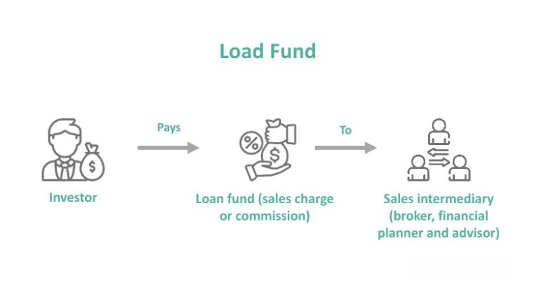

The financial landscape is undergoing a significant transformation, largely driven by technological advancements and the emergence of innovative investment strategies. Among these, investment funds, mutual funds, load funds, and algorithmic trading emerge as pivotal components that are fundamentally shaping the strategies deployed in modern portfolio management.

Investment funds and mutual funds are foundational elements in the investment world, offering individuals a means to pool their resources and achieve diversified investment exposure. These funds are expertly managed, providing access to a wide array of asset classes while mitigating individual investors' risks through diversification. By investing in a curated selection of securities like stocks and bonds, mutual funds allow investors to benefit from professional financial management, although they are subject to various costs such as expense ratios.



Load funds, a subtype of mutual funds, introduce a layer of financial dynamics where sales fees are involved, compensating financial advisors for their services. These funds offer the added dimension of professional advisory, potentially enhancing investment decision-making. However, investors must carefully consider the impact of associated costs on their overall returns.

Algorithmic trading represents a technological evolution in trading, employing sophisticated algorithms to execute trades at unprecedented speeds and efficiencies. Its integration into mutual fund strategies enhances asset allocation and portfolio performance, offering significant advantages in terms of liquidity and decision-making precision. However, it necessitates robust system infrastructures and careful management of associated risks.

This article serves as a comprehensive guide, aimed at empowering investors to make well-informed decisions by understanding these financial instruments and methodologies. It addresses the operational aspects, benefits, and challenges associated with each component, providing a strategic framework to leverage these tools effectively for optimal financial outcomes. The insights offered here are designed to equip investors with the knowledge to navigate the rapidly evolving financial landscape, ensuring they are poised to achieve substantial growth and financial stability.

## Table of Contents

## Understanding Investment Funds and Mutual Funds

Investment funds serve as an essential component of the financial ecosystem, enabling investors to pool resources and invest in various securities collectively. These funds facilitate diversification—a key principle in risk management—by spreading investments across different asset classes such as stocks, bonds, and other financial instruments. This collective investment approach offers individual investors an opportunity to gain exposure to a wide range of assets, minimizing the risk inherent in holding a single security.

A specific category of investment funds is mutual funds. These funds are structured to invest in a portfolio of assets managed by professional fund managers. Within a mutual fund, an investor's capital is diversified across various holdings, aligning with the fund's investment objectives. By relying on professional management, investors benefit from the expertise and research capabilities of experienced fund managers, who make informed decisions on asset allocation, timing, and selection. This professional oversight can enhance investors' potential returns, particularly for those lacking the time or expertise to manage investments actively.

However, the advantages of mutual funds come with associated costs. Primarily, these costs are captured in the form of an expense ratio, which encompasses management fees, administrative fees, and other operational expenses. The expense ratio is expressed as a percentage of the fund's average net assets and directly impacts the investor's net returns. For example, if a mutual fund has a gross annual return of 8% and an expense ratio of 1%, the net return to the investor would be approximately 7%.

Choosing the appropriate type of mutual fund requires careful consideration of an investor's financial goals and risk tolerance. Mutual funds offer various options, including equity funds, bond funds, money market funds, and hybrid funds, each with specific investment strategies and risk profiles. An investor seeking capital appreciation might favor equity funds, which invest primarily in stocks, while those seeking income might opt for bond funds, which focus on fixed-income securities.

In summary, investment funds, particularly mutual funds, provide a structured way for individuals to participate in the broader financial markets with the benefits of diversification and professional management. As investors assess these options, it is crucial to weigh the costs against the potential benefits and ensure alignment with their financial objectives and risk appetite.

## Load Funds: Structure and Benefits

Load funds, a specific category of mutual funds, impose sales charges, also known as load fees, on investors, which serve to remunerate financial advisors for their services. These fees come in various forms, including front-end loads, back-end loads, and level loads, each with its unique implications for investment returns.

Front-end loads are applied at the point of purchase. When an investor buys shares in a fund with a front-end load, a percentage of the investment is immediately taken as a fee. For example, if a front-end load is 5% and an investor puts $10,000 into the fund, $500 is deducted as the commission, leaving $9,500 to be invested in the fund.

Back-end loads, sometimes referred to as deferred sales charges, are fees that investors incur when they redeem, or sell, their shares. These fees often decrease over time; for instance, a back-end load might start at 5% but decrease by 1% each year the investor holds the fund. This sliding scale is designed to incentivize investors to maintain their investment over a longer duration.

Level loads entail the imposition of smaller, ongoing fees which are typically charged annually. These fees do not diminish over time, representing continuous compensation for advisory services as long as the investor holds the fund.

While the involvement of financial advisors through load funds could result in enhanced investment decisions due to professional guidance, the implications of these fees on overall returns are a critical consideration. The subtraction of fees—whether upfront, upon redemption, or as ongoing charges—diminishes the portion of capital directly contributing to portfolio growth, which may affect compounding returns over time.

Investors must evaluate whether the access to professional advice offered by load funds justifies the associated costs. An insightful approach to this decision involves assessing one's financial objectives, investment strategy, and the value derived from advisory services relative to the reduction in net returns caused by load fees.

## Comparing Load and No-Load Funds

No-load funds differ from load funds primarily in their fee structure. No-load funds allow investors to allocate the full amount of their investments towards the growth of the fund, as they do not impose sales charges or commissions. This contrasts with load funds, which often include sales fees to compensate financial advisors, potentially reducing the investor's net returns over time.

Load funds can be beneficial for investors who seek professional guidance, as the fees provide a means for compensating advisors who can offer personalized investment advice. However, these fees are typically in the form of front-end loads, charged at the time of investment, back-end loads, charged upon selling the shares, or level loads, which entail smaller, ongoing charges.

Conversely, investors in no-load funds should remain conscious of the expense ratios, which encompass operational and management fees charged by the fund. Expense ratios, typically expressed as a percentage of the fund's average net assets, can still impact overall returns. Although no-load funds might seem more cost-effective on the surface, these internal fees can vary significantly and should be assessed alongside overall investment strategies.

Choosing between load and no-load funds requires careful consideration of the investor's specific needs. Investors who value professional guidance and are willing to bear the additional costs for potential strategic insights might opt for load funds. On the other hand, those who prefer to minimize costs and undertake independent research may find no-load funds more suitable.

Understanding fee structures and their long-term impact is crucial for maximizing investment returns. Careful evaluation of these fees helps investors optimize their portfolio performance, aligning their choices with both short-term and long-term financial objectives. Such diligence ensures that the selected investment vehicles support the investor's overall financial strategy effectively.

## Algorithmic Trading: Integration with Mutual Funds

Algorithmic trading leverages computer algorithms to execute trades with remarkable speed and precision, reshaping the financial industry by enhancing trading efficiency. This technology diminishes execution costs through faster trade processing and reduces human biases that can lead to suboptimal decisions.

For mutual funds, integrating [algorithmic trading](/wiki/algorithmic-trading) into management practices can significantly enhance portfolio performance. Algorithms can optimize asset allocation by analyzing vast datasets in real time, identifying patterns and trends that might elude human analysts. This capability allows fund managers to make data-driven decisions, adjusting portfolios in response to market dynamics efficiently.

The strategic advantages of algorithmic trading include increased [liquidity](/wiki/liquidity-risk-premium) and improved decision-making precision. By automating trade execution, mutual funds can achieve higher turnover rates without compromising performance, improving overall fund liquidity. Moreover, algorithms enable the precise timing of trades, capitalizing on fleeting market opportunities that manual trading processes might miss.

However, successful algorithmic trading implementation necessitates robust systems and meticulous data management. The reliability of the algorithms hinges on high-quality data and the infrastructure supporting swift execution. Faulty data inputs or system malfunctions can lead to significant losses, making it imperative for mutual funds to invest in stable, secure technological frameworks.

In conclusion, incorporating algorithmic trading into mutual fund management offers substantial benefits, but it requires careful consideration of system integrity and data quality. With the right infrastructure and strategies, mutual funds can harness algorithmic trading to achieve superior financial outcomes.

## Challenges and Considerations

Algorithmic trading is a cornerstone of modern financial markets, automating trade executions and optimizing investment strategies. Despite its numerous advantages, this technology presents specific challenges and considerations that must be addressed to harness its full potential effectively.

### System Failures and Compliance Challenges

One of the primary risks associated with algorithmic trading is the possibility of system failures. These failures can result from hardware malfunctions, software bugs, or unexpected disruptions in data feeds. Such occurrences can lead to significant financial losses if not promptly mitigated. To combat this, implementing robust system architectures and performing regular maintenance checks is crucial. Additionally, the rapid evolution of algorithms necessitates a vigilant approach to compliance. Regulatory frameworks governing algorithmic trading continue to evolve, aiming to ensure market integrity and investor protection. Staying abreast of these changes and adapting systems accordingly is vital for maintaining compliance.

### Balancing Technological Benefits and Risks

The successful implementation of algorithmic trading requires a delicate balance between leveraging technological advances and mitigating associated risks. While algorithms can enhance efficiency and execution speed, over-reliance on them can introduce vulnerabilities. It is essential to incorporate human oversight alongside automated systems to provide a safety net against unforeseen errors. Furthermore, incorporating risk management protocols within the algorithms can prevent abnormal trading activities that might destabilize markets.

### Vigilance in an Evolving Regulatory Landscape

Investors and fund managers must remain vigilant concerning the evolving regulatory landscape surrounding algorithmic trading. Regulatory bodies worldwide are increasingly focusing on monitoring automated trading activities to prevent manipulative practices such as spoofing and layering. Compliance with these regulations not only safeguards investors but also promotes transparency and trust in financial markets. It is imperative for market participants to establish strong compliance frameworks and ensure their algorithmic strategies align with regulatory standards.

### Continuous Backtesting and Strategy Refinement

Continuous [backtesting](/wiki/backtesting) and strategy refinement are crucial components of maintaining effective algorithmic trading systems. Markets are dynamic, influenced by numerous variables that can shift rapidly. Regularly testing algorithms against historical data helps identify weaknesses and optimize strategies. This iterative process of backtesting, combined with [machine learning](/wiki/machine-learning) techniques, allows traders to adapt to changing market conditions swiftly. Python libraries such as `pandas` and `numpy` are beneficial tools for conducting backtesting in a structured and efficient manner.

```python
import pandas as pd
import numpy as np

# Example function for backtesting a basic trading strategy
def backtest_strategy(prices, strategy_function):
    """
    Simulates a backtest of a given trading strategy.

    Parameters:
    prices : pandas.Series : A series of historical price data.
    strategy_function : function : A function that determines the trading strategy.

    Returns:
    strategy_returns : float : The return of the strategy over the backtest period.
    """
    signals = strategy_function(prices)
    returns = prices.pct_change().dropna() # Calculate daily returns
    strategy_returns = (returns * signals.shift()).sum() # Calculate strategy return
    return strategy_returns

# Suppose strategy_function is predefined and specifies trading signals based on the strategy.

historical_prices = pd.Series(np.random.rand(100)) # Example price data
strategy_return = backtest_strategy(historical_prices, strategy_function)
print(f"Strategy return over the backtest period: {strategy_return:.2f}%")
```

### Educating Stakeholders about Algorithmic Trading

Educating stakeholders about the intricacies of algorithmic trading is essential for setting realistic expectations. Investors, fund managers, and regulators must understand both the capabilities and limitations of algorithms. This knowledge empowers stakeholders to make informed decisions, align on strategic goals, and foster collaboration in addressing the challenges of algorithmic trading. Comprehensive education initiatives should cover technical, operational, and regulatory aspects to build a well-rounded understanding of algorithmic mechanisms and their impact on financial markets.

In summary, while algorithmic trading offers substantial benefits, it also entails specific challenges that require careful consideration. A proactive approach encompassing system robustness, compliance vigilance, risk management, strategic refinement, and stakeholder education can mitigate these challenges and enhance the efficiency and reliability of algorithmic trading systems.

## Conclusion

The integration of mutual funds, load funds, and algorithmic trading offers distinct advantages to modern investors. Each of these tools has unique features and benefits, necessitating careful consideration of costs, benefits, and individual financial goals when selecting an investment strategy. Mutual funds provide professional management and diversification, making them suitable for investors seeking a balanced portfolio. Load funds, although associated with fees, offer access to expert financial advice, potentially benefiting those who value professional guidance in their investment decisions. Algorithmic trading stands out with its ability to execute trades swiftly and accurately, optimizing asset allocation and improving liquidity.

Technological advancements in fund management and trading are significantly reshaping the investment landscape. As these innovations continue to evolve, investors must remain informed and adaptable to leverage these tools fully. Keeping abreast of the latest trends and developments enables investors to harness the potential of these strategies for enhanced financial outcomes.

By strategically integrating mutual funds, load funds, and algorithmic trading into their investment portfolios, investors can position themselves for significant financial growth. This approach allows for a diversified and dynamic investment strategy that aligns with both current market conditions and personal financial objectives. Through careful strategy selection and ongoing adaptation, investors are better equipped to achieve substantial returns and build long-term wealth.

## References & Further Reading

[1]: Carhart, M. M. (1997). ["On Persistence in Mutual Fund Performance,"](https://onlinelibrary.wiley.com/doi/full/10.1111/j.1540-6261.1997.tb03808.x) The Journal of Finance, 52(1), 57-82.

[2]: Chincarini, L., & Kim, D. (2006). ["Quantitative Equity Portfolio Management: An Active Approach to Portfolio Construction and Management."](https://archive.org/details/quantitativeequi0000chin_c9d6) McGraw-Hill.

[3]: Aldridge, I. (2013). ["High-Frequency Trading: A Practical Guide to Algorithmic Strategies and Trading Systems."](https://www.amazon.com/High-Frequency-Trading-Practical-Algorithmic-Strategies/dp/1118343506) Wiley.

[4]: Poterba, J. M., & Shoven, J. B. (2002). ["Exchange-Traded Funds: A New Investment Option for Taxable Investors,"](https://www.nber.org/papers/w8781) American Economic Review, 92(2), 422-427.

[5]: Lo, A. W. (2008). ["Hedge Funds: An Analytic Perspective."](https://www.jstor.org/stable/j.ctt7rq28) Princeton University Press.