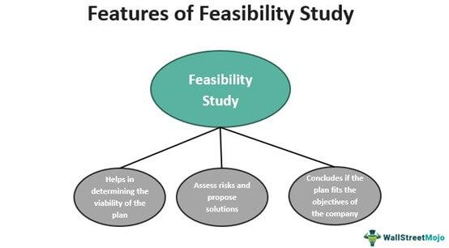

Algorithmic trading represents a significant portion of the financial markets, utilizing computer algorithms to execute trades at speeds and frequencies far beyond human capabilities. This fast-paced environment is influenced by numerous factors that can significantly alter trading outcomes. One such factor critical to algorithmic strategies is the concept of 'load'—a type of fee or commission associated with trading financial instruments.

Understanding 'load' and its implications is essential for traders looking to maintain and enhance their trading strategies. Loads are not just arbitrary charges; they have a direct impact on the profitability and efficiency of trades. With algorithmic trading relying on optimized strategies and rapid execution, any cost, such as a load fee, can affect the net returns. This makes it imperative for traders and automated systems to identify different types of loads and understand their effects to ensure that strategies are executed cost-effectively.



This comprehensive examination of load will focus on its definition, the various types that exist, and their specific impacts on trading strategies within algorithmic contexts. By providing a detailed exploration, the article aims to furnish traders with valuable insights into how loads affect trading outcomes and how these can be managed to optimize performance. Understanding the dynamics of load in algorithmic trading is not merely an academic exercise but a practical necessity for sustaining profitable trades in an ever-evolving financial landscape.

## Table of Contents

## Understanding Load in Algorithmic Trading

In any trading scenario, the concept of 'load' refers to a form of commission or fee. These fees are commonly associated with the buying and selling of financial instruments such as stocks, mutual funds, and exchange-traded funds (ETFs). In the context of algorithmic trading, which utilizes automated systems to execute trades based on predefined criteria, these loads can significantly influence profitability.

Algorithmic trading relies on precise and high-frequency execution of trades, where even small fees can accumulate and impact overall returns. The awareness and recognition of different types of loads in trading become pivotal in optimizing trading strategies. By understanding how these fees are structured, algorithmic traders can develop and fine-tune strategies specifically tailored to minimize the adverse effects of load costs.

There are generally three types of loads associated with trading activities that are worth noting: front-end loads, back-end loads, and no-loads. Each type of load has particular implications on trading outcomes and is crucial for algorithmic systems to factor them into strategy design. For instance, a front-end load, which is charged at the time of purchasing shares, reduces the initial available capital for trading, thereby impacting trading dynamics and potential return on investment.

Moreover, algorithmic systems can optimize trading by incorporating load structures into their decision-making processes. This might involve coding specific conditions to avoid trades that result in excessive load costs, thus preserving the profit margin. The overall goal is to ensure that load-related expenses do not disproportionately erode trading gains.

For an exemplar trading strategy, consider the decision rule: Choose trades only if the expected return exceeds the load cost by a threshold percentage. In Python, this can be represented as:

```python
def should_execute_trade(expected_return, front_end_load, threshold=0.02):
    return expected_return > (front_end_load + threshold)
```

By embedding such logic into trading algorithms, traders can make informed decisions that accommodate the nuances of load fees, improving the efficiency and profitability of the trading operations.

## Types of Load in Financial Context

Loads in the financial context are typically classified into three primary categories: front-end, back-end, and no-load. Understanding these types is essential for analyzing their impact on net returns in trading activities.

Front-end loads are fees imposed at the point of purchasing shares in a mutual fund. These charges are effectively sales commissions paid to brokers and are typically expressed as a percentage of the investment amount. For instance, if an investor puts $10,000 into a mutual fund with a 5% front-end load, $500 would be deducted as a fee, leaving $9,500 to be invested in the fund. The calculation can be expressed as:

$$
\text{Investment after Load} = \text{Initial Investment} \times (1 - \text{Front-end Load Percentage})
$$

It is important to note that front-end loads reduce the initial capital available for investment, which can have significant implications for the overall growth of the investment, especially in the early stages.

Back-end loads, also known as deferred sales charges, apply when shares are sold, rather than when they are bought. The fees may decrease over time, favoring long-term investors who retain their investment for a predefined period. For example, a fund might impose a 5% charge if shares are sold within the first year of purchase but reduce the charge by 1% each subsequent year until it is eventually eliminated. This structured fee schedule encourages investors to hold their investments over a longer term.

No-load funds, by contrast, do not charge any upfront or back-end fees, allowing investors to buy or sell shares without incurring immediate costs. Instead, these funds typically make up for the absence of load fees through other expenses such as management fees or operating expenses. The absence of a load fee can enhance the [liquidity](/wiki/liquidity-risk-premium) and flexibility of a portfolio, as investors can easily buy or sell their positions without additional costs.

Each load type has distinct implications for net returns and should be scrutinized before making investment decisions. For [algorithmic trading](/wiki/algorithmic-trading), these fees can influence the strategies deployed, as they alter the effective net gains from trading activity. Understanding and accounting for these costs can lead to better optimized and more profitable trading strategies.

## Load Considerations for Algorithmic Trading

In algorithmic trading, addressing the impact of various loads on trade execution is crucial for maintaining profitability. Algorithmic strategies must incorporate these considerations to optimize performance and minimize expenses.

Firstly, loads, as a form of commission or fee, directly affect the net returns from trading activities. As such, they can distinctly influence trading decisions, including the optimal times to enter or [exit](/wiki/exit-strategy) positions. For example, front-end loads, which are incurred when purchasing a financial instrument, might discourage frequent trading, as they can erode returns before any potential profit is realized. Conversely, back-end loads, charged upon selling, may incentivize traders to hold positions longer to offset the fee's impact over time.

Additionally, the structure of the load itself, whether front-end, back-end, or no-load, is a primary consideration for traders using algorithmic systems. Each load type demands a distinct approach to structuring trades to preserve returns. For instance, an algorithmic trading strategy might include a variable to account for the load, adjusting the trade's projected profit margin accordingly. In Python, this can be achieved using a basic function:

```python
def calculate_net_profit(price, load_type, load_rate):
    """
    Calculate net profit considering load type.

    :param price: Price of the financial instrument
    :param load_type: 'frontend', 'backend', or 'no-load'
    :param load_rate: Percentage rate of the load
    :return: Net profit after considering load
    """
    if load_type == 'frontend':
        load = price * load_rate
        net_profit = price - load
    elif load_type == 'backend':
        net_profit = price  # Assuming backend load is deducted on selling
    else:
        net_profit = price  # No load

    return net_profit
```

This function allows traders to input the initial price, load type, and load rate to determine the net profit, ensuring that load considerations are integrated into decision-making processes.

By tailoring algorithmic systems to accommodate various load structures, traders can significantly mitigate the costs associated with trading activities. This optimization often involves aligning trading algorithms with specific loads to ensure they execute trades at the most opportune times while minimizing fee impacts. An advanced algorithm might adapt dynamically to varying load conditions, using real-time data to refine its trading decisions and maximize efficiency.

Ultimately, the key to successful algorithmic trading lies in the precise accounting for such fees and employing strategies that not only acknowledge these costs but actively counterbalance them to enhance overall trading performance. Understanding the broader implications of load considerations allows algorithmic traders to navigate market complexities and maintain robust, cost-effective trading operations.

## The Impact of Load on Trading Performance

Loads represent a significant [factor](/wiki/factor-investing) that can influence trading performance in algorithmic trading scenarios. Their presence often reduces the potential profit margin when executing trades. The impact of loads necessitates the need for traders to meticulously analyze and adjust their strategies to ensure cost efficiency. This adaptation might involve recalibrating algorithms to account for the various fees associated with different types of load, such as front-end, back-end, and no-load structures.

When trading algorithms do not account for these costs, they can inadvertently erode a trader's profitability. For instance, a front-end load that is charged at the time of purchase directly reduces the initial investment, affecting the compounded returns of a strategy. Conversely, back-end loads, assessed at the time of selling, can diminish the net gains realized upon exiting a position. Each load type demands a strategic understanding and possibly a mathematical model to predict its impact accurately. 

For example, let $P$ be the initial investment and $L_f$ the front-end load percentage. The effective investment becomes $P(1 - L_f)$. The compounded return $R$ on this reduced amount must account for the initial deduction, influencing the overall strategy design. Computational models can simulate these scenarios to predict the long-term effects on profitability.

Algorithmic trading systems must leverage technology to lessen the friction introduced by these loads. Employing optimization techniques within algorithms can help identify the most cost-effective execution paths. Machine learning models, for instance, can dynamically adjust trading strategies by predicting fee patterns or exploiting variations in load structures offered by different financial instruments. By comprehending and integrating load implications, these systems can enhance decision-making processes and ultimately maximize returns. 

In summary, a robust understanding of the influence of loads on trading performance is crucial. Algorithmic traders must continuously innovate and adapt their strategies to mitigate the financial drag caused by various load types, ensuring sustainable profitability in the fast-evolving landscape of financial markets.

## Case Studies and Examples

Examining past scenarios where loads have significantly influenced trading outcomes offers valuable insights into the dynamics between various load types and algorithmic strategies. One illustrative example involves mutual funds, where different load structures can substantially impact the effectiveness of algorithmic trading methods.

### Mutual Funds and Load Structures

Mutual funds often present three primary load structures: front-end loads, back-end loads, and no-loads. These structures dictate the timing and manner in which fees are charged, which can affect trading decisions. For instance, front-end loads impose a fee at the initial investment stage, effectively reducing the amount of capital available for compounding. In an algorithmic trading system, this reduces the available initial capital, potentially impacting the profitability of the trade.

Conversely, back-end loads are incurred at the time of selling shares, and they can deter frequent trading, as they reduce the final returns. Algorithmic strategies must therefore account for these deferred costs, which may lead to adjusted trading frequencies or holding periods to optimize outcomes.

An example of a no-load structure, which is increasingly favored by algorithmic traders, eliminates entry or exit fees, thereby enhancing liquidity and trade flexibility. This can encourage more dynamic trading strategies and frequent repositioning in accordance with market conditions.

### Historical Scenario: High-Frequency Trading and Load Impact

In high-frequency trading ([HFT](/wiki/high-frequency-trading-strategies)), where trades occur at extremely fast speeds, even minor loads can significantly influence profitability. Consider a study where an HFT strategy involving front-end and back-end loads led to decreased return margins. The strategic decision to prefer no-load environments resulted in marked improvements in net profitability. By eliminating these costs, the algorithm gained the flexibility to execute trades without the friction of additional expenses, which is critical given the low-margin, high-[volume](/wiki/volume-trading-strategy) nature of HFT.

### Algorithmic Adjustments to Load Structures

The analysis of load impacts extends into refining algorithmic models to account for these variables. For instance, an algorithmic trading system might include a module to calculate potential losses from loads and adjust its strategy accordingly. This can be implemented using Python to model load effects:

```python
def compute_adjusted_returns(initial_investment, returns, front_end_load=0, back_end_load=0):
    # Calculate initial capital after front-end load
    initial_capital = initial_investment * (1 - front_end_load)

    # Calculate gross returns on initial capital
    gross_returns = initial_capital * (1 + returns)

    # Deduct back-end load to evaluate final returns
    adjusted_returns = gross_returns * (1 - back_end_load)

    return adjusted_returns

# Example usage
initial_investment = 100000  # $100,000
returns = 0.10  # 10% returns
front_end_load = 0.05  # 5% front-end load
back_end_load = 0.02  # 2% back-end load

adjusted_return = compute_adjusted_returns(initial_investment, returns, front_end_load, back_end_load)
print("Adjusted Returns after Load Costs: $", adjusted_return)
```

In the above code, the calculation of adjusted returns provides a clear view of how loads impact net gains, aiding in the optimization of strategies to circumvent cost inefficiencies.

### Future Implications and Strategy Refinement

Analyzing these case studies underscores the necessity for continuous evaluation and modification of algorithmic trading models with respect to load variables. By understanding historical impacts and employing sophisticated systems to adjust for these fees, traders can better navigate financial markets, ensuring that algorithmic strategies are consistently aligned with optimal cost structures. This iterative approach towards analysis and strategy refinement serves to bolster the sustainability and profitability of algorithmic trading endeavors.

## Best Practices for Managing Load in Algorithmic Trading

When managing load in algorithmic trading, a strategic approach to align trading strategies with load considerations is paramount for minimizing costs. Here are key practices:

1. **Aligning Trading Strategies with Load Considerations**: The efficient alignment of trading strategies can significantly minimize costs associated with loads. Traders should tailor their algorithmic models to account for the specific fee structure of their trading assets. For example, incorporating load costs into the expected cost framework can provide a clearer picture of potential returns. Algorithm thresholds should be adjusted based on expected transactional costs to ensure that execution is only pursued when optimal conditions are met.

2. **Employing Tools to Analyze and Project Impact**: Utilizing advanced analytical tools can provide critical insights into how loads affect trade execution and overall profitability. Tools like Python libraries for data analysis (e.g., pandas, NumPy) provide functionalities to model and simulate trading scenarios with various load structures. For example, a Monte Carlo simulation can forecast potential outcomes under different load conditions, aiding traders in making informed decisions. Here’s a simple Python snippet:

   ```python
   import numpy as np

   def calculate_net_return(gross_return, load):
       return gross_return * (1 - load)

   gross_returns = np.random.normal(0.1, 0.05, 1000)  # simulated gross returns
   load = 0.015  # 1.5% transaction load
   net_returns = calculate_net_return(gross_returns, load)

   expected_net_return = np.mean(net_returns)
   print(f"Expected Net Return: {expected_net_return:.2%}")
   ```

   This snippet calculates the expected net return after accounting for a hypothetical 1.5% transaction load over 1,000 simulations of gross returns.

3. **Staying Informed about Market Conditions and Fund Policies**: Continuous monitoring of market conditions and fund policies is crucial, as these elements can influence load structures. Traders need to keep a pulse on changes in fund management fees, market liquidity conditions, and regulatory shifts that may alter fee dynamics. This vigilance ensures that trading algorithms remain adaptive and relevant, optimizing their response to any shifts in the cost structure landscape.

By incorporating these practices, traders can not only minimize costs but also enhance the overall efficiency and profitability of their algorithmic trading strategies.

## Conclusion

Loads play a significant role in the profitability of algorithmic trading, influencing both strategic decisions and overall performance. A thorough understanding of load types, including front-end, back-end, and no-load, is crucial for traders aiming to maximize returns. Each type of load presents unique challenges and opportunities, which, if not properly managed, can erode profit margins significantly.

Incorporating load analysis into algorithmic strategies offers a pathway to optimize trading performance. By understanding the cost structures associated with different trades, traders can adjust their algorithms to make cost-efficient decisions. For instance, algorithms can be programmed to avoid buying or selling during periods that would trigger higher loads, thereby preserving net gains. Load analysis can be seamlessly integrated into trading algorithms using code, such as Python, to calculate potential fees and adjust strategy execution accordingly.

```python
# Example of a simple load calculation in Python
def calculate_load(load_type, amount):
    if load_type == "front-end":
        return amount * 0.05  # Assuming a 5% front-end load
    elif load_type == "back-end":
        return amount * 0.04  # Assuming a 4% back-end load
    elif load_type == "no-load":
        return 0
    else:
        raise ValueError("Invalid load type")

# Example usage
trade_amount = 10000
load = calculate_load("front-end", trade_amount)
net_investment = trade_amount - load
```

Traders must remain vigilant about costs to maintain sustainable returns. Continuous monitoring and adjustment of trading strategies are necessary in light of changing market conditions and fee structures. Staying informed about financial instrument policies and market shifts is essential for anticipating how loads might fluctuate and affect trading outcomes. By prioritizing cost management and adopting adaptive strategies, traders can ensure that their algorithmic trading practices remain profitable and resilient.

## References & Further Reading

[1]: Bergstra, J., Bardenet, R., Bengio, Y., & Kégl, B. (2011). ["Algorithms for Hyper-Parameter Optimization."](https://dl.acm.org/doi/10.5555/2986459.2986743) Advances in Neural Information Processing Systems 24.

[2]: ["Advances in Financial Machine Learning"](https://www.amazon.com/Advances-Financial-Machine-Learning-Marcos/dp/1119482089) by Marcos Lopez de Prado

[3]: ["Evidence-Based Technical Analysis: Applying the Scientific Method and Statistical Inference to Trading Signals"](https://www.amazon.com/Evidence-Based-Technical-Analysis-Scientific-Statistical/dp/0470008741) by David Aronson

[4]: ["Machine Learning for Algorithmic Trading"](https://github.com/stefan-jansen/machine-learning-for-trading) by Stefan Jansen

[5]: ["Quantitative Trading: How to Build Your Own Algorithmic Trading Business"](https://github.com/LucindaYa/quant-resources/blob/master/Quantitative%20Trading%20How%20to%20Build%20Your%20Own%20Algorithmic%20Trading%20Business.pdf) by Ernest P. Chan