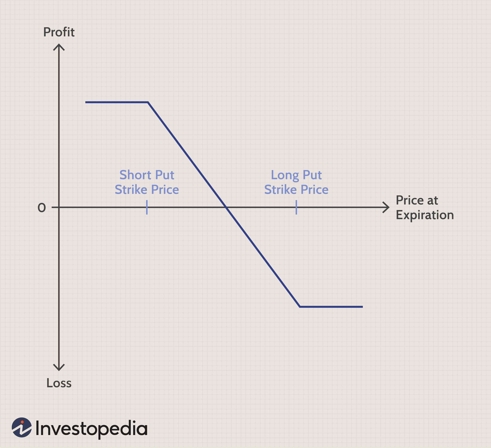

The world of finance is immense and intricate, offering a plethora of instruments and strategies that cater to a diverse range of investors, from retail traders to institutional players. At its core, finance aims to manage risk and optimize returns, making understanding the various available tools an indispensable skill for anyone engaged in the market. In recent years, the integration of load spread options, financial derivatives, and algorithmic trading has become increasingly significant as part of the advancement of contemporary financial markets.

Load spread options, essentially a mechanism to distribute annual fees across a series of payments, offer an innovative approach to financial management by providing investors a more manageable fee payment structure. While this offers transparency in fee deduction, it sometimes obscures the genuine cost associated with mutual fund investments. In parallel, financial derivatives, including options, futures, and swaps, are essential instruments that aid investors in hedging risk, uncovering price movements, and executing complex investment strategies. As intricate as these instruments are, they cater to a wide spectrum of strategic needs, from safeguarding investments to exploiting arbitrage opportunities.



Algorithmic trading, on the other hand, represents a technological evolution within trading systems. By leveraging algorithms, this trading methodology facilitates execution speeds and frequencies that far exceed human capabilities, enhancing market efficiency, precision, and emotional neutrality in trades. This transformation has been propelled by advances in computational technology and data science, which have made it possible to process vast swathes of market data in real-time, thereby enabling more informed decision-making.

This article seeks to unravel these complexities, examining each aforementioned concept on its own while also exploring how they interact to create a more interconnected financial environment. The synergies between load spread options, financial derivatives, and algorithmic trading present unique advantages such as optimized trading strategies and automated fee management. However, they also pose potential challenges, including market risks and the need for rigorous risk management.

By providing a comprehensive overview, this article endeavors to enrich the knowledge base of both novice and seasoned traders, offering insights that can lead to more informed financial decisions. Through understanding and navigating these sophisticated tools and strategies, investors can not only optimize their investment outcomes but also better prepare for the evolving landscape of global financial markets.

## Table of Contents

## Understanding Load Spread Options

A load spread option is an arrangement designed to systematically collect fees from investors over a period of time, rather than requiring an upfront, lump-sum payment. This method primarily applies to mutual funds and other investment vehicles, where management and administrative fees are levied periodically.

### Structure of Load Spread Options

In a traditional sense, investment products often levy a front-end load fee, which is deducted from the initial investment. Alternatively, a load spread option disperses these charges across a predefined period, typically taken as a fixed percentage of the remaining investment or account balance annually. For instance, if an investor chooses a mutual fund with a 5% annual load spread fee on a $10,000 investment, $500 would be deducted each year based on the unchanged investment balance, making it easier for the investor to manage.

### Advantages of Load Spread Options

The primary benefit of load spread options lies in their capacity to offer more palatable pay structures for investors. By leveling out payment obligations, this method enables investors to maintain a greater proportion of their capital in the market for a longer duration, potentially accruing more returns. Financial planners often advocate for load spread options to clients who prefer budgeted financial commitments over a fixed term.

Furthermore, this strategy can make particular investment products appear more attractive by reducing the perceived initial financial burden, potentially enabling a wider range of investors to participate in markets they might otherwise find inaccessible.

### Drawbacks of Load Spread Options

While load spread options may seem advantageous, they often obscure the true cost of an investment. The cumulative effect of annual deductions over several years can lead to a significant reduction in the total return on investment (ROI). Moreover, these fees are generally calculated on the principal balance, not accounting for any depreciation in asset value, thereby potentially exacerbating losses during downturns.

Critics argue that due to these fees being deducted from the investment’s current value, investors may not accurately comprehend the long-term financial implications. This methodology can sometimes lead to complacency in investors who do not actively assess their fee structure, leading to financial outcomes that diverge from initial expectations.

### Conclusion

In summary, load spread options present a practical mechanism to ease fee payment within investment vehicles. While they provide flexibility and ease for investors, it is crucial to assess the overall financial landscape, including potential erosions in returns. A detailed understanding of the implications of load spread options should be part of the broader strategic investment planning, ensuring that investors are equipped to make informed decisions.

## The Role of Financial Derivatives

Financial derivatives are pivotal instruments in modern finance, providing essential tools for risk management, price discovery, and investment strategies. These contracts derive their value from the performance of an underlying asset, index, or [interest rate](/wiki/interest-rate-trading-strategies), offering a diverse array of applications and opportunities.

Derivatives can be broadly categorized into several types, including options, futures, and swaps. Each of these instruments serves distinct functions in the financial markets:

1. **Options**: Options are contracts that give the buyer the right, but not the obligation, to buy or sell an asset at a predetermined price within a specific timeframe. They are used in hedging strategies to manage risk and in speculative strategies to capitalize on market movements. For example, a call option allows the holder to buy an asset, while a put option allows the holder to sell an asset.

2. **Futures**: Futures are standardized contracts obligating the parties to buy or sell an asset at a predetermined price at a future date. These contracts are used primarily for hedging and speculative purposes in commodity, currency, and interest rate markets. The standardized nature of futures contracts facilitates trading on exchanges, increasing liquidity and transparency.

3. **Swaps**: Swaps are agreements between two parties to exchange cash flows or other financial instruments over a specified period. Common types of swaps include interest rate swaps, currency swaps, and credit default swaps. These instruments enable parties to manage exposure to fluctuations in interest rates, exchange rates, and credit risks.

The use of derivatives in trading strategies can be complex, integrating various financial theories and models to forecast market behavior and optimize investment returns. For instance, the Black-Scholes model is a mathematical model used to determine the theoretical price of options, incorporating variables such as [volatility](/wiki/volatility-trading-strategies), interest rates, and time to expiration. Python code for calculating the Black-Scholes price of an option might look like this:

```python
import math
from scipy.stats import norm

def black_scholes(option_type, S, K, T, r, sigma):
    d1 = (math.log(S / K) + (r + 0.5 * sigma ** 2) * T) / (sigma * math.sqrt(T))
    d2 = d1 - sigma * math.sqrt(T)

    if option_type == 'call':
        return (S * norm.cdf(d1) - K * math.exp(-r * T) * norm.cdf(d2))
    elif option_type == 'put':
        return (K * math.exp(-r * T) * norm.cdf(-d2) - S * norm.cdf(-d1))

# Example usage:
S = 100   # Current stock price
K = 100   # Strike price
T = 1     # Time to maturity in years
r = 0.05  # Risk-free interest rate
sigma = 0.2  # Volatility of the underlying stock

call_price = black_scholes('call', S, K, T, r, sigma)
put_price = black_scholes('put', S, K, T, r, sigma)

print(f"Call Option Price: {call_price}")
print(f"Put Option Price: {put_price}")
```

Incorporating derivatives into investment strategies can offer significant advantages by enabling investors to leverage positions, hedge against adverse market movements, and enhance portfolio returns. However, derivatives also introduce complexity and risk, requiring investors to have a thorough understanding of the instruments and the market dynamics affecting their performance. As such, financial derivatives remain indispensable tools for traders and investors aiming to navigate the intricacies of financial markets effectively.

## Algorithmic Trading: An Overview

Algorithmic trading, often referred to as algo trading, utilizes advanced algorithms to execute trades with a precision and speed that surpass human capabilities. These algorithms are pre-programmed with a set of rules and data-driven logic, enabling them to analyze market variables and execute trades at optimal times, often within milliseconds.

A primary advantage of [algorithmic trading](/wiki/algorithmic-trading) is its efficiency in processing vast amounts of market data swiftly, allowing for the identification of patterns and opportunities that would be imperceptible in manual trading. This speed translates to cost-saving benefits and enhanced trade execution, as trades are conducted at the best available prices, minimizing the impact of market volatility. Moreover, the precision of algorithms significantly improves trade accuracy, reducing the likelihood of human errors that can result from fatigue or oversight.

Another benefit is the minimization of emotional bias, a common drawback in human-driven trading. Emotional reactions, such as fear or overconfidence, can impair judgment leading to suboptimal trading decisions. Algorithmic trading mitigates this by adhering strictly to its underlying code, ensuring consistent adherence to the predetermined strategy regardless of market sentiment.

Several tools and platforms form the backbone of algorithmic trading. Software such as MetaTrader, NinjaTrader, and TradeStation offer automated trading capabilities, integrating multiple algorithmic strategies. Additionally, programming languages like Python serve as invaluable resources for developing and testing trading algorithms due to their extensive libraries and simplicity in handling data analytics. Below is an example of a simple algorithmic trading strategy coded in Python using the `pandas` and `numpy` libraries, where we use a moving average crossover strategy:

```python
import pandas as pd
import numpy as np

def moving_average_crossover_strategy(prices, short_window=40, long_window=100):
    # Initialize the trading signals DataFrame
    signals = pd.DataFrame(index=prices.index)
    signals['Signal'] = 0.0

    # Create short and long simple moving averages
    signals['Short_MA'] = prices['Close'].rolling(window=short_window, min_periods=1, center=False).mean()
    signals['Long_MA'] = prices['Close'].rolling(window=long_window, min_periods=1, center=False).mean()

    # Create signals
    signals['Signal'][short_window:] = np.where(
        signals['Short_MA'][short_window:] > signals['Long_MA'][short_window:], 1.0, 0.0
    )

    # Generate trading orders
    signals['Positions'] = signals['Signal'].diff()

    return signals

# Example DataFrame `data` of stock prices with a column 'Close' for closing prices
signals = moving_average_crossover_strategy(data)
print(signals.tail())
```

This illustrative code checks whether the short-term moving average crosses above or below the long-term moving average, generating buy or sell signals accordingly.

Algorithmic trading is not limited to equities; it spans across diverse asset classes such as [forex](/wiki/forex-system), commodities, and cryptocurrencies. Each market presents unique challenges and opportunities, necessitating tailored algorithms to maximize returns and manage risks effectively.

However, while algorithmic trading offers considerable advantages, it also introduces complexities such as the risk of technical failures, algorithmic errors, and market disruptions. Therefore, it's crucial for strategies to be thoroughly backtested under various market conditions and monitored continuously to ensure compliance and performance align with expectations.

## Interconnecting Load Spread Options, Derivatives, and Algorithmic Trading

The integration of load spread options, financial derivatives, and algorithmic trading presents a sophisticated approach to fee management and trading strategy optimization. This synergy capitalizes on the strengths of each component to enhance investment outcomes.

Load spread options, which allow for periodic fee deductions instead of lump sum payments, can be efficiently managed through algorithmic strategies. By employing algorithms, financial institutions can automate the calculation and deduction of fees at predetermined intervals, ensuring accuracy and timeliness in fee settlements. This automation is particularly advantageous for large portfolios, where manual fee management would be cumbersome and prone to errors.

Algorithmic trading, which uses pre-defined instructions and high-speed data processing, complements this by offering enhanced capabilities in executing trade strategies involving derivatives. For instance, an algorithm can be programmed to execute trades based on specific market conditions, such as price movements of underlying assets. This allows for the dynamic adjustment of positions, maximizing returns while managing the inherent market risks of derivatives trading.

Consider an example where a mutual fund employs load spread options for fee collection and simultaneously trades in options and futures. An algorithm could monitor the market for volatility changes and automatically adjust the fund’s positions in derivatives to hedge against potential downsides. This not only optimizes the return on investment but also ensures that the fee collection aligns with the cash flow management strategies of the fund.

Case studies have demonstrated the effectiveness of this integration. For instance, a [quantitative trading](/wiki/quantitative-trading) firm implemented an automated system that combined fee management with real-time market analysis. The system was able to simultaneously manage load spread collections while executing complex trading strategies. This led to improved efficiency and reduced operational costs, as the firm could seamlessly integrate financial operations with strategic trading decisions.

In conclusion, the amalgamation of load spread options management with algorithmic trading strategies leveraging derivatives offers a robust framework for modern investment management. By automating processes and optimizing trading decisions, this integration not only streamlines financial operations but also enhances the financial performance of investment portfolios.

## Risks and Opportunities

While financial instruments like derivatives and strategies such as algorithmic trading provide significant opportunities, they are not without associated risks. Understanding these risks and the methods to manage them is crucial for investors looking to optimize their strategies.

Derivatives—contracts whose value is pegged to an underlying entity—are particularly susceptible to market risks due to their leverage potential and volatility. For instance, the pricing of options and futures can be highly sensitive to changes in the underlying asset's price, interest rates, and market volatility. This sensitivity is quantitatively captured using the Greeks (Delta, Gamma, Theta, Vega, and Rho), which measure the sensitivity of the derivative's price respective to different variables. A critical risk here is that unexpected movements in these variables can lead to significant losses, exemplified in the 2008 financial crisis where the misuse of derivatives is often cited as a contributing [factor](/wiki/factor-investing).

Algorithmic trading, which employs computers programmed to follow defined instructions for executing trades, offers the advantage of speed and precision. However, it also introduces unique risks. One primary concern is the potential for systemic risk, where errors in the algorithms or malfunctions in trading systems can cause cascading failures across markets. This is compounded by flash crashes—extremely rapid decreases in asset prices followed by a quick recovery—often driven by algorithmic trades. Furthermore, algorithmic strategies may face [liquidity](/wiki/liquidity-risk-premium) risks if they cannot buy or sell assets at desired prices due to insufficient market depth.

Effective risk management strategies are paramount to mitigate these potential downsides. For derivatives, employing diversification, setting stringent stop-loss limits, and utilizing risk assessment tools like Value at Risk (VaR) can help manage potential losses. In algorithmic trading, rigorous pre-launch testing in simulated environments, ongoing system monitoring, and incorporating [machine learning](/wiki/machine-learning) for adaptive trading strategies are recommended practices. These measures can help ensure stability even amid volatile or unexpected market conditions.

Investors can optimize their strategies by staying informed about market conditions, continuously updating algorithms to reflect new data, and employing hedging strategies to reduce exposure to adverse price movements. Hedging with derivatives, for instance, can protect an investment portfolio from losses due to fluctuations in currency exchange rates or commodity prices, which is a common practice among multinational corporations to stabilize cash flows.

In conclusion, while the integration of load spread options, derivatives, and algorithmic trading into investment portfolios can lead to enhanced returns and efficiency, it requires judicious management of associated risks. Balancing these instruments' potential benefits with robust risk mitigation strategies is critical to long-term investment success in the ever-evolving financial markets.

## Conclusion

Integrating load spread options, financial derivatives, and algorithmic trading offers a sophisticated framework for navigating modern financial markets. Each element contributes distinct advantages and potential efficiencies to investment and trading strategies. Load spread options allow investors to manage fee payments incrementally, potentially enhancing cash flow management and making investments more accessible through reduced upfront costs. However, their true cost must be evaluated, as a lack of transparency might obscure long-term implications.

Financial derivatives, such as options, futures, and swaps, provide a dynamic platform for risk management and speculative opportunities. These instruments enable investors to hedge against unwanted risk exposures or capitalize on anticipated market movements. The diverse application of derivatives reflects their versatility, offering robust strategies for both risk-averse and risk-seeking investors. 

Algorithmic trading represents the pinnacle of technological integration in finance, using advanced algorithms to execute trades with unprecedented speed and precision. This capability not only reduces human error and emotional bias but also maximizes the execution efficiency across financial instruments. The synergy between algorithmic trading and derivatives is substantial, as algorithms can quickly identify [arbitrage](/wiki/arbitrage) opportunities and optimize derivatives strategies, enhancing the speed and scope of trading activities.

When harmoniously integrated, these tools form a cohesive strategy that can significantly optimize investment outcomes. By automating the management of load spread options and executing complex derivative strategies efficiently, algorithmic trading fosters a more adaptive investment approach. This interconnectedness offers traders and investors a competitive edge, enabling them to navigate intricate financial environments with enhanced agility.

Looking ahead, the convergence of these financial practices is expected to evolve alongside technological advancements and regulatory developments. As [artificial intelligence](/wiki/ai-artificial-intelligence) and machine learning continue to penetrate trading systems, the precision and capability of algorithmic trading will expand. Similarly, emerging regulations might impact the transparency and operation of load spread options and derivatives, necessitating adaptive strategies.

In conclusion, the integration of load spread options, financial derivatives, and algorithmic trading provides a comprehensive approach to capital markets, highlighting both opportunities and challenges. Investors and traders equipped with knowledge about these instruments and strategies are better positioned to capitalize on market dynamics, achieving financial success in a rapidly changing landscape.

## References & Further Reading

[1]: Durbin, M. (2010). ["All About High-Frequency Trading."](https://www.mhebooklibrary.com/doi/book/10.1036/9780071743457) McGraw-Hill.

[2]: Hull, J. C. (2017). ["Options, Futures, and Other Derivatives."](https://www.semanticscholar.org/paper/Options%2C-Futures%2C-and-Other-Derivatives-Hull/89bdee500c8623864fc9eb7a471546aa713acc44) Pearson Education.

[3]: Narang, R. K. (2013). ["Inside the Black Box: A Simple Guide to Quantitative and High-Frequency Trading."](https://onlinelibrary.wiley.com/doi/book/10.1002/9781118662717) Wiley Finance.

[4]: Aldridge, I. (2013). ["High-Frequency Trading: A Practical Guide to Algorithmic Strategies and Trading Systems."](https://www.amazon.com/High-Frequency-Trading-Practical-Algorithmic-Strategies/dp/1118343506) Wiley.

[5]: Linetsky, V. (2007). ["Derivatives Pricing: The Classic Models and New Innovations."](http://users.iems.northwestern.edu/~linetsky/) MIT Press.