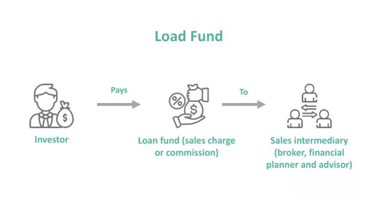

The financial markets offer a diverse array of investment opportunities, each presenting its own set of benefits and risks. Navigating these options can be complex, but investors often seek strategies to optimize their portfolios effectively. Two intriguing avenues that have gained traction are load-waived mutual funds and algorithmic trading. These tools, when understood and applied appropriately, can significantly enhance investment outcomes by minimizing costs and maximizing potential returns.

Load-waived mutual funds present a compelling option for those aiming to reduce investment expenses. By waiving the typical load fees—such as front-end and back-end charges associated with traditional mutual funds—investors can preserve a larger share of their returns. This approach allows for more efficient capital allocation, particularly advantageous in defined contribution retirement plans, where such funds are frequently offered.



Algorithmic trading, on the other hand, leverages technological advancements to execute trades based on predefined criteria. This method enables investors to exploit market efficiencies and achieve trades at optimal prices. The growing accessibility of financial technology has democratized algorithmic trading, making it a viable option for a wider range of investors. By incorporating sophisticated algorithms, investors can enhance the precision of their trading strategies, potentially boosting portfolio performance.

When combined, load-waived funds and algorithmic trading provide a layered approach to investment strategy: cost efficiency from minimized fees and enhanced execution through automated trading techniques. Understanding these tools and their potential synergies is crucial for investors aiming to achieve a strategic advantage in the financial markets. Such knowledge equips them to minimize costs and enhance returns, ultimately better aligning their investment choices with their financial objectives.

## Table of Contents

## What Are Load-Waived Funds?

Load-waived funds are a type of mutual fund distinguished by their exclusion of standard load fees, which are normally charged when purchasing (front-end load) or selling (back-end load) mutual fund shares. These load fees can significantly diminish the returns that investors realize from their fund investments. By waiving these charges, load-waived funds allow investors to retain a larger portion of their investment gains.

Investors may typically access load-waived funds through specific arrangements or conditions. For instance, these funds might be offered to participants of certain retirement plans, like defined contribution plans, or through other institutional arrangements. In these scenarios, the load fees are either reduced or fully waived, thus offering a cost-efficient investment vehicle.

It is important to clarify the difference between no-load funds and load-waived funds. No-load funds are mutual funds that do not charge any load fees at all, whereas load-waived funds typically would charge these fees but have specific exemptions in certain circumstances. Despite the waiver of load fees, load-waived funds might still incur other fees, such as 12b-1 fees. These are ongoing annual fees that mutual funds charge to cover their marketing and distribution expenses and can impact the net returns to the investor over time.

For investors, understanding the fee structure and conditions under which load-waived funds are offered is crucial. This knowledge helps ensure that they optimize their investment returns and select funds that align with their financial strategies and goals.

## Mutual Funds: A Versatile Investment Vehicle

Mutual funds are investment vehicles designed to pool money from numerous investors, enabling the purchase of a diversified portfolio. Diversification across various asset classes—such as stocks, bonds, or other securities—serves to mitigate risk. This approach can be particularly beneficial in achieving a balance between risk and return, as a diversified portfolio is generally less volatile than individual investments. According to Modern Portfolio Theory, diversification can potentially offer the same expected return for lower risk, aligning well with the investment goals of risk-averse individuals. 

One of the primary benefits of mutual funds is the access they provide to professional management. Investors gain access to the expertise of fund managers who conduct thorough research and apply their knowledge to buy and manage a variety of assets. This professional oversight can be advantageous for both novice and experienced investors who may lack the time or expertise to manage their portfolios actively. Moreover, mutual funds allow investors with limited capital to hold a slice of a diversified portfolio, offering fractional ownership in a broad range of securities that might otherwise be financially inaccessible.

Mutual funds are available in various classes, each featuring distinct fee structures that investors should carefully consider. Common fees include management fees, administrative costs, and 12b-1 fees, which cover marketing and distribution expenses. The different share classes typically include Class A, B, and C, each with unique load structures impacting costs. Class A shares often involve front-end loads (sales charges paid when shares are purchased), Class B shares may have back-end loads (charges when shares are sold), and Class C shares typically include level loads (ongoing charges). Understanding these fee structures is crucial and highlights the importance of evaluating alternatives like load-waived funds, which might offer cost advantages by eliminating specific load fees.

Investors aiming to align their mutual fund selections with their financial goals must have a keen understanding of mutual fund mechanics. Beyond fees and management structure, factors such as investment strategy, past performance, and asset allocation should play a critical role in decision-making. Investors should assess whether a fund's objectives and risk level match their long-term financial targets, such as retirement savings or capital preservation. Overall, mutual funds provide a structured and straightforward way to achieve investment diversification, offering both the simplicity of accessibility and the complexity of strategic planning to fit various investor profiles.

## Algorithmic Trading: An Overview

Algorithmic trading refers to the use of computer algorithms to automatically execute trades by following pre-set criteria. These criteria can range from simple conditions, such as moving averages or price levels, to complex quantitative models utilizing timing, [volume](/wiki/volume-trading-strategy), and market [volatility](/wiki/volatility-trading-strategies). The primary goal of [algorithmic trading](/wiki/algorithmic-trading) is to capitalize on market inefficiencies and execute trades at optimal prices, often at speeds unattainable by human traders.

The method leverages market efficiencies by analyzing vast amounts of data in real-time to identify trading opportunities. This is facilitated by innovations in financial technology, which have made algorithmic trading more accessible. Developers can employ languages like Python to create algorithms capable of performing sophisticated financial analyses and executing trades. A typical simple algorithm might look like:

```python
import pandas as pd

# Sample data preparation
data = pd.DataFrame({'prices': [100, 102, 101, 103, 105]})
data['moving_avg'] = data['prices'].rolling(window=2).mean()

# Trading algorithm
buy_signal = (data['prices'] > data['moving_avg']) & (data['prices'].shift(-1) > data['prices'])
sell_signal = (data['prices'] < data['moving_avg']) & (data['prices'].shift(-1) < data['prices'])

data['signal'] = 0
data.loc[buy_signal, 'signal'] = 1  # Buy
data.loc[sell_signal, 'signal'] = -1 # Sell

# Execution logic (placeholder)
for index, row in data.iterrows():
    if row['signal'] == 1:
        print("Execute Buy Order")
    elif row['signal'] == -1:
        print("Execute Sell Order")
```

This code block demonstrates a simple moving average strategy where buy or sell signals are generated based on the relationship between price and its moving average. As financial technology progresses, more sophisticated algorithms use [machine learning](/wiki/machine-learning) techniques to predict market movements more accurately.

Incorporating algorithmic trading into investment strategies can potentially enhance portfolio performance. When combined with mutual funds, algorithms can provide precise and strategic enhancements. For example, automated strategies can optimize transaction timing, helping to avoid market impacts and reduce transaction costs. They can also fine-tune asset allocation according to predefined risk management parameters.

Overall, algorithmic trading presents significant strategic value by allowing investors to exploit market conditions rapidly and efficiently. As technology continues to advance, the potential for performance improvement through algorithmic trading also grows, making it an attractive option for both institutional and retail investors seeking competitive advantages in the fast-paced financial markets.

## The Synergy between Load-Waived Funds and Algorithmic Trading

Combining load-waived funds with algorithmic trading offers investors a potent means to enhance their investment strategies by reducing costs and improving trading precision. Load-waived funds eliminate the typical load fees associated with mutual funds, such as front-end and back-end loads, which allows investors to retain more of their potential returns. This characteristic is crucial as it enables investors to allocate more capital toward aggressive investment strategies or diversifying their portfolios more comprehensively.

The integration of algorithmic trading with load-waived funds further augments the potential for strategic gains. Algorithmic trading employs computer algorithms to execute trades based on predefined criteria, which can include timing, price, or quantity. This method ensures trades are executed at optimal times and prices, thereby enhancing market efficiency. By combining these trading efficiencies with the cost advantages of load-waived funds, investors can maximize their portfolio performance.

Python, a popular programming language in the financial industry, can be instrumental in implementing algorithmic trading strategies. Here's a simple example of how an algorithm might be set up to execute trades:

```python
import pandas as pd

# Load historical price data into a DataFrame
data = pd.read_csv('historical_prices.csv')
data['signal'] = 0

# Calculate moving averages
data['short_mavg'] = data['Close'].rolling(window=5).mean()
data['long_mavg'] = data['Close'].rolling(window=20).mean()

# Generate trading signals
data['signal'][data['short_mavg'] > data['long_mavg']] = 1
data['signal'][data['short_mavg'] < data['long_mavg']] = -1

# Print signals
print(data[['Close', 'short_mavg', 'long_mavg', 'signal']])
```

This script calculates short-term and long-term moving averages of historical stock prices to generate buy and sell signals. Investors can feed these signals into their trading platform to automate the execution, thereby reducing the impact of human errors and emotions on trading decisions. 

Moreover, leveraging load-waived funds with algorithmic trading negates the detrimental effects of load fees, which can significantly erode profits over time. This approach helps in preserving capital, which can be reinvested, amplifying the benefits derived from sophisticated trading strategies. 

By exploring the synergy between load-waived funds and algorithmic trading, investors can unlock new pathways for portfolio optimization, gaining a competitive edge in terms of cost efficiency and execution accuracy. This approach not only maximizes the potential returns on investments but also positions investors to act more nimbly in fast-moving financial markets.

## Considerations and Risks

When considering the use of load-waived mutual funds and algorithmic trading, investors must recognize the potential risks and considerations involved. Load-waived funds, while advantageous in reducing immediate costs by eliminating load fees, are not entirely devoid of expenses. They may still [carry](/wiki/carry-trading) 12b-1 fees, which are annual marketing or distribution fees included in the fund's expense ratio. Although smaller than traditional loads, these fees can accumulate over time, influencing overall investment returns. Understanding all fee obligations is crucial for a realistic assessment of potential gains from load-waived funds.

Algorithmic trading, although beneficial in enhancing trading efficiency and execution, is inherently subjected to market volatility. Algorithms designed to exploit market inefficiencies can face challenges during periods of unexpected market turbulence, potentially leading to suboptimal trading outcomes. The reliance on historical market data and assumptions in algorithmic models can lead to inaccuracies when market conditions change. As such, algorithmic trading strategies may require continuous refinement and adaptation, involving a rigorous testing process to mitigate these risks.

Investors are advised to conduct thorough due diligence when integrating these investment tools. This process includes understanding the intricacies of both financial products and staying abreast of any regulatory changes that may affect algorithmic trading practices. A comprehensive assessment of one's risk tolerance and alignment with long-term investment goals is essential. Engaging with financial advisors can provide valuable insights and perspectives, ensuring that strategies are tailored to individual needs and risk profiles.

Ultimately, being informed about potential drawbacks, such as the potential erosion of returns due to fees in load-waived funds and the susceptibility of algorithmic trading to market fluctuations, is fundamental in crafting a sound investment strategy. Employing a holistic approach that weighs both the advantages and limitations of these tools will better position investors to achieve their financial objectives responsibly and sustainably.

## Conclusion

The investment landscape is rich with opportunities like load-waived funds and algorithmic trading, each offering distinct advantages that, when understood and effectively implemented, can substantially bolster an investor's portfolio. By strategically leveraging these tools, investors can not only minimize costs but also enhance their potential for achieving financial goals with greater efficiency. 

Load-waived funds allow investors to bypass traditional load fees, thereby maximizing the portion of investments that directly contributes to wealth accumulation. When combined with algorithmic trading—where computer algorithms facilitate optimal trade execution—investors can exploit market efficiencies and capitalize on real-time opportunities.

As financial markets continuously evolve, staying informed and adaptable is imperative for successful investment strategies. Adapting to innovations and understanding emerging trends entails a proactive approach to education and exploration. This commitment to learning ensures investors are well-positioned to harness the full potential of these advanced investment strategies. Through continual education and strategic application of these tools, investors can enhance the resilience and performance of their portfolios, navigating the complexities of modern financial markets with confidence.

## References & Further Reading

[1]: Bergstra, J., Bardenet, R., Bengio, Y., & Kégl, B. (2011). ["Algorithms for Hyper-Parameter Optimization."](https://dl.acm.org/doi/10.5555/2986459.2986743) Advances in Neural Information Processing Systems 24.

[2]: ["Advances in Financial Machine Learning"](https://www.amazon.com/Advances-Financial-Machine-Learning-Marcos/dp/1119482089) by Marcos Lopez de Prado

[3]: ["Evidence-Based Technical Analysis: Applying the Scientific Method and Statistical Inference to Trading Signals"](https://www.amazon.com/Evidence-Based-Technical-Analysis-Scientific-Statistical/dp/0470008741) by David Aronson

[4]: ["Machine Learning for Algorithmic Trading"](https://github.com/stefan-jansen/machine-learning-for-trading) by Stefan Jansen

[5]: ["Quantitative Trading: How to Build Your Own Algorithmic Trading Business"](https://www.amazon.com/Quantitative-Trading-Build-Algorithmic-Business/dp/1119800064) by Ernest P. Chan