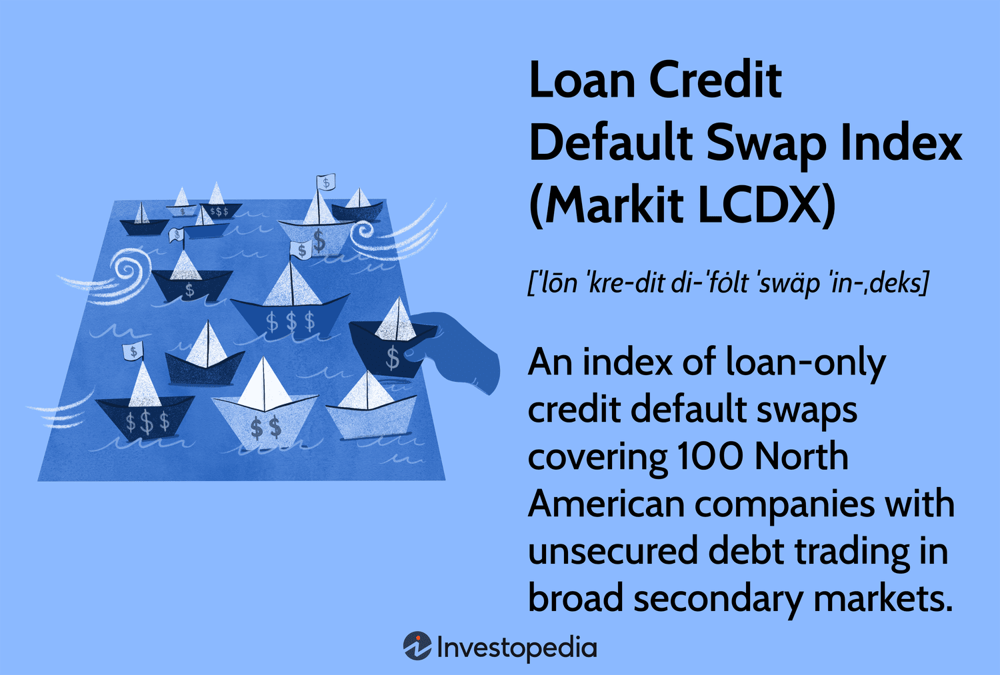

The Loan Credit Default Swap Index (Markit LCDX) represents a crucial component of the credit derivatives market, offering insights and tools vital for institutional investors and financial professionals. This index, composed of loan-only credit default swaps, enables participants to hedge against credit risks associated with syndicated loans. Understanding the LCDX's framework and its impact on financial markets is essential for navigating the complexities of modern investment strategies.

Developed to facilitate credit risk management, the Markit LCDX has evolved as a benchmark for evaluating the creditworthiness of North American corporates with unsecured debt. It captures fluctuations in credit market dynamics and offers liquidity, thereby aiding in effective pricing of individual credit default swaps. The exploration of its fundamentals reveals how it serves as a mirror reflecting the broader economic indicators and market sentiment.

Importantly, algorithmic trading is gaining popularity as it transforms how the LCDX is managed and traded. By leveraging automated platforms, market participants can achieve greater efficiency and transparency, consequently enhancing price discovery and trading execution.

Through this article, we will explore the core elements of the LCDX, examining its development, composition, and the critical role of algorithmic trading. In doing so, we unpack the complexities surrounding this sophisticated financial instrument, aiding stakeholders in optimizing risk management and portfolio performance.

## Table of Contents

## What is the Loan Credit Default Swap Index (Markit LCDX)?

The Loan Credit Default Swap Index (Markit LCDX) is an influential financial instrument in the credit derivatives market. Primarily focusing on 100 North American companies with unsecured debt, the LCDX serves as a benchmark for loan-only credit default swaps (CDS). Its specialization in loan-only CDS differentiates it from other indices, allowing focused exposure to the credit risk associated with syndicated loans.

Trading of the LCDX takes place over-the-counter (OTC), a characteristic that provides significant flexibility and customization opportunities for market participants. This OTC nature is a fundamental part of its utility in hedging credit risk across the syndicated loan market. By facilitating this hedging capability, the LCDX enables participants to mitigate potential losses from defaults, thereby stabilizing investment portfolios that contain leveraged loans.

The LCDX is managed by a consortium of large investment banks, which contributes to its role in providing [liquidity](/wiki/liquidity-risk-premium) and assisting in the pricing of individual credit default swaps. These banks leverage their extensive market presence and expertise to ensure the LCDX remains an effective tool for risk management and speculative strategies. The pricing is reflective of the perceived credit risk of the constituent companies, allowing investors to gauge market sentiment and risk premiums.

IHS Markit Ltd, the index provider, ensures the credibility and operational efficiency of the LCDX. With its robust data infrastructure and market analytics, IHS Markit maintains the integrity and accuracy of the index. This professional management is vital for the confidence that market participants place in the LCDX as a measure of North American corporate credit risk.

In summary, the Loan Credit Default Swap Index (Markit LCDX) is a crucial instrument in risk management and speculative strategies in the credit derivatives market, offering liquidity and critical pricing mechanisms for a specialized set of securities.

## Understanding Loan Credit Default Swaps (CDS)

Credit default swaps (CDS) function as a form of insurance that protects against the default of a borrower. This financial derivative allows an investor to transfer the credit exposure of fixed income products to another party. At the heart of a CDS is the agreement between two parties: the buyer, who seeks protection against the risk of default, and the seller, who provides this protection in exchange for a periodic fee, often referred to as the "spread." The spread is determined based on the perceived risk of the reference entity, typically expressed in basis points per annum.

The mechanism of a CDS can be likened to insurance on a bond or loan, where the buyer pays the seller regular premiums until the maturity of the contract or until a credit event occurs. A credit event is generally understood to include situations such as the bankruptcy, failure to pay, or restructuring of the borrower's obligations. Should a credit event occur, the CDS seller compensates the buyer, either through physical delivery of bonds at their par value (face value) or through a cash settlement equivalent to the difference between the par value and the market value of the reference obligation.

Mathematically, the CDS payoff upon a credit event can be expressed as:

$$
\text{Payoff} = \text{Notional Amount} \times (1 - \text{Recovery Rate})
$$

where the Recovery Rate is the estimated market value of the defaulted obligation as a percentage of its face value. For instance, if the notional amount is $10 million and the recovery rate is 40%, the payoff would be:

$$
\text{Payoff} = 10,000,000 \times (1 - 0.4) = 6,000,000
$$

This payoff compensates the CDS buyer for the loss incurred due to the borrower's default.

The CDS market provides significant benefits in terms of price discovery and credit risk management. However, it also involves risks, such as counterparty risk (the risk that the seller will not be able to fulfill their obligation) and basis risk (the discrepancy between the CDS spread and the actual credit risk of the underlying exposure). Understanding these intricacies is crucial for effectively leveraging CDS in managing credit risk.

## Structure and Composition of the LCDX

The Loan Credit Default Swap Index (LCDX) is structured to include 100 of the most liquid leveraged loans issued by North American companies. These loans are selected based on several parameters, including credit rating, liquidity, and loan size, to ensure that they reflect the broader leveraged loan market accurately. The inclusion of a loan in the LCDX requires that it meet specific liquidity criteria, such as regular trading volumes that can support active index participation.

The construction of the LCDX ensures that each of the 100 entities is equally weighted at the outset, aimed at providing a balanced representation of the market landscape. This equal weighting is essential for maintaining a standardized approach to assessing credit exposure across the index. However, this composition is not rigid and is subject to periodic adjustments. These updates account for changes in market dynamics, reflecting new issuances, defaults, or significant changes in the credit quality of the underlying entities.

The dynamic nature of the LCDX means that it requires regular evaluation to align with shifts in market behavior. Updates are conducted periodically, typically every six months, to incorporate new data and maintain relevance to current market conditions. This periodic updating process involves a meticulous review of the trading activity, credit quality, and size of eligible loans.

Market fluctuations can lead to changes in the weighting of individual components within the LCDX. For instance, as market conditions vary, the liquidity of certain loans may enhance or diminish, necessitating a recalibration of its weight within the index to ensure the index's integrity. This recalibration process adheres to a transparent methodology set out by IHS Markit Ltd, the index provider, guaranteeing that the LCDX accurately represents the state of the North American leveraged loan market.

## Roles and Applications of LCDX

Institutional investors primarily engage with the Loan Credit Default Swap Index (LCDX) as a vehicle for hedging credit risk and managing risk exposures in their portfolios. LCDX serves as an effective tool for offsetting potential credit defaults across a diversified set of leveraged loans from North American companies. By incorporating LCDX into their strategies, investors can achieve a more balanced and resilient portfolio.

The LCDX enables speculation on the creditworthiness of companies included in the index. Investors can take positions based on their expectations of changes in the perceived risk of these companies defaulting on their loans. This speculative aspect allows market participants to express their views on credit trends and capitalize on shifting market sentiment.

Pricing and valuation of the LCDX are based on credit default swap (CDS) spreads. These spreads represent the cost of obtaining CDS protection, stated in basis points. A basis point, equal to 0.01%, is a common unit of measure in finance for [interest rate](/wiki/interest-rate-trading-strategies) spreads, fees, and so on. For example, a spread of 100 basis points translates to a 1% annual cost to insure against default. 

To calculate the cost of protection in more practical terms, consider a notional amount of $10 million and a CDS spread of 150 basis points. The annual protection payment can be calculated as follows:

$$
\text{Annual Cost} = \text{Notional Amount} \times \frac{\text{CDS Spread}}{10,000}
$$

Plugging in the values:

$$
\text{Annual Cost} = \$10,000,000 \times \frac{150}{10,000} = \$150,000
$$

This calculation shows that the buyer of the LCDX pays $150,000 annually to protect $10 million worth of credit exposure. Such calculations are pivotal for investors to assess the affordability and effectiveness of their hedging strategies using LCDX.

## Algorithmic Trading and LCDX

Algorithmic trading has substantially transformed the landscape of Loan Credit Default Swap Index (LCDX) trading by enhancing both efficiency and transparency. As a form of electronic trading, [algorithmic trading](/wiki/algorithmic-trading) leverages complex algorithms to execute trades at speeds and frequencies that are impossible for human traders. 

Automated platforms such as Tradeweb and MarketAxess are integral to this transformation. These platforms facilitate real-time trading and ensure efficient price discovery, crucial for the dynamic and complex nature of the LCDX market. Real-time trading enables market participants to respond rapidly to market conditions, thereby minimizing the lag that typically accompanies manual trading processes. 

The improvements brought about by algorithmic trading can be particularly observed in the enhanced accessibility of the LCDX market. By automating the trade execution process, these platforms reduce the barriers to entry for various market participants, including institutional investors and hedge funds. This increased participation strengthens liquidity in the market, leading to narrower bid-ask spreads and improved overall market efficiency.

Moreover, the evolution of electronic trading platforms supports better management of trading risks through advanced risk management tools and analytics. By systematically analyzing large volumes of data, algorithmic trading platforms allow traders to optimize strategies and manage positions more effectively.

In summary, the integration of algorithmic trading into LCDX trading underscores a significant progression towards a more efficient, transparent, and accessible financial derivative market. As technology continues to evolve, the capabilities and functionalities of these platforms are expected to advance, further enhancing the landscape of LCDX trading.

## Challenges and Risks in LCDX Trading

Liquidity concerns in Loan Credit Default Swap Index (LCDX) trading often surface during periods of market stress, manifesting as wider bid-ask spreads. This phenomenon occurs because participants in financial markets tend to withdraw from trading during volatile times, reducing the number of counterparties willing to buy or sell contracts. This scarcity of counterparties can create significant spreads between the asking price and the bidding price, thereby increasing transaction costs for investors. As a consequence, the ability to liquidate positions or hedge against adverse movements in credit risk becomes restricted, which can lead to inefficiencies and higher risk exposure for investors.

Counterparty risk is another critical [factor](/wiki/factor-investing) in LCDX trading, particularly evident during financial crises. This risk arises when the counterparty to a derivative contract fails to fulfill its contractual obligations. The collapse of major financial institutions, like Lehman Brothers during the 2008 financial crisis, highlighted the systemic implications of counterparty risk in the derivatives market. In such scenarios, the default or potential default of a counterparty can lead to significant financial losses for other market participants and reinforce the cycle of default risk within financial systems. To manage this risk, counterparties often rely on collateral agreements and central clearing parties, which albeit effective, introduce additional complexity and costs.

Basis risk emerges from the discrepancies between the performance of the LCDX and the actual loan portfolios they are intended to hedge. This risk becomes apparent when the index does not precisely track the risk of the underlying loans due to differences in composition, liquidity, and other market factors. The mismatch in index performance versus actual loan creditworthiness can reduce the effectiveness of hedging strategies, leading to unexpected financial exposure for investors. The occurrence of basis risk is particularly problematic as it undermines the protective intent of using CDS indices and necessitates the use of sophisticated models and adjustments to align exposures properly.

These challenges underscore the importance of a comprehensive risk management framework when dealing with LCDX trading. Such a framework incorporates periodic stress testing, robust counterparty credit assessments, and dynamic hedging strategies to adjust for basis risks. Financial institutions and investors must continuously refine these strategies to adapt to evolving market conditions and maintain effective risk mitigation.

## Conclusion

The Markit Loan Credit Default Swap Index (LCDX) serves as a pivotal component in managing credit risk, particularly within the leveraged loan market. As a comprehensive index that encompasses 100 North American entities, it affords market participants a robust framework for hedging potential losses associated with loan defaults. Its utility extends beyond mere risk mitigation, offering investors the ability to gauge market sentiment regarding the creditworthiness of various companies.

In addition to its foundational role in risk management, the evolving landscape of LCDX trading is increasingly influenced by algorithmic trading innovations. The integration of algorithms and automated trading systems has augmented both the efficiency and transparency of LCDX transactions. Platforms such as Tradeweb and MarketAxess exemplify this transition by providing real-time data, which enhances liquidity and facilitates accurate price discovery.

As the financial markets continue to evolve, the development and adoption of algorithmic trading strategies are likely to further shape the dynamics and accessibility of LCDX trading. This ongoing evolution underscores the importance of understanding LCDX intricacies, enabling institutional investors and financial professionals to enhance portfolio performance and implement effective risk management strategies.

In summary, the Markit LCDX remains an indispensable tool in the financial world. Its importance is amplified by the synergies between traditional risk management practices and modern technological advancements. Maintaining a comprehensive grasp of its mechanisms and potential applications is essential for leveraging its full capabilities and navigating the complexities of today's financial markets.

## References & Further Reading

[1]: Markit. (2021). ["Markit Loan Credit Default Swap Index (LCDX)."](https://www.investopedia.com/terms/l/lcdx.asp) 

[2]: Hull, J. (2018). ["Options, Futures, and Other Derivatives"](https://www.semanticscholar.org/paper/Options%2C-Futures%2C-and-Other-Derivatives-Hull/89bdee500c8623864fc9eb7a471546aa713acc44) (10th Edition). Pearson.

[3]: O’Kane, D. (2008). ["Modelling Single-name and Multi-name Credit Derivatives"](https://onlinelibrary.wiley.com/doi/pdf/10.1002/9781119201960.fmatter). Wiley.

[4]: Lopez de Prado, M. (2018). ["Advances in Financial Machine Learning"](https://www.amazon.com/Advances-Financial-Machine-Learning-Marcos/dp/1119482089). Wiley.

[5]: Jansen, S. (2018). ["Machine Learning for Algorithmic Trading"](https://github.com/stefan-jansen/machine-learning-for-trading). Packt Publishing.

[6]: Fleming, J., Kirby, C., & Ostdiek, B. (2001). ["The Economic Value of Volatility Timing Using 'Realized' Volatility."](https://www.sciencedirect.com/science/article/pii/S0304405X02002593) Journal of Financial Economics, 67(3), 473-509.

[7]: Duffie, D. (1999). ["Credit Swap Valuation."](https://www.darrellduffie.com/uploads/1/4/8/0/148007615/duffiecreditswapvaluation1999.pdf) Financial Analysts Journal, 55(1), 73-87.