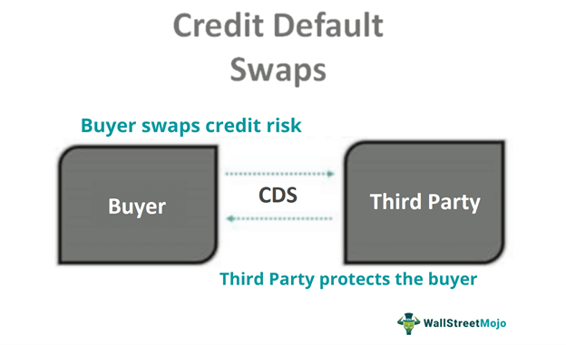

The financial landscape has undergone significant transformations over recent decades, particularly due to the advent and evolution of derivative products and credit markets. Derivatives, which include instruments like futures, options, and swaps, are fundamentally financial contracts whose value is derived from an underlying asset or group of assets. They are crucial in financial markets for hedging risks, price discovery, and increasing liquidity.

Among the various types of credit derivatives, Loan Credit Default Swaps (LCDS) have emerged as a significant tool. An LCDS is a specific type of credit derivative where the underlying reference obligation is a syndicated loan. These instruments were developed to extend the benefits of credit default swaps (CDS) to loans, which traditionally have less liquidity and transparency than bonds. The introduction of LCDS has allowed market participants to hedge against or speculate on the credit risk associated with syndicated loans.



Credit derivatives play a pivotal role in modern financial systems. They enable the unbundling and transfer of credit risk, thereby allowing institutions to manage their risk exposure efficiently. This mechanism fosters a dynamic and flexible credit market, which is vital for financial stability and economic growth. Credit derivatives also contribute to the seamless flow of capital and help in mitigating the negative impacts of credit events on the broader economy.

Algorithmic trading has increasingly been employed in the derivatives market. This method uses computer algorithms to execute trades at high speeds and volumes, aiming to optimize trading strategies and financial outcomes. In the context of credit derivatives, algorithmic trading has led to improved market efficiency, reduced transaction costs, and enhanced liquidity. The technology-driven approach to trading has revolutionized how financial markets operate, creating a more competitive and interconnected environment.

In summary, the financial landscape involving derivatives and credit markets is continuously evolving. The growth of credit derivatives, particularly LCDS, underscores their importance in mitigating credit risk and enhancing financial stability. Concurrently, the adoption of algorithmic trading is transforming market dynamics, driving efficiency, and fostering innovation in the derivatives market.

## Table of Contents

## Understanding Loan Credit Default Swaps (LCDS)

Loan Credit Default Swaps (LCDS) are a specialized category of credit derivatives structured to provide protection against the risk of default in syndicated secured loans. LCDS operate similarly to traditional Credit Default Swaps (CDS), wherein two parties engage in a contractual agreement transferring the credit risk of a specific loan or set of loans. The protection buyer pays a periodic premium to the protection seller, and in return, the protection seller compensates the buyer if the defined credit event, such as a loan default, occurs.

### Differences Between CDS and LCDS
While both CDS and LCDS involve transferring credit risk, several distinctions exist. A regular CDS typically references corporate bonds or similar debt instruments, whereas a LCDS specifically references syndicated secured loans. Syndicated loans are made by a group of lenders and are often structured as secured obligations, meaning they are backed by collateral. Such loans usually occur in leveraged buyouts or other corporate financing activities involving high credit risk.

### Characteristics of Syndicated Secured Loans in LCDS
The underlying obligations in LCDS transactions are syndicated secured loans, which usually exhibit several key characteristics:
1. **Collateral**: These loans are secured by assets, which provides an additional layer of security for lenders.
2. **Tranches**: The loans are often divided into tranches with varying levels of seniority and risk, offering different levels of protection and yielding potential.
3. **Syndication**: Multiple lenders participate in the issuance of these loans, spreading the risk across a broader base.

This focus on syndicated loans introduces an added level of complexity in LCDS compared to traditional CDS, primarily due to the need to assess the quality and [liquidity](/wiki/liquidity-risk-premium) of the collateral backing the loans and the collective risk profile.

### Historical Development of LCDS
The concept of LCDS emerged in the early 2000s, driven by the rapid growth of the leveraged loan market and the demand for sophisticated credit risk management tools. Financial institutions sought to hedge against potential defaults in syndicated loan portfolios or exploit discrepancies in loan pricing for [arbitrage](/wiki/arbitrage) opportunities. Over time, LCDS became an integral part of the credit derivatives market as investors sought tailored solutions catering to the dynamics of syndicated loans.

Overall, the development of LCDS has provided market participants with enhanced means to manage credit exposure efficiently, reflecting a broader trend towards financial innovation and complexity in credit markets.

## Functionality and Types of LCDS

Loan Credit Default Swaps (LCDS) are financial instruments designed to transfer credit risk associated with a syndicated loan from one party to another. These swaps function by allowing a protection buyer to swap the credit exposure of a syndicated secured loan for periodic premium payments to a protection seller. The protection seller, in return, takes on the risk and agrees to compensate the buyer if a defined credit event, such as a default, occurs. This mechanism provides a way for financial market participants to manage and mitigate credit risk in their portfolios.

### Types of Loan Credit Default Swaps

Loan Credit Default Swaps are primarily categorized into two types: Cancelable (U.S. LCDS) and Non-Cancelable (European LCDS). The distinction between these types arises from their cancellation policies and market conventions.

**Cancelable (U.S. LCDS):** In a Cancelable LCDS, the protection buyer retains the option to terminate the contract before its maturity. This feature offers greater flexibility and is aligned with the typical structure of American financial instruments that accommodate early termination rights. The cancellation provision can influence pricing and risk management strategies, as it introduces an additional decision-making layer for participants considering the opportunity to reallocate or exit their positions.

**Non-Cancelable (European LCDS):** In contrast, European LCDS are structured without the cancellation option, meaning the contract remains in force until it matures or a default occurs. This structure reflects the European market's preference for less complexity and more predictable cash flows throughout the contract's duration. As a result, Non-Cancelable LCDS provide a stable instrument for those seeking straightforward credit risk transfer without the potential complications of early termination.

### Trading vs. Hedging with LCDS

In the context of Loan Credit Default Swaps, participants engage in these instruments for either trading or hedging purposes. Each of these strategies serves distinct objectives within financial markets:

- **Trading:** LCDS can be used by traders to speculate on changes in credit quality or market conditions. By taking positions in LCDS, traders attempt to profit from movements in credit spreads, which reflect the perceived risk of the underlying loan. In trading, the focus is often on short-term gains through tactical positioning and anticipating market shifts.

- **Hedging:** For investors and institutions aiming to manage existing credit exposures, LCDS serve as effective hedging tools. By purchasing protection through LCDS, entities can offset potential losses from the underlying loans in their portfolios. This hedging approach helps stabilize returns and reduce vulnerability to adverse credit events, aligning with long-term risk management strategies.

Understanding the nuances between Cancelable and Non-Cancelable LCDS, along with their applications in trading and hedging, is key for market participants aiming to navigate the complexities of credit risk management efficiently. These instruments continue to play a pivotal role in the broader derivatives market, offering tailored solutions based on the distinct needs of different financial actors.

## LCDS in Algorithmic Trading

Algorithmic trading plays a crucial role in modern financial markets, including the derivatives sector where Loan Credit Default Swaps (LCDS) are traded. This form of trading utilizes computer algorithms to execute thousands of trades at high speed, enhancing market efficiency and minimizing transaction costs. In the context of LCDS, algorithms can manage the complexity and size of datasets inherent to credit derivatives, facilitating improved decision-making processes.

Financial institutions implement algorithms to optimize trading strategies involving LCDS through a variety of techniques. These algorithms are designed to analyze vast amounts of data to identify arbitrage opportunities, manage risk, and execute trades automatically. One common method involves the use of [statistical arbitrage](/wiki/statistical-arbitrage) strategies, which rely on the statistical analysis of time series data to predict price movements. For instance, [machine learning](/wiki/machine-learning) models, including regression analysis or neural networks, can be trained on historical data to anticipate changes in LCDS spreads. Python or other programming languages can be utilized to develop these models. For example:

```python
import numpy as np
from sklearn.linear_model import LinearRegression

# Sample data representing historical LCDS prices and market indicators
lcds_prices = np.array([[1.0, 2.1], [1.2, 2.2], [1.4, 2.3], [1.5, 2.5]])
market_indicators = np.array([2.0, 2.5, 3.2, 3.8])

# Linear regression model
model = LinearRegression()
model.fit(lcds_prices, market_indicators)

# Predict future prices
future_indicators = np.array([[1.6, 2.7]])
predicted_price = model.predict(future_indicators)
print(predicted_price)
```

The use of algorithms brings significant benefits to LCDS trading, including enhanced operational efficiency, reduced human error, and the ability to process information at a pace unattainable by manual trading. Algorithms can quickly analyze market conditions and execute trades at the optimal time, capitalizing on short-term fluctuations in LCDS spreads.

However, several challenges are associated with [algorithmic trading](/wiki/algorithmic-trading) of credit derivatives. One primary concern is model risk, where incorrect assumptions or data inputs can lead to significant financial losses. Additionally, high-frequency trading, a subset of algorithmic trading, can contribute to market [volatility](/wiki/volatility-trading-strategies), potentially exacerbating price swings in LCDS markets. The complexity of credit derivatives also necessitates sophisticated algorithms that can accurately assess credit risk and calculate probabilities of default.

Moreover, the reliance on technology introduces operational risks, such as system failures or cyber threats, which can have severe consequences for trading activities. To mitigate these challenges, institutions often employ robust risk management frameworks and continuously monitor algorithm performance, adjusting strategies as needed to align with changing market conditions.

In summary, while algorithmic trading significantly enhances the efficiency and effectiveness of trading strategies involving LCDS, it also requires careful management to address inherent risks and challenges. As the technology evolves, financial institutions continue to innovate and refine their algorithms, ensuring they remain competitive and responsive to the dynamic nature of the derivatives market.

## Market Implications of LCDS

Loan Credit Default Swaps (LCDS) have become a significant component of the credit derivatives market, with distinct implications for liquidity and credit risk management. These instruments allow investors to transfer the credit risk associated with syndicated secured loans, typically resulting in enhanced liquidity within this segment of the financial market. The participation of a wide range of market participants, including banks, hedge funds, and other institutional investors, contributes to an increase in market activity and liquidity.

In terms of credit risk management, LCDS offer a mechanism for financial institutions to mitigate potential losses arising from borrower defaults. By purchasing protection through an LCDS, lenders can effectively hedge against credit events, thus stabilizing their financial positions. This capability becomes particularly vital during periods of economic uncertainty, where the risk of defaults can be heightened.

The comparison of market spreads between LCDS and traditional Credit Default Swaps (CDS) is crucial in analyzing their respective market implications. Typically, the spreads on LCDS are narrower than those of standard CDS, reflecting the secured nature of the underlying loans and often higher recovery rates expected in the event of default. This characteristic implies that LCDS are typically perceived as less risky by the market, and thus command tighter spreads. Mathematically, this can be expressed as:

$$
\text{LCDS Spread} < \text{CDS Spread}
$$

These spreads are influenced by several factors, including the creditworthiness of the underlying loan issuer and the terms of the loan agreement itself.

LCDS also serve as a speculative tool, enabling traders to take positions on the creditworthiness of borrowers without directly holding the underlying loans. This aspect of LCDS contributes to market dynamics by adding layers of speculative activity, which can significantly affect pricing and liquidity. While speculation can provide additional liquidity and enhance price discovery, it also introduces volatility and can lead to destabilizing market behaviors during times of stress, as traders might rapidly change their positions based on market sentiment or external shocks.

As a speculative instrument, LCDS allow for diverse trading strategies, similar to those employed in traditional derivatives markets. Traders engage in activities such as arbitrage, where they seek to exploit price differences between LCDS and other related instruments. Additionally, LCDS are used for directional trading, where speculators bet on the improvement or deterioration of a loan's credit standing.

In conclusion, the market implications of LCDS are multifaceted, with significant effects on liquidity, credit risk management, and market dynamics. While the instrument offers essential benefits such as risk mitigation and liquidity enhancement, it also adds complexity and potential volatility to the financial system through its use as a speculative tool.

## Risks and Challenges in LCDS Trading

Loan Credit Default Swaps (LCDS) present multiple risks and challenges that are inherent to their complex structure and the markets in which they operate. Understanding these is crucial for market participants and regulators to navigate and manage effectively.

### Liquidity Risk

Liquidity risk is a significant concern in LCDS trading. This type of risk arises when there is insufficient market liquidity, making it difficult to execute trades without causing substantial impact on the price. The niche nature of LCDS, compared to broader credit default swaps (CDS), often results in thinner trading volumes and wider bid-ask spreads, exacerbating liquidity issues. Such characteristics can lead to challenges in entering and exiting positions, particularly during periods of market instability when liquidity may dry up rapidly.

### Counterparty Risk

Counterparty risk refers to the possibility that one of the parties involved in the swap agreement fails to meet their contractual obligations. This risk is intrinsic to over-the-counter (OTC) markets, like those where LCDS are typically traded. The collapse of Lehman Brothers in 2008 underscored the reality of counterparty risk, highlighting the potential for systemic repercussions if a major market participant defaults. Improvements in collateral management and central clearing have been introduced post-2008 to mitigate these risks, but challenges persist, particularly when unprecedented economic stresses occur.

### Basis Risk

Basis risk in LCDS occurs when there is a discrepancy between the performance of the LCDS and the underlying secured loans. This risk can manifest if the changes in the credit quality of the referenced corporate loan do not align with movements in the LCDS market spreads. Basis risk complicates hedging strategies, as it can introduce unforeseen financial exposure even when positions are seemingly balanced.

### Impact of Financial Crises

Economic and financial crises have profound effects on the LCDS market. Crises lead to heightened default rates and increased volatility, influencing credit spreads and amplifying the aforementioned risks. During such times, liquidity evaporates, counterparty risk escalates, and basis risk becomes more pronounced as correlations between different financial instruments break down. The 2008 financial crisis, for instance, brought to light vulnerabilities within credit derivatives, leading to a domino effect of defaults and calls on credit protection which substantially affected market stability.

### Regulatory Considerations

In response to the cascading impact of the 2008 crisis, regulators worldwide have imposed stricter rules on derivatives trading, including LCDS. The enactment of the Dodd-Frank Wall Street Reform and Consumer Protection Act in the United States and the European Market Infrastructure Regulation (EMIR) in the European Union marked a paradigm shift in regulatory oversight. These regulations mandated greater transparency, required central clearing for standardized OTC derivatives, and instituted margin requirements to better manage counterparty risk. While these measures have increased market robustness, they also pose additional compliance costs and complexities for market participants.

The balance between innovation in credit derivatives and the imperative of maintaining systemic stability continues to shape the evolution of LCDS trading strategies. As such, market players must remain vigilant, adapting to regulatory changes and preparing for economic shifts that may impact LCDS markets in unforeseen ways.

## Future Trends in LCDS and Credit Derivatives

The landscape of Loan Credit Default Swaps (LCDS) and credit derivatives is continually shaped by evolving market demands and regulatory frameworks. These changes prompt innovation and adaptation as participants in financial markets seek to optimize risk management and investment strategies. 

LCDS have evolved significantly, influenced by regulatory changes following the 2008 financial crisis. Regulatory bodies, aiming to mitigate systemic risk, introduced stringent requirements for transparency and capitalization. Institutions dealing with credit derivatives have been compelled to adapt to these regulations, enhancing data reporting and risk management systems. This regulatory evolution ensures market participants maintain robust risk assessment practices, reducing potential vulnerabilities within financial markets.

Electronic trading platforms have profoundly impacted LCDS trading, fostering increased transparency and efficiency. As trading becomes more digitized, these platforms facilitate real-time data access, enabling market participants to make informed decisions swiftly. The automation of trades reduces operational risks and increases the speed at which transactions are executed, enhancing market liquidity. With the integration of algorithmic trading systems, financial institutions can execute trades with precision, harnessing data analytics to optimize strategies and achieve competitive advantages.

The COVID-19 pandemic has introduced macroeconomic uncertainties, affecting LCDS and broader credit derivatives markets. The pandemic-induced economic downturn increased credit risk, impacting both corporate debtors and lenders. As a result, LCDS have experienced fluctuating market dynamics, with rising default probabilities leading to wider spreads and increased cost of protection. However, the adaptability of electronic trading platforms and advanced risk assessment tools has provided resilience, allowing the effective management of these heightened risks.

In anticipation of future trends, market participants remain vigilant regarding potential macroeconomic disruptions, such as geopolitical tensions and [interest rate](/wiki/interest-rate-trading-strategies) volatility. The continuous evolution of electronic trading technologies and regulatory landscapes will likely further shape the future of LCDS, ensuring ongoing improvements in transparency, efficiency, and risk management capabilities. As LCDS and credit derivatives markets advance, the integration of cutting-edge technologies and adapting to global economic shifts will be crucial for maintaining their stability and relevance.

## Conclusion

Loan Credit Default Swaps (LCDS) have become a pivotal instrument in modern financial markets, playing a crucial role in credit risk management and trading strategies. LCDS allow financial institutions to hedge against the risk of borrower defaults by transferring credit exposure to a counterparty in exchange for periodic premium payments. This transfer of risk facilitates greater liquidity and enables lenders to manage their credit portfolios more dynamically, optimizing their risk-return profiles.

Algorithmic trading has significantly enhanced the efficiency of LCDS markets. By employing advanced algorithms and high-frequency trading strategies, financial institutions can swiftly execute trades, identify arbitrage opportunities, and respond to market shifts with remarkable precision. This technological advancement has not only increased the speed and [volume](/wiki/volume-trading-strategy) of trades but also improved price discovery and market transparency. The integration of algorithmic trading in LCDS markets also reduces transaction costs and minimizes human error, leading to more accurate pricing mechanisms and efficient hedging strategies.

As the landscape of credit derivatives continues to evolve, market participants must adapt to changing regulatory environments, technological innovations, and macroeconomic factors. The financial crisis of 2008 underscored the need for robust risk management practices and transparent trading operations. In response, regulatory reforms have been introduced to enhance the stability and integrity of credit derivative markets. Moreover, the rise of electronic trading platforms and increasing adoption of blockchain technology are expected to further transform LCDS trading, making it more accessible and secure.

Looking ahead, the potential impacts of macroeconomic factors such as geopolitical tensions, interest rate fluctuations, and global economic recovery post-COVID-19 pandemic will be pivotal in shaping the future dynamics of LCDS and credit derivatives. As markets become more interconnected, the ability to effectively manage credit risk and capitalize on trading opportunities will continue to be paramount for financial institutions. The evolving landscape of LCDS and credit derivatives will demand greater innovation, agility, and strategic foresight to navigate the complexities of the financial markets.

## References & Further Reading

[1]: Das, S. R. (2005). ["Credit Derivatives: Trading & Management of Credit & Default Risk."](https://archive.org/details/creditderivative0000dass) SSRN Electronic Journal.

[2]: Gregory, J. (2015). ["The xVA Challenge: Counterparty Credit Risk, Funding, Collateral, and Capital."](https://www.amazon.com/xVA-Challenge-Counterparty-Funding-Collateral/dp/1119109418) Wiley Finance.

[3]: O'Kane, D. (2008). ["Modelling Single-name and Multi-name Credit Derivatives."](https://onlinelibrary.wiley.com/doi/pdf/10.1002/9781119201960.fmatter) Wiley Finance.

[4]: Jarrow, R. A. (2011). ["Credit Default Swaps."](https://papers.ssrn.com/sol3/papers.cfm?abstract_id=1646373) The Journal of Derivatives.

[5]: Hull, J. C. (2018). ["Options, Futures, and Other Derivatives."](https://www.semanticscholar.org/paper/Options%2C-Futures%2C-and-Other-Derivatives-Hull/89bdee500c8623864fc9eb7a471546aa713acc44) Pearson.