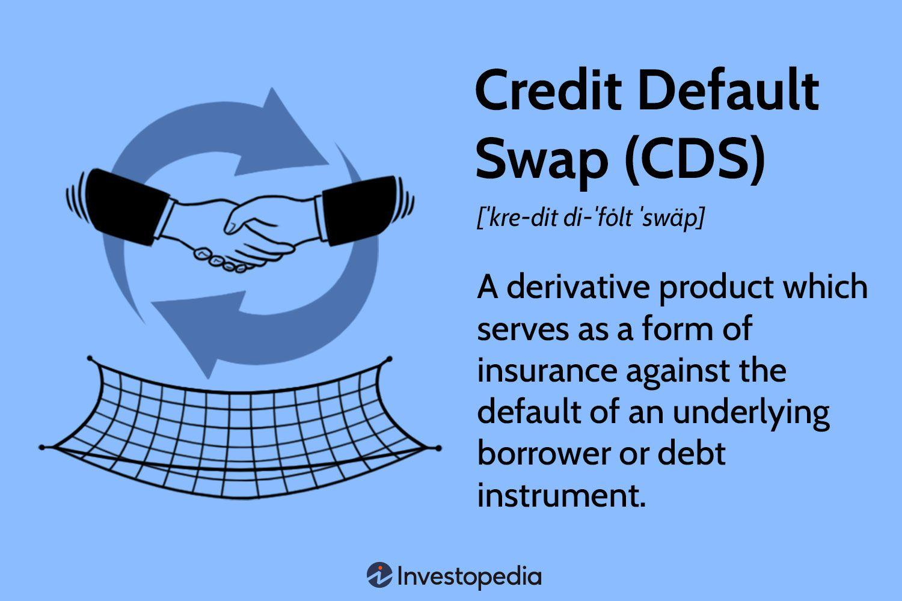

## Table of Contents

## What is a Loan Credit Default Swap (LCDS)?

A Loan Credit Default Swap (LCDS) is a type of financial agreement that helps protect lenders if a borrower can't pay back their loan. It's like an insurance policy for the loan. In this agreement, one party, usually a bank, pays a fee to another party, often an investor. In return, if the borrower defaults on the loan, the investor agrees to cover the loss.

LCDSs are used mainly in the world of business loans. They help banks manage the risk of lending money. If a company borrows money from a bank and then can't pay it back, the bank might lose a lot of money. But if the bank has an LCDS, the investor steps in to cover the loss. This makes banks more willing to lend money, which can help businesses grow and the economy to thrive.

## How does a Loan Credit Default Swap work?

A Loan Credit Default Swap (LCDS) is like an insurance policy for a loan. Imagine a bank gives a loan to a company. The bank wants to protect itself in case the company can't pay back the loan. So, the bank buys an LCDS from an investor. The bank pays the investor a regular fee, kind of like an insurance premium. In return, if the company defaults on the loan and can't pay it back, the investor agrees to cover the loss. This way, the bank is protected and doesn't lose money if the company fails.

LCDSs are useful because they help banks manage the risk of lending money. Banks can lend more freely knowing they have a safety net. This can help businesses get the money they need to grow and create jobs. But, like any financial tool, LCDSs can be complicated and need to be used carefully. If too many companies default on their loans at the same time, it could be hard for investors to cover all the losses. That's why it's important for banks and investors to understand the risks and manage them well.

## What are the key components of an LCDS?

The main parts of a Loan Credit Default Swap (LCDS) are the buyer, the seller, and the loan itself. The buyer is usually a bank that has given a loan to a company. The bank wants to protect itself if the company can't pay back the loan. The seller is an investor who agrees to cover the loss if the company defaults. The loan is what the LCDS is based on; it's the thing that the bank wants to protect.

The second key part is the premium, which is like an insurance payment. The bank pays the investor a regular fee for the LCDS. This fee is based on how risky the loan is thought to be. If the loan is seen as very risky, the fee will be higher. The final part is the event of default. This is when the company can't pay back the loan, and the investor has to step in and cover the loss for the bank. This event triggers the LCDS and makes the investor pay up.

## Who are the typical participants in an LCDS transaction?

The typical participants in a Loan Credit Default Swap (LCDS) transaction are banks and investors. Banks are the ones who give loans to companies. They use LCDSs to protect themselves if the company can't pay back the loan. Investors, on the other hand, are the ones who agree to cover the loss if the company defaults. They get paid a regular fee by the bank for taking on this risk.

Sometimes, other financial institutions like hedge funds or insurance companies can also be involved. They might act as investors and take on the risk of the loan defaulting. This can help spread the risk around and make the financial system more stable. But at the core, it's usually just banks and investors who are the main players in an LCDS transaction.

## What are the benefits of using a Loan Credit Default Swap?

Using a Loan Credit Default Swap (LCDS) has several benefits for banks and the overall economy. For banks, LCDSs help manage the risk of lending money. When a bank gives a loan to a company, there's always a chance that the company might not be able to pay it back. With an LCDS, the bank can buy protection against this risk. If the company defaults, the investor who sold the LCDS will cover the loss. This means the bank can lend money more freely, knowing they have a safety net.

For the economy, LCDSs can help businesses grow. When banks feel more secure about lending, they're more likely to give loans to companies. This can help businesses expand, create jobs, and boost economic activity. LCDSs also help spread risk around the financial system. Instead of one bank taking on all the risk of a loan, an investor shares that risk. This can make the financial system more stable and help prevent big problems if a few companies can't pay back their loans.

## What are the risks associated with Loan Credit Default Swaps?

Using Loan Credit Default Swaps (LCDSs) can be risky. One big risk is that if a lot of companies default on their loans at the same time, the investors who sold the LCDSs might not have enough money to cover all the losses. This could cause big problems for the whole financial system. Another risk is that banks might start taking bigger risks because they feel protected by the LCDS. They might lend money to riskier companies, thinking they are safe. But if those companies fail, it could still cause trouble.

Also, LCDSs can be hard to understand and manage. If banks and investors don't fully understand how they work, they might make bad decisions. This can lead to big losses. Plus, if there's not enough information about the loans that the LCDSs are based on, it can be hard to know how risky they really are. This lack of transparency can make the whole system more unstable.

## How is the pricing of an LCDS determined?

The price of a Loan Credit Default Swap (LCDS) depends on how likely it is that the company won't be able to pay back the loan. This is called the risk of default. If the company is seen as risky, the price of the LCDS will be higher. The bank that wants protection has to pay more money to the investor who agrees to cover the loss if the company fails. The price is usually a regular fee, kind of like an insurance payment, and it's based on how risky the loan is thought to be.

To figure out how risky the loan is, people look at things like the company's credit rating, how much debt it has, and how well it's doing in its business. If the company has a low credit rating or a lot of debt, the risk of default is higher, and the price of the LCDS goes up. Also, if the economy is doing badly, the risk might be higher because more companies could have trouble paying back their loans. So, the price of an LCDS can change over time as these things change.

## What is the difference between a Loan Credit Default Swap and a regular Credit Default Swap?

A Loan Credit Default Swap (LCDS) and a regular Credit Default Swap (CDS) are both used to protect against the risk of someone not paying back a loan. But they are a bit different. An LCDS is used for loans that a bank gives to a company. It's like insurance for that specific loan. If the company can't pay back the loan, the investor who sold the LCDS steps in and covers the loss for the bank.

A regular CDS, on the other hand, can be used for different kinds of debt, not just loans. It can protect against the risk of a company not paying back its bonds or other kinds of debt. So, while an LCDS is focused on loans, a CDS can be used for a wider range of debt. Both help manage risk, but they apply to different types of financial agreements.

## Can you explain the settlement process of an LCDS?

When a company can't pay back its loan and triggers a Loan Credit Default Swap (LCDS), the settlement process starts. This means the bank and the investor who sold the LCDS need to figure out how to handle the loss. There are two main ways to settle an LCDS: physical settlement and cash settlement. In physical settlement, the bank gives the loan to the investor, and the investor pays the bank the full value of the loan. In cash settlement, the bank keeps the loan, and the investor pays the bank the difference between the loan's value and what the company can actually pay back.

The choice between physical and cash settlement depends on what the bank and the investor agreed on when they made the LCDS deal. Physical settlement is more common because it's simpler. The bank just hands over the loan, and the investor pays the full amount. Cash settlement can be trickier because it involves figuring out how much the loan is really worth and how much the company can pay back. Either way, the goal is to make sure the bank doesn't lose money because the company couldn't pay back the loan.

## What regulatory considerations should be taken into account when dealing with LCDS?

When dealing with Loan Credit Default Swaps (LCDSs), there are important rules and regulations to consider. These rules help make sure that the financial system stays safe and fair. For example, banks and investors have to follow rules set by financial regulators like the Securities and Exchange Commission (SEC) in the United States. These rules can include how much risk a bank can take on, how much information they have to share about the loans, and how they report their LCDS deals. The goal is to prevent big problems and make sure everyone knows what they're getting into.

Another important thing to think about is how LCDSs are treated under laws like the Dodd-Frank Act. This law was made to help prevent another big financial crisis like the one in 2008. It has rules about how LCDSs can be traded, how they need to be reported, and how much money banks need to keep on hand to cover potential losses. These regulations can change over time, so it's important for banks and investors to stay up to date and make sure they're following all the rules. This helps keep the financial system stable and protects everyone involved.

## How do Loan Credit Default Swaps impact the broader financial market?

Loan Credit Default Swaps (LCDSs) can have a big impact on the broader financial market. They help banks manage the risk of lending money to companies. When banks feel safer about lending because they have LCDSs, they might be more willing to give out loans. This can help businesses grow, create jobs, and boost the economy. But if a lot of companies can't pay back their loans at the same time, the investors who sold the LCDSs might not have enough money to cover all the losses. This could cause big problems for the whole financial system.

LCDSs also affect how risk is spread around. Instead of one bank taking on all the risk of a loan, an investor shares that risk. This can make the financial system more stable because the risk is not all in one place. But it can also be risky if people don't understand how LCDSs work or if there's not enough information about the loans. If banks start taking bigger risks because they feel protected by LCDSs, it could lead to trouble if those risky loans don't get paid back. So, while LCDSs can help, they need to be used carefully to keep the financial market safe and healthy.

## What are some real-world examples or case studies of LCDS usage?

One real-world example of Loan Credit Default Swaps (LCDSs) in action happened during the 2008 financial crisis. Many banks had given loans to companies and used LCDSs to protect themselves. When the economy crashed, a lot of companies couldn't pay back their loans. The investors who sold the LCDSs had to step in and cover the losses. But there were so many defaults that some investors couldn't pay, which made the crisis even worse. This showed how important it is to use LCDSs carefully and understand the risks.

Another example is how big banks like JPMorgan Chase use LCDSs to manage their risk. They might give a big loan to a company and then buy an LCDS to protect themselves. If the company does well and pays back the loan, the bank just pays the regular fee for the LCDS. But if the company struggles and can't pay back the loan, the investor who sold the LCDS covers the loss. This helps the bank feel more secure about lending money, which can help businesses grow and the economy stay strong.

## What are the market implications of LCDS?

Loan Credit Default Swaps (LCDS) have become a significant component of the credit derivatives market, with distinct implications for [liquidity](/wiki/liquidity-risk-premium) and credit risk management. These instruments allow investors to transfer the credit risk associated with syndicated secured loans, typically resulting in enhanced liquidity within this segment of the financial market. The participation of a wide range of market participants, including banks, hedge funds, and other institutional investors, contributes to an increase in market activity and liquidity.

In terms of credit risk management, LCDS offer a mechanism for financial institutions to mitigate potential losses arising from borrower defaults. By purchasing protection through an LCDS, lenders can effectively hedge against credit events, thus stabilizing their financial positions. This capability becomes particularly vital during periods of economic uncertainty, where the risk of defaults can be heightened.

The comparison of market spreads between LCDS and traditional Credit Default Swaps (CDS) is crucial in analyzing their respective market implications. Typically, the spreads on LCDS are narrower than those of standard CDS, reflecting the secured nature of the underlying loans and often higher recovery rates expected in the event of default. This characteristic implies that LCDS are typically perceived as less risky by the market, and thus command tighter spreads. Mathematically, this can be expressed as:

$$
\text{LCDS Spread} < \text{CDS Spread}
$$

These spreads are influenced by several factors, including the creditworthiness of the underlying loan issuer and the terms of the loan agreement itself.

LCDS also serve as a speculative tool, enabling traders to take positions on the creditworthiness of borrowers without directly holding the underlying loans. This aspect of LCDS contributes to market dynamics by adding layers of speculative activity, which can significantly affect pricing and liquidity. While speculation can provide additional liquidity and enhance price discovery, it also introduces [volatility](/wiki/volatility-trading-strategies) and can lead to destabilizing market behaviors during times of stress, as traders might rapidly change their positions based on market sentiment or external shocks.

As a speculative instrument, LCDS allow for diverse trading strategies, similar to those employed in traditional derivatives markets. Traders engage in activities such as [arbitrage](/wiki/arbitrage), where they seek to exploit price differences between LCDS and other related instruments. Additionally, LCDS are used for directional trading, where speculators bet on the improvement or deterioration of a loan's credit standing.

In conclusion, the market implications of LCDS are multifaceted, with significant effects on liquidity, credit risk management, and market dynamics. While the instrument offers essential benefits such as risk mitigation and liquidity enhancement, it also adds complexity and potential volatility to the financial system through its use as a speculative tool.

## References & Further Reading

[1]: Das, S. R. (2005). ["Credit Derivatives: Trading & Management of Credit & Default Risk."](https://archive.org/details/creditderivative0000dass) SSRN Electronic Journal.

[2]: Gregory, J. (2015). ["The xVA Challenge: Counterparty Credit Risk, Funding, Collateral, and Capital."](https://www.amazon.com/xVA-Challenge-Counterparty-Funding-Collateral/dp/1119109418) Wiley Finance.

[3]: O'Kane, D. (2008). ["Modelling Single-name and Multi-name Credit Derivatives."](https://onlinelibrary.wiley.com/doi/pdf/10.1002/9781119201960.fmatter) Wiley Finance.

[4]: Jarrow, R. A. (2011). ["Credit Default Swaps."](https://papers.ssrn.com/sol3/papers.cfm?abstract_id=1646373) The Journal of Derivatives.

[5]: Hull, J. C. (2018). ["Options, Futures, and Other Derivatives."](https://www.semanticscholar.org/paper/Options%2C-Futures%2C-and-Other-Derivatives-Hull/89bdee500c8623864fc9eb7a471546aa713acc44) Pearson.