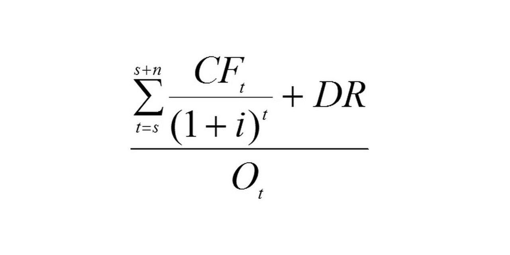

In project finance, the Loan Life Coverage Ratio (LLCR) is an essential metric used to assess a project's ability to meet its debt obligations throughout the loan term. This ratio provides a comprehensive view of a project's financial solvency, making it a key consideration for lenders and investors when evaluating the associated risks. Understanding the LLCR is crucial as it informs stakeholders about the project's capacity to generate sufficient revenues to cover its debt, thus influencing financial decision-making processes. This article examines LLCR, how it is calculated, and its role in financial analysis, especially within algorithmic trading scenarios. By appreciating LLCR, stakeholders can make informed decisions about investment risks and opportunities, optimizing their strategies based on long-term debt servicing capabilities.

## Table of Contents



## Understanding the Loan Life Coverage Ratio (LLCR)

The Loan Life Coverage Ratio (LLCR) is a crucial metric in project finance, predominantly used to evaluate a firm's long-term solvency and its ability to cover loan repayments throughout the life of the loan. This metric offers a comprehensive view, as it accounts for the entirety of the loan term, unlike the Debt Service Coverage Ratio (DSCR), which typically provides a more immediate assessment by focusing on short-term debt service capacity.

The calculation of LLCR involves the net present value (NPV) of the project’s cash flows that are available for debt service. These cash flows are discounted back to the present value at a specific discount rate, typically the project's weighted average cost of capital (WACC). The formula can be expressed as follows:

$$
\text{LLCR} = \frac{\text{NPV of Cash Flows Available for Debt Service}}{\text{Outstanding Debt}}
$$

In this formula, the NPV is calculated by summing the discounted cash flows over the loan's duration. This method considers all expected cash inflows available for servicing the debt, providing a more comprehensive evaluation of financial health over the entire loan period.

By covering the full term of the loan, LLCR allows lenders and investors to gain insight into the long-term solvency and financial robustness of a project, making it an indispensable tool in risk assessment and decision-making processes in project finance.

## The Formula and Components of LLCR

Mathematically, the Loan Life Coverage Ratio (LLCR) is a critical analytical tool expressed through a straightforward formula: 

$$

\text{LLCR} = \frac{\text{NPV of Cash Flows Available for Debt Service}}{\text{Outstanding Debt Balance}} 
$$

Here, the key components warrant a closer examination:

1. **Net Present Value (NPV) of Cash Flows Available for Debt Service**: This involves calculating the present value of future cash flows generated by the project that are available to meet debt obligations. The cash flows are discounted back to their present value using the discount rate, usually the project's Weighted Average Cost of Capital (WACC). This discounting accounts for the time value of money, acknowledging that future cash flows are worth less than immediate cash flows due to potential earning capacity. 

2. **Outstanding Debt Balance**: This is the total amount of debt that remains to be repaid over the life of the project. The outstanding debt balance serves as the denominator in the LLCR calculation and provides the baseline against which the value of the project's cash flows is assessed.

3. **Discount Rate**: Typically, the discount rate in LLCR calculations is equivalent to the project's WACC. The WACC represents the average rate that a company is expected to pay to finance its assets, weighted according to the proportion of equity and debt in its capital structure. Accurate determination of WACC is vital as it influences the NPV calculation of future cash flows, thereby affecting the LLCR outcome.

The LLCR, through these components, offers a holistic view of a project's capacity to service its debt over the lifespan of the loan, factoring in both the timing and magnitude of cash flows relative to outstanding debt levels.

## Importance of LLCR in Financial Analysis

The Loan Life Coverage Ratio (LLCR) plays a vital role in financial analysis by serving as a key indicator of a project's credit risk. Higher LLCR values typically suggest lower financial risk, indicating that a project is in a strong financial position to meet its debt obligations. This long-term view of debt repayment capacity makes LLCR a crucial metric for lenders and investors who are assessing the viability and risk associated with a particular project.

Financial covenants, which are contracts between the borrower and lender that define terms to be adhered to during the loan period, frequently stipulate LLCR requirements. These covenants ensure that a borrower maintains a certain level of financial health throughout the loan term. If a project's LLCR falls below the agreed threshold, it could trigger renegotiations of loan terms, or in severe cases, might even lead to default conditions.

Investors also rely on LLCR to gauge a project's financial health and its capacity to service debt, thereby influencing their investment decisions. A robust LLCR signifies confidence in a project's ability to generate sufficient cash flows over its loan lifetime, which can lead to favorable investment terms and potentially lower financing costs. Consequently, LLCR not only reflects the current financial standing of a project but also has a direct impact on strategic financial decisions and negotiations.

## Application of LLCR in Algorithmic Trading

Algorithmic trading, known for its capacity to process vast amounts of financial data with impressive speed and precision, benefits significantly from the incorporation of the Loan Life Coverage Ratio (LLCR). This ratio provides predictive insights into a project's long-term solvency, important for informing both investment strategies and automated trading decisions.

The predictive power of LLCR lies in its ability to reflect a project's ability to cover its debt over the entire life of the loan, which is particularly invaluable in [algorithmic trading](/wiki/algorithmic-trading) environments where strategic foresight is crucial. By integrating LLCR data, trading algorithms can quantitatively assess the solvency of various projects, which is important for portfolio optimization.

One of the primary applications is the optimization of portfolio allocations. Investors seeking to maximize returns while managing risk can use LLCR as a criterion for selecting or weighting investments, ensuring that funds are allocated to projects with robust debt-servicing capabilities. This can be implemented through algorithmic adjustments that periodically adjust the portfolio in response to shifts in LLCR valuations.

To incorporate LLCR into trading algorithms, you might employ programming languages such as Python due to its extensive libraries for financial analytics. For instance, a simple model could involve calculating the LLCR for a given project and assigning weights in an investment portfolio based on these values. Here's a simplified example in Python:

```python
import numpy as np

# Define cash flows, discount rate, and outstanding debt
cash_flows = [1000000] * 10  # annual cash flow
discount_rate = 0.08
outstanding_debt = 5000000

# Calculate NPV of cash flows
npv_cash_flows = np.npv(discount_rate, cash_flows)

# Calculate LLCR
llcr = npv_cash_flows / outstanding_debt

# Simple portfolio allocation logic based on LLCR
def allocate_based_on_llcr(llcr, threshold=1.2):
    if llcr > threshold:
        return "Overweight in portfolio"
    elif llcr == threshold:
        return "Neutral weight in portfolio"
    else:
        return "Underweight in portfolio"

# Determine allocation based on LLCR
portfolio_decision = allocate_based_on_llcr(llcr)
print(f"LLCR: {llcr:.2f} | Portfolio Decision: {portfolio_decision}")
```

This code assesses the project's LLCR and suggests an investment strategy—overweight, neutral, or underweight—based on its capacity to service debt. By integrating such algorithms, investors can ensure that their portfolios remain responsive to the evolving financial health of underlying projects, enhancing both risk management and potential returns in algorithmic trading scenarios.

## Comparing LLCR with DSCR

Loan Life Coverage Ratio (LLCR) and Debt Service Coverage Ratio (DSCR) are key metrics in evaluating a project's debt repayment capabilities, yet they serve distinct purposes in financial analysis. LLCR offers insights into the entire life span of a loan, factoring in expected cash flows over the project's duration and providing a robust measure of long-term solvency. It is calculated as the net present value (NPV) of cash flows available for debt service divided by the total outstanding debt, incorporating future cash flow predictions into a present-value framework.

Conversely, DSCR serves as a short-term indicator of a project's capacity to meet its current debt obligations. By comparing the cash flows available for debt service to the debt service due in a specific period, DSCR offers a quick overview of a project's immediate financial health. Its focus is narrower, concentrating on a discrete time frame, typically aligning with one fiscal year or quarter.

Both ratios hold distinct advantages depending on the analytical context. LLCR is particularly beneficial for stakeholders requiring a comprehensive understanding of a project's financial viability over its complete lifecycle. It helps assess long-term credit risk and informs decisions regarding loan terms and interest rates.

In contrast, DSCR is valuable for ongoing monitoring, helping creditors and project managers ensure that financial operations remain stable and sustainable in the short term. It can indicate potential shortfalls in revenue that might affect immediate debt servicing capabilities, prompting adjustments or interventions.

In practice, these ratios often complement one another. While LLCR provides a strategic, broader view necessary for long-range planning and investment appraisal, DSCR ensures tactical, operational stability, safeguarding against short-term financial disruptions. Utilizing both metrics gives investors and stakeholders a well-rounded perspective on financial health, enabling more effective risk assessment and management.

## Practical Example and Calculation of LLCR

To understand the practical application and calculation of the Loan Life Coverage Ratio (LLCR), consider a renewable energy project with annual cash flows of $1,000,000 over a ten-year period and an outstanding debt of $5,000,000. Calculating the LLCR involves determining the net present value (NPV) of the project's cash flows available for debt service and then comparing this with the total outstanding debt.

First, we calculate the NPV of the cash flows. The NPV can be determined using the formula:

$$
NPV = \sum_{t=1}^{T} \frac{CF_t}{(1 + r)^t}
$$

where:
- $CF_t$ is the cash flow at time $t$,
- $r$ is the discount rate,
- $T$ is the total number of periods.

In this scenario, $CF_t = $1,000,000$, $r = 8\% = 0.08$, and $T = 10$.

Utilizing Python, the NPV is calculated as follows:

```python
def calculate_npv(cash_flows, discount_rate):
    npv = sum(cf / ((1 + discount_rate) ** t) for t, cf in enumerate(cash_flows, start=1))
    return npv

annual_cash_flows = [1000000] * 10
discount_rate = 0.08

npv = calculate_npv(annual_cash_flows, discount_rate)
print(f"Net Present Value of cash flows: ${npv:,.2f}")
```

Upon calculation, the NPV of these cash flows is approximately $6,710,081. This figure reflects the present value of future cash flows, considering the discount rate.

Next, the LLCR is determined by dividing the NPV by the outstanding debt amount:

$$
LLCR = \frac{NPV}{\text{Outstanding Debt}} = \frac{\$6,710,081}{\$5,000,000} \approx 1.34
$$

The computed LLCR of 1.34 indicates a robust ability of the project to cover its debt obligations over the loan's lifespan. A ratio above 1 suggests that the project generates sufficient cash flow to meet its debt payments, which is interpreted as a healthy financial position in terms of loan servicing capability.

## Limitations and Considerations of LLCR

The Loan Life Coverage Ratio (LLCR) is a valuable metric in project finance, yet it is not without its limitations. One notable limitation is its inherent smoothing effect. LLCR calculates an average coverage ratio over the entire loan life, which can obscure short-term financial fluctuations and weaknesses in cash flow during specific periods. Consequently, projects with significant variance in cash flow may appear more financially stable than they actually are when solely evaluated based on LLCR.

To mitigate this limitation, LLCR should be used alongside other financial ratios and qualitative assessments. For instance, combining it with the Debt Service Coverage Ratio (DSCR) can provide both a long-term and short-term view of a project's debt servicing capacity. While LLCR offers a broader, long-term perspective, DSCR focuses on a project's ability to meet debt obligations in the near term, offering insights into periodic financial health.

Additionally, using complementary analyses such as sensitivity analysis or scenario analysis can enhance understanding of potential variations in project performance over time. These methods can highlight how predictive cash flows change under different economic conditions or operational scenarios, providing a more comprehensive view of a project's financial viability.

Incorporating qualitative insights is equally crucial. Factors such as management quality, regulatory environment, and market dynamics can have significant impacts on project success and should be considered alongside numerical measures like LLCR. This holistic approach ensures a balanced assessment of the project's ability to meet its financial commitments throughout its lifecycle.

## Conclusion

The Loan Life Coverage Ratio (LLCR) is an essential metric in project finance, providing a comprehensive view of a project's ability to meet its debt obligations throughout the loan term. Its effectiveness lies in offering both investors and lenders a reliable measure of financial solvency over the long run. By considering the total net cash flows available for debt service and comparing them against outstanding debt, LLCR delivers insights into the long-term financial health and risk profile of a project.

Integrating LLCR within broader financial analysis enhances decision-making processes for investors and lenders alike. By assessing the coverage ratio in conjunction with other financial metrics, stakeholders can achieve a holistic understanding of a project's viability and potential risks. In algorithmic trading, LLCR's predictive capabilities are harnessed to develop strategies that consider a project's debt-servicing capabilities, thus optimizing investment portfolios and enhancing risk management practices.

Overall, the LLCR is a valuable component of any financial analysis framework, facilitating informed decision-making. Its relevance spans from traditional investment evaluations to cutting-edge algorithmic trading systems, ensuring that both current and future debt obligations are considered in strategic financial planning. This holistic view aids in mitigating risks associated with long-term project financing, supporting sustainable investment and lending strategies.

## References & Further Reading

[1]: Yescombe, E. R. (2013). ["Principles of Project Finance."](https://www.sciencedirect.com/book/9780123910585/principles-of-project-finance) Academic Press.

[2]: Gatti, S. (2018). ["Project Finance in Theory and Practice: Designing, Structuring, and Financing Private and Public Projects."](https://www.sciencedirect.com/book/9780323983600/project-finance-in-theory-and-practice) Academic Press.

[3]: Lopez de Prado, M. (2018). ["Advances in Financial Machine Learning."](https://www.amazon.com/Advances-Financial-Machine-Learning-Marcos/dp/1119482089) Wiley.

[4]: Mun, J. (2006). ["Modeling Risk: Applying Monte Carlo Simulation, Real Options Analysis, Forecasting, and Optimization."](https://www.researchgate.net/publication/338035771_Modeling_Risk_Applying_Monte_Carlo_Simulation_Real_Options_Analysis_Stochastic_Forecasting_and_Optimization) Wiley.

[5]: Hull, J. C. (2015). ["Options, Futures, and Other Derivatives."](https://www.semanticscholar.org/paper/Options%2C-Futures%2C-and-Other-Derivatives-Hull/89bdee500c8623864fc9eb7a471546aa713acc44) Pearson Education.