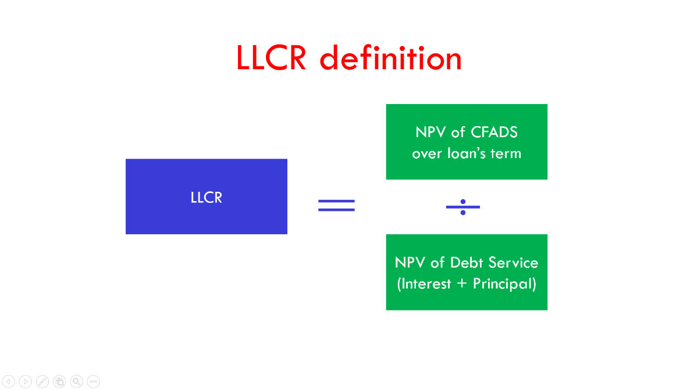

## Table of Contents

## What is the Loan Life Coverage Ratio (LLCR)?

The Loan Life Coverage Ratio (LLCR) is a financial metric used to assess the ability of a project to repay its debt over its entire life. It is commonly used in project finance to evaluate the risk associated with lending money for large projects like infrastructure or energy developments. LLCR is calculated by dividing the present value of the cash flow available for debt service by the outstanding debt. This ratio helps lenders understand if the project's future cash flows will be sufficient to cover the loan payments throughout the loan's term.

In simple terms, LLCR tells lenders how many times the project's cash flow can cover the debt over its life. A higher LLCR means the project is less risky because it has more cash flow to pay back the loan. For example, an LLCR of 1.5 means the project's cash flow is 1.5 times the amount needed to pay off the debt. Lenders usually look for an LLCR above a certain threshold, like 1.3 or 1.5, to feel confident about the project's ability to repay the loan. If the LLCR is too low, it might be harder for the project to get financing.

## Why is the LLCR important in financial analysis?

The Loan Life Coverage Ratio (LLCR) is important in financial analysis because it helps lenders and investors understand if a project can pay back its loans over its entire life. By looking at the LLCR, they can see if the project's future cash flows will be enough to cover the debt. This is crucial for big projects like building roads or power plants, where a lot of money is borrowed. If the LLCR is high, it means the project is less risky because it has more cash coming in than it needs to pay off the loan.

Lenders use the LLCR to decide if they should give money to a project. They want to make sure they will get their money back. If the LLCR is above a certain level, like 1.3 or 1.5, lenders feel more confident about lending money. A low LLCR means the project might struggle to pay back the loan, making it harder to get financing. So, the LLCR is a key tool that helps everyone involved make better decisions about big projects and their financing.

## What are the key components needed to calculate the LLCR?

To calculate the Loan Life Coverage Ratio (LLCR), you need two main pieces of information: the present value of the cash flow available for debt service and the outstanding debt. The cash flow available for debt service is the money left over after all operating costs and taxes are paid but before paying back the loan. You need to add up all this cash flow over the life of the project and then figure out its present value, which means adjusting it for the time value of money.

The outstanding debt is the total amount of money the project still owes on its loan. To find the LLCR, you divide the present value of the cash flow available for debt service by the outstanding debt. This tells you how many times the project's cash flow can cover the debt over its life. A higher number means the project is less risky because it has more cash to pay back the loan.

## How do you calculate the Net Present Value (NPV) of cash flows for LLCR?

To calculate the Net Present Value (NPV) of cash flows for the Loan Life Coverage Ratio (LLCR), you first need to know all the cash flows that the project will make over its life. These are the amounts of money the project will have left after paying for all its costs, taxes, and other expenses but before paying back the loan. You add up all these cash flows, but you need to adjust them for the time value of money. This means that money you get in the future is worth less than money you get today. You use a discount rate to do this adjustment. The discount rate is like an [interest rate](/wiki/interest-rate-trading-strategies) that shows how much you value money now compared to money later.

Once you have all the future cash flows, you apply the discount rate to each one. To do this, you divide each cash flow by (1 + discount rate) raised to the power of the number of years into the future that cash flow happens. For example, if you get $100 in one year and the discount rate is 5%, you would calculate it as $100 / (1 + 0.05)^1, which equals about $95.24. You do this for each year's cash flow and then add up all these discounted values. The total is the NPV of the cash flows, which you use in the LLCR calculation by dividing it by the outstanding debt.

## What is the formula for calculating the LLCR?

The formula for calculating the Loan Life Coverage Ratio (LLCR) is simple. You take the Net Present Value (NPV) of the cash flow available for debt service and divide it by the total outstanding debt. The NPV is the total of all the future cash flows the project will make, but adjusted so that money received in the future is worth less than money received today. You use a discount rate to make this adjustment. The outstanding debt is the total amount of money the project still owes on its loan.

For example, if the NPV of the cash flows available for debt service is $150,000 and the outstanding debt is $100,000, the LLCR would be $150,000 divided by $100,000, which equals 1.5. This means the project's cash flow is 1.5 times the amount needed to pay off the debt. Lenders look at this number to see if the project is safe to lend money to. A higher LLCR means the project is less risky because it has more cash to cover the loan payments.

## Can you provide a simple example of LLCR calculation?

Let's say there's a project that will make $50,000 each year for the next 5 years. After paying all costs and taxes, that $50,000 is the cash flow available for debt service. The project has a loan of $200,000 that needs to be paid back. We need to find the Net Present Value (NPV) of those $50,000 yearly payments using a discount rate of 5%.

First, we calculate the NPV. The first year's $50,000 is worth $50,000 / (1 + 0.05)^1, which is about $47,619. The second year's $50,000 is worth $50,000 / (1 + 0.05)^2, which is about $45,351. We keep doing this for all 5 years and add up the results. The total NPV comes out to about $216,475. Now, we divide this NPV by the outstanding debt of $200,000. So, the LLCR is $216,475 divided by $200,000, which equals about 1.08. This means the project's cash flow is 1.08 times the amount needed to pay off the debt. Lenders might see this as a bit risky because the LLCR is not very high.

## How does the discount rate affect the LLCR?

The discount rate is really important when you figure out the Loan Life Coverage Ratio (LLCR). It's like an interest rate that helps you understand how much money today is worth compared to money you'll get in the future. If the discount rate is high, it makes the future cash flows worth less today. This means the Net Present Value (NPV) of the cash flows will be smaller, and when you divide that smaller NPV by the total debt, you get a lower LLCR. So, a higher discount rate can make a project look riskier because it shows less ability to pay back the loan.

On the other hand, if the discount rate is low, the future cash flows are worth more today. This makes the NPV of the cash flows bigger, and when you divide that bigger NPV by the total debt, you get a higher LLCR. A lower discount rate makes the project look safer because it suggests there's more cash available to cover the loan payments. So, the discount rate you choose can really change how lenders see the project's ability to pay back the money they lend.

## What are common benchmarks or thresholds for LLCR in different industries?

In different industries, the benchmarks or thresholds for the Loan Life Coverage Ratio (LLCR) can vary, but they often fall within a certain range. For industries like infrastructure or energy projects, lenders usually want to see an LLCR of at least 1.3 to 1.5. This means the project's cash flow should be 1.3 to 1.5 times the amount needed to pay off the debt. These industries are seen as riskier because they involve big projects that take a long time to finish and start making money.

For other industries, like real estate or smaller business projects, the LLCR might be a bit lower, around 1.2 to 1.3. These projects are often seen as less risky because they can start making money sooner. Lenders look at the LLCR to decide if a project is safe enough to lend money to. If the LLCR is above the industry's usual threshold, it's easier to get a loan because it shows the project can pay back the money.

## How does LLCR differ from Debt Service Coverage Ratio (DSCR)?

The Loan Life Coverage Ratio (LLCR) and the Debt Service Coverage Ratio (DSCR) are both important measures used in finance to see if a project can pay back its loans, but they look at different things. LLCR looks at the whole life of the project. It takes the total cash flow the project will make over its entire life, figures out what that's worth today, and then sees if that's enough to pay off the entire loan. This is helpful for big projects like building highways or power plants, where it's important to know if the project can pay back the loan over many years.

On the other hand, DSCR focuses on a shorter time, usually just one year. It looks at the cash flow the project makes in a single year and compares it to the loan payments due that year. DSCR tells lenders if the project can pay its loan payments for that year. It's often used for smaller projects or businesses where the focus is on making sure the project can keep up with its loan payments year by year. So, while LLCR gives a long-term view, DSCR gives a short-term view of the project's ability to pay back its debt.

## What are the limitations of using LLCR in project finance?

One big problem with using LLCR in project finance is that it depends a lot on guesses about the future. To figure out LLCR, you need to know how much money the project will make over its whole life. But it's hard to predict things like how much people will pay for what the project makes or how much it will cost to run the project. If these guesses are wrong, the LLCR might not be a good measure of how safe the project is. Also, LLCR uses a discount rate to figure out what future money is worth today, and choosing the right discount rate can be tricky. If the discount rate is too high or too low, it can make the project look more or less risky than it really is.

Another issue is that LLCR doesn't show how the project is doing right now. It looks at the whole life of the project, which can be many years. This means it might not catch problems that happen early on, like if the project isn't making as much money as expected in the first few years. Lenders might want to know how the project is doing year by year, not just over its whole life. That's why they often use other measures like DSCR alongside LLCR to get a fuller picture of the project's financial health.

## How can sensitivity analysis be applied to LLCR calculations?

Sensitivity analysis is a way to see how changes in different things can affect the Loan Life Coverage Ratio (LLCR). You can use it to test what happens if things like the amount of money the project makes, the costs to run the project, or the discount rate change. For example, if you think the project might make less money than you first thought, you can change that number in your LLCR calculation and see how it affects the result. This helps you understand if the project is still safe to lend money to even if things don't go as planned.

By doing sensitivity analysis, you can find out which parts of the project are most important for paying back the loan. If small changes in the project's income or costs make a big difference in the LLCR, it means the project is more risky. Lenders can use this information to decide if they should lend money to the project and what kind of terms to offer. It's like a way to check if the project can handle surprises and still pay back the loan.

## What advanced techniques can be used to optimize LLCR in complex financial models?

To optimize the Loan Life Coverage Ratio (LLCR) in complex financial models, one advanced technique is to use Monte Carlo simulations. This method involves running many different scenarios to see how changes in things like project income, costs, and discount rates can affect the LLCR. By doing this, you can get a better idea of how likely it is that the project will be able to pay back its loan. It helps you understand the risks better and make smarter decisions about how to manage the project's finances to keep the LLCR high.

Another technique is to use optimization algorithms. These are like smart math tools that can find the best way to do things. For example, they can help you figure out the best mix of debt and equity financing to use, or the best times to make big payments on the loan. By using these algorithms, you can find ways to make the project's cash flow as strong as possible, which can lead to a higher LLCR. This makes the project look safer to lenders and can help you get better loan terms.

## What is the Loan Life Coverage Ratio (LLCR) and how is it understood?

The Loan Life Coverage Ratio (LLCR) is a crucial metric in project finance, predominantly used to evaluate a firm's long-term solvency and its ability to cover loan repayments throughout the life of the loan. This metric offers a comprehensive view, as it accounts for the entirety of the loan term, unlike the Debt Service Coverage Ratio (DSCR), which typically provides a more immediate assessment by focusing on short-term debt service capacity.

The calculation of LLCR involves the net present value (NPV) of the project’s cash flows that are available for debt service. These cash flows are discounted back to the present value at a specific discount rate, typically the project's weighted average cost of capital (WACC). The formula can be expressed as follows:

$$
\text{LLCR} = \frac{\text{NPV of Cash Flows Available for Debt Service}}{\text{Outstanding Debt}}
$$

In this formula, the NPV is calculated by summing the discounted cash flows over the loan's duration. This method considers all expected cash inflows available for servicing the debt, providing a more comprehensive evaluation of financial health over the entire loan period.

By covering the full term of the loan, LLCR allows lenders and investors to gain insight into the long-term solvency and financial robustness of a project, making it an indispensable tool in risk assessment and decision-making processes in project finance.

## What is the Formula and Components of LLCR?

Mathematically, the Loan Life Coverage Ratio (LLCR) is a critical analytical tool expressed through a straightforward formula: 

$$

\text{LLCR} = \frac{\text{NPV of Cash Flows Available for Debt Service}}{\text{Outstanding Debt Balance}} 
$$

Here, the key components warrant a closer examination:

1. **Net Present Value (NPV) of Cash Flows Available for Debt Service**: This involves calculating the present value of future cash flows generated by the project that are available to meet debt obligations. The cash flows are discounted back to their present value using the discount rate, usually the project's Weighted Average Cost of Capital (WACC). This discounting accounts for the time value of money, acknowledging that future cash flows are worth less than immediate cash flows due to potential earning capacity. 

2. **Outstanding Debt Balance**: This is the total amount of debt that remains to be repaid over the life of the project. The outstanding debt balance serves as the denominator in the LLCR calculation and provides the baseline against which the value of the project's cash flows is assessed.

3. **Discount Rate**: Typically, the discount rate in LLCR calculations is equivalent to the project's WACC. The WACC represents the average rate that a company is expected to pay to finance its assets, weighted according to the proportion of equity and debt in its capital structure. Accurate determination of WACC is vital as it influences the NPV calculation of future cash flows, thereby affecting the LLCR outcome.

The LLCR, through these components, offers a holistic view of a project's capacity to service its debt over the lifespan of the loan, factoring in both the timing and magnitude of cash flows relative to outstanding debt levels.

## What is a Practical Example and Calculation of LLCR?

To understand the practical application and calculation of the Loan Life Coverage Ratio (LLCR), consider a renewable energy project with annual cash flows of $1,000,000 over a ten-year period and an outstanding debt of $5,000,000. Calculating the LLCR involves determining the net present value (NPV) of the project's cash flows available for debt service and then comparing this with the total outstanding debt.

First, we calculate the NPV of the cash flows. The NPV can be determined using the formula:

$$
NPV = \sum_{t=1}^{T} \frac{CF_t}{(1 + r)^t}
$$

where:
- $CF_t$ is the cash flow at time $t$,
- $r$ is the discount rate,
- $T$ is the total number of periods.

In this scenario, $CF_t = $1,000,000$, $r = 8\% = 0.08$, and $T = 10$.

Utilizing Python, the NPV is calculated as follows:

```python
def calculate_npv(cash_flows, discount_rate):
    npv = sum(cf / ((1 + discount_rate) ** t) for t, cf in enumerate(cash_flows, start=1))
    return npv

annual_cash_flows = [1000000] * 10
discount_rate = 0.08

npv = calculate_npv(annual_cash_flows, discount_rate)
print(f"Net Present Value of cash flows: ${npv:,.2f}")
```

Upon calculation, the NPV of these cash flows is approximately $6,710,081. This figure reflects the present value of future cash flows, considering the discount rate.

Next, the LLCR is determined by dividing the NPV by the outstanding debt amount:

$$
LLCR = \frac{NPV}{\text{Outstanding Debt}} = \frac{\$6,710,081}{\$5,000,000} \approx 1.34
$$

The computed LLCR of 1.34 indicates a robust ability of the project to cover its debt obligations over the loan's lifespan. A ratio above 1 suggests that the project generates sufficient cash flow to meet its debt payments, which is interpreted as a healthy financial position in terms of loan servicing capability.

## References & Further Reading

[1]: Yescombe, E. R. (2013). ["Principles of Project Finance."](https://www.sciencedirect.com/book/9780123910585/principles-of-project-finance) Academic Press.

[2]: Gatti, S. (2018). ["Project Finance in Theory and Practice: Designing, Structuring, and Financing Private and Public Projects."](https://www.sciencedirect.com/book/9780323983600/project-finance-in-theory-and-practice) Academic Press.

[3]: Lopez de Prado, M. (2018). ["Advances in Financial Machine Learning."](https://www.amazon.com/Advances-Financial-Machine-Learning-Marcos/dp/1119482089) Wiley.

[4]: Mun, J. (2006). ["Modeling Risk: Applying Monte Carlo Simulation, Real Options Analysis, Forecasting, and Optimization."](https://www.researchgate.net/publication/338035771_Modeling_Risk_Applying_Monte_Carlo_Simulation_Real_Options_Analysis_Stochastic_Forecasting_and_Optimization) Wiley.

[5]: Hull, J. C. (2015). ["Options, Futures, and Other Derivatives."](https://www.semanticscholar.org/paper/Options%2C-Futures%2C-and-Other-Derivatives-Hull/89bdee500c8623864fc9eb7a471546aa713acc44) Pearson Education.