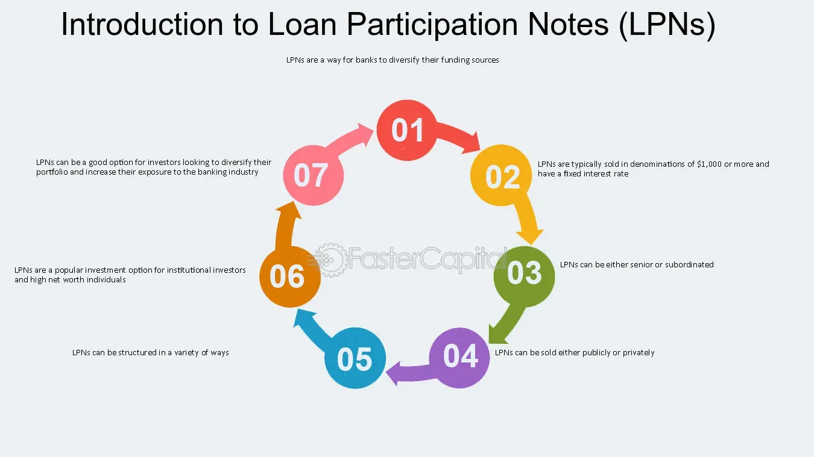

## Table of Contents

## What is a Loan Participation Note?

A Loan Participation Note (LPN) is a type of financial instrument where a bank or financial institution sells a portion of a loan to investors. This allows the original lender to share the risk and potential returns of the loan with others. For example, if a bank has given a big loan to a company, it might sell parts of that loan to investors as LPNs. This way, the bank can free up some of its money and the investors get a chance to earn interest from the loan.

Investors who buy LPNs receive payments based on the interest and principal payments made by the borrower on the original loan. This can be attractive to investors looking for steady income, as they receive regular payments. However, there are risks involved. If the borrower fails to repay the loan, the investors who hold the LPNs could lose money. Therefore, it's important for investors to understand the creditworthiness of the borrower before investing in LPNs.

## How does a Loan Participation Note work?

A Loan Participation Note (LPN) works by letting a bank or a financial institution share a loan with other investors. Imagine a bank gives a big loan to a company. Instead of keeping the whole loan, the bank can sell pieces of it to investors. These pieces are called Loan Participation Notes. By doing this, the bank gets some money back right away and shares the risk of the loan with the investors.

When investors buy LPNs, they get payments based on the interest and principal the company pays on the original loan. This can be good for investors because they get regular payments, kind of like getting interest from a savings account. But there's a risk too. If the company can't pay back the loan, the investors might lose money. So, it's important for investors to check if the company is likely to pay back the loan before they buy LPNs.

## What are the benefits of investing in Loan Participation Notes?

Investing in Loan Participation Notes can be a good way to earn regular income. When you buy an LPN, you get payments from the interest and principal that the borrower pays on the original loan. This can be attractive if you're looking for steady money coming in, similar to getting interest from a savings account or dividends from stocks. Plus, LPNs can offer higher returns than some other safe investments like bonds, because they come with a bit more risk.

Another benefit is that LPNs let you invest in big loans that you might not be able to afford on your own. By buying a piece of the loan, you can join in on the potential profits without having to put up the full amount of the loan. This can be a way to diversify your investments, spreading your money across different types of assets, which can help reduce risk. Just remember, while LPNs can offer good returns, they also come with the risk that the borrower might not pay back the loan, so it's important to do your homework before investing.

## What are the risks associated with Loan Participation Notes?

Investing in Loan Participation Notes comes with some risks. One big risk is that the borrower might not be able to pay back the loan. If the company that borrowed the money runs into financial trouble, they might miss payments or even default on the loan. This means investors who bought the LPNs could lose some or all of their money. It's important to check how likely the borrower is to pay back the loan before investing.

Another risk is that LPNs can be hard to sell quickly. If you need your money back fast, you might not be able to find someone to buy your LPN right away. This is called low [liquidity](/wiki/liquidity-risk-premium). Also, the value of LPNs can go up and down based on how well the borrower is doing and what's happening in the economy. If things change, you might end up selling your LPN for less than you paid for it.

## Who typically issues Loan Participation Notes?

Loan Participation Notes are usually issued by banks or financial institutions. These organizations give out big loans to companies and then sell parts of those loans to investors. By doing this, the bank can get some of its money back right away and share the risk of the loan with others.

Sometimes, special companies called loan originators or loan servicers issue LPNs too. These companies focus on making loans and then selling pieces of those loans to investors. This helps them manage their money better and spread out the risk of the loans they make.

## How can an investor purchase a Loan Participation Note?

An investor can buy a Loan Participation Note by working with a bank or a financial institution that offers them. These banks usually have special departments or teams that handle LPNs. The investor would need to contact the bank, learn about the available LPNs, and decide which one fits their investment goals. The bank will then guide the investor through the process, explaining the terms of the LPN, the risks involved, and how to complete the purchase.

Sometimes, investors can also buy LPNs through investment platforms or brokers that specialize in these types of securities. These platforms make it easier for investors to find and compare different LPNs from various issuers. Once an investor finds an LPN they like, they can usually buy it directly through the platform, often with the help of a financial advisor to make sure it's a good fit for their portfolio.

## What is the difference between a Loan Participation Note and a traditional loan?

A Loan Participation Note (LPN) and a traditional loan work differently. With a traditional loan, a bank gives money directly to a borrower, like a person or a business, and the borrower pays back the loan with interest over time. The bank keeps the entire loan and all the risk that comes with it. On the other hand, an LPN is when a bank gives a loan to a borrower but then sells parts of that loan to investors. This way, the bank doesn't have to keep all the risk by itself and can get some money back right away.

LPNs let investors get a piece of a big loan without having to lend the whole amount themselves. When investors buy an LPN, they get regular payments from the interest and principal the borrower pays on the loan. This can be a good way for investors to earn money, but it also comes with risks. If the borrower can't pay back the loan, the investors could lose money. In contrast, with a traditional loan, only the bank has to worry about the borrower not paying back the loan.

## How are Loan Participation Notes structured?

A Loan Participation Note (LPN) is structured when a bank gives a big loan to a borrower, like a company, and then sells pieces of that loan to investors. The bank splits the loan into smaller parts, and each part is sold as an LPN. This means that the investors who buy the LPNs get a share of the loan, and they receive payments based on the interest and principal that the borrower pays back to the bank. The structure of the LPN includes details like the [interest rate](/wiki/interest-rate-trading-strategies), how often payments are made, and the total amount of the loan that the LPN represents.

The LPN also includes terms that explain what happens if the borrower can't pay back the loan. These terms are important because they tell investors what risks they're taking. For example, if the borrower defaults, the LPN might say how the losses will be shared among the investors. The structure of an LPN is designed to make it clear to investors what they're buying into, including the potential rewards and risks. This way, investors can make informed decisions about whether to buy the LPN.

## What legal considerations should be taken into account with Loan Participation Notes?

When dealing with Loan Participation Notes, it's important to think about the legal stuff. First, you need to check if the LPN follows the rules set by the government or financial regulators. Different places have different rules about how loans can be split and sold to investors. The bank or financial institution selling the LPN has to make sure they're doing everything by the book. They need to give investors clear information about the loan, like who the borrower is, the interest rate, and what happens if the borrower can't pay back the loan. This helps investors understand what they're getting into and protects them from being misled.

Also, think about the agreements between the bank, the borrower, and the investors. These agreements should say clearly what everyone's rights and responsibilities are. If something goes wrong, like the borrower not paying back the loan, the agreements should explain how the problem will be handled. It's a good idea for investors to get advice from a lawyer before buying an LPN. A lawyer can help make sure the investor understands all the legal details and knows what they're agreeing to. This can help avoid legal problems down the road.

## How do Loan Participation Notes impact the financial market?

Loan Participation Notes can change how money moves around in the financial market. When banks sell parts of their loans as LPNs, they get some money back right away. This lets them lend more money to other people or businesses. It's like freeing up space in their piggy bank. This can help the economy grow because more people and businesses can borrow money to do things like start new projects or buy things they need.

LPNs also let more people join in on big loans. Instead of just the bank having the loan, lots of investors can own a piece of it. This can make the financial market more exciting because more people can try to earn money from loans. But it also means that if the borrower can't pay back the loan, more people might lose money. So, LPNs can make the market a bit riskier, but they also help spread money around and give more people a chance to invest.

## What are the tax implications of investing in Loan Participation Notes?

When you invest in Loan Participation Notes, you need to think about taxes. The interest you get from the LPN is usually counted as regular income. That means you'll have to pay taxes on it, just like you would on money you earn from a job. The tax rate depends on your overall income and where you live. Sometimes, if you sell your LPN for more than you paid for it, you might have to pay capital gains tax on the profit. It's a good idea to talk to a tax expert to make sure you understand all the tax rules that apply to your situation.

Also, the way LPNs are taxed can be different in different countries. Some places might have special rules or benefits for investing in LPNs. For example, in some countries, you might be able to deduct certain expenses related to your LPN investment from your taxes. Keeping good records of your LPN investments, like how much you paid for them and how much interest you received, is important for tax time. A tax advisor can help you figure out the best way to handle your taxes when you invest in LPNs.

## How can advanced investors use Loan Participation Notes for portfolio diversification?

Advanced investors can use Loan Participation Notes to spread out their investments and make their portfolios stronger. By buying LPNs, investors can add a different kind of asset to their mix. Instead of just having stocks or bonds, they can own a piece of a big loan. This helps them not put all their eggs in one basket. If one part of their investments goes down, the LPNs might still be doing well, which can help balance things out.

LPNs also let investors get into big loans they couldn't afford on their own. This can be a way to earn steady money from interest payments, which can be good for people who want regular income. But it's important for investors to understand the risks. They need to check how likely the borrower is to pay back the loan and think about how LPNs fit into their overall plan. By carefully choosing LPNs, advanced investors can make their portfolios more diverse and possibly safer.

## What is the relationship between Algorithmic Trading and LPNs?

Algorithmic trading in Loan Participation Notes (LPNs) involves the use of advanced computational models to improve investment decision-making. These models analyze vast datasets to uncover patterns and trends that can inform trading strategies. The automation inherent in [algorithmic trading](/wiki/algorithmic-trading) allows for the quick and precise execution of trades, making it particularly beneficial in markets involving complex instruments like LPNs.

One of the key advantages of using algorithms in trading LPNs is the ability to efficiently assess credit risks. Algorithms can process large amounts of credit data to estimate the likelihood of default and other risk factors more accurately than manual methods. This is crucial for LPNs, given their dependence on the creditworthiness of the underlying loans.

Optimizing portfolios is another critical function facilitated by algorithmic trading. By using techniques such as mean-variance optimization, algorithms can construct portfolios that maximize expected returns for a given level of risk. The formula for mean-variance optimization is:

$$

\text{Maximize } \quad \frac{\sum_{i=1}^{n}(w_i \times r_i) - \frac{\lambda}{2} \sum_{i=1}^{n} \sum_{j=1}^{n} (w_i \times w_j \times \sigma_{ij}) }{\sum_{i=1}^{n}(w_i)} 
$$

where $w_i$ represents the weight of an asset in the portfolio, $r_i$ is the expected return, $\sigma_{ij}$ is the covariance between the returns of assets $i$ and $j$, and $\lambda$ is the risk aversion coefficient.

In terms of execution, algorithms have the ability to implement trades across different markets and financial instruments with speed and precision, which is especially vital in the case of LPNs, where market conditions and pricing can quickly change.

Understanding both the technical and fundamental aspects of LPNs is crucial. Technical analysis involves examining historical pricing data and trading volumes, while [fundamental analysis](/wiki/fundamental-analysis) assesses the creditworthiness of the loans within the LPN. Together, these analyses enable the development of robust algorithms that can make informed trading decisions, thereby optimizing investment outcomes in LPN markets. 

Overall, the integration of algorithmic trading into the LPN market has the potential to transform how these financial instruments are traded, offering sophisticated tools to navigate their complexities and dynamics.

## References & Further Reading

[1]: ["Introduction to Loan Participation Notes"](https://fastercapital.com/content/Demystifying-Loan-Participation-Notes--A-Comprehensive-Guide-to-LPNs.html) by Claude Baumgarten, Journal of Applied Finance.

[2]: ["Advances in Financial Machine Learning"](https://www.amazon.com/Advances-Financial-Machine-Learning-Marcos/dp/1119482089) by Marcos Lopez de Prado

[3]: ["Risk Management in Finance Institutions"](https://www.investopedia.com/terms/r/riskmanagement.asp) by John C. Hull, Springer.

[4]: ["Machine Learning for Asset Managers"](https://www.cambridge.org/core/books/machine-learning-for-asset-managers/6D9211305EA2E425D33A9F38D0AE3545) by Marcos Lopez de Prado

[5]: ["Algorithmic Trading: Winning Strategies and Their Rationale"](https://www.amazon.com/Algorithmic-Trading-Winning-Strategies-Rationale-ebook/dp/B00CY5HC0U) by Ernest P. Chan