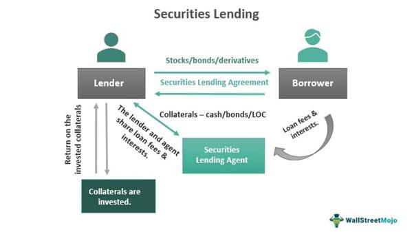

Financial mechanisms serve as the backbone of modern markets, shaping the flow of capital and fostering economic stability and growth. At the heart of these mechanisms lie loans, stocks, and lending activities, each playing a critical role in facilitating the movement of funds between entities. Loans provide the necessary capital for enterprises and individuals to invest in new ventures, purchase goods, or manage day-to-day operations, thereby stimulating economic activity. Stocks, on the other hand, represent ownership in companies and allow firms to raise capital from the public, creating opportunities for growth and expansion.

The interaction between loans, stocks, and lending is a dynamic process, impacting various sectors of the economy. Loans obtained by businesses can be leveraged to increase production capacity, leading to potential stock price appreciation and greater returns for investors. Conversely, fluctuations in stock markets can influence lending conditions, as stock values often serve as collateral for secured loans. This interplay underscores the interconnected nature of financial markets.



However, these interactions are fraught with risks. Lending practices entail credit risk— the possibility that borrowers may default on their obligations, leading to financial losses for lenders. Similarly, stock investments are subject to market risks, where changes in economic conditions, interest rates, or company performance may affect stock prices adversely. These risks necessitate robust risk management strategies to safeguard the interests of both lenders and investors.

In recent decades, algorithmic trading has surged to prominence within financial markets, transforming the landscape of investment and trading. Algorithmic trading utilizes complex mathematical models and algorithms to execute trades at high speeds and large volumes, often beyond human capabilities. This rise of algorithmic trading introduces new efficiencies by reducing transaction costs and improving market liquidity, yet it also presents additional risks and challenges, such as system failures and market volatility.

The purpose of this article is to unravel the complexities of these financial elements—loans, stocks, lending, and the rise of algorithmic trading—and examine their interconnections. By understanding how these components interact and the associated risks, we can better appreciate the intricate nature of modern financial markets and the essential role they play in the global economy.

## Table of Contents

## Understanding Financial Mechanisms

Financial mechanisms are integral constructs within the economy, functioning as the processes and instruments that facilitate the flow and allocation of capital. They serve as the foundation for the activities within financial markets and directly contribute to economic stability and growth.

### Definition and Role of Financial Mechanisms in the Economy

Financial mechanisms encompass a broad range of activities and instruments that include loans, stocks, bonds, derivatives, and various forms of contractual agreements. These mechanisms play a pivotal role in channeling funds from investors to those who require capital, such as individuals, corporations, and governments. By facilitating these transfers, financial mechanisms support business operations, public services, and personal investments, ultimately fueling economic development.

The primary role of financial mechanisms is to enhance [liquidity](/wiki/liquidity-risk-premium), ensure efficient capital allocation, and distribute risks across participants. They enable market participants to hedge against uncertainties and invest resources in ventures that can yield long-term returns. Moreover, they contribute to setting and stabilizing prices within markets through supply and demand interactions.

### How Loans, Stocks, and Other Instruments Facilitate Economic Growth

**Loans**: Loans are fundamental financial instruments used by individuals and businesses to secure the funds needed for consumption and investment. When banks or other financial institutions provide loans, they often require collateral or creditworthiness assessments to mitigate risk. Loans stimulate economic growth by enabling consumers to purchase goods and services and by providing businesses with capital needed for expansion and operational enhancements.

**Stocks**: Stocks represent ownership in companies and grant shareholders a claim on corporate profits in the form of dividends and capital gains. By issuing stocks, companies can attract investment from the public, thereby raising capital without incurring debt. This infusion of equity capital is crucial for innovation, research and development, and the expansion of business operations, contributing significantly to economic growth.

**Bonds and Derivatives**: Bonds are debt securities that enable issuers to finance their activities through borrowing, while derivatives are financial contracts whose value is linked to the performance of underlying assets or indexes. Bonds provide a steady income stream to investors and allow issuers, such as governments and corporations, to undertake large projects. Derivatives help manage financial risks by allowing investors to hedge against potential price movements in assets like commodities, currencies, and interest rates.

### Examples of Financial Mechanisms at Work in Various Sectors

1. **Corporate Sector**: Companies utilize a combination of equity (stocks) and debt (bonds and loans) to finance their operations. For instance, a tech firm may issue bonds to fund the development of new technology or raise equity through an initial public offering (IPO) to expand its market presence.

2. **Public Sector**: Governments employ bonds to raise funds for infrastructure projects, such as building roads, schools, and hospitals. These projects, funded by financial mechanisms, enhance public welfare and stimulate economic growth by creating jobs and improving productivity.

3. **Household Sector**: Individuals leverage financial mechanisms such as mortgages and consumer loans to facilitate home ownership and personal consumption. This access to credit supports economic activity by driving demand for goods and services.

In summary, financial mechanisms are indispensable to the economic infrastructure, enabling the efficient movement of capital and risk management. They not only support immediate financial needs but also lay the groundwork for sustained economic progress across varied sectors.

## Loan Stock and Lender Risks

Loan stocks, often referred to as debentures or bonds, are debt instruments issued by corporations or governments to raise capital. These instruments promise to pay fixed interest to investors until maturity, after which the principal amount is repaid. Loan stocks are a critical component of the financial ecosystem, as they provide the necessary funding for entities to undertake large projects, expansions, or to refinance existing debts. 

Investors in loan stocks earn interest, which is typically calculated using the formula:

$$
\text{Interest} = \text{Principal} \times \text{Rate} \times \text{Time}
$$

Where:
- $\text{Principal}$ is the initial amount invested,
- $\text{Rate}$ is the annual interest rate,
- $\text{Time}$ is the duration for which the money is invested.

However, investing in loan stocks is not without risks. Lender risks stem from several factors including credit risk, [interest rate](/wiki/interest-rate-trading-strategies) risk, and liquidity risk. 

**Credit Risk** arises from the possibility of a borrower defaulting on payments. If the issuing entity faces financial difficulties, it may fail to make interest payments or return the principal.

**Interest Rate Risk** refers to the risk of fluctuating interest rates that affect loan stock values. As interest rates rise, the market value of existing bond issuances generally falls because newer issuances offer higher returns.

**Liquidity Risk** is the risk of not being able to sell loan stocks quickly without compromising on the price. This is particularly prevalent in markets where there is low trading volume.

To mitigate these risks, lenders and investors employ different strategies. Diversification is a common tactic, spreading investments across different sectors or geographical areas to minimize potential losses from any single source. Credit evaluation processes, robust risk assessment models, and the use of credit default swaps can also shield investors from potential defaults. Furthermore, laddering bond maturities—a strategy where bonds are purchased at different times and with varying maturities—can help stabilize income and reduce exposure to interest rate fluctuations.

Economic factors significantly influence lender risks. During economic downturns, the likelihood of defaults increases, heightening credit risk. In contrast, a booming economy might drive inflation, leading central banks to raise interest rates—a situation that amplifies interest rate risk.

In essence, a nuanced understanding of these risks and the implementation of well-researched mitigation strategies are essential for maintaining the stability and profitability of investments in loan stocks. Proper risk management not only preserves individual investments but also sustains broader economic health by ensuring the steady flow of capital in the market.

## Algorithmic Trading

Algorithmic trading refers to the use of computerized systems and mathematical algorithms to conduct trading activities in financial markets. The evolution of [algorithmic trading](/wiki/algorithmic-trading) can be traced back to the late 20th century, when computers began to revolutionize trading practices. Initially, algorithms were utilized to optimize simple tasks like calculating [arbitrage](/wiki/arbitrage) opportunities and executing large orders without causing significant market impact. Over time, with advancements in technology and increased data availability, algorithmic trading has evolved into a sophisticated activity that forms a critical part of modern financial markets.

Algorithms enhance efficiency in trading by automating the entire trading process, from data analysis to order execution. They are programmed to follow specific strategies, incorporating predefined rules based on factors such as timing, price, quantity, or other mathematical models. For instance, a popular algorithmic strategy involves using moving averages to make buy or sell decisions. If $\text{MA}_{\text{short-term}} > \text{MA}_{\text{long-term}}$, a buy signal may be triggered, while the reverse condition could signal a sell order. These algorithms rapidly process vast amounts of data that would be impossible for a human trader to assimilate, allowing for more informed decision-making and enhanced precision in trade execution.

The benefits of algorithmic trading in modern markets are numerous. First, it significantly reduces transaction costs by minimizing the human intervention required during trade execution, which reduces errors and facilitates faster decision-making. Algorithms can operate on a 24/7 basis, capitalizing on opportunities that arise outside regular trading hours. Furthermore, they enhance market liquidity, providing more depth to the market and thereby reducing the spread between bids and asks. This increased liquidity benefits all market participants by making it easier to enter and [exit](/wiki/exit-strategy) positions.

However, algorithmic trading is not without its challenges and limitations. One major concern is the potential for systemic risk, as the reliance on algorithms can lead to market disruptions if multiple systems react similarly to a particular event, causing a rapid, cascading effect—often referred to as a "flash crash." Additionally, while algorithms excel at data analysis and speed, they may lack the adaptive reasoning and intuition of human traders, potentially leading to suboptimal decisions in unpredictable market conditions. There is also the risk of overfitting, where an algorithm becomes too tailored to historical data and loses its effectiveness in new market environments.

To address these challenges, continuous development and testing of trading algorithms are essential. Regulatory oversight is also crucial to ensure fair trading practices and mitigate risks associated with high-frequency trading. As the algorithmic trading landscape evolves, it will be essential for financial institutions and regulators to adapt their strategies and frameworks to keep pace with technological advancements.

## Interconnections Between Loans, Stocks, and Algorithmic Trading

Algorithmic trading is a significant driver of efficiency and liquidity in modern financial markets, potentially impacting loan stock markets by influencing prices and trading volumes rapidly. By utilizing complex algorithms and high-speed data processing, algorithmic trading systems can execute trades based on predefined criteria, often reacting to market conditions faster than human traders can.

The interplay between lending activities and stock trading is evident in the interconnected nature of financial markets. Lenders and investors in loan securities, for instance, rely heavily on market signals and activities in the stock market to gauge the creditworthiness of borrowers. If algorithmic trading leads to increased [volatility](/wiki/volatility-trading-strategies) or sudden swings in stock prices, it can directly affect the perceived risk associated with loan stocks. This is because the financial health of companies issuing stocks often correlates with their ability to meet debt obligations.

Evaluating the impact of automated trading on lender risks involves understanding how rapid changes in market prices can affect the value of loan securities. For example, a sudden decline in stock prices triggered by algorithmic trades might reflect adverse economic news, affecting companies' credit ratings and thus increasing lender risks. To mitigate these risks, lenders and investors may use risk management strategies such as diversification or hedging to protect against market volatility.

The role of technology in managing financial products and risks is paramount, especially in a landscape where algorithmic trading is prevalent. Advanced risk management tools can process large volumes of data to provide predictive analytics and real-time monitoring of market conditions. Technologies like [machine learning](/wiki/machine-learning) and [artificial intelligence](/wiki/ai-artificial-intelligence) are increasingly used to create adaptive systems that can adjust to market changes, enabling more precise risk assessment and management.

Overall, the integration of algorithmic trading into financial markets underscores the critical role technology plays in enhancing the efficiency and complexity of these markets. By leveraging technology, market participants can better navigate the risks and opportunities presented by the dynamic interconnections between loans, stocks, and trading activities.

## Managing Risks in a Complex Financial Environment

Managing risks in a complex financial environment involves employing a multi-faceted approach to ensure sustainability and resilience against potential adversities. Here, we discuss the best practices for managing risks associated with loan stocks, implementing strategies to mitigate risks linked to algorithmic trading, the use of technological tools for comprehensive risk management, and the crucial role of regulations and compliance.

**Best Practices for Managing Risks Associated with Loan Stocks**

Loan stocks, or loan-based securities, hold a unique position in financial markets as they combine elements of both debt and equity instruments. To manage risks associated with them, one effective strategy is thorough credit risk assessment. This involves analyzing the borrower's creditworthiness, which can be achieved through credit scoring models and financial statement analysis. Diversification is another key practice, where portfolios are varied across different industries and geographies to reduce exposure to any single point of failure. Additionally, setting up collateral and covenants can further safeguard lenders by providing recourse in case of default.

**Strategies to Mitigate Risks Linked to Algorithmic Trading**

Algorithmic trading has transformed market operations but brings unique risks, such as system failures and market manipulations. Robust risk mitigation strategies include implementing circuit breakers to curb excessive volatility and stress testing algorithms under various market scenarios to ensure stability. Real-time monitoring is also critical, where systems are continuously assessed for performance and anomalies are immediately addressed. It is also advisable to have a "kill switch" to halt trading immediately if predefined risk thresholds are exceeded.

**Technological Tools and Resources for Comprehensive Risk Management**

The adoption of advanced technology is paramount in managing financial risks. Machine learning and artificial intelligence algorithms can predict and detect early warning signals in market behavior, assisting in proactive risk management. Blockchain technology enhances data integrity and transparency, particularly in loan stock transactions, by providing a secure, tamper-proof record-keeping system. Additionally, data analytics tools enable comprehensive analysis of large datasets, helping managers identify trends and potential risks more effectively. 

```python
import numpy as np
from sklearn.ensemble import RandomForestClassifier

# Example: Using a simple algorithm to predict default risk
# Assume 'X' is the feature set and 'y' is the target variable (e.g., default/non-default)
model = RandomForestClassifier(n_estimators=100, random_state=42)
model.fit(X, y)

# Predict and calculate the probability of default
predicted_risks = model.predict_proba(X_test)[:, 1]
print(predicted_risks)
```

**The Importance of Regulations and Compliance in Risk Management**

Regulations play a pivotal role in maintaining market integrity and protecting investors. Compliance with regulations like the Basel III for banking or MiFID II for trading ensures institutions have adequate capital and risk-control measures while promoting transparency. Regulatory frameworks guide institutions in maintaining leverage ratios and liquidity coverage, vital in adverse conditions. Ongoing compliance checks and updates to internal policies aligned with regulatory changes are essential for mitigating legal and financial risks. 

In conclusion, a comprehensive risk management strategy for complex financial markets requires an amalgamation of astute financial practices, technology utilization, and strict adherence to regulations, enabling institutions to not only protect their investments but also capitalize on market opportunities responsibly.

## Future Trends and Developments

Emerging trends in financial mechanisms and market dynamics are reshaping how investors, institutions, and policymakers interact with financial systems. Among these changes, advancements in algorithmic trading technology are gaining prominence. Algorithmic trading, which leverages mathematical models and computing power to execute trades, is evolving with the integration of artificial intelligence (AI) and machine learning (ML). These technologies enhance pattern recognition, enabling systems to learn from vast datasets for improved decision-making. As AI and ML continue to develop, the scope and complexity of algorithms will likely increase, potentially leading to more sophisticated trading strategies and improved market efficiencies.

In terms of economic policies, future developments are anticipated to have significant effects on loans and stocks. As governments respond to economic challenges, policy shifts can influence interest rates, capital availability, and regulatory frameworks. For instance, changes in central bank policies might affect lending rates, impacting both borrowers and lenders. Similarly, fiscal policies directed towards specific sectors could alter stock market dynamics by encouraging or discouraging investments. A hypothetical scenario could involve using Python to simulate interest rate adjustments affecting loan demands:

```python
import numpy as np

# Interest rates (in percentage)
interest_rates = np.array([0.5, 1.0, 1.5, 2.0, 2.5])

# Function to simulate demand impact based on interest rates
def simulate_loan_demand(rate):
    return max(0, 1000 - 100 * rate)  # Hypothetical linear relationship

loan_demands = [simulate_loan_demand(rate) for rate in interest_rates]

loan_demands
```

The liquidity and risk management landscape is also transforming with the deployment of advanced technologies. Enhanced analytic tools and risk assessment models are enabling real-time monitoring and prediction of financial risks. Blockchain technology is being explored for greater transparency and security in financial transactions, which could revolutionize how contracts are validated and enforced.

Furthermore, financial risk management must adapt to navigate these technologies and policies. Comprehensive strategies incorporating regulatory compliance, cyber security, and operational resilience will become imperative as financial ecosystems become more interconnected. Adopting a holistic approach to risk management, combining traditional methods with modern innovations, will be crucial for stakeholders aiming for stability and growth.

Predictions suggest that as these trends converge, the efficiency and complexity of financial markets will reach unprecedented levels. Stakeholders who adapt to these changes effectively are likely to benefit from increased opportunities, though they must also manage potential new risks associated with emerging technologies and policy shifts.

## Conclusion

This article has explored the intricate network of financial mechanisms that define modern markets, delving into the interconnected domains of loans, stocks, and algorithmic trading. Understanding these mechanisms is crucial for anyone navigating today's economic landscape, as they form the backbone of financial growth and stability. Loans serve as essential instruments for facilitating capital infusion across sectors, while stocks enable the redistribution of wealth and investment in companies.

A significant discussion point has been the various risks associated with these mechanisms, particularly for lenders and investors. Factors such as economic downturns, market volatility, and technological advancements add layers of complexity to managing these risks. Risk mitigation is thus not only a strategic priority but also a necessity to ensure sustainable financial engagements.

Algorithmic trading, with its efficiency and speed, has transformed stock markets but comes with its own set of challenges and limitations. Its synergy with loans and stocks illustrates an ever-evolving financial landscape where technology plays a pivotal role in managing these interactions.

Balancing opportunities and risks requires a deep understanding of how these financial elements operate and their broader implications in the market. Investors and financial institutions must continuously adapt to changes in the economic environment, leveraging technological tools and adhering to regulatory frameworks to maintain stability.

Continuous learning and strategic adaptation are imperative to thriving in today's dynamic markets. As financial mechanisms and technologies continue to evolve, the ability to anticipate changes and swiftly adapt to new trends will determine success. By staying informed and proactive, investors and institutions can navigate the complexities of financial markets, optimizing returns while mitigating potential risks.

## References & Further Reading

[1]: Bergstra, J., Bardenet, R., Bengio, Y., & Kégl, B. (2011). ["Algorithms for Hyper-Parameter Optimization."](https://papers.nips.cc/paper/4443-algorithms-for-hyper-parameter-optimization) Advances in Neural Information Processing Systems 24.

[2]: ["Advances in Financial Machine Learning"](https://www.amazon.com/Advances-Financial-Machine-Learning-Marcos/dp/1119482089) by Marcos Lopez de Prado

[3]: ["Evidence-Based Technical Analysis: Applying the Scientific Method and Statistical Inference to Trading Signals"](https://www.amazon.com/Evidence-Based-Technical-Analysis-Scientific-Statistical/dp/0470008741) by David Aronson

[4]: ["Machine Learning for Algorithmic Trading"](https://github.com/stefan-jansen/machine-learning-for-trading) by Stefan Jansen

[5]: ["Quantitative Trading: How to Build Your Own Algorithmic Trading Business"](https://books.google.com/books/about/Quantitative_Trading.html?id=j70yEAAAQBAJ) by Ernest P. Chan