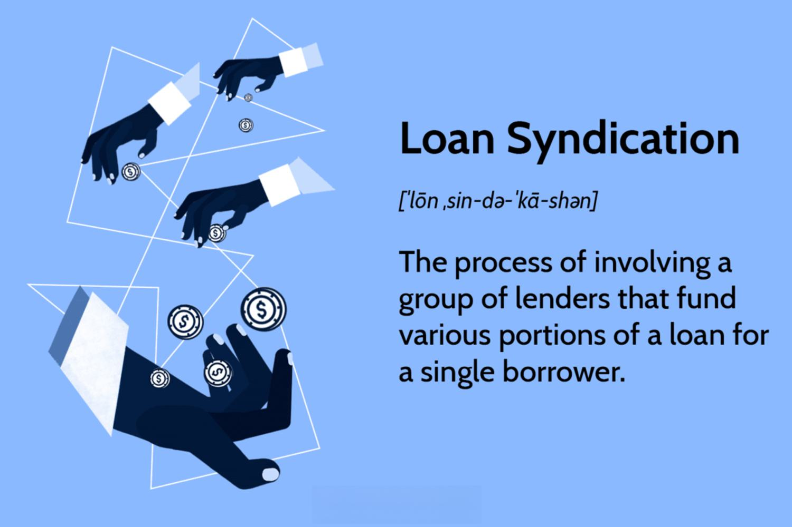

The financial industry is a complex ecosystem, encompassing various sectors such as banking, lending, and trading. Each of these sectors plays a critical role in the economic framework by facilitating capital flow, supporting business activities, and enabling wealth creation. In recent years, these sectors have undergone significant transformation due to technological advancements and innovative financial strategies.

Technological advancements, such as digital platforms and algorithmic trading, have reshaped traditional financial operations, enhancing efficiency and accessibility. Digital platforms have democratized access to financial services, allowing consumers and businesses to engage in transactions with increased convenience and security. Algorithmic trading has introduced new levels of speed and precision to trading activities, contributing to greater market liquidity and reduced transaction costs.

Simultaneously, innovative financial strategies, such as loan syndication and financial collaborations, have emerged to address large-scale funding needs and distribute financial risks. These strategies enable institutions to undertake expansive projects and complex financial operations more effectively, increasing the resilience of the financial system.

This article explores the convergence of financial collaboration, bank lending, loan syndication, and algorithmic trading. It aims to provide insights into how these elements interact within the modern financial landscape and their significance to stakeholders. Understanding these elements is crucial as they can pave the way for stakeholders to navigate the continuously evolving financial environment efficiently. By examining their interplay, stakeholders can better position themselves to leverage the opportunities and tackle the challenges that arise within this dynamic ecosystem.

## Table of Contents

## Financial Collaboration: An Overview

Financial collaboration involves the partnership and cooperation between financial institutions and various stakeholders to achieve shared objectives. It is pivotal in addressing a vast array of financial services, from lending and risk management to complex investment strategies. The cooperative nature of financial collaboration reinforces stability in the financial ecosystem and fosters innovation. 

Several factors are driving the trend toward financial collaboration. Technological advancements have bridged gaps between institutions, enabling seamless communication and integration across platforms. This technological integration has been facilitated by developments in fintech, which have introduced new tools and processes that allow for more efficient exchanges of information and resources. For example, blockchain technology's decentralized ledger system provides secure and transparent transaction records, which can enhance trust among collaborating entities.

Additionally, regulatory pressures in many financial systems require institutions to operate with high levels of transparency and accountability. This regulatory environment naturally encourages collaboration among financial entities as they work together to comply with stringent standards set by governing bodies. By pooling resources and expertise, these institutions can effectively navigate the complex regulatory landscape.

The benefits of financial collaboration are significant. By working together, financial institutions can achieve economies of scale, reduce operational costs, and mitigate risks. This collaboration also opens opportunities for sharing best practices and innovative ideas, leading to improved financial products and services. For instance, joint ventures and partnerships can lead to the development of new financial instruments or the improvement of existing services, providing better solutions for consumers.

Despite these advantages, financial collaboration can present challenges. One such challenge is coordinating multiple stakeholders with potentially differing objectives and priorities. Ensuring alignment across goals requires robust governance structures and consistent communication. Additionally, issues related to cybersecurity and data privacy can arise, as collaborative platforms may become targets for malicious actors seeking to exploit vulnerabilities in shared networks.

In summary, financial collaboration is an essential mechanism through which financial institutions can enhance their service offerings and operational capabilities. By leveraging technological innovations and maintaining compliance with regulatory frameworks, institutions can harness the benefits of collaboration while addressing its inherent challenges. As the financial landscape continues to evolve, collaboration will likely remain a key strategy for institutions aiming to thrive in a dynamic market environment.

## Bank Lending: Foundations and Innovations

Bank lending is a fundamental activity within the financial sector, providing essential capital for personal, commercial, and industrial purposes. At its core, bank lending involves the provision of funds by banks to various borrowers with the expectation of repayment, usually accompanied by interest. This traditional model of lending has undergone significant transformation in recent years, driven by technological advancements and innovative financial strategies, which are reshaping how borrowers and lenders interact.

## Recent Innovations in Bank Lending

### Digital Lending Platforms

The advent of digital lending platforms represents one of the most significant innovations in bank lending. These platforms leverage advanced technologies, such as [artificial intelligence](/wiki/ai-artificial-intelligence) (AI) and [machine learning](/wiki/machine-learning), to streamline the loan origination process, enhance decision-making, and improve customer experience. Unlike traditional methods, which can be labor-intensive and time-consuming, digital platforms offer borrowers a seamless and faster lending process. They utilize AI algorithms to assess creditworthiness by analyzing vast amounts of data, including non-traditional data sources like social media activity and transaction history, providing a more holistic view of a borrower’s financial health.

### Peer-to-Peer Lending

Peer-to-peer (P2P) lending is another revolutionary change impacting the sector. Unlike conventional bank loans, P2P platforms connect borrowers directly with investors willing to fund their loans, bypassing traditional banking intermediaries. This approach democratizes access to credit, often providing more competitive interest rates for borrowers and higher returns for investors. While P2P lending initially focused on personal loans, it has expanded into small business and real estate financing, further diversifying its offerings.

## Current Trends and Influences

### Regulatory Challenges

The rapid evolution in bank lending practices poses regulatory challenges. Governments and regulatory bodies strive to ensure that these new lending models do not compromise financial system stability or consumer protection. There is an ongoing effort to develop regulatory frameworks that accommodate innovation while mitigating systemic risks. For instance, digital lenders must comply with Know Your Customer (KYC) and anti-money laundering (AML) regulations, which necessitate robust identity verification processes and transaction monitoring systems.

### Technological Advancements

The increasing integration of technology into bank lending is not limited to digital platforms and P2P models. Blockchain technology, for example, is gaining traction as a tool to enhance transparency, security, and efficiency in the lending process. Smart contracts, powered by blockchain, can automate loan agreements and repayments, reducing the potential for human error and fraud.

Additionally, big data analytics are being used to refine credit-scoring models. Traditional credit scores might overlook certain demographic segments, leading to underserved populations. Enhanced analytics can provide deeper insights into borrower behavior and creditworthiness, fostering a more inclusive lending environment.

In conclusion, the bank lending landscape is being redefined by digital lending platforms, P2P lending, and technological integration. While these innovations offer numerous benefits, including increased efficiency and expanded access, they also necessitate adaptive regulatory frameworks to address emerging risks. As the sector continues to evolve, stakeholders must embrace these innovations to remain competitive and meet the changing needs of borrowers.

## Loan Syndication: A Collaborative Approach

Loan syndication is a financial mechanism where multiple lending institutions collaborate to collectively fund a borrower’s large loan requirement. This approach is particularly vital for financing extensive projects like corporate expansions, infrastructure developments, and large-scale acquisitions. By consolidating several lenders, syndication not only disperses the financial risk among participating entities but also allows borrowers to obtain more capital than a single lender might be willing or able to provide.

**Role of Syndicate Agents**

In a syndicated loan, the syndicate agent holds a pivotal role. Typically a financial institution, the agent is responsible for structuring the loan, organizing the syndicate, administering payments, and ensuring compliance with the loan agreement. The agent acts as the intermediary between the borrower and the lenders, coordinating communications and managing any issues that arise during the loan tenure.

**Benefits for Lenders and Borrowers**

For lenders, syndication offers a pathway to diversify their portfolios without committing to the total loan amount, thus managing and mitigating risk. Lenders can participate in large projects and gain from interest earnings proportional to their share of the loan. This participation often entails sharing of due diligence and information resources, as well as leveraging the syndicate agent's expertise in managing complex financing agreements.

Borrowers benefit from syndication by accessing a broader pool of capital and a diverse range of lender expertise. A syndicated loan can lead to more favorable borrowing terms such as extended repayment schedules and competitive interest rates due to the collective bargaining power of the syndicate. Additionally, syndication can enhance a borrower’s credibility by showing confidence from a consortium of financial institutions.

**Examples of Successful Loan Syndications**

One notable example of successful loan syndication is the financing of large infrastructure projects like airport expansions or multinational mergers. For instance, in the acquisition of a major corporation, a syndicated loan may involve dozens of banks and financial institutions worldwide, orchestrated by a leading global bank acting as the syndicate agent. These high-value syndications demonstrate the potential scale and complexity that can be built through collaborative financing strategies.

Loan syndication is thus an effective tool that combines multiple stakeholders’ resources and expertise, addressing large capital needs while balancing risk and reward among lenders and borrowers. This collaborative approach has become an integral part of modern finance, adapting flexibly to meet the evolving demands of global financial markets.

## Algo Trading: The Intersection of Finance and Technology

Algorithmic trading, commonly referred to as algo trading, leverages computer algorithms to automate trading operations, enabling transactions with an efficiency and speed unattainable by human traders. This technological advancement has transformed traditional trading models by significantly enhancing market [liquidity](/wiki/liquidity-risk-premium) and lowering transaction costs.

### Advantages of Algorithmic Trading

**Increased Speed and Efficiency**: Algorithmic trading systems process complex calculations swiftly and execute orders instantly, thereby capitalizing on market movements as they occur. This rapid execution reduces latency—a critical factor in financial markets where time equates to profitability.

**Enhanced Market Liquidity**: With automated trading systems executing numerous transactions simultaneously, market liquidity improves. This surge in liquidity benefits all market participants by tightening bid-ask spreads and enhancing price discovery processes.

**Reduced Transaction Costs**: By minimizing human intervention, algo trading reduces the emotional and cognitive biases that can lead to suboptimal trade execution. This reduction in discretionary errors, combined with the ability to route orders to the most cost-effective venues, ensures lower overall trading costs.

### Integration with Financial Processes

Algo trading is not an isolated phenomenon but is interconnected with other financial sectors, notably loan syndication and lending. By integrating with these processes, algorithmic systems optimize analysis and decision-making. 

#### Loan Syndication
In loan syndication, algo trading can provide advanced analytics for assessing risk and pricing associated with large syndicated loans. By employing historical data and predictive modeling, algorithms can assist in determining optimal loan structures and interest rates, improving both syndicate efficiency and borrower outcomes.

#### Lending
In the lending sector, algo trading enables enhanced risk profiling and asset-liability management. Algorithms can assess borrower creditworthiness rapidly and adjust lending rates dynamically based on real-time market conditions, thereby optimizing the lender's portfolio management.

### Potential Risks

Despite its numerous benefits, [algorithmic trading](/wiki/algorithmic-trading) is not devoid of risks. Systemic risks such as 'flash crashes'—sudden market downturns caused by automated sell-offs—demonstrate the potential [volatility](/wiki/volatility-trading-strategies) introduced by algorithms. Furthermore, the reliance on complex models poses risks if underlying assumptions are incorrect or if algorithms are improperly tuned to prevailing market conditions. 

### Integration Challenges

Seamless integration of algo trading with traditional financial processes requires robust technological infrastructure, a high degree of data accuracy, and adherence to regulatory frameworks. Financial institutions must ensure that their algorithmic systems comply with regulations like the Markets in Financial Instruments Directive (MiFID II) in Europe, which mandates transparency, efficiency, and fair trading practices.

Algorithmic trading continues to reshape the financial landscape by merging with traditional processes in novel ways, thereby creating a more resilient and adaptable system for managing modern financial markets. Stakeholders must be vigilant in managing the intricacies of these technologies to maximize their advantages while minimizing associated challenges.

## The Synergy between Loan Syndication and Algorithmic Trading

Combining loan syndication with algorithmic trading represents a significant evolution in financial transactions, optimizing decision-making processes and increasing efficiency. Loan syndication involves multiple financial institutions lending to a single borrower, often for large-scale projects. Algorithmic trading, on the other hand, uses advanced computer algorithms to automate the trading process in financial markets. The integration of these two components can significantly enhance the efficiency and robustness of financial ecosystems.

The synergy between these mechanisms allows for superior data analysis and risk assessment capabilities, making the loan syndication process more streamlined. By applying algorithms to analyze vast amounts of financial data, institutions can assess the risk associated with syndicated loans more accurately. This data-driven approach ensures that decisions are informed by comprehensive insights into market trends and financial metrics.

Advanced platforms like Octaura are at the forefront of utilizing this synergy. Octaura's platform incorporates algorithmic trading principles to facilitate syndicated loan trading. By employing sophisticated analytics and data-driven strategies, such platforms can enhance market participant experiences in several ways. They offer real-time data analysis, improving the speed and precision of syndication processes. Additionally, these platforms can simulate various market conditions to evaluate potential outcomes, thereby providing a robust framework for risk management.

For instance, through Octaura's advanced analytics, loan syndications can be traded more efficiently. The platform leverages predictive algorithms to identify optimal trading opportunities, thereby maximizing returns and minimizing risks. This system significantly reduces transaction times and costs, offering higher liquidity and better pricing in the syndication markets.

Moreover, this synergy improves the transparency of loan syndication markets. Automated systems ensure that all trading data is recorded and accessible, reducing the likelihood of discrepancies and fraud. By using a standardized platform for trading syndicated loans, different financial institutions can collaborate more smoothly, fostering an environment of trust and mutual benefit.

In conclusion, the integration of loan syndication with algorithmic trading not only enhances the operational efficiency of financial transactions but also contributes to a more resilient financial system. As financial institutions continue to embrace technological advancements, the use of data-driven platforms like Octaura will be pivotal in shaping the future of financial collaborations.

## Challenges and Opportunities

Financial collaboration, lending, syndication, and algorithmic trading are integral to modern finance, yet they come with inherent challenges that stakeholders must address to fully exploit the opportunities they present. Key challenges include regulatory compliance, cybersecurity threats, and market volatility. Understanding these challenges is crucial for stakeholders to effectively manage risks and leverage financial innovations.

**Regulatory Compliance**

The global financial industry is heavily regulated to ensure market stability, protect investors, and mitigate systemic risk. Financial institutions engaged in collaboration, lending, and trading must comply with a myriad of regulations, such as the Basel III standards which emphasize risk management and capital adequacy. Non-compliance can result in substantial legal penalties and damage to reputation. The constantly evolving regulatory landscape poses a challenge as institutions must stay updated with local and international regulations. For instance, algorithmic trading is subject to specific rules that aim to prevent market manipulation and flash crashes. Stakeholders need to develop robust compliance frameworks and invest in technology that ensures real-time adherence to regulatory standards.

**Cybersecurity**

With the increasing reliance on digital platforms, cybersecurity has become a critical concern. Financial data is a lucrative target for cybercriminals, making financial institutions prime targets for cyberattacks. The integration of technologies, such as digital lending platforms and algorithmic trading systems, increases the exposure to cybersecurity threats. Institutions must implement comprehensive cybersecurity measures to protect sensitive data and maintain trust. This involves employing advanced encryption, monitoring for intrusions, and conducting regular security audits. Additionally, companies should focus on training employees in cybersecurity best practices to reduce human error-related breaches.

**Market Volatility**

Market volatility is an inherent aspect of financial markets, influenced by economic indicators, geopolitical events, and investor sentiment. For financial collaborations, a volatile market environment can affect loan syndications by altering interest rates and risk assessments, leading to potential losses for lenders. Similarly, algorithmic trading strategies must adapt swiftly to market changes to avoid substantial financial losses. Stakeholders should employ sophisticated risk management tools and diversification strategies to mitigate the effects of volatility. By leveraging predictive analytics, institutions can better anticipate market trends and make informed decisions.

**Opportunities for Future Developments**

While these challenges are significant, they also present opportunities for innovation and growth. Technological advancements such as artificial intelligence and machine learning can enhance risk assessment processes, improve trading algorithms, and streamline compliance procedures. For instance, platforms like Octaura provide data-driven solutions that enhance syndicated loan trading and offer advanced analytics to improve market efficiency.

The convergence of these financial elements is likely to lead to increased collaboration between fintech companies and traditional financial institutions. This partnership fosters innovation, resulting in products and services that cater to the needs of a digital-first clientele. By embracing these developments, stakeholders can create more efficient, transparent, and resilient financial systems.

In summary, while challenges such as regulatory compliance, cybersecurity, and market volatility persist, they foster a climate of innovation, pushing financial institutions to develop robust strategies and technologies that prepare them for the future financial landscape. As the industry progresses, embracing these opportunities could yield substantial benefits for businesses and investors alike.

## Conclusion

The financial landscape is in a constant state of flux, shaped by the intricate dynamics of collaboration, lending, syndication, and trading. These elements are pivotal, each playing a critical role in the efficacy and stability of global finance systems. Embracing technological advancements is not merely advantageous but necessary. The integration of artificial intelligence, blockchain, and big data analytics has the potential to transform traditional financial processes, offering enhanced efficiency and unprecedented transparency.

Strategic partnerships are crucial in this evolution. By collaborating, financial institutions can combine resources and expertise, paving the way for innovative solutions that address complex market demands and foster resilience. Through such alliances, stakeholders can better navigate regulatory changes and manage risks associated with cyber threats and economic volatility.

To harness the full potential of financial innovations, stakeholders must remain adaptable and proactive. Investing in continuous learning and technology adoption will equip them to anticipate and respond to emerging trends. As financial environments evolve, those who embrace change and leverage new tools will thrive, setting new standards for operational excellence and competitive advantage.

## References & Further Reading

[1]: Alter, A. (2020). ["Loan Syndications and Trading: The Complete Guide."](https://www.lsta.org/news-resources/lsta-publishes-industry-handbook-on-loan-syndications-and-trading/) De Gruyter.

[2]: Alexander, C., & Sheedy, E. (2005). ["The Professional Risk Managers' Guide to Financial Markets."](https://books.google.com/books/about/The_Professional_Risk_Managers_Guide_to.html?id=63boAwAAQBAJ) McGraw-Hill.

[3]: Narang, R. (2009). ["Inside the Black Box: A Simple Guide to Quantitative and High-Frequency Trading."](https://onlinelibrary.wiley.com/doi/book/10.1002/9781118267738) Wiley.

[4]: Fabozzi, F. J., & Jones, F. J. (2019). ["Foundations of Global Financial Markets and Institutions."](https://mitpress.mit.edu/9780262039543/foundations-of-global-financial-markets-and-institutions/) MIT Press.

[5]: Sironi, A., & Resti, A. (2007). ["Risk Management and Shareholders' Value in Banking."](https://onlinelibrary.wiley.com/doi/book/10.1002/9781118371886) Wiley.