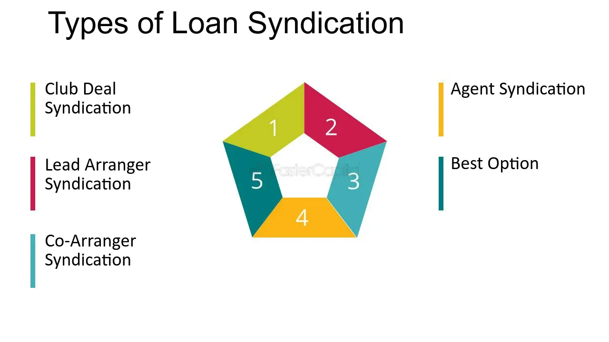

## Table of Contents

## What is loan syndication?

Loan syndication is when a group of banks or financial institutions come together to provide a loan to a single borrower. This is often used for large loans that one bank might not want to take on by itself because it's too risky or too big. By sharing the loan, the risk is spread out among the different banks, making it safer for each one.

The process starts when a borrower, usually a big company or a government, needs a large amount of money. They approach one bank, called the lead bank, which then puts together a group of other banks to help fund the loan. The lead bank manages the loan, handles the paperwork, and makes sure everything goes smoothly. This way, the borrower gets the money they need, and the banks share both the risk and the rewards.

## How does loan syndication work?

Loan syndication happens when a borrower needs a big loan that one bank can't or won't give by itself. The borrower goes to a lead bank and asks for help. The lead bank then finds other banks to join in and share the loan. This way, the risk of the loan is spread out among many banks, making it safer for each one. The lead bank takes charge of organizing everything, from setting up the loan terms to handling the paperwork.

Once the group of banks, called the syndicate, is formed, they all agree on how much each bank will lend and the terms of the loan. The borrower then gets the total amount of money they need from the syndicate. The lead bank keeps an eye on the loan, making sure payments are made on time and dealing with any issues that come up. This way, even though the loan is big and might be risky, the banks can work together to make it happen and share both the risk and any profits.

## What are the benefits of loan syndication for borrowers?

Loan syndication helps borrowers get big loans that one bank might not give them alone. If a company or government needs a lot of money, they can go to one bank, and that bank can find other banks to help. This means the borrower can get all the money they need from one big loan instead of trying to get smaller loans from different places. It makes things easier because they only have to deal with one main bank, even if many banks are involved.

Another benefit is that loan syndication can sometimes get borrowers better terms. Because many banks are working together, they might be willing to offer a lower [interest rate](/wiki/interest-rate-trading-strategies) or more flexible repayment options. This can save the borrower money and make it easier to pay back the loan. Overall, loan syndication gives borrowers a way to get the big loans they need with better terms and less hassle.

## What are the benefits of loan syndication for lenders?

Loan syndication helps lenders share the risk of big loans. When one bank can't or doesn't want to give a large loan by itself, it can join with other banks to spread out the risk. This way, if the borrower can't pay back the loan, the loss is shared among all the banks in the group. It makes big loans safer for each bank because they're not on the hook for the whole amount.

Another benefit for lenders is that loan syndication can help them make more money. By working together, banks can take on bigger loans that they wouldn't be able to do alone. This means they can earn more interest and fees from these loans. Plus, being part of a syndicate can help banks build relationships with other banks and with big borrowers, which can lead to more business in the future.

## What are the different types of loan syndication?

There are three main types of loan syndication: underwritten, best-efforts, and club deals. In an underwritten deal, the lead bank promises to provide the whole loan if other banks don't join in. This means the lead bank takes on all the risk at first, but it also means they can charge fees for this service. Best-efforts syndication is when the lead bank tries to get other banks to join but doesn't promise to cover the whole loan if they can't. This type is less risky for the lead bank but can be less certain for the borrower.

Club deals are when a small group of banks work together to give a loan without a formal lead bank. They all agree on the terms and share the risk equally. This type of syndication is often used for smaller loans or when the borrower has a good relationship with the banks involved. Each type of loan syndication has its own benefits and risks, depending on how much risk the banks want to take and how much control the borrower needs over the loan process.

## What is the role of the lead bank in loan syndication?

The lead bank plays a big role in loan syndication. It starts when a borrower needs a big loan and goes to the lead bank for help. The lead bank then finds other banks to join in and share the loan. This way, the risk of the loan is spread out among many banks. The lead bank is in charge of organizing everything. It sets up the loan terms, handles all the paperwork, and makes sure everything goes smoothly. The lead bank also talks to the borrower and the other banks, making sure everyone agrees on the loan details.

In an underwritten deal, the lead bank promises to provide the whole loan if other banks don't join in. This means the lead bank takes on all the risk at first, but it can also charge fees for this service. In a best-efforts deal, the lead bank tries to get other banks to join but doesn't promise to cover the whole loan if they can't. No matter the type of deal, the lead bank keeps an eye on the loan after it's given out. It makes sure payments are made on time and deals with any problems that come up. This way, the lead bank helps make sure the loan works out well for everyone involved.

## What are the key steps involved in the loan syndication process?

When a borrower needs a big loan, they go to a lead bank to start the loan syndication process. The lead bank looks at the borrower's needs and decides if it wants to help. If it does, the lead bank finds other banks to join in and share the loan. This group of banks is called a syndicate. Together, they agree on how much each bank will lend and the terms of the loan. The lead bank handles all the paperwork and makes sure everyone agrees on the details.

Once the syndicate is formed and the loan terms are set, the borrower gets the money they need. The lead bank keeps an eye on the loan to make sure payments are made on time. If there are any problems, the lead bank talks to the borrower and the other banks to fix them. This way, the risk of the loan is shared among all the banks, and the borrower gets the big loan they need from one place.

## How do syndicated loans differ from traditional loans?

Syndicated loans are different from traditional loans because they involve more than one bank. When a borrower needs a big loan, one bank might not want to give it all by itself because it's too risky or too big. So, that bank, called the lead bank, finds other banks to join in and share the loan. This group of banks is called a syndicate. They all agree on the loan terms and how much each bank will lend. The lead bank handles everything, from setting up the loan to making sure payments are made on time. This way, the risk is spread out among many banks, making it safer for each one.

Traditional loans, on the other hand, are given by just one bank. If a borrower needs a loan, they go to a bank, and that bank decides if it wants to give the loan based on the borrower's credit and other factors. If the bank agrees, it gives the whole loan itself. The borrower then pays back the loan to that one bank. Traditional loans are usually smaller and less risky for the bank because it's not sharing the loan with other banks. But if a borrower needs a big loan, a traditional loan might not be an option, and that's when a syndicated loan can help.

## What are some common challenges faced in loan syndication?

One big challenge in loan syndication is getting all the banks to agree on the loan terms. Each bank might want different things, like a higher interest rate or different repayment rules. The lead bank has to talk to everyone and find a way to make them all happy. This can take a lot of time and work. If the banks can't agree, the whole loan could fall apart, and the borrower might not get the money they need.

Another challenge is keeping track of the loan once it's given out. The lead bank has to make sure the borrower pays back the loan on time and that all the banks get their share of the payments. If the borrower misses a payment or has trouble paying, the lead bank has to deal with it. This can be hard because the lead bank has to talk to the borrower and the other banks to figure out what to do. It's a lot of responsibility, and things can get complicated if problems come up.

## Can you provide examples of successful loan syndications?

One good example of a successful loan syndication was when a big company called Tesla needed money to build a new factory. They asked a bank for help, and that bank found other banks to join in. Together, they gave Tesla a big loan. Tesla used the money to build their factory and make more cars. They paid back the loan on time, and all the banks were happy because they shared the risk and got their money back.

Another example is when a country needed money to build new roads and schools. They went to a bank, and that bank put together a group of other banks to help. The country got the loan and used it to build the roads and schools. They paid back the loan over time, and the banks were glad they helped because it made the country better and they got their money back. Both of these examples show how loan syndication can help big projects happen and be successful.

## How do regulatory environments affect loan syndication?

Regulatory environments can have a big impact on loan syndication. Different countries have different rules about how banks can work together and give out loans. These rules can make it harder or easier for banks to join a syndicate. For example, some countries might have strict rules about how much risk a bank can take, which can limit how much they can lend in a syndication. If the rules are too tight, banks might not want to join in, and the borrower might not get the loan they need.

On the other hand, if the regulatory environment is more relaxed, it can be easier for banks to work together and give out big loans. This can help borrowers get the money they need for big projects. But even with fewer rules, banks still have to be careful and follow the laws to make sure the loan is safe for everyone. So, the rules in a country can really change how loan syndication works and whether it's successful.

## What are the future trends and innovations in loan syndication?

In the future, technology will play a bigger role in loan syndication. Banks are starting to use digital platforms to make the process faster and easier. These platforms can help banks find each other and agree on loan terms without a lot of paperwork. They can also use data and algorithms to figure out the best way to share the risk and set the interest rates. This can make loan syndication quicker and more efficient, helping borrowers get the money they need faster.

Another trend is that more types of lenders might join in loan syndications. Right now, mostly banks work together, but in the future, other kinds of financial institutions like insurance companies or investment funds might join too. This could help spread the risk even more and make it easier for borrowers to get big loans. As more players get involved, loan syndication could become a bigger and more important part of the financial world.

## References & Further Reading

[1]: Alter, A. (2020). ["Loan Syndications and Trading: The Complete Guide."](https://www.lsta.org/news-resources/lsta-publishes-industry-handbook-on-loan-syndications-and-trading/) De Gruyter.

[2]: Alexander, C., & Sheedy, E. (2005). ["The Professional Risk Managers' Guide to Financial Markets."](https://books.google.com/books/about/The_Professional_Risk_Managers_Guide_to.html?id=63boAwAAQBAJ) McGraw-Hill.

[3]: Narang, R. (2009). ["Inside the Black Box: A Simple Guide to Quantitative and High-Frequency Trading."](https://onlinelibrary.wiley.com/doi/book/10.1002/9781118267738) Wiley.

[4]: Fabozzi, F. J., & Jones, F. J. (2019). ["Foundations of Global Financial Markets and Institutions."](https://mitpress.mit.edu/9780262039543/foundations-of-global-financial-markets-and-institutions/) MIT Press.

[5]: Sironi, A., & Resti, A. (2007). ["Risk Management and Shareholders' Value in Banking."](https://onlinelibrary.wiley.com/doi/book/10.1002/9781118371886) Wiley.