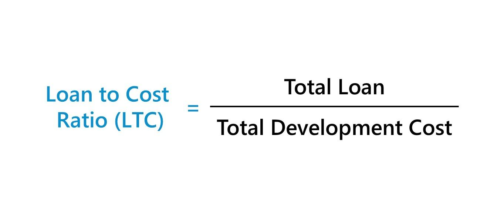

## Table of Contents

## What is the Loan-to-Cost (LTC) Ratio?

The Loan-to-Cost (LTC) Ratio is a financial term used in real estate to figure out how much money a lender is willing to loan for a project compared to the total cost of that project. It's calculated by dividing the loan amount by the total cost of the project, including the purchase price of the land and all construction costs. If the total cost of a project is $1 million and the lender agrees to loan $800,000, the LTC ratio would be 80%.

Lenders use the LTC ratio to assess the risk of a real estate project. A higher LTC ratio means the lender is providing a larger portion of the project's cost, which could be riskier for them. On the other hand, a lower LTC ratio means the borrower is putting more of their own money into the project, which might make the lender feel more secure. The acceptable LTC ratio can vary, but it often ranges between 65% to 85% depending on the lender and the specifics of the project.

## Why is the LTC Ratio important in real estate?

The LTC Ratio is important in real estate because it helps lenders decide how much money they are willing to loan for a project. It shows the lender how much of the total cost they will cover and how much the borrower will have to pay themselves. This ratio helps lenders understand the risk of the project. If the LTC Ratio is high, it means the lender is putting up more money, which could be riskier for them. If the LTC Ratio is low, it means the borrower is putting in more of their own money, which might make the lender feel safer about the loan.

Understanding the LTC Ratio also helps borrowers know how much they need to invest in a project. If a lender will only cover a certain percentage of the total cost, the borrower needs to find the rest of the money themselves. This can affect whether a project is even possible to start. The LTC Ratio can vary a lot depending on the lender and the project, but it's a key number that both lenders and borrowers look at when planning a real estate project.

## How do you calculate the LTC Ratio?

To calculate the Loan-to-Cost (LTC) Ratio, you need to divide the loan amount by the total cost of the project. The total cost includes the price of the land and all the costs to build whatever you're planning. For example, if you want to build a house and the land costs $200,000 and building the house costs $300,000, the total cost is $500,000. If the bank agrees to give you a loan of $400,000, you divide $400,000 by $500,000. That gives you an LTC Ratio of 0.8 or 80%.

The LTC Ratio is important because it helps the bank decide how much money they will lend you. If the ratio is high, it means the bank is lending a bigger part of the money needed for the project, which could be riskier for them. If the ratio is low, it means you are putting more of your own money into the project, which might make the bank feel safer about lending you the money. Knowing the LTC Ratio can help you plan how much money you need to start your project.

## What are the components needed to calculate the LTC Ratio?

To calculate the Loan-to-Cost (LTC) Ratio, you need to know two main things: the loan amount and the total cost of the project. The loan amount is how much money the bank or lender agrees to give you for your project. The total cost of the project includes everything you need to pay for, like the price of the land and all the costs to build whatever you're planning.

Once you have these numbers, you can find the LTC Ratio by dividing the loan amount by the total cost of the project. For example, if the total cost of your project is $500,000 and the bank agrees to loan you $400,000, you divide $400,000 by $500,000 to get an LTC Ratio of 0.8 or 80%. This ratio helps the bank understand how much of the project's cost they are covering and how much risk they are taking on.

## Can you provide an example of calculating the LTC Ratio?

Let's say you want to build a new house. The land costs $200,000 and building the house will cost $300,000. So, the total cost of your project is $500,000. You go to the bank and ask for a loan. The bank agrees to give you $400,000. To find the Loan-to-Cost (LTC) Ratio, you divide the loan amount by the total cost of the project. So, you divide $400,000 by $500,000.

This gives you an LTC Ratio of 0.8 or 80%. This means the bank is willing to cover 80% of the total cost of your project. The other 20% you have to cover yourself. The LTC Ratio is important because it helps the bank understand how much risk they are taking on. If the ratio is high, the bank is lending a bigger part of the money needed, which could be riskier for them. If the ratio is low, you are putting more of your own money into the project, which might make the bank feel safer about lending you the money.

## What is considered a good LTC Ratio for different types of real estate projects?

A good Loan-to-Cost (LTC) Ratio can be different for different types of real estate projects. For big projects like building new apartment buildings or shopping centers, banks might be okay with an LTC Ratio of around 65% to 75%. This means the bank would give you a loan for 65% to 75% of the total cost, and you would need to find the rest of the money yourself. These projects are often seen as riskier because they cost a lot of money and take a long time to finish, so banks want to be careful.

For smaller projects, like fixing up a single house to sell it, banks might be willing to give you a loan for up to 85% of the total cost. These projects are usually quicker and less risky, so banks feel more comfortable lending more money. But, the exact LTC Ratio that is considered good can change depending on the bank and the specific project. It's always a good idea to talk to your bank about what they think is a good LTC Ratio for your project.

## How does the LTC Ratio differ from the Loan-to-Value (LTV) Ratio?

The Loan-to-Cost (LTC) Ratio and the Loan-to-Value (LTV) Ratio are both important numbers in real estate, but they are used in different ways. The LTC Ratio is used when you're building something new or making big changes to a property. It looks at how much money the bank will give you compared to the total cost of your project, including the price of the land and all the building costs. If you're planning to build a new house and the total cost is $500,000, the LTC Ratio will tell you what percentage of that $500,000 the bank is willing to loan you.

On the other hand, the LTV Ratio is used when you're buying a property that's already built or finished. It compares the loan amount to the current value of the property. For example, if you want to buy a house that's worth $300,000, the LTV Ratio will show what percentage of that $300,000 the bank is willing to lend you. The LTV Ratio is important for understanding how much money you need to put down to buy the property and how much risk the bank is taking on. Both ratios help banks decide how much money to lend, but they focus on different parts of the real estate process.

## What are the risks associated with a high LTC Ratio?

A high LTC Ratio means that the bank is lending you a big part of the money you need for your project. This can be risky for the bank because if your project doesn't go well, they might not get their money back. If you can't finish the project or if it doesn't make as much money as you hoped, the bank could lose a lot. Also, if the real estate market goes down, the value of your project might be less than what you owe the bank, which is bad for both you and the bank.

For you, a high LTC Ratio means you have less of your own money in the project. This can be risky because if things go wrong, you might lose everything you put in. It also means you have more debt to pay back, which can be hard if your project doesn't make enough money. So, while a high LTC Ratio can help you start a big project with less money upfront, it comes with a lot of risks that you need to think about carefully.

## How can a borrower improve their LTC Ratio?

A borrower can improve their LTC Ratio by putting more of their own money into the project. If the total cost of your project is $500,000 and the bank is willing to loan you $400,000, your LTC Ratio is 80%. But if you can put in more money yourself, say another $50,000, the total cost stays the same but the loan amount goes down to $350,000. Now your LTC Ratio is 70%. This makes the project look less risky to the bank because you have more of your own money at stake.

Another way to improve your LTC Ratio is to find other ways to lower the total cost of your project. This could mean finding cheaper materials, negotiating better deals with builders, or even choosing a less expensive piece of land. If you can lower the total cost from $500,000 to $450,000, and the bank still agrees to loan you $400,000, your LTC Ratio goes from 80% to about 89%. But if you can also put in more of your own money, the improvement can be even better. By managing costs and increasing your own investment, you can make your project look safer and more appealing to lenders.

## What impact does the LTC Ratio have on loan approval and interest rates?

The LTC Ratio can affect whether a bank will approve your loan and what [interest rate](/wiki/interest-rate-trading-strategies) they will charge. If your LTC Ratio is high, it means the bank is lending you a big part of the money you need for your project. This can be risky for the bank because if your project doesn't go well, they might not get their money back. Because of this, banks might be less likely to approve a loan with a high LTC Ratio. They might also charge a higher interest rate to cover the extra risk they are taking on.

On the other hand, if your LTC Ratio is low, it means you are putting more of your own money into the project. This makes the project look less risky to the bank because you have more at stake. Banks are usually more likely to approve loans with a low LTC Ratio because they feel safer about getting their money back. They might also offer a lower interest rate because the risk is lower. So, having a good LTC Ratio can help you get your loan approved and save money on interest.

## How do lenders use the LTC Ratio in their decision-making process?

Lenders use the LTC Ratio to figure out how much money they should loan for a real estate project. The LTC Ratio shows them what part of the total cost they will cover and what part the borrower will pay. If the LTC Ratio is high, it means the lender is giving a big part of the money needed for the project. This can be risky for the lender because if the project doesn't go well, they might not get their money back. So, lenders might be less likely to approve a loan with a high LTC Ratio, or they might charge a higher interest rate to cover the extra risk.

On the other hand, if the LTC Ratio is low, it means the borrower is putting more of their own money into the project. This makes the project look less risky to the lender because the borrower has more at stake. Lenders are usually more likely to approve loans with a low LTC Ratio because they feel safer about getting their money back. They might also offer a lower interest rate because the risk is lower. So, the LTC Ratio helps lenders decide if they should approve a loan and what interest rate to charge.

## What are the industry standards and trends regarding LTC Ratios for commercial and residential projects?

In the real estate industry, the standards for Loan-to-Cost (LTC) Ratios can be different for commercial and residential projects. For commercial projects like building new apartment buildings or shopping centers, lenders usually see an LTC Ratio of around 65% to 75% as good. These projects are often seen as riskier because they cost a lot of money and take a long time to finish. So, lenders want to be careful and make sure the borrower has enough of their own money in the project. The exact LTC Ratio can change depending on the lender and the specifics of the project, but this range is common.

For residential projects, like fixing up a single house to sell it, lenders might be willing to give a loan for up to 85% of the total cost. These projects are usually quicker and less risky, so lenders feel more comfortable lending more money. Trends in the industry show that lenders are paying more attention to the LTC Ratio because it helps them understand how much risk they are taking on. If the real estate market is doing well, lenders might be more willing to approve loans with higher LTC Ratios. But if the market is not doing well, they might be more careful and prefer lower LTC Ratios.

## What is the Loan-to-Cost (LTC) Ratio and how can it be explored?

The Loan-to-Cost (LTC) ratio is an essential metric in real estate finance, serving as a critical tool for investors and lenders to assess the feasibility of a real estate project. It is defined as the ratio of the loan amount to the overall cost of the project. Mathematically, it is expressed as:

$$
\text{LTC Ratio} = \frac{\text{Loan Amount}}{\text{Total Project Cost}}
$$

Total project cost encompasses all expenditures related to the development or acquisition of a property, including land acquisition, construction costs, labor, permits, and other associated expenses. A key aspect of the LTC ratio is its ability to indicate the level of financial leverage being employed in a project. A higher LTC ratio suggests higher leverage, indicating greater financial risk and potential return, while a lower LTC ratio suggests a more conservative approach with reduced risk.

The LTC ratio is distinct from the Loan-to-Value (LTV) ratio, another prevalent financial metric. The LTV ratio assesses the loan amount as a proportion of the property's appraised value or market value rather than the total project cost. While the LTV ratio focuses on valuation, the LTC ratio provides insight into the actual costs incurred during development, offering a more comprehensive understanding of a project's financial structure.

In practical applications, the LTC ratio is used by lenders to determine the maximum loan amount they are willing to offer for a project. For instance, if a project's total cost is $1,000,000 and a lender agrees to finance 80% of these costs, the LTC ratio would be 80%. This means the lender is providing $800,000, and the remaining $200,000 must be funded by the developer or through alternative financing.

Consider a scenario where a developer aims to construct a new residential complex with projected costs totaling $10 million. The developer seeks financing and approaches a bank. After evaluating the project's specifics, the bank agrees to cover 70% of the total project cost, resulting in an LTC ratio of 70%. This implies the developer needs to secure the remaining 30%, either through equity investment or other financing means.

Such calculations are pivotal in decision-making processes, as they influence both the project's financing strategy and the risk assessment criteria applied by lenders. Understanding the LTC ratio allows stakeholders to align financial strategies with project objectives and market conditions, ensuring a balanced approach to managing potential returns and risks.

## What are the challenges and considerations?

Incorporating Loan-to-Cost (LTC) ratios into [algorithmic trading](/wiki/algorithmic-trading) systems presents several challenges that stakeholders must carefully navigate. One significant issue is data accuracy. Accurate and timely data are crucial for the effectiveness of algorithmic trading strategies. The LTC ratio, defined as the percentage of a project's cost financed by the loan:

$$
\text{LTC} = \left( \frac{\text{Loan Amount}}{\text{Total Project Cost}} \right) \times 100
$$

relies heavily on precise input data. Discrepancies in either the total project cost or the amount financed can lead to incorrect LTC calculations, potentially skewing the results and leading to suboptimal trading strategies.

Market [volatility](/wiki/volatility-trading-strategies) further compounds this challenge. Real estate markets can be unpredictable, with significant fluctuations due to economic, political, or environmental factors. These fluctuations can rapidly alter project valuations and cost structures, affecting the LTC ratio's relevance and utility. Algorithms must be designed to quickly adapt to these changes or risk becoming obsolete.

Ethical and regulatory considerations represent another critical aspect. The use of algorithms in real estate financing must adhere to existing financial regulations. Algorithms must be transparent and auditable, ensuring compliance with laws intended to prevent market manipulation or discrimination. Moreover, ethical considerations such as fairness and the potential impact on the broader market should guide the development and implementation of these algorithms.

Balancing algorithmic efficiency with human oversight is essential for mitigating risks associated with automated systems in real estate financing. While algorithms can process vast amounts of data more quickly than humans, they may overlook qualitative factors or unprecedented market conditions. Human experts can provide valuable insights and context that algorithms might miss, ensuring that decisions are grounded in both quantitative and qualitative analysis.

Python, a widely used programming language in financial modeling, can be employed to simulate scenarios and evaluate the impact of different LTC ratios on investment strategies. Here’s a simple Python example to simulate an LTC scenario:

```python
def calculate_ltc(loan_amount, project_cost):
    try:
        return (loan_amount / project_cost) * 100
    except ZeroDivisionError:
        return "Total project cost cannot be zero."

loan_amount = 800000
project_cost = 1000000
ltc_ratio = calculate_ltc(loan_amount, project_cost)

print(f"The LTC ratio is: {ltc_ratio:.2f}%")
```

The code snippet calculates the LTC ratio, emphasizing the necessity of non-zero project costs to avoid errors. This simple simulation underscores the role of algorithms in automating and improving decision-making processes, while also highlighting the importance of input data integrity.

Ultimately, the integration of LTC ratios into algorithmic trading systems requires careful consideration of these challenges and a robust framework that balances technological capabilities with human expertise, regulatory compliance, and ethical considerations.

## References & Further Reading

[1]: Bergstra, J., Bardenet, R., Bengio, Y., & Kégl, B. (2011). ["Algorithms for Hyper-Parameter Optimization."](https://dl.acm.org/doi/10.5555/2986459.2986743) Advances in Neural Information Processing Systems 24.

[2]: ["Advances in Financial Machine Learning"](https://www.amazon.com/Advances-Financial-Machine-Learning-Marcos/dp/1119482089) by Marcos Lopez de Prado

[3]: ["Evidence-Based Technical Analysis: Applying the Scientific Method and Statistical Inference to Trading Signals"](https://www.amazon.com/Evidence-Based-Technical-Analysis-Scientific-Statistical/dp/0470008741) by David Aronson

[4]: ["Machine Learning for Algorithmic Trading"](https://github.com/stefan-jansen/machine-learning-for-trading) by Stefan Jansen

[5]: ["Quantitative Trading: How to Build Your Own Algorithmic Trading Business"](https://books.google.com/books/about/Quantitative_Trading.html?id=j70yEAAAQBAJ) by Ernest P. Chan