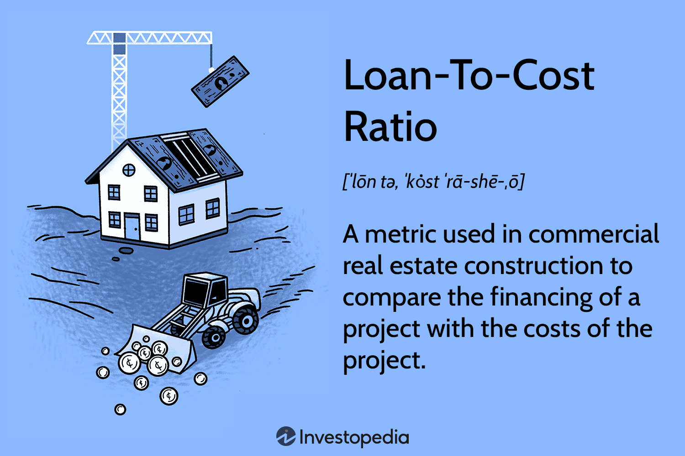

Real estate financing is a cornerstone of property investment, providing the necessary capital for purchasing, developing, or refinancing real estate assets. At its core, it involves a range of financial arrangements that enable the acquisition or improvement of property, typically through loans secured by the property itself. A critical metric within this domain is the Loan-to-Cost (LTC) ratio, which measures the proportion of loan financing against the total cost of the real estate project. The LTC ratio is crucial for assessing the feasibility and risk associated with property investments, as it helps both investors and lenders determine the level of financial leverage and potential return on investment.

Algorithmic trading, on the other hand, represents a transformative progression in the financial markets. It involves the use of computer algorithms to execute trading decisions autonomously, based on pre-defined criteria. This method of trading is characterized by its ability to process vast amounts of data at high speeds, thereby increasing market efficiency and liquidity. As financial markets evolve, the confluence of algorithmic trading with various investment sectors, including real estate, becomes increasingly significant.



The intersection of real estate financing and algorithmic trading represents a paradigm shift in investment strategies. Advances in technology are enabling investors to integrate quantitative data analysis and machine learning algorithms into real estate decision-making processes. This amalgamation allows for enhanced evaluation of financial metrics like the LTC ratio, optimizing investment portfolios and improving risk management.

The objective of this article is to explore the role and implications of the LTC ratio within the sphere of real estate financing and its integration into algorithmic trading strategies. By examining how these two domains interact, this analysis aims to provide insights into the innovative ways technology is reshaping real estate investments.

The article is structured as follows: it begins with an exploration of the fundamentals of real estate financing, followed by a detailed discussion on the Loan-to-Cost ratio and its application. The article then transitions into a discussion on algorithmic trading in real estate and the synergies between the LTC ratio and algorithmic approaches. It concludes by addressing the challenges and considerations associated with these innovations, providing a comprehensive understanding of the future of real estate financing.

## Table of Contents

## Understanding Real Estate Financing

Real estate financing serves as the foundation for property investment and development, encompassing a variety of traditional and modern methods to secure the necessary capital. It involves complex financial structures and key components that aid in the facilitation of property transactions and developments.

**Traditional Methods and Emerging Trends**

Traditional real estate financing relies heavily on mortgages, which provide a long-term loan secured against the property itself. Lenders assess the borrower's creditworthiness and the property's value to approve the loan amount, often demanding a down payment. In contrast, emerging trends in real estate financing incorporate alternative funding sources such as real estate investment trusts (REITs), crowdfunding, and peer-to-peer lending platforms. These innovations allow for more flexible and diversified funding options, enabling smaller investors to participate and enhancing [liquidity](/wiki/liquidity-risk-premium) in real estate markets.

**Components of Real Estate Financing**

1. **Loans and Mortgages**: Central to real estate financing is the loan structure, which can vary from fixed-rate mortgages, where the interest rate remains constant, to adjustable-rate mortgages, which adjust based on market changes. A critical component is the interest rate, influencing the overall cost of the loan and derived from factors like market conditions, lender policies, and borrower risk profiles.

2. **Interest Rates**: These rates are vital as they dictate the cost of borrowing capital. Various factors determine these rates, including the economic environment, inflation expectations, and monetary policy set by central banks. Lower rates typically encourage borrowing and investment, while higher rates may deter it.

3. **Valuation**: Accurate property valuation is essential in assessing loan amounts and risks. Appraisal methods, such as the sales comparison approach, income approach, and cost approach, provide estimates of a property's market value. These valuations influence the loan terms and conditions provided by lenders.

**Stakeholders in the Financing Process**

The financing process involves several stakeholders, each playing a crucial role in shaping the investment landscape:

- **Lenders**: Typically banks or financial institutions, they provide the capital required for real estate transactions. They assess the risk and determine the loan terms, interest rates, and collateral needed.

- **Investors**: These include individuals, corporations, or entities that seek returns from real estate investments. Their participation may range from direct ownership of properties to investments in real estate funds or securities.

- **Developers**: They are responsible for the conceptualization and execution of real estate projects. Developers often require substantial funding to acquire land, secure permits, and manage construction, relying on financial institutions and investors to support these endeavors.

By understanding these components and stakeholder roles, participants in the real estate market can make informed decisions and optimize their financing strategies.

## Exploring the Loan-to-Cost (LTC) Ratio

The Loan-to-Cost (LTC) ratio is an essential metric in real estate finance, serving as a critical tool for investors and lenders to assess the feasibility of a real estate project. It is defined as the ratio of the loan amount to the overall cost of the project. Mathematically, it is expressed as:

$$
\text{LTC Ratio} = \frac{\text{Loan Amount}}{\text{Total Project Cost}}
$$

Total project cost encompasses all expenditures related to the development or acquisition of a property, including land acquisition, construction costs, labor, permits, and other associated expenses. A key aspect of the LTC ratio is its ability to indicate the level of financial leverage being employed in a project. A higher LTC ratio suggests higher leverage, indicating greater financial risk and potential return, while a lower LTC ratio suggests a more conservative approach with reduced risk.

The LTC ratio is distinct from the Loan-to-Value (LTV) ratio, another prevalent financial metric. The LTV ratio assesses the loan amount as a proportion of the property's appraised value or market value rather than the total project cost. While the LTV ratio focuses on valuation, the LTC ratio provides insight into the actual costs incurred during development, offering a more comprehensive understanding of a project's financial structure.

In practical applications, the LTC ratio is used by lenders to determine the maximum loan amount they are willing to offer for a project. For instance, if a project's total cost is $1,000,000 and a lender agrees to finance 80% of these costs, the LTC ratio would be 80%. This means the lender is providing $800,000, and the remaining $200,000 must be funded by the developer or through alternative financing.

Consider a scenario where a developer aims to construct a new residential complex with projected costs totaling $10 million. The developer seeks financing and approaches a bank. After evaluating the project's specifics, the bank agrees to cover 70% of the total project cost, resulting in an LTC ratio of 70%. This implies the developer needs to secure the remaining 30%, either through equity investment or other financing means.

Such calculations are pivotal in decision-making processes, as they influence both the project's financing strategy and the risk assessment criteria applied by lenders. Understanding the LTC ratio allows stakeholders to align financial strategies with project objectives and market conditions, ensuring a balanced approach to managing potential returns and risks.

## Algorithmic Trading in Real Estate

Algorithmic trading, often referred to as algo-trading, involves the use of computer algorithms to execute and manage trading decisions with minimal human intervention. These algorithms can execute trades at speeds and frequencies that are impossible for human traders, taking advantage of even the smallest price discrepancies across markets. Originally developed for financial markets such as equities and foreign exchange, [algorithmic trading](/wiki/algorithmic-trading) has become increasingly sophisticated, employing complex mathematical models and real-time data analysis.

In recent years, there has been a burgeoning interest in extending algorithmic trading strategies to real estate investments and financing. This integration of algorithmic trading in real estate is facilitated by advances in technology, data availability, and analytic capabilities. Unlike traditional markets where transactions can be executed almost instantaneously, real estate deals involve longer timeframes and more complex due diligence processes. However, algorithms can still streamline various stages of property investment, particularly in the aspects of market analysis, property valuation, and risk assessment.

One of the primary advantages of algorithmic systems in real estate is the increased efficiency in processing vast amounts of data. Algorithms can swiftly analyze property-related data, such as price trends, rental yields, and demographic information, to identify potential investment opportunities. This type of analysis enables investors to make informed decisions based on comprehensive market intelligence rather than relying solely on intuition or historical performance.

Moreover, algorithms offer the resilience to rapidly adapt to market changes. Real estate markets can be influenced by a multitude of factors, including economic shifts, policy changes, and local market dynamics. Algorithmic trading systems can continuously update their models and assumptions in response to new information, ensuring that investment strategies remain relevant and timely. This capability is particularly beneficial in real estate financing, where market conditions can impact interest rates, available capital, and overall investment returns.

In summary, the deployment of algorithmic trading in the real estate sector is transforming investment strategies by enhancing the speed, accuracy, and adaptability of market analyses. With the continued evolution of data technologies and [artificial intelligence](/wiki/ai-artificial-intelligence), algorithmic approaches are likely to gain further prominence, providing investors with more sophisticated tools to navigate the complexities of real estate financing.

## Synergies Between LTC Ratio and Algorithmic Trading

The Loan-to-Cost (LTC) ratio, a crucial metric in real estate financing, measures the proportion of a loan to the total cost of a property investment. Its integration into algorithmic trading models presents opportunities to optimize real estate portfolios through enhanced efficiency and informed decision-making.

### Incorporating LTC Ratio in Algorithmic Trading Models

Algorithmic trading models can incorporate the LTC ratio by using it to evaluate potential investments based on risk and return profiles. These models rely on historical and real-time data to analyze various financial metrics, including the LTC ratio, to spot lucrative investment opportunities or divestiture points. By maintaining an ideal LTC ratio, algorithms balance the amount of leverage used in investments while minimizing financial risks. 

One common way to execute this is through [machine learning](/wiki/machine-learning) algorithms that process vast amounts of data to learn patterns and predict outcomes. Python, widely used in financial industry applications, offers libraries like NumPy, pandas, and scikit-learn, that can be employed to build models that take the LTC ratio into consideration. For example:

```python
import numpy as np
import pandas as pd
from sklearn.linear_model import LinearRegression

# Sample data representing project costs and loan amounts
data = {
    'project_cost': [1000000, 1500000, 2000000, 2500000],
    'loan_amount': [700000, 1050000, 1400000, 1750000]
}

# Calculate the LTC ratio
df = pd.DataFrame(data)
df['LTC_ratio'] = df['loan_amount'] / df['project_cost']

# Use the LTC ratio as a feature for a predictive model
X = df['LTC_ratio'].values.reshape(-1, 1)
y = np.array([0.5, 0.6, 0.7, 0.8])  # Example target variable

model = LinearRegression()
model.fit(X, y)
predictions = model.predict(X)
```

In this simplified example, the LTC ratio is used as an input variable to a linear regression model. More sophisticated models would involve additional features and hyperparameter optimization to improve predictive accuracy.

### Enhancing Financial Analysis and Decision-Making

Automated systems, leveraging the LTC ratio, can vastly enhance the speed and accuracy of financial analysis and decision-making. Algorithms can perform real-time monitoring, adjusting investment strategies to align with market dynamics swiftly. This capability allows investors to capitalize on fleeting opportunities and mitigate risks associated with unexpected market shifts.

Furthermore, integrating LTC ratios with other financial metrics via algorithms helps improve portfolio diversification strategies. By calculating optimal leverage levels and comparing them to historical benchmarks, systems can propose portfolio adjustments that uphold investment goals with minimal risk exposure.

### Successful Strategies and Case Studies

A practical example of successfully integrating the LTC ratio into algorithmic trading is the strategy used by data-driven investment firms that blend conventional financial analysis with machine learning techniques. One notable case would be utilizing the LTC ratio to evaluate the leverage of potential real estate investments and optimizing [interest rate](/wiki/interest-rate-trading-strategies) exposure across a portfolio. 

The use of LTC-based models is particularly effective in volatile markets where traditional decision-making lags. Real-time data analysis ensures that portfolios maintain appropriate leverages, maximizing returns while minimizing risk. For instance, during periods of economic uncertainty, adjusting LTC ratio thresholds dynamically based on forecasted market conditions leads to more resilient investment strategies.

In summary, incorporating the LTC ratio into algorithmic trading models facilitates a strategic advantage by optimizing real estate portfolios through advanced analytics and real-time responsiveness. This integration revolutionizes traditional investment approaches and sets a precedent for future innovations in real estate finance.

## Challenges and Considerations

Incorporating Loan-to-Cost (LTC) ratios into algorithmic trading systems presents several challenges that stakeholders must carefully navigate. One significant issue is data accuracy. Accurate and timely data are crucial for the effectiveness of algorithmic trading strategies. The LTC ratio, defined as the percentage of a project's cost financed by the loan:

$$
\text{LTC} = \left( \frac{\text{Loan Amount}}{\text{Total Project Cost}} \right) \times 100
$$

relies heavily on precise input data. Discrepancies in either the total project cost or the amount financed can lead to incorrect LTC calculations, potentially skewing the results and leading to suboptimal trading strategies.

Market [volatility](/wiki/volatility-trading-strategies) further compounds this challenge. Real estate markets can be unpredictable, with significant fluctuations due to economic, political, or environmental factors. These fluctuations can rapidly alter project valuations and cost structures, affecting the LTC ratio's relevance and utility. Algorithms must be designed to quickly adapt to these changes or risk becoming obsolete.

Ethical and regulatory considerations represent another critical aspect. The use of algorithms in real estate financing must adhere to existing financial regulations. Algorithms must be transparent and auditable, ensuring compliance with laws intended to prevent market manipulation or discrimination. Moreover, ethical considerations such as fairness and the potential impact on the broader market should guide the development and implementation of these algorithms.

Balancing algorithmic efficiency with human oversight is essential for mitigating risks associated with automated systems in real estate financing. While algorithms can process vast amounts of data more quickly than humans, they may overlook qualitative factors or unprecedented market conditions. Human experts can provide valuable insights and context that algorithms might miss, ensuring that decisions are grounded in both quantitative and qualitative analysis.

Python, a widely used programming language in financial modeling, can be employed to simulate scenarios and evaluate the impact of different LTC ratios on investment strategies. Here’s a simple Python example to simulate an LTC scenario:

```python
def calculate_ltc(loan_amount, project_cost):
    try:
        return (loan_amount / project_cost) * 100
    except ZeroDivisionError:
        return "Total project cost cannot be zero."

loan_amount = 800000
project_cost = 1000000
ltc_ratio = calculate_ltc(loan_amount, project_cost)

print(f"The LTC ratio is: {ltc_ratio:.2f}%")
```

The code snippet calculates the LTC ratio, emphasizing the necessity of non-zero project costs to avoid errors. This simple simulation underscores the role of algorithms in automating and improving decision-making processes, while also highlighting the importance of input data integrity.

Ultimately, the integration of LTC ratios into algorithmic trading systems requires careful consideration of these challenges and a robust framework that balances technological capabilities with human expertise, regulatory compliance, and ethical considerations.

## Conclusion

In conclusion, this article has outlined the integral role of the Loan-to-Cost (LTC) ratio in augmenting investment outcomes, particularly when synergized with algorithmic trading techniques. The LTC ratio serves as a crucial assessment tool for determining the financial viability of property investments by providing a clear picture of the loan amount relative to the total project cost. Its application extends beyond traditional analysis, becoming a vital component in algorithmic models that can optimize real estate portfolios by enhancing accuracy in cost assessments and investment decisions.

Reflecting on the future of real estate financing, technology's transformative power is evident in its ability to revolutionize investment strategies. The use of algorithms not only increases efficiency but also offers the agility required to swiftly respond to market fluctuations. As technology continues to advance, it paves the way for more sophisticated financial instruments and strategies, promising a shift towards data-driven, automated investment processes that minimize human error and maximize returns.

Investors and real estate professionals are encouraged to embrace the integration of LTC ratios into algorithmic systems. By leveraging these sophisticated tools, stakeholders can obtain a deeper understanding of market dynamics, evaluate projects more effectively, and execute trades with heightened precision. The intersection of LTC ratios and algorithmic trading represents a burgeoning frontier in real estate financing, offering a pathway to improved investment outcomes in an increasingly digital era.

## References & Further Reading

[1]: Bergstra, J., Bardenet, R., Bengio, Y., & Kégl, B. (2011). ["Algorithms for Hyper-Parameter Optimization."](https://dl.acm.org/doi/10.5555/2986459.2986743) Advances in Neural Information Processing Systems 24.

[2]: ["Advances in Financial Machine Learning"](https://www.amazon.com/Advances-Financial-Machine-Learning-Marcos/dp/1119482089) by Marcos Lopez de Prado

[3]: ["Evidence-Based Technical Analysis: Applying the Scientific Method and Statistical Inference to Trading Signals"](https://www.amazon.com/Evidence-Based-Technical-Analysis-Scientific-Statistical/dp/0470008741) by David Aronson

[4]: ["Machine Learning for Algorithmic Trading"](https://github.com/stefan-jansen/machine-learning-for-trading) by Stefan Jansen

[5]: ["Quantitative Trading: How to Build Your Own Algorithmic Trading Business"](https://books.google.com/books/about/Quantitative_Trading.html?id=j70yEAAAQBAJ) by Ernest P. Chan