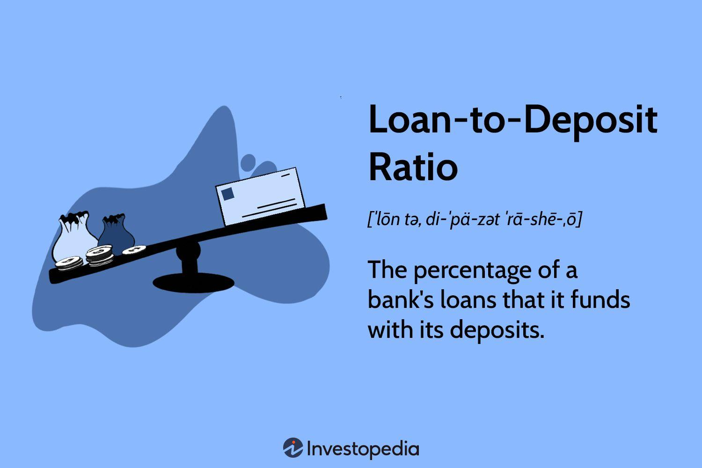

## Table of Contents

## What is the Loan-to-Deposit Ratio (LDR)?

The Loan-to-Deposit Ratio (LDR) is a simple way to see how much a bank is lending out compared to the money it has from deposits. It's like a score that tells us if a bank is using the money people give it wisely. To find the LDR, you take the total amount of loans the bank has given out and divide it by the total amount of money people have put into the bank. Then, you multiply that number by 100 to get a percentage.

This ratio is important because it helps us understand if a bank is being too risky or too safe with the money it holds. If the LDR is high, it means the bank is lending out a lot of the money it has, which could be risky if people suddenly want their money back. If the LDR is low, it means the bank is keeping a lot of money in reserve, which is safer but might mean they're not making as much money from loans. Banks and regulators watch this ratio to make sure the bank stays healthy and can meet its customers' needs.

## Why is the Loan-to-Deposit Ratio important for banks?

The Loan-to-Deposit Ratio is really important for banks because it shows how well they are managing the money that people give them. When people put their money into a bank, the bank uses that money to give out loans to others. The LDR tells the bank if it's lending out too much or too little of this money. If the ratio is too high, it means the bank is giving out a lot of loans, which can be risky. If everyone who put money in the bank wants it back at the same time, the bank might not have enough money to give back because it's all lent out.

On the other hand, if the LDR is too low, it means the bank is not lending out much of the money it has. This can be safer because the bank has more money to give back to people if they need it. But, it also means the bank is not making as much money from loans, which is how banks usually make their profits. So, banks need to find a good balance with their LDR to make sure they are safe but also making money. Regulators also watch this ratio to make sure banks are not taking too many risks with people's money.

## How is the Loan-to-Deposit Ratio calculated?

The Loan-to-Deposit Ratio, or LDR, is calculated by taking the total amount of loans a bank has given out and dividing it by the total amount of money people have put into the bank. Once you have that number, you multiply it by 100 to turn it into a percentage. So, if a bank has given out $80 million in loans and people have put in $100 million, the LDR would be ($80 million / $100 million) * 100, which equals 80%.

This ratio helps banks and the people who watch over them to see if the bank is using the money wisely. A high LDR might mean the bank is lending out too much of the money it has, which could be risky if everyone wants their money back at the same time. A low LDR might mean the bank is being too cautious and not making as much money from loans as it could. Finding the right balance is important for the bank to stay healthy and profitable.

## What is considered a healthy Loan-to-Deposit Ratio?

A healthy Loan-to-Deposit Ratio (LDR) for a bank is usually between 80% and 90%. This means that for every dollar people put into the bank, the bank lends out 80 to 90 cents. This range is seen as a good balance because it shows the bank is using the money to make loans and earn interest, but it's also keeping enough money in reserve to give back to people if they need it.

If the LDR is too high, like over 90%, it could mean the bank is lending out too much of the money it has. This can be risky because if everyone wants their money back at the same time, the bank might not have enough to give back. On the other hand, if the LDR is too low, like under 80%, it might mean the bank is being too cautious. While this is safer, it also means the bank isn't making as much money from loans, which is how banks make their profits. So, a healthy LDR helps the bank stay safe and profitable at the same time.

## How does the Loan-to-Deposit Ratio affect a bank's liquidity?

The Loan-to-Deposit Ratio (LDR) directly affects a bank's liquidity, which is how easily the bank can give people their money back when they want it. If the LDR is high, it means the bank has lent out a lot of the money it has from deposits. This can make it harder for the bank to have enough cash on hand if many people suddenly want to take their money out. A high LDR could lead to liquidity problems because the bank has less money available to meet these withdrawal demands.

On the other hand, if the LDR is low, it means the bank is keeping more money in reserve and not lending out as much. This makes the bank more liquid because it has more cash readily available to give back to people who want their money. A lower LDR helps the bank stay safer in terms of liquidity, but it also means the bank might not be making as much money from loans. So, finding a good balance with the LDR is important for the bank to manage its liquidity well while still being profitable.

## What are the regulatory standards for the Loan-to-Deposit Ratio?

Regulatory standards for the Loan-to-Deposit Ratio vary from country to country, but they all aim to make sure banks don't take too many risks with people's money. In the United States, for example, the Federal Reserve and other regulators keep a close eye on banks' LDR to ensure they are lending responsibly. There isn't a strict rule saying the LDR must be a certain number, but if a bank's LDR gets too high, like over 100%, regulators might step in to check if the bank is being too risky.

In the European Union, the European Central Bank sets guidelines for banks to follow. They might not have a specific LDR limit, but they look at the overall health of the bank, including its LDR, to make sure it's safe. If a bank's LDR is too high, it could mean the bank is lending out more money than it has in deposits, which can be risky. Regulators want to make sure banks have enough money to give back to people if they need it, so they watch the LDR carefully.

## How can a high Loan-to-Deposit Ratio impact a bank's operations?

A high Loan-to-Deposit Ratio means a bank is lending out a lot of the money people put into it. This can make it hard for the bank to have enough cash on hand if many people suddenly want their money back. If the bank doesn't have enough money to give back, it can lead to big problems. People might lose trust in the bank and take their money out even faster, which can cause the bank to run into serious trouble. This is called a bank run, and it can be very dangerous for the bank's operations.

Also, a high LDR can make regulators worried. They might think the bank is taking too many risks with the money it holds. If regulators see a bank's LDR is too high, they might step in and tell the bank to change how it's doing things. This could mean the bank has to stop lending so much or get more money from other places. All these changes can affect how the bank runs every day, making it harder for the bank to do business and make money.

## What strategies can banks use to manage their Loan-to-Deposit Ratio?

Banks can manage their Loan-to-Deposit Ratio by changing how much they lend out. If the LDR is too high, they might decide to give out fewer loans. This means they keep more money in the bank, so they can give it back to people who want it. Banks can also look for other ways to get money, like selling some of their loans to other banks or investors. This helps them have more cash on hand without having to stop lending completely.

Another way banks can manage their LDR is by trying to get more money from people through deposits. They might offer higher interest rates to attract more customers to put their money in the bank. This way, they have more money to lend out without making the LDR too high. Banks need to find a good balance so they can keep lending and making money, but also stay safe and ready to give people their money back when they need it.

## How does the Loan-to-Deposit Ratio differ across various countries?

The Loan-to-Deposit Ratio can be different in different countries because each country has its own rules and ways of doing things. In some countries, banks might be allowed to lend out more of the money they have from deposits, which makes their LDR higher. For example, in the United States, banks often have an LDR around 80% to 90%, which means they lend out a lot of the money people give them. But the rules can change, and if a bank's LDR gets too high, regulators might step in to make sure the bank is not taking too many risks.

In other countries, like those in the European Union, banks might be more careful about how much they lend out. Their LDR might be lower, around 70% to 80%, because they want to keep more money in reserve. This can make the banks safer, but it also means they might not make as much money from loans. Each country's regulators watch the LDR to make sure banks are lending responsibly and have enough money to give back to people if they need it.

## Can the Loan-to-Deposit Ratio predict financial crises?

The Loan-to-Deposit Ratio can be a helpful sign that a financial crisis might be coming. If a bank's LDR is very high, it means the bank is lending out a lot of the money people give it. This can be risky because if everyone suddenly wants their money back, the bank might not have enough cash to give back to everyone. When many banks have high LDRs at the same time, it can be a warning that the whole financial system is under stress and might be heading toward a crisis.

But, the LDR alone can't tell us for sure if a crisis is coming. It's just one piece of the puzzle. Other things like how much money people owe, how well the economy is doing, and what regulators are doing also matter. So, while a high LDR can be a warning sign, it's important to look at lots of different information to really understand if a financial crisis is likely to happen.

## How do changes in monetary policy affect the Loan-to-Deposit Ratio?

Changes in monetary policy can have a big effect on a bank's Loan-to-Deposit Ratio. When the central bank, like the Federal Reserve in the U.S., decides to lower interest rates, it becomes cheaper for banks to borrow money. This can make banks want to lend out more money because they can make more loans without it costing them as much. As a result, the LDR might go up because banks are lending out a bigger part of the money they have from deposits. On the other hand, if the central bank raises interest rates, it costs banks more to borrow money. This might make them lend out less, which could lower the LDR because they're keeping more money in reserve.

Also, when the central bank changes how much money banks need to keep in reserve, it can change the LDR too. If the central bank says banks can keep less money in reserve, banks might lend out more of the money they have from deposits. This would make the LDR go up. But if the central bank says banks need to keep more money in reserve, banks might lend out less, and the LDR could go down. So, the LDR can move up or down depending on what the central bank does with interest rates and reserve requirements.

## What are the implications of a low Loan-to-Deposit Ratio for a bank's profitability?

A low Loan-to-Deposit Ratio means a bank is not lending out much of the money people put into it. This can make the bank safer because it has more money to give back to people if they need it. But, it can also mean the bank is not making as much money as it could. Banks make most of their money by lending out money and charging interest on those loans. If a bank is not lending out much, it's not making as much interest, which can hurt its profits.

So, a low LDR can be good for keeping the bank safe, but it's not so good for making money. If a bank wants to be more profitable, it might need to find a way to lend out more money without making the LDR too high. This can be tricky because the bank needs to balance being safe with making money. If it can't find the right balance, the bank might struggle to make enough profit to stay healthy and grow.

## What is the Loan-to-Deposit Ratio (LDR) and how is it understood?

The Loan-to-Deposit Ratio (LDR) is a critical financial metric that assesses a bank's liquidity by examining the ratio of total loans to total deposits. This ratio indicates how well a bank utilizes its deposits to issue loans, essentially providing insights into the bank's profitability and risk level. The formula for calculating the LDR is straightforward:

$$
\text{LDR} = \left( \frac{\text{Total Loans}}{\text{Total Deposits}} \right) \times 100
$$

A higher LDR suggests that a bank is issuing more loans relative to its deposits. This can indicate robust lending activity and potential profitability through interest income. However, it may also pose [liquidity](/wiki/liquidity-risk-premium) risk if the bank faces unexpected withdrawals or funding demands and does not have sufficient reserves. Conversely, a lower LDR implies higher liquidity, as more deposits are held in reserve. This may ensure the bank can meet sudden withdrawal requests but could reflect missed opportunities for generating income through loans.

The ideal LDR is generally considered to be between 75% and 90%. This range strikes a balance between optimizing the bank's earnings through lending activities and maintaining enough liquidity to handle unforeseen outflows or financial stress scenarios. Banks with an LDR within this range are often perceived as maintaining a prudent but profitable lending strategy. 

Ultimately, the LDR is a versatile tool that provides stakeholders with pertinent information about a bank's financial management and risk posture. It serves as a vital indicator for investors, analysts, and regulators in evaluating the bank's operational efficiency and stability.

## What are Example Calculations and Industry Comparisons?

To calculate the Loan-to-Deposit Ratio (LDR), use the following formula: 

$$
\text{LDR} = \left( \frac{\text{Total Loans}}{\text{Total Deposits}} \right) \times 100
$$

This percentage provides a clear view of how much of a bank's deposits are converted into loans, indicating the bank's lending efficiency and liquidity position. For instance, if a bank has $900 million in total loans and $1 billion in total deposits, the LDR would be:

$$
\text{LDR} = \left( \frac{900,000,000}{1,000,000,000} \right) \times 100 = 90\%
$$

This example suggests the bank loans out 90% of its deposits, indicating an aggressive lending strategy while maintaining an adequate liquidity buffer.

Analysts often compare LDRs across banks within the same region or sector to unearth strategic tendencies. For example, during stable economic periods, banks in emerging markets may exhibit higher LDRs due to greater lending opportunities and growth prospects, demonstrating an aggressive approach to market expansion. Conversely, banks in developed economies might show more conservative LDRs, focusing on stability and risk aversion.

It's important to note that regional economic conditions and regulatory frameworks heavily influence these ratios. For example, European banks might adhere to stricter regulatory capital requirements compared to banks in Asia, leading to conservative LDR benchmarks. Through these comparisons, stakeholders can infer the risk appetite and operational strategies of different banking institutions.

## References & Further Reading

[1]: Baum, C.F., Caglayan, M., Schäfer, D., & Talavera, O. (2017). ["The Impact of ECB Monetary Policy Decisions and Communication on the Yield Curve,"](https://www.jstor.org/stable/27784180) Economic Systems, 41(4), 569-586.

[2]: ["The New Lombard Street: How the Fed Became the Dealer of Last Resort"](https://www.jstor.org/stable/j.ctt7sgxz) by Perry Mehrling

[3]: Minsky, H.P. (1992). ["The Financial Instability Hypothesis,"](https://www.semanticscholar.org/paper/The-Financial-Instability-Hypothesis-Minsky/40ad103b47edecf776df8fea2f362bc52cc724f4) Working Paper No. 74. Levy Economics Institute.

[4]: ["Algorithmic Trading and DMA: An Introduction to Direct Access Trading Strategies"](https://archive.org/details/algorithmictradi0000john) by Barry Johnson

[5]: ["Banking, Liquidity and Bank Runs in an Infinite Horizon Economy"](https://www.aeaweb.org/articles?id=10.1257/aer.20130665) by John A. Weinberg, Journal of Economic Theory