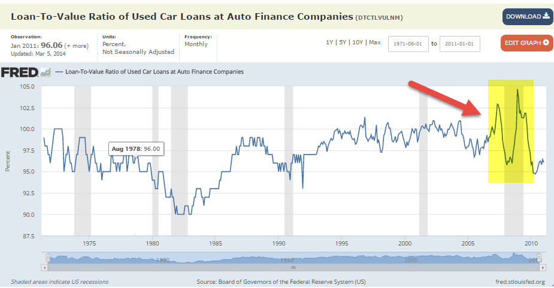

## Table of Contents

## What is the Loan-to-Value (LTV) ratio?

The Loan-to-Value (LTV) ratio is a financial term that shows the relationship between the amount of money you borrow and the value of the asset you are buying with that money. For example, if you are buying a house, the LTV ratio compares the size of your mortgage loan to the price or appraised value of the home. This ratio is important because it helps lenders decide how risky a loan is. A higher LTV ratio means you are borrowing a larger amount compared to the value of the asset, which can be riskier for the lender.

Lenders use the LTV ratio to assess the risk of a loan. If the LTV ratio is high, it means the borrower has less equity in the asset, which increases the chance that the lender might not get all their money back if the borrower cannot pay and the asset has to be sold. Generally, a lower LTV ratio is seen as safer because it shows that the borrower has more of their own money invested in the asset. This can lead to better loan terms, like lower interest rates, for the borrower.

## Why is the LTV ratio important in lending?

The LTV ratio is important in lending because it helps lenders figure out how risky a loan is. When someone wants to borrow money to buy something like a house, the lender looks at the LTV ratio to see how much of the house's value is being borrowed. If the LTV ratio is high, it means the borrower is putting down less of their own money, which makes the loan riskier. This is because if the borrower can't pay back the loan, the lender might not get all their money back when they sell the house.

Lenders use the LTV ratio to decide if they should give someone a loan and what terms to offer. A lower LTV ratio means the borrower has more of their own money invested in the asset, which is safer for the lender. Because of this, people with lower LTV ratios might get better loan terms, like lower interest rates. This makes the LTV ratio a key [factor](/wiki/factor-investing) in the lending decision and can affect how much it costs to borrow money.

## How do you calculate the LTV ratio manually?

To calculate the Loan-to-Value (LTV) ratio manually, you need two pieces of information: the amount of the loan and the value of the asset. The loan amount is how much money you are borrowing, and the value of the asset is how much the thing you are buying is worth. For example, if you are buying a house, the loan amount is your mortgage, and the value of the asset is the price of the house or its appraised value. To find the LTV ratio, you divide the loan amount by the value of the asset. Then, you multiply that number by 100 to turn it into a percentage.

Let's say you want to buy a house that costs $200,000 and you are borrowing $160,000 for the mortgage. To calculate the LTV ratio, you would divide $160,000 by $200,000, which gives you 0.8. When you multiply 0.8 by 100, you get an LTV ratio of 80%. This means you are borrowing 80% of the house's value. A lower LTV ratio, like 80%, is usually seen as less risky by lenders because it shows that you are putting more of your own money into the purchase.

## What are the basic components needed to calculate LTV in Excel?

To calculate the Loan-to-Value (LTV) ratio in Excel, you need two basic pieces of information: the loan amount and the value of the asset. The loan amount is how much money you are borrowing, and the value of the asset is how much the thing you are buying is worth. In Excel, you would enter these two numbers into separate cells. For example, you might put the loan amount in cell A1 and the value of the asset in cell B1.

Once you have the loan amount and the value of the asset entered into Excel, you can calculate the LTV ratio. To do this, you would use a formula in another cell. The formula would divide the loan amount by the value of the asset. For example, if the loan amount is in A1 and the value of the asset is in B1, you would type `=A1/B1` into a new cell, say C1, to get the LTV ratio as a decimal. To turn this into a percentage, you would then multiply by 100, so the full formula would be `=A1/B1*100`. This would give you the LTV ratio as a percentage, like 80% if you are borrowing 80% of the asset's value.

## How do you input loan amount and property value data into Excel?

To input the loan amount and property value into Excel, first open a new or existing Excel workbook. Click on the cell where you want to enter the loan amount, like cell A1. Type the loan amount into this cell, for example, if you are borrowing $160,000, just type 160000. Then, click on another cell, like B1, to enter the property value. Type the value of the property into this cell, for example, if the house costs $200,000, type 200000.

After you have entered the loan amount and property value into their respective cells, you can use these numbers to calculate the Loan-to-Value (LTV) ratio. In a new cell, like C1, you can type a formula to divide the loan amount by the property value. For example, if the loan amount is in A1 and the property value is in B1, you would type `=A1/B1` into C1. This will give you the LTV ratio as a decimal. To turn it into a percentage, you can multiply by 100, so the full formula would be `=A1/B1*100`. This will show you the LTV ratio as a percentage, like 80% if you are borrowing 80% of the property's value.

## What is the Excel formula for calculating the LTV ratio?

To calculate the Loan-to-Value (LTV) ratio in Excel, you need to know the loan amount and the value of the property. Let's say you put the loan amount in cell A1 and the property value in cell B1. In another cell, like C1, you can type a formula to find out the LTV ratio. The formula you need is `=A1/B1`. This formula divides the loan amount by the property value, giving you the LTV ratio as a decimal number.

To show the LTV ratio as a percentage, you can change the formula a bit. Instead of just `=A1/B1`, you can type `=A1/B1*100` in cell C1. This will multiply the result by 100, turning the decimal into a percentage. For example, if you are borrowing $160,000 for a house worth $200,000, the formula `=160000/200000*100` will show you an LTV ratio of 80%.

## How can you format the LTV result in Excel for better readability?

To make the LTV ratio easier to read in Excel, you can format the cell where the LTV ratio is calculated. First, click on the cell that has the LTV ratio, like cell C1. Then, go to the 'Home' tab on the top of the Excel window. Find the 'Number' section and click on the '%' symbol. This changes the number in the cell to a percentage, making it easier to understand at a glance. For example, if the LTV ratio is 0.8, it will show as 80%.

You can also make the LTV ratio stand out more by changing the number of decimal places. Click on the cell with the LTV ratio again, go to the 'Home' tab, and in the 'Number' section, click on the 'Increase Decimal' or 'Decrease Decimal' buttons to adjust how many numbers show after the decimal point. If you want the LTV ratio to look neat and clean, you might choose to show it with no decimal places, like 80% instead of 80.00%. This helps make your Excel sheet clearer and easier to read.

## What are common errors to avoid when calculating LTV in Excel?

When calculating the Loan-to-Value (LTV) ratio in Excel, one common mistake is entering the wrong numbers. Make sure you put the loan amount in one cell and the property value in another cell correctly. If you mix them up, your LTV ratio will be wrong. Also, be careful with the formula. The right formula is to divide the loan amount by the property value and then multiply by 100 to get a percentage. If you forget to multiply by 100, you'll get a decimal instead of a percentage, which can be confusing.

Another error to watch out for is not formatting the cell correctly. After you calculate the LTV ratio, you should format the cell to show the result as a percentage. If you don't do this, the number might look like a decimal, which is harder to understand. Also, make sure you're using the right cells in your formula. If you type the wrong cell references, like A2 instead of A1, your calculation will be off. Double-check everything to make sure your LTV ratio is accurate and easy to read.

## How can you use conditional formatting in Excel to highlight different LTV thresholds?

To use conditional formatting in Excel to highlight different LTV thresholds, first select the cell where you have calculated the LTV ratio, like cell C1. Go to the 'Home' tab and click on 'Conditional Formatting'. Choose 'New Rule' and then select 'Format only cells that contain'. In the rule description, set it to 'Cell Value' and 'greater than' a certain percentage, like 80%. Click on 'Format', choose a fill color, and click 'OK'. This will make the cell turn that color if the LTV ratio is over 80%. You can repeat this process to set different colors for other thresholds, like 70% or 90%.

By using conditional formatting, you can quickly see if the LTV ratio is in a safe range or if it's too high. For example, you might use green for LTV ratios below 70%, yellow for ratios between 70% and 80%, and red for ratios above 80%. This makes it easy to understand the risk level of the loan at a glance. Just remember to adjust the thresholds and colors to match what you need for your specific situation.

## Can you create a dynamic LTV calculator in Excel that updates automatically?

To create a dynamic LTV calculator in Excel that updates automatically, you need to set up your spreadsheet with the loan amount in one cell and the property value in another. Let's say you put the loan amount in cell A1 and the property value in cell B1. In a third cell, like C1, you can type the formula `=A1/B1*100` to calculate the LTV ratio. This formula will automatically update whenever you change the numbers in A1 or B1, so you always see the current LTV ratio.

To make the LTV calculator even more useful, you can use conditional formatting to highlight different LTV thresholds. Select cell C1, go to the 'Home' tab, and click on 'Conditional Formatting'. Set up rules to change the color of the cell based on the LTV ratio. For example, you might make the cell turn green if the LTV is below 70%, yellow if it's between 70% and 80%, and red if it's above 80%. This way, you can quickly see if the LTV ratio is in a safe range or if it's too high, and the calculator will always be up to date with your latest numbers.

## How do you integrate amortization schedules with LTV calculations in Excel?

To integrate amortization schedules with LTV calculations in Excel, you start by setting up your LTV calculator. Put the loan amount in one cell, like A1, and the property value in another cell, like B1. In a third cell, like C1, you use the formula `=A1/B1*100` to calculate the LTV ratio. This formula will update automatically whenever you change the numbers in A1 or B1. Next, you create an amortization schedule. This shows how much of each loan payment goes towards interest and principal over time. You can use Excel functions like PMT, PPMT, and IPMT to set this up. For example, in cell D1, you can type `=PMT([interest rate](/wiki/interest-rate-trading-strategies)/12, number of payments, loan amount)` to find the monthly payment.

Once you have both the LTV calculator and the amortization schedule in your Excel sheet, you can link them together. As the loan is paid down, the loan amount decreases. You can update the loan amount in cell A1 to reflect the remaining balance from the amortization schedule. For example, if you have the remaining balance after each payment in column E, you can use a formula like `=E2` in cell A1 to automatically update the loan amount. This way, the LTV ratio in cell C1 will also update automatically, showing how the LTV changes as you pay off the loan. This integration helps you see how your LTV ratio changes over time as you make payments on your loan.

## What advanced Excel functions can enhance LTV analysis and reporting?

To make your LTV analysis and reporting better in Excel, you can use some advanced functions. One useful function is VLOOKUP, which helps you find and pull data from a big table. For example, if you have a list of different LTV ratios and their risk levels, you can use VLOOKUP to quickly find the risk level for any LTV ratio you enter. Another helpful function is IF, which lets you set up rules to show different results based on the LTV ratio. For instance, you can use IF to show "High Risk" if the LTV is over 80% and "Low Risk" if it's below 70%. These functions make your LTV analysis more detailed and easier to understand.

Another advanced function you can use is INDEX and MATCH together. These functions work like VLOOKUP but are more flexible. You can use them to find data in any direction, not just from left to right. This is great for pulling in property values or loan amounts from different parts of your spreadsheet. Also, using the DATA TABLE function can help you see how changing the loan amount or property value affects the LTV ratio. By setting up a data table, you can quickly see different scenarios and how they impact your LTV analysis. These advanced functions help you make your LTV reports more powerful and useful.

## What is the Loan-to-Value (LTV) Ratio and how is it understood?

The Loan-to-Value (LTV) ratio is a pivotal financial metric employed by lenders to gauge the risk associated with lending activities. This metric is calculated by dividing the amount of the loan by the appraised value of the property in question. The formula for calculating the LTV ratio can be expressed as:

$$
\text{LTV Ratio} = \frac{\text{Loan Amount}}{\text{Appraised Property Value}}
$$

A lower LTV ratio is generally indicative of reduced risk for lenders as it suggests that the borrower owns a larger portion of the property. For instance, a borrower with a higher equity stake is less likely to default on a loan because they have more invested in the property. 

Lending institutions often encourage borrowers to maintain lower LTV ratios to improve their chances of obtaining favorable loan terms. One notable advantage is the potential to avoid the requirement for private mortgage insurance (PMI), which can add to the cost of borrowing. PMI is typically necessary when the LTV ratio exceeds a certain threshold, often around 80%, as it protects the lender against potential default.

The significance of the LTV ratio extends to its critical role in the decision-making process related to loan approval and mortgage eligibility. Financial institutions utilize this ratio as a benchmark to determine whether a loan application meets their risk criteria. A lower LTV ratio not only enhances a borrower's eligibility but also could result in more attractive interest rates and less stringent loan conditions.

In summary, the LTV ratio serves as a fundamental indicator of financial risk and borrower credibility in the lending landscape. Achieving and maintaining a favorable LTV ratio is beneficial for both lenders, who seek to minimize risk, and borrowers, who aim for advantageous lending terms.

## How can you calculate the LTV ratio using Excel?

Excel is a versatile tool for calculating the Loan-to-Value (LTV) ratio, a crucial metric in assessing the risk associated with a loan. Calculating the LTV ratio in Excel is straightforward and can be done with just a few steps. The LTV ratio is defined as the loan amount divided by the appraised value of the property:

$$
\text{LTV Ratio} = \frac{\text{Loan Amount}}{\text{Appraised Property Value}} \times 100
$$

### Steps to Calculate LTV Ratio in Excel:

1. **Input Data**: Begin by opening a new Excel spreadsheet. In two separate cells, input the loan amount and the appraised property value. For example:
   - Cell A1: `Loan Amount`
   - Cell B1: `Appraised Property Value`
   - Cell A2: Enter the specific loan amount, e.g., `200,000`
   - Cell B2: Enter the appraised property value, e.g., `250,000`

2. **Apply Formula**: In another cell, use the formula to calculate the LTV ratio. Click on a blank cell (say C2) and enter the formula:
   ```excel
   =A2/B2*100
   ```
   This formula divides the loan amount (cell A2) by the appraised value (cell B2) and multiplies the result by 100 to get the percentage.

3. **Format as Percentage**: Excel allows you to format the result as a percentage. Right-click on the cell containing the LTV result (C2), select 'Format Cells', and choose 'Percentage'. This will display the LTV ratio in a more readable percentage format.

4. **Scenario Analysis**: Excel offers robust capabilities for scenario analysis. To analyze different scenarios, such as changes in loan amounts or property values, you can use tools like Data Tables or Scenario Manager. This helps in understanding how variations in input values affect the LTV ratio.

5. **Use in Financial Planning**: Understanding how to manipulate these figures in Excel can be highly beneficial. By adjusting the loan amounts and property values, users can model financial scenarios and assess the impact on LTV ratios. This practice is not only useful for personal finance but also aids in professional financial planning, especially for real estate investors and financial analysts.

Excel's ability to perform calculations and scenario modeling makes it an invaluable tool for financial analysis, helping users make informed decisions based on the LTV ratio and its implications.

## References & Further Reading

[1]: ["Advances in Financial Machine Learning"](https://www.amazon.com/Advances-Financial-Machine-Learning-Marcos/dp/1119482089) by Marcos Lopez de Prado

[2]: ["Machine Learning for Algorithmic Trading"](https://www.amazon.com/Machine-Learning-Algorithmic-Trading-alternative/dp/1839217715) by Stefan Jansen

[3]: ["Quantitative Trading: How to Build Your Own Algorithmic Trading Business"](https://www.amazon.com/Quantitative-Trading-Build-Algorithmic-Business/dp/1119800064) by Ernest P. Chan

[4]: ["Financial Modeling in Excel For Dummies"](https://www.dummies.com/book/technology/software/microsoft-products/excel/financial-modeling-in-excel-for-dummies-281721/) by Danielle Stein Fairhurst

[5]: ["Principles for Enhancing the Quality of Financial Information through Use of Excel"](https://accountinginsights.org/enhancing-financial-reporting-through-robust-disclosure-controls/) by The Chartered Institute of Management Accountants

[6]: ["Algorithmic Trading: Winning Strategies and Their Rationale"](https://books.google.com/books/about/Algorithmic_Trading.html?id=WAlFDwAAQBAJ) by Ernie Chan