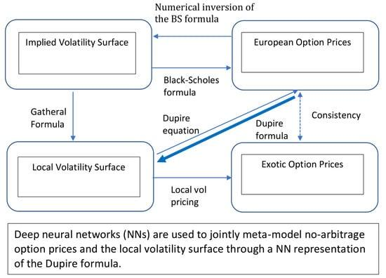

Financial derivatives are intricate financial products that derive their value from an underlying asset, such as stocks, bonds, commodities, or market indices. These instruments allow investors to speculate on the future price movements of the underlying assets or to hedge against potential losses. Derivatives play a pivotal role in financial markets by enhancing liquidity, enabling risk transfer, and allowing price discovery.

Financial modeling is a crucial tool in the world of derivatives, involving the construction of abstract representations of real financial situations through mathematical and statistical techniques. This process aids in forecasting future financial performances and assessing the risks associated with investment decisions. Models such as the Black-Scholes model and binomial tree models are frequently utilized for pricing options and projecting potential financial outcomes under various scenarios.



Local volatility, a nuanced measure within financial modeling, refines option pricing by considering the specific strike prices and expiration dates associated with options. Unlike constant volatility models, local volatility allows for the calibration of different volatilities for each option on the same underlying asset. This approach provides a more accurate reflection of an option's theoretical value, particularly when dealing with exotic options that traditional models may struggle to price correctly.

Algorithmic trading, commonly referred to as algo trading, leverages sophisticated computer algorithms to automate trading decisions and execute orders. By processing vast amounts of market data and considering numerous variables, these algorithms can perform trades at speeds and frequencies beyond the capability of human traders. Algo trading enhances market efficiency and allows traders to capitalize on small price discrepancies, making it particularly effective in high-frequency trading environments.

Collectively, these components highlight the complexity and sophistication of modern financial markets. By combining derivatives, financial modeling, local volatility assessments, and algorithmic trading, market participants can formulate advanced strategies to optimize returns and manage risk effectively.

## Table of Contents

## Understanding Financial Derivatives

Financial derivatives are sophisticated financial instruments that derive their value from the performance of an underlying entity, which may include assets, indices, or interest rates. These contracts serve as foundational elements in modern financial markets and encompass a broad spectrum of products including options, futures, and swaps. Each derivative serves distinct purposes, ranging from hedging risks to outright speculation.

**Options** are derivatives that provide the buyer with the right, but not the obligation, to buy or sell an underlying asset at an agreed-upon price on or before a specified date. They are predominantly used for hedging risks in a portfolio or speculating on the future price movements of the underlying assets. The intrinsic value of options is influenced by several factors including the price of the underlying asset, strike price, volatility, time to expiration, and prevailing interest rates.

**Futures** contracts obligate the holder to buy or sell an asset at a predetermined future date and price. These instruments are commonly employed in industries subject to price volatility, such as commodities and currencies, for both hedging and speculative purposes. Futures are critical in providing price discovery and liquidity to the markets in which they operate.

**Swaps** are agreements between two parties to exchange future cash flows according to a prearranged formula. Often used to manage interest rate and currency risks, swaps allow entities to restructure their cash flow profiles in accordance with changing financial conditions. For example, an interest rate swap might involve exchanging fixed interest rate payments for floating rate payments.

The mechanics and applications of derivatives are intricate, necessitating a comprehensive understanding of their structure, pricing, and the market environment. Properly managing these instruments involves a solid grasp of the associated risks, such as market, credit, and [liquidity](/wiki/liquidity-risk-premium) risks. Pricing models, like the Black-Scholes for options, enable market participants to assign appropriate values to derivatives based on underlying assumptions and market conditions.

In corporate finance and investment strategies, derivatives are integral for crafting solutions that either shield against unwanted financial exposures or exploit speculative opportunities. As derivatives can introduce significant risks if mismanaged, thorough knowledge of financial theory, mathematical modeling, and regulatory parameters is essential for market participants engaging with these instruments.

## The Role of Financial Modeling in Derivatives

Financial modeling plays a critical role in the context of derivatives, offering a structured approach to understanding, forecasting, and managing the potential outcomes and risks associated with these complex financial instruments. Derivatives, by their nature, depend on the performance of underlying assets, and modeling is essential to capture the intricacies involved in their pricing and risk assessment.

One of the fundamental models used in derivative pricing is the Black-Scholes model, formulated by Fischer Black, Myron Scholes, and Robert Merton. The Black-Scholes model provides a theoretical estimate for pricing European-style options and has significantly impacted financial theory and practice. It is based on the assumption of constant [volatility](/wiki/volatility-trading-strategies) and interest rates, and it uses the formula:

$$
C = S_0 N(d_1) - X e^{-rT} N(d_2)
$$

where:
- $C$ is the call option price
- $S_0$ is the current stock price
- $X$ is the strike price of the option
- $r$ is the risk-free interest rate
- $T$ is the time to maturity
- $N$ is the cumulative distribution function of the standard normal distribution
- $d_1$ and $d_2$ are calculated as:

$$
d_1 = \frac{\ln(\frac{S_0}{X}) + (r + \frac{\sigma^2}{2})T}{\sigma\sqrt{T}}
$$

$$
d_2 = d_1 - \sigma\sqrt{T}
$$

The Black-Scholes model emphasizes theoretical efficiency, and its derivatives, such as implied volatility, serve as integral components in financial modeling.

Another popular approach is the binomial tree model, which provides a more flexible framework for pricing options by adopting a discrete-time lattice model. The binomial model is particularly useful for American options, which can be exercised any time before expiration. This approach involves the recursive calculation of option prices by simulating multiple potential price paths for the underlying asset.

The application of these models goes beyond simple pricing; they are instrumental in structuring, pricing, and managing derivative portfolios. Financial modeling helps traders and risk managers make informed decisions about how to allocate resources, structure trades, and hedge against potential risks. By incorporating various scenarios and assumptions, financial modeling allows institutions to optimize their derivative strategies.

The process of financial modeling can also be illustrated through programming. For example, using Python, one can simulate option pricing using the Black-Scholes model:

```python
import numpy as np
from scipy.stats import norm

def black_scholes(S, X, T, r, sigma, option_type='call'):
    d1 = (np.log(S / X) + (r + 0.5 * sigma ** 2) * T) / (sigma * np.sqrt(T))
    d2 = d1 - sigma * np.sqrt(T)

    if option_type == 'call':
        price = S * norm.cdf(d1) - X * np.exp(-r * T) * norm.cdf(d2)
    elif option_type == 'put':
        price = X * np.exp(-r * T) * norm.cdf(-d2) - S * norm.cdf(-d1)
    else:
        raise ValueError("Option type must be either 'call' or 'put'")

    return price

# Example usage:
S0 = 100   # Current stock price
X = 100    # Strike price
T = 1      # Time to maturity (in years)
r = 0.05   # Risk-free interest rate
sigma = 0.2  # Volatility

call_price = black_scholes(S0, X, T, r, sigma, option_type='call')
```

This Python code illustrates how a simple implementation captures the essential elements of the Black-Scholes model, enabling analysts to simulate and analyze option prices effectively.

Through financial modeling, market participants are equipped to make more strategic decisions, positioning them to better handle the risks and opportunities associated with derivatives. These models form the backbone of derivatives markets, providing critical insights that influence trading, risk management, and strategic planning.

## Exploring Local Volatility in Financial Markets

Local volatility provides a nuanced perspective on option pricing by incorporating the distinct characteristics of each option beyond the assumptions of the constant volatility models. Unlike traditional models such as Black-Scholes, which assume a constant volatility irrespective of an option’s strike price and expiration date, local volatility models embrace the variability of volatility based on the local market conditions. This refined approach allows for a more precise reflection of an option’s theoretical value and acknowledges that volatility can differ for options on the same underlying asset.

The Black-Scholes model, while foundational, operates under the assumption of constant volatility, which can be a limiting [factor](/wiki/factor-investing). This uniform volatility assumption does not capture the true behavior of the underlying asset’s market dynamics. Local volatility models, on the other hand, improve upon this by using a volatility surface—a three-dimensional plot that represents volatility across different strike prices and maturities. This approach enables the model to accurately fit market prices of a broad range of options and better reflect the actual distributions of asset prices.

Local volatility is particularly useful in pricing exotic options, which often have payoffs that depend on the path of the underlying asset price or have discontinuous payoffs. Standard models, with their homogenous volatility assumption, frequently fall short in capturing the complexity of these instruments. By adjusting for local variability, market practitioners can enhance pricing accuracy, risk assessment, and hedging strategies for these complex financial products.

In practice, the Dupire local volatility model provides the framework to extract local volatility from observed market prices of vanilla options. The model calculates local volatility through a partial differential equation derived from market prices. This equation essentially inverts a volatility surface from the market prices of plain-vanilla options to obtain a local volatility function. The Dupire formula is given as:

$$
\sigma_{\text{local}}^2(K, T) = \frac{\frac{\partial C}{\partial T}}{0.5 K^2 \frac{\partial^2 C}{\partial K^2}}
$$

where $C$ is the call option price, $K$ is the strike price, and $T$ is the maturity. This ability to back out implied volatilities from market prices enables traders and risk managers to fine-tune their strategies based on realistic market conditions.

In summary, understanding local volatility constitutes a significant advantage in financial modeling and option pricing. It empowers users to leverage advanced insights that accommodate the nuanced features of both market conditions and individual financial instruments, thus enhancing the ability to strategize and manage financial risks effectively.

## Algo Trading and Its Integration with Financial Modeling

Algorithmic trading represents an advanced technological approach where trading decisions and executions are automated using extensively designed algorithms. These algorithms consider a multitude of parameters and data points—including historical price data, market conditions, [order book](/wiki/order-book-trading-strategies) status, and specific financial metrics—to optimize trading strategies.

Financial modeling plays an instrumental role in informing and shaping [algorithmic trading](/wiki/algorithmic-trading) strategies. By creating simulations that mimic real market conditions, financial models can forecast potential outcomes and assess various scenarios. For instance, when building algorithmic strategies, models such as Monte Carlo simulations can be used to project the range of potential price movements and their respective probabilities. This allows traders to optimize their decision-making process based on realistic market simulations.

An algorithm's success in trading is often predicated on its ability to respond to the nuances of market volatility. Local volatility, which accounts for variabilities in financial derivatives such as options, affiliates closely with algorithmic trading. The sensitivity of algorithmic strategies to changes in local volatility means that slight fluctuations in an option’s implied volatility surface can trigger trade executions. This is particularly relevant in high-frequency trading environments, where algorithms need to capitalize on microsecond-level price changes.

By integrating financial modeling with algorithmic strategies, traders can further refine their approach, making it possible to execute high-frequency trades with precision. For example, derivative pricing models like the Black-Scholes model can be incorporated into trading algorithms to evaluate the optimal timing for executing trades based on predicted price paths and volatility trends. As such, algorithmic trading, supported by robust financial modeling, enhances the ability to exploit market inefficiencies while managing risk systematically. 

Overall, this integration is vital to maintaining a competitive advantage, as it enables the alignment of model predictions with algorithmic executions, thus streamlining order processing, optimizing execution costs, and maximizing potential profits in dynamic markets.

## Applications and Benefits of Combining These Techniques

The integration of financial derivatives, local volatility, and financial modeling creates powerful trading strategies that can greatly benefit traders and financial institutions. By combining these techniques, market participants can achieve a higher degree of sophistication in their trading approaches, enabling them to effectively manage risks and potentially enhance portfolio returns.

Financial derivatives, such as options and futures, are vital tools for hedging risks and speculating on future price movements. When used with local volatility modeling, these instruments can be priced more accurately, reflecting the unique characteristics of each option or contract. This refinement in pricing enables traders to identify mispriced derivatives, allowing them to capitalize on [arbitrage](/wiki/arbitrage) opportunities or adjust their positions to manage risks more effectively.

Financial modeling plays a crucial role in the application of these techniques by providing a structured framework for analyzing various market scenarios and outcomes. Using models like Black-Scholes, traders can simulate the potential behavior of derivatives under different market conditions. By incorporating local volatility into these models, traders gain a more realistic view of how options might behave, thereby improving decision-making and enhancing portfolio management.

The integration of algorithmic trading systems further amplifies the benefits of these combined techniques. By automating trading processes, algorithmic strategies can execute trades with precision and speed, taking advantage of the slightest variations in market conditions. These algorithms can process large volumes of data and make trading decisions in fractions of a second, resulting in optimized execution and reduced transaction costs.

Python, with its robust libraries for financial modeling and data analysis, facilitates the integration of these techniques into algorithmic trading systems. For example, using the `numpy` and `pandas` libraries, traders can construct comprehensive models that incorporate local volatility estimates, perform back-testing, and simulate future market scenarios. Additionally, the `scipy` library can be used to solve complex mathematical problems, including those related to the pricing of exotic derivatives.

```python
import numpy as np
import pandas as pd
from scipy.optimize import minimize

# Example of a simple Black-Scholes pricing model with local volatility adjustments
def black_scholes_price(S, K, T, r, sigma):
    # S = current stock price
    # K = option strike price
    # T = time to expiration in years
    # r = risk-free interest rate
    # sigma = local volatility
    d1 = (np.log(S / K) + (r + 0.5 * sigma**2) * T) / (sigma * np.sqrt(T))
    d2 = d1 - sigma * np.sqrt(T)
    call_price = S * norm.cdf(d1) - K * np.exp(-r * T) * norm.cdf(d2)
    return call_price

# Example data
S = 100  # Current stock price
K = 100  # Option strike price
T = 1    # Time to expiration (1 year)
r = 0.05 # Risk-free interest rate
sigma = 0.2 # Local volatility estimate

# Calculate the option price
price = black_scholes_price(S, K, T, r, sigma)
print(f"Option Price with Local Volatility: {price}")
```

By leveraging these techniques, financial institutions can better navigate the complexities of modern markets, where timely and data-driven decisions are crucial to success. The reduction of human error and enhanced ability to quickly react to market changes allows for more efficient portfolio management, improved risk assessment, and the potential for better overall returns. As technology continues to advance, the synergy between financial derivatives, local volatility modeling, and algorithmic trading will remain a vital component of any sophisticated trading strategy.

## Challenges and Considerations

Implementing sophisticated techniques such as financial derivatives, local volatility modeling, and algorithmic trading presents a variety of challenges and considerations that are crucial for success in modern financial markets. Each method requires considerable computational resources due to the complexity and [volume](/wiki/volume-trading-strategy) of data processing involved. The precision of calculations, particularly in options pricing and volatility assessments, is reliant on high-performance computing infrastructures. Advanced expertise in financial mathematics is indispensable, as practitioners must design, implement, and refine mathematical models that underpin these financial strategies. Understanding stochastic calculus, differential equations, and numerical algorithms is essential for developing sound models.

Moreover, regulatory considerations play a pivotal role in derivative trading. Financial institutions and traders must be vigilant of the changing regulatory landscape, as compliance with guidelines such as the Dodd-Frank Act in the United States or the European Market Infrastructure Regulation (EMIR) in the European Union is mandatory. These regulations aim to enhance transparency and reduce systemic risk, but they also impose additional reporting requirements and operational constraints which must be managed effectively.

Market risks, including credit risk, liquidity risk, and operational risk, are inherent in derivative trading. Market participants need to implement robust risk management frameworks to identify, measure, and mitigate these risks. For example, Value at Risk (VaR) models, stress testing, and credit exposure assessments are critical components of risk management strategies.

As financial markets rapidly evolve, continuous learning and adaptation become imperative. Innovations in financial technology (FinTech) and [machine learning](/wiki/machine-learning) are frequently changing the landscape, necessitating the ongoing development of new skills and techniques. Financial modelers and traders must remain abreast of advancements in data analytics, algorithm optimization, and model recalibration to maintain a competitive edge. This continuous adaptation, combined with a strong understanding of market dynamics, positions market participants to leverage technological developments effectively, thus enhancing their strategic decision-making capabilities in the financial markets.

## Conclusion

Financial derivatives, local volatility, and algorithmic trading significantly impact the modern financial landscape by providing traders and institutions with sophisticated tools for managing risk and enhancing portfolio performance. Financial derivatives, by design, allow market participants to gain exposure to various financial instruments and indices without directly owning the underlying assets. This characteristic makes them versatile tools for hedging against potential losses or for speculative purposes.

Local volatility models refine traditional models such as Black-Scholes by introducing dynamic volatility factors. This enables a more precise pricing mechanism for options, particularly exotic ones that exhibit unique characteristics not captured by constant volatility assumptions. By adopting local volatility models, financial professionals can better gauge risk and potential market movements, thereby enhancing their decision-making processes.

The combination of algorithmic trading with robust financial modeling represents a further evolution in trading strategies. Algorithmic trading systems, driven by powerful computer algorithms, automate complex trading decisions and execute large volumes of transactions at high speeds. These systems can leverage financial models to simulate and predict market conditions, allowing for optimized trading strategies that account for minute market fluctuations and local volatility inputs.

Financial modeling serves as the backbone of these advanced trading and risk management techniques. By using quantitative methods to simulate various market scenarios and potential outcomes, financial modeling provides critical insights and strategic advantages to traders. Whether through Monte Carlo simulations, stochastic modeling, or other quantitative techniques, financial modeling continues to play an essential role in modern finance.

As technology and financial markets evolve, the integration of these methods will continue to shape the future of trading and risk management. Innovations in computational power, data analytics, and machine learning enhance the capabilities of financial modeling, local volatility analysis, and algorithmic trading. Continuous adaptation and learning remain crucial for market participants to maintain a competitive edge in a fast-paced financial environment. The potential for further advancements in fintech promises to unlock even greater strategic advantages for those adept at harnessing these powerful tools.

## References & Further Reading

[1]: Gatheral, J. (2006). "The Volatility Surface: A Practitioner's Guide." Wiley. [Link to book](https://onlinelibrary.wiley.com/doi/book/10.1002/9781119202073)

[2]: Hull, J. C. (2017). "Options, Futures, and Other Derivatives" (9th Edition). Pearson. [Link to book](https://www.amazon.com/Options-Futures-Other-Derivatives-9th/dp/0133456315)

[3]: Black, F., & Scholes, M. (1973). ["The Pricing of Options and Corporate Liabilities."](https://www.cs.princeton.edu/courses/archive/fall09/cos323/papers/black_scholes73.pdf) Journal of Political Economy, 81(3), 637-654.

[4]: Dupire, B. (1994). "Pricing with a Smile." Risk Magazine, 7(1), 18-20. [Link to paper](https://www.semanticscholar.org/paper/Pricing-with-a-Smile-Dupire/03798655e555ca39ed845e4399f745b3d0d11681)

[5]: Lehar, A. (2005). ["Measuring Systemic Risk: A Risk Management Approach."](https://www.sciencedirect.com/science/article/pii/S0378426604002456) Journal of Banking & Finance, 29(10), 2577-2603.

[6]: Jansen, S. (2018). "Machine Learning for Algorithmic Trading." Packt. [Link to book](https://github.com/stefan-jansen/machine-learning-for-trading)

[7]: Chan, E. P. (2008). "Quantitative Trading: How to Build Your Own Algorithmic Trading Business." Wiley. [Link to book](https://onlinelibrary.wiley.com/doi/pdf/10.1002/9781119203377.fmatter)