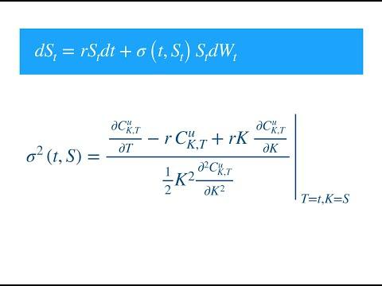

## Table of Contents

## What is local volatility in finance?

Local volatility is a way to understand how the price of something like a stock or option might change over time. It's a model that looks at how much the price can go up or down, not just overall but at each specific price level and time. This helps people who trade or invest to better guess what might happen to the price in the future.

Imagine you're trying to predict the weather for a trip. A simple weather forecast might say it will be mostly sunny, but a local volatility model is like a detailed weather map that shows you how the weather might change at different times of the day and in different places. This detailed view helps traders make smarter choices about when to buy or sell, because they can see how the price might move at different times and levels.

## How does local volatility differ from implied volatility?

Local volatility and implied volatility are two ways to look at how much the price of something like a stock or option might change. Implied volatility is what the market thinks the future price changes might be. It's a single number that comes from the price of an option right now. If people think the price will move a lot, the implied volatility goes up, and if they think it will stay pretty steady, it goes down.

Local volatility, on the other hand, gives you a more detailed picture. It doesn't just give you one number for the whole future. Instead, it shows how the price might change at different times and at different price levels. It's like having a map of price changes over time, not just a single guess. This helps traders see how the price might move in different situations, which can be really useful for making trading decisions.

## What is the purpose of using local volatility models in option pricing?

Local volatility models are used in option pricing to give traders a better idea of how the price of an option might change over time. Unlike other models that might give you one big guess about future price changes, local volatility models look at how the price might move at different times and at different price levels. This helps traders see the full picture of what might happen, not just a single prediction.

By using local volatility models, traders can make smarter choices about when to buy or sell options. These models help them understand how the price of an option could change based on where the price of the underlying asset is right now and where it might go in the future. This detailed view can lead to better trading decisions and can help traders manage their risks more effectively.

## Can you explain the mathematical formula used to calculate local volatility?

Local volatility is calculated using a formula that looks at how the price of an option changes over time and at different price levels. The basic idea is to use the prices of options at different times and strike prices to figure out how the price of the underlying asset might move. The formula involves taking the second derivative of the option price with respect to the underlying asset's price and the first derivative with respect to time. This helps us see how sensitive the option price is to changes in the underlying asset's price and how that sensitivity changes over time.

In simpler terms, if you imagine the price of an option as a surface that changes as the underlying asset's price and time move, local volatility tells you how bumpy that surface is at each point. The formula for local volatility, often called the Dupire formula, is given by sigma(t, S) = sqrt(2 * (dC/dS + rS * C) / (S^2 * (d^2C/dS^2))), where sigma(t, S) is the local volatility at time t and asset price S, C is the option price, r is the risk-free [interest rate](/wiki/interest-rate-trading-strategies), and the derivatives are taken with respect to the underlying asset's price S. This formula helps traders understand how the price might change in different scenarios, giving them a detailed map of potential price movements.

## How is local volatility estimated from market data?

Local volatility is estimated from market data by looking at the prices of options at different times and strike prices. Traders use these prices to figure out how the price of the underlying asset might move. They do this by using a formula called the Dupire formula, which involves calculating how the option price changes when the underlying asset's price changes and how it changes over time. This helps them see how sensitive the option price is to these changes, giving them a detailed picture of how the price might move in the future.

To use the Dupire formula, traders need to know the current prices of options at different strike prices and expiration dates. They then use these prices to calculate the local volatility at each point in time and for each price level of the underlying asset. This process involves some math, but the idea is simple: by looking at how option prices change, traders can estimate how the underlying asset's price might move in different situations. This detailed view helps them make better trading decisions and manage their risks more effectively.

## What are the key assumptions behind local volatility models?

Local volatility models assume that the price of the underlying asset can be predicted by looking at how option prices change over time and at different price levels. They believe that the future price movements can be figured out by studying the current prices of options. This means that local volatility models think that all the information needed to predict how the price might move is already in the market, and they use this information to create a detailed map of potential price changes.

Another key assumption is that the volatility of the underlying asset changes smoothly over time and price levels. Local volatility models do not believe in sudden jumps or big changes in volatility. Instead, they think that volatility changes gradually, which helps them create a smooth surface of price movements. This smooth change is important because it allows traders to see how the price might move in different situations without big surprises.

## What are the advantages of using local volatility models over other volatility models?

Local volatility models give traders a detailed map of how the price of an option might change over time and at different price levels. Unlike other models that might just give a single guess about future price changes, local volatility models show how the price could move in different situations. This helps traders see the full picture, not just a single prediction. By understanding how the price might change at each point, traders can make smarter choices about when to buy or sell options, which can lead to better trading decisions.

Another advantage of local volatility models is that they assume the price changes smoothly over time and price levels. This means they don't expect sudden big jumps in price or volatility, which makes their predictions more stable and reliable. Traders can use this smooth view to plan their trades more carefully and manage their risks better. Overall, local volatility models provide a detailed and stable way to understand how option prices might move, which can be very helpful for traders.

## What are the limitations and potential pitfalls of local volatility models?

Local volatility models can be tricky because they assume that the price of an asset changes smoothly over time and at different price levels. But in real life, prices can jump suddenly, and these models might not catch those big changes. If a big event happens that makes the price move a lot, the local volatility model might not predict it well. This can lead to surprises for traders who rely on these models, and they might end up losing money if they don't expect these big jumps.

Another problem with local volatility models is that they need a lot of data to work well. They use the prices of options at different times and strike prices to figure out how the price might move. If the data is not good or if there are not enough options to look at, the model might give wrong predictions. This can make it hard for traders to trust the model, especially in markets where there are not many options traded. So, while local volatility models can be helpful, they have their limits and can lead to problems if traders are not careful.

## How does local volatility impact the pricing of exotic options?

Local volatility helps traders understand how the price of exotic options might change over time. Exotic options are special kinds of options that can have different rules than regular options. Because local volatility models look at how the price might move at different times and price levels, they can give a detailed picture of what might happen to the price of an exotic option. This detailed view is really helpful for pricing exotic options because it shows how the price could change in different situations, not just one big guess.

But local volatility models can also make things tricky when pricing exotic options. These models assume that the price changes smoothly, but exotic options can be affected by big jumps or sudden changes in the market. If the model doesn't catch these big changes, it might give the wrong price for the exotic option. So, while local volatility models can help traders see how the price might move, they need to be careful and understand the limits of these models when pricing exotic options.

## What is the relationship between local volatility and the volatility smile?

Local volatility and the volatility smile are connected because they both help traders understand how the price of options might change. The volatility smile is a pattern that shows how the implied volatility of options changes at different strike prices. When you look at the prices of options with different strike prices, you might see that the implied volatility forms a smile shape, with higher volatility for options that are far away from the current price of the underlying asset. This smile tells traders that the market expects bigger price changes for options that are far from the current price.

Local volatility models take this idea further by giving a detailed map of how the price might move at different times and price levels. Instead of just seeing the smile shape, local volatility models look at how the option prices change and use that information to figure out how the price might move in the future. By understanding the volatility smile, local volatility models can help traders see how the price might change in different situations, which can be really useful for pricing options and making trading decisions.

## How can local volatility be used in risk management and hedging strategies?

Local volatility helps traders manage risk and make better hedging strategies by giving them a detailed map of how the price of an option might change over time and at different price levels. Instead of just guessing how the price might move, local volatility models show traders how the price could change in different situations. This helps them see the full picture and understand how sensitive the option price is to changes in the underlying asset's price. By knowing this, traders can plan their trades more carefully and make sure they are not taking too much risk.

For hedging, local volatility models are really useful because they help traders figure out how to protect themselves from big price changes. If a trader knows how the price might move at different times and price levels, they can use this information to set up hedges that will work well in different situations. This means they can buy or sell other options or assets to balance out their risk, making sure they don't lose too much money if the price moves in a way they didn't expect. By using local volatility models, traders can create more effective hedging strategies and manage their risks better.

## What are some advanced techniques for calibrating local volatility models to market data?

Calibrating local volatility models to market data can be tricky, but there are some advanced techniques that can help. One way is to use a method called "smoothing" to make sure the local volatility surface is smooth and doesn't have any big jumps. This involves taking the option prices at different times and strike prices and using math to make the local volatility change smoothly. Another technique is to use "regularization," which helps make sure the model fits the data well without overfitting. This means the model can still work well even if the data is a bit messy or if there are not a lot of options to look at.

Another advanced technique is to use "stochastic optimization" methods, like genetic algorithms or particle swarm optimization, to find the best local volatility surface that fits the market data. These methods try different ways of setting up the local volatility model and see which one works best. They can be really helpful because they can find good solutions even when the problem is really complicated. By using these advanced techniques, traders can make sure their local volatility models are as accurate as possible, which helps them make better trading decisions and manage their risks more effectively.

## What is the Role of Financial Modeling in Derivatives?

Financial modeling plays a critical role in the pricing of derivatives, as well as in risk management. A derivative's value is derived from an underlying asset, and financial models are essential for accurately determining this value and assessing the associated risks. Among the numerous financial models used, the Black-Scholes model and the binomial tree model are particularly significant.

The Black-Scholes model revolutionized the field by providing a mathematical framework for pricing European options. It operates under the assumption of constant [volatility](/wiki/volatility-trading-strategies) and models the dynamic behavior of financial markets through stochastic differential equations. The Black-Scholes formula for a European call option is represented as:

$$
C = S_0 N(d_1) - Xe^{-rt} N(d_2)
$$

where:
- $C$ is the call option price,
- $S_0$ is the current price of the underlying asset,
- $X$ is the strike price of the option,
- $r$ is the risk-free interest rate,
- $t$ is the time to expiration,
- $N$ is the cumulative distribution function of the standard normal distribution,
- $d_1 = \frac{\ln(S_0/X) + (r + \sigma^2/2)t}{\sigma\sqrt{t}}$,
- $d_2 = d_1 - \sigma\sqrt{t}$,
- $\sigma$ is the volatility of the underlying asset.

While the Black-Scholes model is influential, especially for European options, its assumption of constant volatility does not always align with market realities. To address some of these limitations, the binomial tree model offers a more flexible approach, particularly advantageous for pricing American options, which can be exercised at any time prior to expiration.

The binomial tree model simulates different paths that the price of an underlying asset can take over time using a discrete-time framework. It constructs a lattice where each node represents a possible price of the underlying asset at a given point in time, modeled through upward ($u$) and downward ($d$) movements. The option price is then calculated by working backward from the final nodes of the lattice to the initial node, allowing for the evaluation of optimal early exercise opportunities in the case of American options. The probabilities of upward and downward movements are determined as:

$$
p = \frac{e^{rt} - d}{u - d}
$$

This methodology allows for greater flexibility in modeling assets with path-dependent features or complex early-exercise rights, making it highly adaptable for various derivative products.

Both the Black-Scholes and binomial tree models are foundational in financial modeling, each with its merits and limitations. The choice between them typically depends on the specific characteristics of the derivative being modeled and the assumptions traders and analysts are willing to accept. In practice, financial models incorporate these foundational concepts alongside more advanced techniques to accommodate the vast complexities encountered in derivative markets.

## What is Exploring Local Volatility in Financial Markets?

Local volatility models enhance option pricing accuracy by determining volatility as a variable function rather than a constant. These models evaluate volatility in relation to both time and the underlying asset's price level, leading to a more refined analysis. Unlike models that assume constant volatility, local volatility models employ a volatility surface that adapts based on strike prices and maturities. This approach is constructed from a grid where each node represents a specific time and price level, allowing for detailed modeling of market dynamics.

The volatility surface is derived from market-implied volatilities of options for varying strikes and expiration dates. It is constructed using partial differential equations (PDEs) and calibration techniques like the Dupire local volatility model. The Dupire model uses the relationship:

$$
\sigma_{LV}(S, t)^2 = \frac{\frac{\partial C}{\partial t} + rK\frac{\partial C}{\partial K}}{\frac{1}{2} K^2 \frac{\partial^2 C}{\partial K^2}},
$$

where $\sigma_{LV}(S, t)$ is the local volatility, $C$ is the option price, $r$ is the risk-free interest rate, $S$ is the asset price, $t$ is the current time, and $K$ is the strike price. This formula allows traders to compute local volatility based on observable option prices, thereby capturing the dynamics of implied volatility across different market conditions.

Local volatility models are particularly advantageous when pricing exotic options, which are financial derivatives with payoffs dependent on the price path of the underlying asset. These options cannot be accurately priced using constant volatility models because their payoffs are sensitive to the path-dependent nature of volatility. By employing local volatility models, traders can generate more accurate pricing and hedging strategies for exotic options like barrier options, Asian options, and lookback options.

The flexibility and depth provided by local volatility models make them an essential tool in modern financial markets, offering traders the ability to better understand and navigate the complexities of dynamic volatility environments.

## References & Further Reading

Gatheral, J. (2006). *The Volatility Surface: A Practitioner's Guide.* Wiley. This book offers an in-depth analysis of the volatility surface, presenting practical insights into modeling and interpreting volatility smile and skew for option pricing. Gatheral's work is crucial for understanding local volatility models and their applications in hedging and risk management.

Hull, J. C. (2017). *Options, Futures, and Other Derivatives* (9th Edition). Pearson. Hull's textbook is an authoritative resource in derivative securities, offering comprehensive coverage of fundamental and advanced concepts in options and futures markets, including the pivotal Black-Scholes model and its assumptions about constant volatility.

Black, F., & Scholes, M. (1973). *The Pricing of Options and Corporate Liabilities.* Journal of Political Economy. This seminal paper introduced the Black-Scholes model, a groundbreaking approach for pricing options that set the foundation for modern derivatives markets. Despite its assumptions of constant volatility and Brownian motion, the model remains influential in financial modeling and is the basis for subsequent developments in local and stochastic volatility models.

