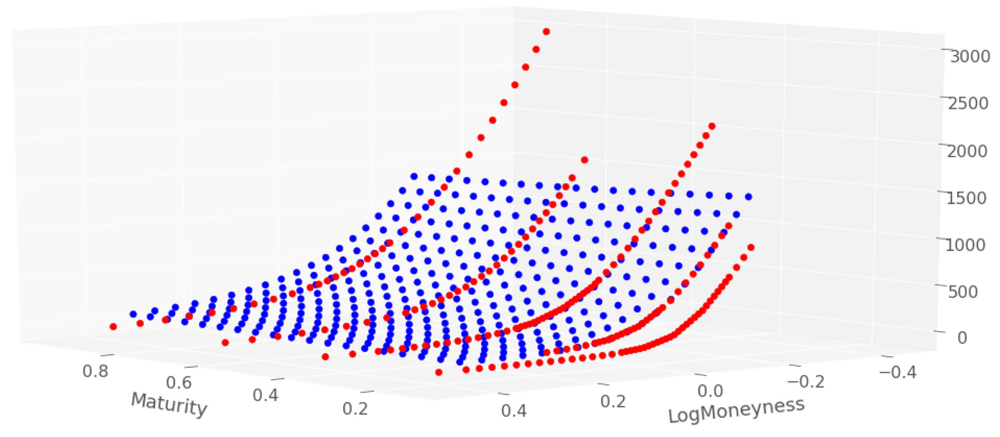

In the dynamic landscape of financial markets, understanding the interplay of various instruments is key to crafting advanced trading strategies. Local volatility plays a crucial role in the pricing of financial derivatives, which are financial instruments deriving their value from underlying assets such as stocks, bonds, or commodities. Unlike constant volatility models, local volatility models consider volatility as a function of both time and the asset’s current level, providing a more detailed approach to option pricing. This nuanced understanding is essential for accurately evaluating derivatives, particularly exotic options that possess unique payoff structures.

Algorithmic trading, commonly known as algo trading, has transformed how market participants engage with financial markets. By automating decision-making and trade execution through sophisticated algorithms, algo trading enhances the ability to react to market changes at micro levels. The integration of algo trading with financial modeling, particularly local volatility models, allows traders to optimize trade execution by leveraging nuanced market dynamics.

This article explores the intricacies of local volatility, its significance in financial modeling, and its synergy with algo trading. By examining how these elements interact, readers will gain insights into the refined tools these models offer for risk management and opportunity exploitation in modern financial markets.

## Table of Contents

## Understanding Financial Derivatives

Financial derivatives are financial instruments whose value is derived from the performance of underlying assets such as stocks, bonds, commodities, interest rates, or market indexes. These derivatives serve as essential tools for managing risk and enabling speculative opportunities in financial markets. By facilitating the transfer of risk from one party to another, derivatives allow market participants to hedge against potential losses or gain exposure to various financial instruments without having to hold the underlying assets directly.

### Types of Financial Derivatives

#### Options
Options are contracts that give the holder the right, but not the obligation, to buy or sell an underlying asset at a predetermined price, known as the strike price, before or on a specified expiration date. There are two primary types of options: call options and put options. A call option provides the right to purchase the underlying asset, while a put option grants the right to sell it. The ability to choose whether to exercise the option provides flexibility and a strategic edge to the holder, making options popular for both hedging strategies and speculative plays.

#### Futures
Futures contracts are standardized agreements to buy or sell a specific quantity of an asset at a predetermined price at a specified time in the future. Unlike options, futures contracts obligate the holder to execute the transaction on the expiration date. These contracts are commonly used for hedging purposes, particularly in commodities trading, to lock in prices and mitigate the risk of adverse price movements. The standardized nature of futures contracts facilitates trading on exchanges, providing [liquidity](/wiki/liquidity-risk-premium) and price transparency.

#### Swaps
Swaps are derivative contracts through which two parties agree to exchange cash flows or financial instruments over a set period. The most common type of swap is the [interest rate](/wiki/interest-rate-trading-strategies) swap, where parties exchange fixed and floating rate interest payments. Swaps are also prevalent in currency and commodity markets and can be tailored to meet specific needs of the counterparties involved. Their flexibility allows institutions to manage complex risk profiles and adjust their exposure to various market conditions.

### Functions and Mechanisms

Financial derivatives are integral to modern financial markets due to their diverse functionalities. They enhance market efficiency by allowing the redistribution of risk according to individual risk appetites and market views. The mechanisms of derivatives vary according to their type and structure:

1. **Hedging**: By taking a position in derivatives that is opposite to their current holdings, investors can protect against unfavorable price movements. For instance, a farmer may use futures to lock in the price of a crop, securing income despite market fluctuations.

2. **Speculation**: Traders often use derivatives to bet on future price movements without the need to own the underlying assets. The leverage effect inherent in derivatives amplifies both potential gains and risks, appealing to speculators seeking significant returns.

3. **Arbitrage**: Efficient markets are maintained through arbitrage, where traders exploit price differentials of similar or related assets across different markets or derivatives themselves, seeking risk-free profit by aligning prices.

The versatility and complexity of financial derivatives require an understanding of their specific terms, market behavior, and pricing models. Properly utilized, they provide significant opportunities for managing risk and capitalizing on market movements.

## The Role of Financial Modeling in Derivatives

Financial modeling plays a critical role in the pricing of derivatives, as well as in risk management. A derivative's value is derived from an underlying asset, and financial models are essential for accurately determining this value and assessing the associated risks. Among the numerous financial models used, the Black-Scholes model and the binomial tree model are particularly significant.

The Black-Scholes model revolutionized the field by providing a mathematical framework for pricing European options. It operates under the assumption of constant [volatility](/wiki/volatility-trading-strategies) and models the dynamic behavior of financial markets through stochastic differential equations. The Black-Scholes formula for a European call option is represented as:

$$
C = S_0 N(d_1) - Xe^{-rt} N(d_2)
$$

where:
- $C$ is the call option price,
- $S_0$ is the current price of the underlying asset,
- $X$ is the strike price of the option,
- $r$ is the risk-free interest rate,
- $t$ is the time to expiration,
- $N$ is the cumulative distribution function of the standard normal distribution,
- $d_1 = \frac{\ln(S_0/X) + (r + \sigma^2/2)t}{\sigma\sqrt{t}}$,
- $d_2 = d_1 - \sigma\sqrt{t}$,
- $\sigma$ is the volatility of the underlying asset.

While the Black-Scholes model is influential, especially for European options, its assumption of constant volatility does not always align with market realities. To address some of these limitations, the binomial tree model offers a more flexible approach, particularly advantageous for pricing American options, which can be exercised at any time prior to expiration.

The binomial tree model simulates different paths that the price of an underlying asset can take over time using a discrete-time framework. It constructs a lattice where each node represents a possible price of the underlying asset at a given point in time, modeled through upward ($u$) and downward ($d$) movements. The option price is then calculated by working backward from the final nodes of the lattice to the initial node, allowing for the evaluation of optimal early exercise opportunities in the case of American options. The probabilities of upward and downward movements are determined as:

$$
p = \frac{e^{rt} - d}{u - d}
$$

This methodology allows for greater flexibility in modeling assets with path-dependent features or complex early-exercise rights, making it highly adaptable for various derivative products.

Both the Black-Scholes and binomial tree models are foundational in financial modeling, each with its merits and limitations. The choice between them typically depends on the specific characteristics of the derivative being modeled and the assumptions traders and analysts are willing to accept. In practice, financial models incorporate these foundational concepts alongside more advanced techniques to accommodate the vast complexities encountered in derivative markets.

## Exploring Local Volatility in Financial Markets

Local volatility models enhance option pricing accuracy by determining volatility as a variable function rather than a constant. These models evaluate volatility in relation to both time and the underlying asset's price level, leading to a more refined analysis. Unlike models that assume constant volatility, local volatility models employ a volatility surface that adapts based on strike prices and maturities. This approach is constructed from a grid where each node represents a specific time and price level, allowing for detailed modeling of market dynamics.

The volatility surface is derived from market-implied volatilities of options for varying strikes and expiration dates. It is constructed using partial differential equations (PDEs) and calibration techniques like the Dupire local volatility model. The Dupire model uses the relationship:

$$
\sigma_{LV}(S, t)^2 = \frac{\frac{\partial C}{\partial t} + rK\frac{\partial C}{\partial K}}{\frac{1}{2} K^2 \frac{\partial^2 C}{\partial K^2}},
$$

where $\sigma_{LV}(S, t)$ is the local volatility, $C$ is the option price, $r$ is the risk-free interest rate, $S$ is the asset price, $t$ is the current time, and $K$ is the strike price. This formula allows traders to compute local volatility based on observable option prices, thereby capturing the dynamics of implied volatility across different market conditions.

Local volatility models are particularly advantageous when pricing exotic options, which are financial derivatives with payoffs dependent on the price path of the underlying asset. These options cannot be accurately priced using constant volatility models because their payoffs are sensitive to the path-dependent nature of volatility. By employing local volatility models, traders can generate more accurate pricing and hedging strategies for exotic options like barrier options, Asian options, and lookback options.

The flexibility and depth provided by local volatility models make them an essential tool in modern financial markets, offering traders the ability to better understand and navigate the complexities of dynamic volatility environments.

## Algo Trading and Its Integration with Financial Modeling

Algorithmic trading, often referred to as algo trading, is a technology-driven approach that automates the decision-making and execution processes of trading in financial markets. It relies on sophisticated algorithms and vast datasets to execute trades at speeds and frequencies that are otherwise impossible for human traders. A foundational aspect of this process is the integration of financial modeling, which underpins the development of algorithms with the capability to respond adaptively to micro-level market changes.

Financial modeling plays a critical role in [algorithmic trading](/wiki/algorithmic-trading) by providing quantitative frameworks that support the analysis and interpretation of complex market data. These models enable the evaluation of various trading hypotheses, execution strategies, and risk management techniques by simulating the financial markets' behavior under different scenarios. Among these models, the incorporation of local volatility stands out for its ability to capture the subtle variations in market dynamics.

Local volatility models enhance algorithmic trading strategies by allowing traders to assess option prices with greater accuracy. Unlike models that assume constant volatility, local volatility models account for volatility as a function of both time and the underlying asset's current value. This results in a volatility surface that adapts to changes in the asset price and strike prices, thus reflecting market conditions more precisely.

The integration of local volatility into algorithmic trading algorithms allows for nuanced trade execution optimization. This involves continuously updating and recalibrating model parameters in real-time as new data streams in, ensuring that the trading algorithms are always aligned with the latest market dynamics. By doing so, traders can exploit transient pricing inefficiencies and minimize portfolio risks more effectively.

Moreover, advanced algorithmic frameworks incorporate local volatility into their trading logic to handle complicated pricing structures such as exotic options. These options, with their unique payoff characteristics, benefit significantly from the flexibility of local volatility models, as they allow for a more accurate assessment of the options' fair value and risk profiles.

In practice, the integration of these sophisticated models within an algorithmic trading system involves significant computational resources and expertise in both quantitative finance and information technology. Traders and developers must ensure that their systems can process high-frequency data feeds, execute trades within microseconds, and adapt to rapidly changing market conditions while adhering to sound risk management principles and regulatory standards.

Overall, the fusion of algo trading with financial modeling, particularly through local volatility integration, represents a powerful approach to navigating modern financial markets. This synergy not only enhances execution precision but also extends the capabilities of traders to manage risks and capitalize on market opportunities with unprecedented accuracy and speed.

## Applications and Benefits of Combining These Techniques

The integration of derivatives, local volatility, and financial modeling significantly enhances trading strategies by enabling more accurate price estimation and risk assessment. Derivatives, such as options, futures, and swaps, derive their value from underlying assets and are integral for hedging risk and capitalizing on potential price movements. Local volatility models refine the pricing of these derivatives by recognizing that volatility varies with both the time and the asset's current level, offering a more precise and flexible approach than constant volatility models.

Incorporating these refined models into algorithmic trading, or algo trading, amplifies their effectiveness. Algo trading utilizes sophisticated algorithms to automate decision-making and execute trades with speed and precision, making it well-suited for reacting to micro-level market changes efficiently. By integrating local volatility into these algorithms, traders can optimize trade execution, capitalizing on nuanced market dynamics.

The synergy between derivatives, local volatility, and algo trading creates opportunities to enhance portfolio performance. One such opportunity lies in leveraging [arbitrage](/wiki/arbitrage), where traders can exploit pricing discrepancies in different markets. By understanding the nuanced market dynamics through local volatility models, traders can identify these discrepancies more effectively and react rapidly via automated systems. Additionally, sophisticated risk management strategies can be formulated by combining these techniques, allowing for more robust frameworks that better manage financial risk exposure.

Overall, the combination of derivatives, local volatility, financial modeling, and algorithmic trading offers a comprehensive toolkit for traders to increase efficiency, reduce risks, and potentially improve returns. This integration highlights the power of advanced technology and quantitative analysis in optimizing trading and investment strategies.

## Challenges and Considerations

Implementing sophisticated models and strategies in financial markets presents several challenges and considerations, primarily because of the inherent complexity and resource intensity. First, these advanced models demand considerable computational resources. The calculation of local volatility surfaces, for instance, involves complex numerical methods and iterative procedures, which can be computationally expensive. This requirement necessitates high-performance computing infrastructure and software capable of handling vast amounts of data to produce accurate and timely results.

Financial expertise is equally critical when deploying these models. Derivatives and local volatility involve intricate mathematical and statistical concepts, necessitating personnel who possess not only theoretical knowledge but also practical experience in applying these models in real-world scenarios. The expertise required extends to understanding the nuances of algorithmic trading and integrating these models effectively to enhance trading strategies and risk management.

Regulatory compliance is another pivotal [factor](/wiki/factor-investing). The financial industry is heavily regulated, with strict guidelines governing the use of derivatives due to their potential systemic impact. As financial instruments become more complex, ensuring adherence to regulatory standards becomes increasingly important. Traders and institutions must stay abreast of evolving regulatory frameworks, such as the Dodd-Frank Act in the United States or the European Market Infrastructure Regulation (EMIR), to ensure legality and avoid potential penalties.

Effective risk management frameworks are essential for managing market risks associated with derivatives trading and local volatility application. This involves the creation of robust models that can accurately assess and mitigate risk, ensuring that portfolios are optimized for both performance and safety. The integration of stress testing and scenario analysis can help identify potential vulnerabilities in trading strategies, providing insights necessary for strategic adjustments.

In conclusion, while the integration of sophisticated financial modeling and algorithmic trading can greatly enhance market engagement, it is not without its challenges. Overcoming these requires a strategic amalgamation of technological resources, expert financial knowledge, and stringent adherence to regulatory standards to successfully navigate the complex landscape of modern financial markets.

## Conclusion

Local volatility, financial derivatives, and algo trading are pivotal components of contemporary financial markets, each playing a crucial role in enhancing risk management and exploiting trading opportunities. Local volatility models offer a sophisticated method for pricing options by accounting for the dynamic nature of an asset's volatility over time and across different price levels. This nuanced approach allows for more accurate and flexible pricing of complex derivatives, such as exotic options, which further aids in mitigating risk and capitalizing on market movements.

The continuous evolution of advanced modeling techniques in financial markets places significant emphasis on improving the interactive capabilities of trading systems. These techniques enable more precise assessments of derivative pricing and risk exposure, ensuring that market participants can respond swiftly and effectively to changing conditions. As algo trading automates decision-making and trade execution, the integration of these models allows for rapid reactions to micro-level market changes, boosting trade efficiency and effectiveness.

With ongoing innovations in FinTech and [machine learning](/wiki/machine-learning), the potential of financial tools is set to grow. The incorporation of machine learning algorithms into trading strategies enhances predictive analytics, allowing for more informed decision-making processes based on vast datasets and real-time information. Consequently, the precision and efficiency with which financial instruments are handled will continue to improve, offering profound benefits in terms of performance and risk management.

In this landscape, market participants must remain adaptable and open to continuous learning. The swift pace of technological and methodological advancements demands that traders and institutions regularly update their knowledge and skills. This adaptive approach not only helps in adopting new tools and techniques but also ensures compliance with evolving regulatory standards. Ultimately, the synergy achieved through combining local volatility models, algorithmic trading, and financial derivatives paves the way for more robust and resilient market practices.

## References & Further Reading

Gatheral, J. (2006). *The Volatility Surface: A Practitioner's Guide.* Wiley. This book offers an in-depth analysis of the volatility surface, presenting practical insights into modeling and interpreting volatility smile and skew for option pricing. Gatheral's work is crucial for understanding local volatility models and their applications in hedging and risk management.

Hull, J. C. (2017). *Options, Futures, and Other Derivatives* (9th Edition). Pearson. Hull's textbook is an authoritative resource in derivative securities, offering comprehensive coverage of fundamental and advanced concepts in options and futures markets, including the pivotal Black-Scholes model and its assumptions about constant volatility.

Black, F., & Scholes, M. (1973). *The Pricing of Options and Corporate Liabilities.* Journal of Political Economy. This seminal paper introduced the Black-Scholes model, a groundbreaking approach for pricing options that set the foundation for modern derivatives markets. Despite its assumptions of constant volatility and Brownian motion, the model remains influential in financial modeling and is the basis for subsequent developments in local and stochastic volatility models.

