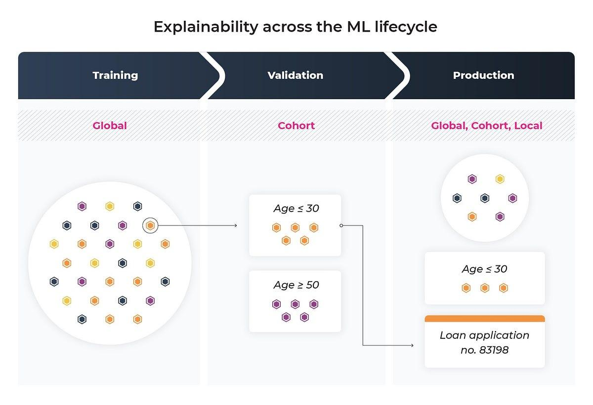

## Table of Contents

## What is a local model?

A local model is a type of artificial intelligence that runs on a single device, like a computer or a smartphone, instead of using the internet to connect to a faraway server. This means that all the processing and data handling happens right on the device you are using. For example, if you use a local model on your phone, it does its thinking and learning without sending information to the internet.

Using a local model can be really helpful because it keeps your data private and secure. Since the information stays on your device, there's less chance that someone else could see or use it. Also, local models can work faster because they don't have to wait for information to travel back and forth over the internet. This can make things like voice commands or image recognition quicker and more efficient.

## What is a global model?

A global model is a type of artificial intelligence that uses the internet to connect to a big server far away. This server does all the thinking and learning for the model. When you use a global model on your phone or computer, it sends your data over the internet to the server, which then sends back the results. For example, when you ask a smart speaker a question, it might send your voice to a server to figure out what you said and then send back an answer.

Using a global model can be good because it can use a lot of data from many different people. This can make the model smarter and better at understanding things. But, there are some things to think about. Since your data goes over the internet, it might not be as private or safe. Also, if the internet is slow or not working, the model might not work well. So, while global models can be very powerful, they depend a lot on the internet and the faraway server.

## How do local and global models differ in their approach?

Local models and global models have different ways of working. A local model does all its thinking and learning right on the device you are using, like your phone or computer. It doesn't need to use the internet to connect to a faraway server. This means that your data stays on your device, which can keep it more private and secure. Also, because everything happens on your device, local models can often work faster and don't depend on the internet being fast or working well.

On the other hand, a global model uses the internet to send your data to a big server far away. This server does all the thinking and learning for the model. When you use a global model, your device sends information over the internet, and the server sends back the results. This can be good because the server can use data from many people to make the model smarter. But, it can also mean that your data might not be as private, and the model might not work well if the internet is slow or not working.

In summary, local models are good for privacy and speed because they work on your own device. Global models can be smarter because they use a lot of data, but they need a good internet connection and might not keep your data as private.

## What are some common applications of local models?

Local models are often used for things that need to happen quickly and privately on your own device. One common use is voice commands on smartphones. When you tell your phone to do something, like set an alarm or send a text, a local model can understand your voice right away without sending your words over the internet. This keeps your voice data private and makes the phone respond faster. Another use is for image recognition, like when you take a photo and the phone quickly identifies what's in it. Since the model works on your phone, it can do this quickly and without needing the internet.

Another application of local models is in offline translation apps. These apps can translate text or speech without needing an internet connection, which is really helpful when you're traveling and don't have service. The translations happen right on your device, so they're faster and keep your data private. Local models are also used in some games that run on your computer or console. These games can use local models to make the characters or the game world react more quickly to what you do, without needing to send information to a server.

## What are some common applications of global models?

Global models are often used for things that need a lot of data from many people to work well. One common use is in voice assistants like Siri or Alexa. When you ask them a question or give them a command, your voice is sent over the internet to a big server. This server can use information from lots of people to understand what you're saying better and give you a good answer. Another use is in online translation services. When you use a website to translate text or speech, your words go to a server that can use lots of data to give you the best translation.

Global models are also used in recommendation systems, like those on streaming services or online shopping sites. When you watch a show or buy something, the site sends that information to a server. The server uses data from lots of people to suggest other shows or products you might like. This can make the suggestions more accurate because they're based on what many people have done. But, since global models need to send your data over the internet, they might not be as private or fast as local models.

## How do local models handle data?

Local models handle data by keeping it right on the device you are using, like your phone or computer. When you use a local model, all the information it needs stays on your device. This means that if you're using a voice command or taking a photo, the model uses that data to do its job without sending it over the internet. This helps keep your data private and secure because it doesn't leave your device.

Because the data stays on your device, local models can work faster. They don't have to wait for information to go back and forth over the internet. This makes things like voice commands or image recognition happen quickly. But, local models can only use the data on your device, so they might not be as smart as global models that can use data from many people. Still, they're great for when you need speed and privacy.

## How do global models handle data?

Global models handle data by sending it over the internet to a big server far away. When you use a global model, like when you ask a smart speaker a question or use an online translation service, your device sends your data to the server. The server then uses this data, along with information from lots of other people, to do its job. This can make the model smarter because it has more data to work with.

But, because your data goes over the internet, it might not be as private or safe. Other people or companies might see your information. Also, if the internet is slow or not working, the global model might not work well. It has to wait for the data to travel back and forth, which can make things slower. So, while global models can be very powerful and smart, they depend a lot on the internet and the faraway server.

## What are the advantages of using a local model over a global model?

Using a local model has some big advantages. One big plus is privacy. When you use a local model, all your data stays on your own device. It doesn't get sent over the internet to a faraway server. This means no one else can see or use your information, which keeps it safe and private. Another advantage is speed. Since the local model works right on your device, it can do things like voice commands or image recognition really fast. It doesn't have to wait for information to travel back and forth over the internet, which can make everything quicker and smoother.

Another good thing about local models is that they can work even if you don't have an internet connection. If you're traveling or in a place with no internet, a local model can still do its job. This is really helpful for things like offline translation apps or games that need to react quickly. While local models might not be as smart as global models because they only use the data on your device, they're great for when you need speed, privacy, and the ability to work without the internet.

## What are the advantages of using a global model over a local model?

One big advantage of using a global model is that it can be smarter because it uses a lot of data from many people. When you use a global model, like a voice assistant or an online translation service, it sends your data over the internet to a big server. This server can use information from lots of other people to understand what you're saying or give you better results. For example, if you ask a question, the server might know the answer better because it has learned from lots of other people's questions.

Another advantage is that global models can keep learning and getting better over time. Because they use data from so many people, they can improve their understanding and performance. This means that the more people use the global model, the smarter it can become. But, global models need a good internet connection to work well. If the internet is slow or not working, they might not be as fast or reliable as local models.

## How can the performance of local and global models be evaluated and compared?

To evaluate and compare the performance of local and global models, we can look at several things. One important thing is speed. Local models can often work faster because they do everything on your device and don't need to send data over the internet. If you want something to happen quickly, like a voice command on your phone, a local model might be better. On the other hand, global models might take a bit longer because they have to send data back and forth over the internet. But, they can be smarter because they use a lot of data from many people.

Another thing to consider is privacy. Local models keep your data private because it stays on your device. If privacy is important to you, a local model might be the better choice. Global models send your data over the internet, which means other people or companies might see it. This can be a problem if you want to keep your information safe. So, when comparing local and global models, think about what's more important to you: speed and privacy, or having a model that can be smarter because it uses more data.

## What are some advanced techniques used to optimize local models?

One way to make local models work better is by using something called model compression. This means making the model smaller so it can fit on your device and work faster. One way to do this is by pruning, which is like cutting away parts of the model that aren't really needed. Another way is quantization, which means using smaller numbers to do the math, so the model uses less space and can run quicker. By doing these things, the local model can still do its job well, but it takes up less room on your device and works faster.

Another technique is called on-device learning. This means the local model can keep learning and getting better right on your device, without needing to send data over the internet. This can make the model smarter over time because it uses the information you give it to improve. It's really helpful because it keeps your data private and lets the model work better for you. By using these advanced techniques, local models can be faster, use less space, and still be smart and useful.

## What are some advanced techniques used to optimize global models?

One way to make global models work better is by using something called federated learning. This means that instead of sending all your data to a faraway server, your device only sends the changes it learns. Lots of devices do this, and the server puts all the changes together to make the model smarter. This can help keep your data more private because you're not sending all of it over the internet. It also means the model can get better without needing to see everyone's data all at once.

Another technique is called model parallelism. This means splitting up the big model into smaller parts and letting different servers work on each part at the same time. By doing this, the model can use more computers to do its job faster. It's like having a team of people working together to finish a big job quicker. Using these techniques, global models can become smarter and work better, even though they need the internet to do their job.

## References & Further Reading

[1]: ["Advances in Financial Machine Learning"](https://www.amazon.com/Advances-Financial-Machine-Learning-Marcos/dp/1119482089) by Marcos Lopez de Prado

[2]: ["Machine Learning for Algorithmic Trading"](https://github.com/stefan-jansen/machine-learning-for-trading) by Stefan Jansen

[3]: ["Algorithmic Trading: Winning Strategies and Their Rationale"](https://www.amazon.com/Algorithmic-Trading-Winning-Strategies-Rationale/dp/1118460146) by Ernie Chan

[4]: Zhang, J., Russell, E., Zang, Y., & Chen, S. (2020). ["A Survey on Machine Learning Models for Algorithmic Trading."](https://pubmed.ncbi.nlm.nih.gov/31902710/) arXiv preprint arXiv:2012.05780.

[5]: ["Quantitative Trading: How to Build Your Own Algorithmic Trading Business"](https://www.amazon.com/Quantitative-Trading-Build-Algorithmic-Business/dp/1119800064) by Ernest P. Chan

[6]: Park, C. H., & Irwin, S. H. (2007). ["What Do We Know About the Profitability of Technical Analysis?"](https://onlinelibrary.wiley.com/doi/abs/10.1111/j.1467-6419.2007.00519.x) Journal of Economic Surveys, 21(4), 786-826.