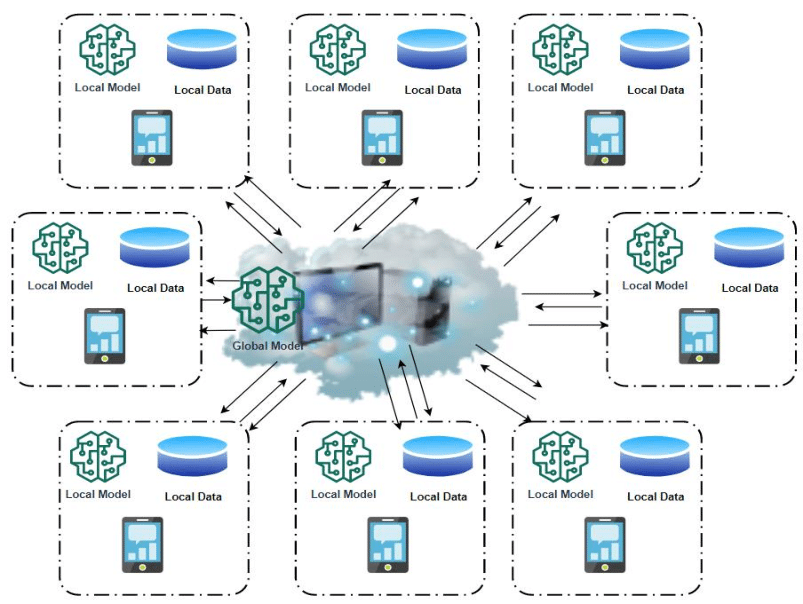

Algorithmic trading, commonly referred to as algo trading, is the process of using computer algorithms to perform trading tasks. These tasks range from deciding what stocks to buy or sell to determining the precise timing and execution of trades. By relying on sophisticated algorithms, market participants can execute trades at speeds and frequencies that human traders cannot match, thus gaining a competitive edge. One central decision facing practitioners of algo trading is the choice between utilizing local models or global models. This decision impacts not only the design and execution of trading strategies but also determines the dataset that algorithms will prioritize.

Local models in algo trading are specifically tailored to address particular markets or instruments, often considering localized economic indicators or market trends. These models can potentially identify and capitalize on specific regional market dynamics, providing insights that might be overlooked by broader models. In contrast, global models synthesize data across multiple markets, thereby offering a more comprehensive perspective. These models are particularly beneficial when aiming to understand overarching trends that span various regions and sectors.



The primary goal of this article is to elucidate the differences between local and global models in the context of algorithmic trading. By understanding their unique attributes and applications, traders can better align their strategies with their trading objectives, whether that involves honing in on niche market opportunities or capitalizing on large-scale global trends.

## Table of Contents

## Understanding Local Models

Local models are tailored to address the intricacies of specific markets or instruments by incorporating localized factors, such as regional economic indicators or market trends. This specialization enables local models to be acutely responsive to fluctuations and nuances within a particular market environment, potentially enhancing their predictive accuracy.

Localized factors play a significant role in the success of local models. These factors may include variables such as regional GDP growth rates, unemployment statistics, consumer confidence indices, or even local geopolitical developments. By embedding these elements, local models can detect patterns and movements that might be overlooked by broader, less focused approaches.

Moreover, the sensitivity of local models to regional market movements positions them as valuable tools for traders and investors who concentrate on particular geographical areas or niche markets. For instance, a local model could be fine-tuned for the energy market in a particular country, incorporating specific regional policies and market dynamics that influence supply and demand.

Mathematically, local models often employ techniques such as time series analysis or [machine learning](/wiki/machine-learning) algorithms that are calibrated specifically to the characteristics of the data from these localized markets. For example, a Python implementation might utilize libraries such as pandas and scikit-learn to preprocess data and train models that consider variables exclusive to the region of interest:

```python
import pandas as pd
from sklearn.model_selection import train_test_split
from sklearn.ensemble import RandomForestRegressor

# Load regional economic data
data = pd.read_csv('regional_market_data.csv')

# Preprocess and feature selection
features = data[['regional_indicator_1', 'market_trend_1', 'policy_factor_1']]
target = data['market_outcome']

# Split data into training and test sets
X_train, X_test, y_train, y_test = train_test_split(features, target, test_size=0.2, random_state=42)

# Train a local model using Random Forest
model = RandomForestRegressor(n_estimators=100, random_state=42)
model.fit(X_train, y_train)

# Test model accuracy
accuracy = model.score(X_test, y_test)
print(f'Model Accuracy: {accuracy:.2f}')
```

In this code snippet, a Random Forest model is trained using region-specific features, demonstrating how local models can be implemented to focus on particular market characteristics.

Despite their potential advantages, the scope of local models is naturally limited to the regions they are designed for. This specificity requires careful consideration when adapting these models to new regions or when attempting to scale their applications. While local models excel in capturing regional dynamics, they may lack the broader perspective offered by global models, which can synthesize and interpret worldwide market trends.

## Understanding Global Models

Global models in [algorithmic trading](/wiki/algorithmic-trading) are pivotal for analyzing and executing strategies across multiple markets simultaneously. These models aggregate and process vast amounts of data from an array of sources, including international financial markets, economic indicators, geopolitical events, and cross-market trends. By synthesizing this information, global models strive to provide comprehensive insights that surpass the capabilities of models limited by regional focus.

A key attribute of global models is their ability to identify patterns and correlations that may be invisible when examining a single market. By utilizing global datasets, these models can discern overarching trends that influence various assets and markets universally. For example, a global model can assess the impact of U.S. Federal Reserve policy changes not only on domestic markets but also on foreign exchanges, commodities, and emerging market equities.

Mathematically, global models often employ advanced statistical techniques and machine learning algorithms to handle high-dimensional data inputs. Techniques such as Principal Component Analysis (PCA) might be used to reduce dimensionality, capturing the most significant components of global market movements. Machine learning algorithms like random forests or neural networks could be trained to predict asset prices or market directions based on historical and real-time global data.

Here is a simple Python snippet illustrating the concept of using PCA to identify principal components in a global dataset:

```python
import numpy as np
from sklearn.decomposition import PCA

# Simulated global market data: rows are data points and columns are different market indicators
data = np.random.rand(1000, 20) 

# Initialize PCA model to capture major trends
pca = PCA(n_components=5)  # Reducing to 5 principal components
principal_components = pca.fit_transform(data)

# Explained variance by each principal component
print(pca.explained_variance_ratio_)
```

Global models face certain challenges, including the complexity of integrating diverse data sets and the computational resources needed for processing large volumes of information. However, their advantages in offering a holistic view often outweigh these difficulties, especially for strategies that require a broad understanding of interconnected markets.

The efficacy of global models lies in their capacity to facilitate a unified approach to trading strategy development, aiding traders and institutions in avoiding myopic decisions restricted to specific locales. By offering a panoramic view of market dynamics, global models empower traders to make informed decisions that can capitalize on worldwide opportunities.

## Pros and Cons of Local Models

Local models in algorithmic trading are highly valued for their ability to hone in on regional market nuances. These models leverage detailed, region-specific data such as local economic indicators, political events, and socio-cultural trends, offering enhanced sensitivity to fluctuations within a specific market. This sensitivity can potentially lead to more accurate predictions and, consequently, better-informed trading decisions within the targeted area. By focusing on a narrower scope, local models can effectively capture short-term, high-frequency market dynamics, allowing traders to capitalize on minute price changes and fleeting opportunities. 

However, the reliance on regional specificity can also present distinct limitations. As local models are designed to optimize for particular regions, they may struggle to incorporate or adapt to broader global market movements. This narrow focus might result in the exclusion of influential global trends, which could affect market behavior in unforeseen ways. Consequently, traders might miss out on significant opportunities or risk being blindsided by larger shifts in the international economic landscape. 

Moreover, local models require considerable recalibration when applied to new regions. Each market's unique characteristics demand tailored adjustments, which can be time-consuming and resource-intensive. A local model optimized for one market might underperform if indiscriminately applied to another without careful modification. Therefore, while local models offer the advantage of precision in certain contexts, they often necessitate a significant commitment of time and resources to maintain their relevance and applicability across varied market environments.

## Pros and Cons of Global Models

Global models in algorithmic trading are designed to analyze and act upon data derived from multiple markets, offering several advantages alongside notable drawbacks. One of the principal benefits is their capacity for wider applicability across a diverse array of financial markets. By utilizing data from various sources, global models can provide insights into broad market trends and dynamics that might be missed when focusing solely on local markets.

A key advantage of global models is their ability to identify overarching patterns and relationships between different markets. This breadth of analysis enables traders to recognize and capitalize on macroeconomic events that influence a range of assets concurrently. For instance, global geopolitical shifts or worldwide economic indicators can be integrated into a comprehensive model to predict broad market movements. This is particularly useful for traders engaging in diversified portfolios, where understanding inter-market relationships is crucial for optimizing strategy and mitigating risk.

However, global models are not without their disadvantages. A major limitation is their diminished sensitivity to local market conditions. While they offer extensive coverage, this can come at the expense of precision in niche markets. For example, a global model may overlook local anomalies or region-specific economic indicators that could be critical in crafting successful trading strategies for particular markets. This could result in potential inaccuracies, as local economic factors often significantly impact market behavior.

Moreover, global models tend to be more complex than their local counterparts, increasing development and implementation efforts. The comprehensive nature of these models necessitates handling large datasets, which can be computationally intensive and require substantial technological resources. Implementing such models calls for robust infrastructure and sophisticated algorithms, which might involve higher financial costs and time investments.

In conclusion, while global models are well-suited for capturing and leveraging diverse market trends on a broad scale, they require balancing against local insights to ensure precision and effectiveness in trading applications.

## Application in Algo Trading

Deciding between local and global models in algorithmic trading often hinges on specific trading strategies and overarching goals. Local models, by design, are attuned to the nuances of specific regional markets. They focus intensely on localized factors, which may include regional economic indicators, cultural spending habits, or indigenous market sentiment. Traders centering their strategies around particular geographical areas or market segments might find local models advantageous due to their heightened sensitivity to the local market's idiosyncrasies. For instance, a local model might excel in predicting stock movements in an emerging market by closely analyzing domestic monetary policy changes and their immediate impact on local stocks.

On the other hand, global models synthesize data from multiple markets to provide a macro-level perspective. This approach is particularly beneficial for traders seeking diversification and broader market insights. Global models can integrate knowledge from disparate regions to discern worldwide economic patterns, which might not be immediately apparent from local datasets alone. For example, a global model might identify a correlation between oil price fluctuations and currency valuations across multiple countries, providing traders with a holistic view of market dynamics.

The decision to employ local or global models affects risk management strategies as well. Local models may offer lower risk in their respective regional markets due to their targeted approach, while global models enable risk diversification by balancing exposures across various markets. Traders aiming for international diversification or those looking to leverage cross-market [arbitrage](/wiki/arbitrage) opportunities will likely benefit from global models' comprehensive frameworks.

Ultimately, the choice between local and global models depends on the trader's mission, whether seeking pinpoint accuracy in a single market or comprehensive coverage of multiple markets. This choice should be continuously evaluated as market conditions evolve and as advancements in computing power and data availability emerge, allowing for more sophisticated modelling techniques in algorithmic trading.

## Case Studies

Case studies provide valuable insights into the effectiveness of local and global models in algorithmic trading. They demonstrate how each model type can outperform the other under specific conditions and highlight the advantages of combining both for optimal trading results.

One notable case study involves the foreign exchange ([forex](/wiki/forex-system)) market, where a trading firm implemented both local and global models. The local model was tailored to capture nuances in the currency pair USD/EUR, factoring in regional economic indicators such as European Central Bank monetary policy announcements and U.S. employment data. The global model incorporated a broader set of macroeconomic indicators, including oil prices and global interest rates, to gauge the underlying strength of respective economies. The local model demonstrated superior performance during periods of regional economic releases, effectively predicting short-term market movements. In contrast, the global model excelled during global market events, such as geopolitical tensions, providing a more comprehensive risk assessment.

Another example can be found in equity markets, where a [hedge fund](/wiki/hedge-fund-trading-strategies) used a local model to trade stocks in the Japanese market and a global model to assess trends across the Asian region. The local model focused on domestic factors like Japan's GDP growth and stock market [liquidity](/wiki/liquidity-risk-premium), yielding high accuracy for short-term trading strategies. However, during broader economic shifts affecting multiple Asian markets, the global model provided a strategic advantage by identifying overarching trends not visible through the local lens. This approach enabled the fund to anticipate regional shifts and adjust portfolios accordingly, mitigating potential losses.

Furthermore, successful implementation of both models is illustrated by a commodities trading firm that used algorithmic strategies to trade [crude oil](/wiki/crude-oil) futures. The local model took into account inventory levels at key U.S. storage hubs, which was crucial for short-term trading strategies sensitive to domestic supply dynamics. Simultaneously, a global model integrating OPEC decisions and geopolitical factors like Middle East tensions allowed the firm to navigate longer-term market movements. This combination of models maximized trading profits and minimized risk exposure, underscoring the importance of integrating local and global insights.

These case studies illustrate that while local models offer precision in specific contexts, global models provide breadth, balancing the strengths and weaknesses inherent to each approach. Ultimately, aligning trading strategies with appropriate model choices — or a hybrid approach — is crucial for optimizing algorithmic trading outcomes across diverse market conditions.

## Conclusion

In algorithmic trading, both local and global models have distinct advantages and play significant roles dependent on specific trading objectives and market conditions. Local models excel in environments where a nuanced understanding of regional market dynamics is critical. These models provide heightened sensitivity to local economic indicators and market trends, offering potentially increased predictive accuracy within those regions. However, their specificity can also be a limitation, potentially constraining them to particular markets and requiring adaptations to be effective in other locales.

In contrast, global models aggregate and analyze data from a wide range of markets simultaneously. This holistic approach can uncover overarching trends and provide insights that may not be visible through a localized lens. While these models offer broad applicability and the ability to capitalize on trends that impact multiple markets, they may not adequately account for the intricacies of individual markets, which could lead to inaccuracies when regional variations are significant.

The decision to employ local or global models should stem from the trader’s strategic goals and the geographic focus of their trading activities. Traders concentrating on a specific region may find local models more advantageous, while those seeking diversification across various geographies might prefer global models to inform their trading strategies.

As algorithmic trading systems continue to evolve, advancements in [artificial intelligence](/wiki/ai-artificial-intelligence) and machine learning are expected to enhance the capabilities of both local and global models. These technologies will likely lead to more sophisticated models capable of better integrating local nuances and global trends, thus offering improved performance and adaptability. This progress underscores the continuous and dynamic nature of algorithmic trading, where the choice of model type will remain pivotal in navigating complex markets.

## References & Further Reading

[1]: ["Advances in Financial Machine Learning"](https://www.amazon.com/Advances-Financial-Machine-Learning-Marcos/dp/1119482089) by Marcos Lopez de Prado

[2]: ["Machine Learning for Algorithmic Trading"](https://github.com/stefan-jansen/machine-learning-for-trading) by Stefan Jansen

[3]: ["Algorithmic Trading: Winning Strategies and Their Rationale"](https://www.amazon.com/Algorithmic-Trading-Winning-Strategies-Rationale/dp/1118460146) by Ernie Chan

[4]: Zhang, J., Russell, E., Zang, Y., & Chen, S. (2020). ["A Survey on Machine Learning Models for Algorithmic Trading."](https://pubmed.ncbi.nlm.nih.gov/31902710/) arXiv preprint arXiv:2012.05780.

[5]: ["Quantitative Trading: How to Build Your Own Algorithmic Trading Business"](https://www.amazon.com/Quantitative-Trading-Build-Algorithmic-Business/dp/1119800064) by Ernest P. Chan

[6]: Park, C. H., & Irwin, S. H. (2007). ["What Do We Know About the Profitability of Technical Analysis?"](https://onlinelibrary.wiley.com/doi/abs/10.1111/j.1467-6419.2007.00519.x) Journal of Economic Surveys, 21(4), 786-826.