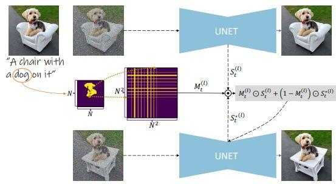

## Table of Contents

## What is localization in the context of machine learning?

Localization in machine learning refers to the task of identifying the specific location of an object within an image or a scene. It's like playing a game of "find the object," but instead of just saying if the object is there or not, you also need to point out exactly where it is. For example, if you're looking for a cat in a picture, localization would involve drawing a box around the cat to show its exact position.

This task is often used in computer vision applications, such as autonomous driving where a car needs to know the exact position of other vehicles or pedestrians. Localization can be done using different techniques, but one common method is to use a convolutional neural network (CNN) to analyze the image and predict the coordinates of the bounding box around the object. This helps the machine not only to recognize what is in the image but also to understand where it is located, which is crucial for many real-world applications.

## Why is localization important in computer vision and robotics?

Localization is super important in computer vision and robotics because it helps machines understand where things are in the world around them. Imagine you're a robot trying to navigate a room. If you can't tell where the furniture is, you might bump into it! By using localization, a robot can see an object, like a chair, and know exactly where that chair is in the room. This helps the robot move around safely and do tasks like picking up objects or avoiding obstacles.

In computer vision, localization is key for tasks like object tracking in videos or helping self-driving cars know where other cars and pedestrians are on the road. For example, if a self-driving car can pinpoint the exact location of a pedestrian, it can make better decisions about when to stop or slow down. This makes the car safer and more reliable. Without localization, the car might see the pedestrian but not know where they are, which could lead to accidents. So, localization is like giving machines a better sense of their surroundings, making them smarter and more useful.

## What are the basic principles behind localization models?

Localization models work by figuring out where things are in a picture or a scene. They do this by looking at the whole image and then focusing on specific parts to find and draw a box around an object. This is often done using a type of computer program called a convolutional neural network (CNN). The CNN looks at different parts of the image and tries to guess where the object is. It does this by breaking the image into smaller pieces and then figuring out which piece has the object in it. Once it finds the right piece, it draws a box around it to show where the object is located.

To make the guessing more accurate, localization models use something called a loss function. This function helps the model know how well it's doing at finding the right spot for the object. If the box the model draws is far from where the object really is, the loss function will be high, telling the model it needs to do better. If the box is close to the right spot, the loss function will be low, showing the model is doing a good job. Over time, the model learns to draw better and better boxes by adjusting based on the feedback from the loss function. This way, the model gets better at finding the exact location of objects in pictures.

## How does ORB-SLAM2 work as a localization model?

ORB-SLAM2 is a cool system that helps robots and cameras figure out where they are and where they're going. It uses something called ORB features, which are like little markers in the pictures that the camera sees. When the camera moves around, ORB-SLAM2 looks at these markers to understand how the camera is moving and where it is in the world. It's like playing a game of "connect the dots" but in 3D! ORB-SLAM2 can do three main things: tracking where the camera is right now, mapping the world around it, and figuring out where the camera has been before. This helps the robot or camera navigate without getting lost.

The way ORB-SLAM2 works is pretty smart. It starts by finding the ORB features in the pictures and then uses these features to guess where the camera is. It keeps track of these guesses over time and builds a map of the world. If the camera sees a place it's been before, ORB-SLAM2 can use that information to make its guesses even better. This is called loop closing, and it's like the camera saying, "Hey, I've been here before!" By doing all this, ORB-SLAM2 can help robots and cameras move around and explore new places without getting lost. It's like having a super smart GPS that works inside buildings and in new environments.

## What are the key features of ORB-SLAM2 that make it effective?

ORB-SLAM2 is really good at figuring out where a camera is and mapping the world around it. It uses ORB features, which are like special markers in the pictures the camera sees. These markers help the system understand how the camera is moving and where it is. One cool thing about ORB-SLAM2 is that it can track the camera's position in real-time, which means it can keep up with the camera as it moves around. It also builds a map of the environment, so it knows what the place looks like. This helps a lot when the camera goes back to a spot it's seen before because ORB-SLAM2 can recognize it and use that information to be more accurate.

Another key feature of ORB-SLAM2 is its ability to close loops. This means that if the camera sees a place it's been before, the system can connect the old information with the new information. It's like the camera saying, "Oh, I've been here before!" This helps make the map and the camera's position even more accurate. ORB-SLAM2 is also good at working in different environments, whether it's inside a building or outside. It can handle changes in lighting and even small changes in the scene. All these features make ORB-SLAM2 a very effective tool for robots and cameras to navigate and explore without getting lost.

## How does IoU-Net improve upon traditional localization methods?

IoU-Net improves upon traditional localization methods by being better at figuring out where objects are in pictures. Traditional methods often use something called Intersection over Union (IoU) to see how well they're doing at drawing boxes around objects. IoU is like a score that tells how much the guessed box overlaps with the real box. If the guessed box is far from the real box, the IoU score is low, and if it's close, the score is high. IoU-Net makes this better by not just guessing one box but by looking at many possible boxes and picking the best one. This makes the guesses more accurate because it considers more options before deciding.

Another way IoU-Net improves things is by using a special kind of neural network that can learn from its mistakes better. Traditional methods might have a hard time if the object in the picture is a bit different from what they've seen before. But IoU-Net can handle these changes better because it's designed to be more flexible. It looks at the whole picture and all the possible boxes it could draw, then picks the one that fits best. This makes it more reliable in different situations, like when the lighting changes or the object is partly hidden. By being smarter about how it guesses and learns, IoU-Net can do a better job at finding objects in pictures.

## What is the role of fragmentation in localization models?

Fragmentation in localization models helps by breaking down the task of finding objects into smaller, easier parts. Imagine you're trying to find a toy in a big messy room. Instead of looking at the whole room at once, you might look at smaller areas one by one. That's what fragmentation does in localization models. It divides the image into smaller pieces, or fragments, so the model can focus on finding the object in each piece. This can make the model more accurate because it's easier to find something in a small area than in a big one.

By using fragmentation, localization models can also handle complex scenes better. If there are many objects in the picture, or if the objects are partly hidden, fragmentation helps the model look at different parts of the image separately. This way, the model can find all the objects more reliably, even if they're hard to see. So, fragmentation makes the job of finding objects in pictures easier and more accurate for the model.

## Can you explain the process of training a localization model like IoU-Net?

Training a localization model like IoU-Net involves feeding it lots of pictures with objects in them, along with the correct locations of those objects. The model starts by making guesses about where the objects are in each picture. It does this by drawing boxes around what it thinks are the objects. To help the model learn, we use something called a loss function. The loss function compares the model's guesses to the real locations of the objects and tells the model how well it's doing. If the model's guesses are far from the real locations, the loss function will be high, showing that the model needs to improve. If the guesses are close, the loss function will be low, showing the model is doing a good job. Over time, the model adjusts its guesses to lower the loss function, getting better at finding objects in pictures.

During training, IoU-Net uses a special trick to improve its guesses. It looks at many different possible boxes for each object and picks the one that fits best. This is different from traditional methods that might only guess one box. By considering more options, IoU-Net can be more accurate. The model also learns to handle different situations, like changes in lighting or objects that are partly hidden. This makes it more reliable in real-world use. As the model keeps training, it gets better and better at drawing the right boxes around objects, making it a powerful tool for tasks like object detection and tracking.

## What are some common challenges faced when implementing localization models in real-world scenarios?

When implementing localization models in real-world scenarios, one common challenge is dealing with changing environments. For example, the lighting might change throughout the day, or objects might move around. This can make it hard for the model to recognize and locate objects accurately. Another challenge is handling occlusions, where parts of an object are hidden by other things in the scene. This can confuse the model and make it harder to draw the right box around the object. Additionally, real-world scenes often have a lot of clutter and background noise, which can distract the model and make it less accurate.

Another difficulty is the need for large amounts of high-quality training data. Localization models need to see many different examples to learn well, but collecting and labeling this data can be time-consuming and expensive. If the training data doesn't cover all the situations the model might encounter, it might not work well in new environments. Also, computational resources can be a challenge. Running these models, especially in real-time applications like autonomous driving, requires powerful hardware, which can be costly and not always available. Despite these challenges, with careful design and ongoing improvements, localization models can become more robust and effective in real-world use.

## How do localization models handle dynamic environments?

Localization models have to work hard to keep up with dynamic environments where things are always moving or changing. Imagine a robot trying to find its way through a busy shopping mall. People are walking around, lights are changing, and stores might even move their displays. To handle this, the model needs to be smart about updating its guesses about where things are. It does this by constantly looking at new pictures and adjusting its understanding of the world. For example, if a person walks in front of a sign the robot is using to navigate, the model needs to recognize that the sign is still there, just temporarily hidden.

One way localization models handle dynamic environments is by using techniques like tracking and prediction. When something moves, the model can follow it over time, using past information to guess where it will be next. This is like playing a game of "guess where the ball will go" but with objects in a scene. The model might also use special algorithms to quickly adapt to changes, making sure it can still find and locate objects even when the environment is not staying the same. By being flexible and learning from new data all the time, localization models can do a better job in places where things are always on the move.

## What advanced techniques can be used to enhance the accuracy of ORB-SLAM2?

One way to make ORB-SLAM2 more accurate is by using something called loop closure detection. This means that when the camera sees a place it's been before, ORB-SLAM2 can use that information to correct any mistakes it might have made along the way. It's like the camera saying, "Oh, I've been here before, so I know where I am now!" By doing this, ORB-SLAM2 can make its map of the world more accurate and help the camera stay on track even in tricky environments. Another technique is to use more advanced feature descriptors instead of just ORB features. These new descriptors can be better at handling changes in lighting or when objects move around, making the system more reliable in dynamic settings.

Another advanced technique is to use deep learning to help ORB-SLAM2. Deep learning can be used to improve how the system recognizes and tracks objects in the scene. For example, a neural network can be trained to understand the environment better and help ORB-SLAM2 make better guesses about where things are. This can make the system more robust and able to handle different situations, like when the camera moves quickly or the lighting changes a lot. By combining these advanced techniques, ORB-SLAM2 can become even better at figuring out where it is and mapping the world around it.

## How can the performance of localization models like IoU-Net be quantitatively evaluated?

The performance of localization models like IoU-Net can be quantitatively evaluated using metrics like Intersection over Union (IoU). IoU is a measure of how well the model's predicted bounding box matches the actual bounding box around an object. The formula for IoU is $$ \text{IoU} = \frac{\text{Area of Overlap}}{\text{Area of Union}} $$. If the IoU score is high, it means the model's guess is very close to the real location of the object. If the score is low, the guess is not very accurate. Researchers often set a threshold, like 0.5, to decide if a prediction is good enough. If the IoU is above the threshold, the prediction is considered correct.

Another important metric is the mean Average Precision (mAP). mAP looks at how well the model can find all the objects in a picture, not just one. It considers both how accurate the model is and how many objects it can find. To calculate mAP, you first find the precision and recall for different confidence thresholds. Precision is how many of the model's guesses are correct, and recall is how many of the actual objects the model found. Then, you calculate the average precision for each class of objects and take the mean across all classes. A higher mAP score means the model is better at finding and locating objects in different situations.