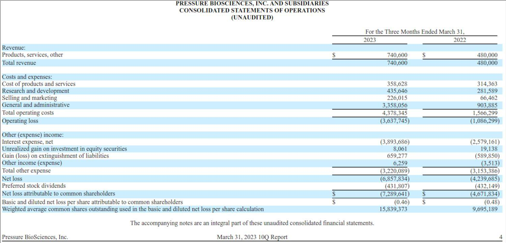

## Table of Contents

## What is a profit and loss statement?

A profit and loss statement, often called a P&L statement, is a financial report that shows how much money a business made or lost over a certain period, like a month or a year. It lists all the money coming into the business from sales and other sources, and all the money going out for expenses like rent, salaries, and supplies. By comparing the total income to the total expenses, the P&L statement shows if the business made a profit or suffered a loss.

This statement is very important for business owners and managers because it helps them understand how well the business is doing financially. They can see which parts of the business are making money and which parts are costing too much. This information helps them make better decisions about where to spend money and how to grow the business. It's also useful for investors and lenders who want to know if the business is a good investment or if it can pay back loans.

## Why is it important to locate a company's profit and loss statement?

Locating a company's profit and loss statement is important because it gives a clear picture of how the company is doing financially. It shows how much money the company made and how much it spent over a certain time. This helps people understand if the company is making a profit or losing money. For business owners and managers, knowing this information is key to making smart decisions about where to spend money and how to improve the business.

For investors and lenders, the profit and loss statement is crucial because it helps them decide if the company is a good investment or if it can pay back loans. If a company is making a profit, it might be a good place to invest money. If it's losing money, investors might want to be careful. Lenders also look at this statement to see if the company can afford to pay back what it borrows. So, finding and understanding a company's profit and loss statement is important for anyone interested in the company's financial health.

## Where can I find a company's profit and loss statement?

You can find a company's profit and loss statement in their financial reports. These reports are usually shared with the public if the company is big and has to follow rules from the government. You can look at the company's website, usually in a section called "Investor Relations" or "Financials." Sometimes, you can also find these reports on websites that collect financial information about many companies.

If the company is smaller and doesn't have to share its financials with everyone, you might need to ask them directly for the profit and loss statement. You can contact their accounting or finance department to see if they will give you the information. Sometimes, if you are an investor or a lender, the company might share this with you to show how they are doing financially.

## What are the key components of a profit and loss statement?

A profit and loss statement has several key parts that help you understand a company's money situation. The first part is revenue, which is all the money the company earns from selling its products or services. This can also include other income like interest or rent from properties. The next part is the cost of goods sold (COGS), which is the money spent to make or buy the products the company sells. Subtracting COGS from revenue gives you the gross profit, which shows how much money the company makes after paying for what it sells.

The second part of the statement includes operating expenses, which are costs to run the business day-to-day. This includes things like rent, salaries, utilities, and marketing costs. Subtracting these operating expenses from the gross profit gives you the operating profit or loss, which shows how well the company is doing with its main business activities. There are also other expenses or incomes, like interest on loans or taxes, that need to be added or subtracted to get to the net profit or loss. This final number tells you if the company made money or lost money overall during the period.

## How often are profit and loss statements typically released?

Profit and loss statements are usually released by big companies every three months, or quarterly. This means you can see how the company did financially every few months. It helps people keep track of the company's progress throughout the year. Sometimes, these big companies also release a yearly profit and loss statement to sum up how they did over the whole year.

Smaller companies might not release their profit and loss statements as often. They might only share them once a year, or they might not share them with the public at all. It depends on the rules they have to follow and what they want to show to people outside the company. If you are an investor or a lender, you might be able to get these statements more often if you ask the company directly.

## Can I access a profit and loss statement for a private company?

Accessing a profit and loss statement for a private company can be a bit harder than for a public company. Private companies don't have to share their financial information with everyone. They might only share it with certain people, like investors or lenders, who need to know how the company is doing financially. If you are one of these people, you might be able to ask the company directly for their profit and loss statement.

If you're not an investor or a lender, it can be tough to get a private company's profit and loss statement. You might need to talk to someone in the company's finance or accounting department. They might be willing to share some information with you, but they don't have to. Sometimes, private companies will share a little bit of financial information on their website or in press releases, but it won't be as detailed as a full profit and loss statement.

## What is the difference between a profit and loss statement and an income statement?

A profit and loss statement and an income statement are actually the same thing, just with different names. Both show how much money a business made and spent over a certain time, like a month or a year. They list all the money coming in from sales and other sources, and all the money going out for things like rent, salaries, and supplies. By comparing the total income to the total expenses, they show if the business made a profit or had a loss.

The difference in names might come from where you are or the kind of business. In some places, people might call it a profit and loss statement, while in others, they might use income statement. But no matter what it's called, the purpose is the same: to give a clear picture of the business's financial health. This helps business owners, investors, and lenders make smart decisions about the company.

## How can I interpret the data in a profit and loss statement?

Interpreting a profit and loss statement is all about understanding how a business is doing with its money. First, you look at the revenue, which is all the money the business made from selling things or services. Then, you subtract the cost of goods sold (COGS), which is what it cost to make or buy those things. The difference between revenue and COGS is the gross profit. This tells you how much money the business makes after paying for what it sells. If the gross profit is big, it means the business is doing well at selling its products or services.

Next, you need to look at the operating expenses, which are the costs to run the business every day, like rent, salaries, and utilities. You subtract these from the gross profit to get the operating profit or loss. This shows how well the business is doing with its main activities. If the operating profit is positive, the business is making money from its main work. Finally, you add or subtract any other income or expenses, like interest on loans or taxes, to find the net profit or loss. This final number tells you if the business made money or lost money overall during the time period. By looking at these numbers, you can see where the business is doing well and where it might need to improve.

## What financial ratios can be derived from a profit and loss statement?

From a profit and loss statement, you can figure out some important financial ratios that help you understand how a business is doing. One ratio is the gross profit margin, which you find by dividing the gross profit by the revenue and then multiplying by 100 to get a percentage. This tells you what part of each dollar of sales is left after paying for the things the business sells. Another ratio is the operating profit margin, which you get by dividing the operating profit by the revenue and multiplying by 100. This shows how much money the business makes from its main activities after paying for daily costs like rent and salaries.

Another useful ratio is the net profit margin, which you calculate by dividing the net profit by the revenue and multiplying by 100. This tells you what part of each dollar of sales is left as profit after all expenses, including taxes and interest, are paid. These ratios help you see if the business is good at making money and managing its costs. By comparing these ratios over time or with other businesses, you can see if the company is getting better or worse at making a profit.

## How do I compare profit and loss statements across different companies?

To compare profit and loss statements across different companies, you need to look at the same time periods for each company. This means comparing their quarterly or yearly statements. You should also make sure you're comparing similar types of businesses, because different industries can have very different costs and ways of making money. For example, a tech company might have different expenses than a restaurant. Start by looking at the revenue to see how much money each company made from selling their products or services. Then, compare the cost of goods sold (COGS) to see how much it cost them to make or buy those products. This will help you understand how efficient each company is at turning sales into profit.

After looking at revenue and COGS, compare the operating expenses of each company. These are the costs to run the business every day, like rent, salaries, and utilities. By subtracting these from the gross profit, you can see the operating profit or loss for each company. This tells you how well each company is doing with its main activities. Finally, look at the net profit or loss, which shows how much money each company made or lost after all expenses, including taxes and interest, are paid. By comparing these numbers, you can see which company is better at making money and managing costs. You can also use financial ratios like gross profit margin, operating profit margin, and net profit margin to make these comparisons easier.

## What are some common red flags to look for in a profit and loss statement?

When you look at a profit and loss statement, there are some warning signs or red flags to watch out for. One big red flag is if the company's revenue is going down over time. This means they are selling less stuff, which can be a problem. Another red flag is if the cost of goods sold (COGS) is going up faster than the revenue. This means it's costing them more to make or buy what they sell, and they might not be making as much profit. Also, if the operating expenses are growing a lot, it could mean the company is spending too much on things like rent or salaries, which can hurt their profits.

Another thing to watch for is if the company's net profit is shrinking or if they are showing a net loss. This means after paying all their bills, they are not making money, or they are losing money. If you see that taxes or interest expenses are really high, it could be a sign that the company has a lot of debt, which is risky. By keeping an eye out for these red flags, you can get a better idea of whether a company might be facing financial trouble.

## How can advanced analytical tools enhance the analysis of profit and loss statements?

Advanced analytical tools can make it easier to understand profit and loss statements by doing quick calculations and showing the data in different ways. These tools can help you find patterns and trends that might be hard to see if you're just looking at numbers on a page. For example, they can create graphs and charts that show how a company's revenue and expenses have changed over time. This helps you see if the company is getting better or worse at making money. Also, these tools can do complicated math really fast, so you can figure out things like profit margins and other financial ratios without having to do it all by hand.

These tools can also help you compare a company's profit and loss statement with other companies or with the same company's past performance. They can do this quickly and accurately, which saves a lot of time. For example, if you want to see how a company's profit margin compares to its competitors, an analytical tool can show you this information side by side. This makes it easier to see if a company is doing better or worse than others in its industry. By using these tools, you can get a deeper understanding of a company's financial health and make better decisions based on the data.

## What is the Understanding of the Profit and Loss Statement?

The Profit and Loss (P&L) statement is an essential financial document that outlines a company's financial performance over a specific period, typically a quarter or a fiscal year. It encapsulates the company's revenues, expenses, and profits, providing a clear picture of its operational efficiency and profitability.

A P&L statement comprises several key metrics that are crucial for evaluating a company's profitability:

1. **Revenues**: This section records all the income generated from the sale of goods and services. It is the primary source of income for any business and serves as the foundation for profit calculation.

2. **Expenses**: These include various costs incurred by the company. They are usually categorized into:
   - **Cost of Goods Sold (COGS)**: Direct costs associated with the production of goods sold by the company.
   - **Operating Expenses**: These are the day-to-day expenses required to run the business, such as salaries, rent, and utilities.

3. **Gross Profit**: Calculated as the difference between revenues and COGS, gross profit indicates the efficiency of a company in managing its production costs. The formula is:
$$
   \text{Gross Profit} = \text{Revenues} - \text{COGS}

$$

4. **Operating Income**: Also known as operating profit, this metric subtracts operating expenses from gross profit. It reflects the company's earnings from its core business operations:
$$
   \text{Operating Income} = \text{Gross Profit} - \text{Operating Expenses}

$$

5. **Net Income**: This is the residual income after all expenses, including taxes and interest, have been deducted. Often referred to as the "bottom line," it serves as the ultimate indicator of a company’s profitability:
$$
   \text{Net Income} = \text{Operating Income} - (\text{Interest} + \text{Taxes})

$$

Businesses utilize P&L statements not only for internal analysis to identify trends and areas for cost efficiency but also to communicate their financial performance to external stakeholders, such as investors, creditors, and regulatory bodies. This transparency helps build trust and facilitates strategic decision-making and financial planning. Through these statements, companies can assess their financial health and make informed decisions to foster growth and sustainability.

## What are the components of a Profit and Loss Statement?

A Profit and Loss (P&L) statement, also known as an income statement, is an essential financial document that reveals a company's revenue and expenses over a specified period. The main components of a P&L statement provide a comprehensive view of financial health and profitability. Below is an in-depth look at these components:

**Revenue:** Revenue refers to the total income generated by a company from its core business activities, typically from the sale of goods or services. It serves as the starting point for evaluating a company's financial performance. Revenue can be derived from various sources, such as product sales, service fees, or interest from financial investments. It is important to differentiate between operating revenue, generated from primary activities, and non-operating revenue, which comes from secondary sources like asset sales.

**Cost of Goods Sold (COGS):** COGS represents the direct costs associated with producing goods or delivering services sold by a business. It includes expenses like raw materials, labor, and manufacturing overhead involved in production. By calculating COGS, a company can determine its gross profit, which is obtained by subtracting COGS from revenue:

$$

\text{Gross Profit} = \text{Revenue} - \text{COGS} 
$$

Gross profit is a crucial metric, reflecting the efficiency of production processes and the cost-effectiveness of operations.

**Operating Expenses:** These are the day-to-day costs necessary for maintaining business operations but not directly tied to any specific product or service. Operating expenses include items like salaries, rent, utilities, marketing, and administrative costs. Efficient management of operating expenses is crucial for enhancing net profit and overall business sustainability. 

**Net Income:** Net income, or the "bottom line," is the residual income that remains after all operating and non-operating expenses, interest, taxes, and other financial obligations have been deducted from total revenue. It is a key indicator of a company's profitability. The formula for calculating net income is:

$$

\text{Net Income} = \text{Revenue} - (\text{COGS} + \text{Operating Expenses} + \text{Taxes} + \text{Interest})
$$

Net income provides stakeholders, including investors and management, a clear picture of the company's financial performance and potential for future growth.

Understanding these components helps businesses assess their financial operations, identify areas for cost reduction, and make informed decisions that drive profitability and strategic growth.

## References & Further Reading

[1]: ["Financial Reporting and Analysis"](https://www.wallstreetmojo.com/financial-reporting/) by Charles H. Gibson

[2]: ["Financial Modeling"](https://en.wikipedia.org/wiki/Financial_modeling) by Simon Benninga

[3]: ["The Basics of Financial Statement Analysis"](https://link.springer.com/content/pdf/10.1007/978-3-031-28267-6_6) from CFA Institute

[4]: ["Algorithmic Trading: Winning Strategies and Their Rationale"](https://www.wiley.com/en-us/Algorithmic+Trading%3A+Winning+Strategies+and+Their+Rationale-p-9781118746912) by Ernest P. Chan

[5]: ["Valuation: Measuring and Managing the Value of Companies"](https://www.amazon.com/Valuation-Measuring-Managing-Companies-Finance/dp/1119610885) by McKinsey & Company Inc.