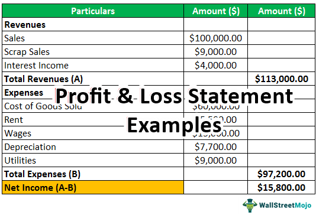

The profit and loss (P&L) statement stands as a cornerstone in the financial and corporate domain, playing a vital role in assessing a company's fiscal well-being. Often referred to as the income statement, this financial document provides an extensive overview of a company's revenues, costs, and profitability over a given timeframe. By detailing these financial metrics, the P&L statement enables businesses to gauge operational success and make informed financial decisions.

For companies engaged in algorithmic trading, the P&L statement assumes heightened importance. The precision and comprehensiveness of this financial document are crucial for shaping investment strategies and managing associated risks. Given the data-driven nature of algorithmic trading, having access to accurate and detailed financial information is essential. Such information aids in the formation of algorithms that predict market movements and optimize trading decisions. The reliance on historical data encapsulated in P&L statements allows traders to refine their models, thereby enhancing profitability and reducing exposure to financial volatility.



## Table of Contents

## Understanding the Profit and Loss Statement

The Profit and Loss (P&L) statement is an essential financial document that outlines a company's financial performance over a specific period, typically a quarter or a fiscal year. It encapsulates the company's revenues, expenses, and profits, providing a clear picture of its operational efficiency and profitability.

A P&L statement comprises several key metrics that are crucial for evaluating a company's profitability:

1. **Revenues**: This section records all the income generated from the sale of goods and services. It is the primary source of income for any business and serves as the foundation for profit calculation.

2. **Expenses**: These include various costs incurred by the company. They are usually categorized into:
   - **Cost of Goods Sold (COGS)**: Direct costs associated with the production of goods sold by the company.
   - **Operating Expenses**: These are the day-to-day expenses required to run the business, such as salaries, rent, and utilities.

3. **Gross Profit**: Calculated as the difference between revenues and COGS, gross profit indicates the efficiency of a company in managing its production costs. The formula is:
$$
   \text{Gross Profit} = \text{Revenues} - \text{COGS}

$$

4. **Operating Income**: Also known as operating profit, this metric subtracts operating expenses from gross profit. It reflects the company's earnings from its core business operations:
$$
   \text{Operating Income} = \text{Gross Profit} - \text{Operating Expenses}

$$

5. **Net Income**: This is the residual income after all expenses, including taxes and interest, have been deducted. Often referred to as the "bottom line," it serves as the ultimate indicator of a company’s profitability:
$$
   \text{Net Income} = \text{Operating Income} - (\text{Interest} + \text{Taxes})

$$

Businesses utilize P&L statements not only for internal analysis to identify trends and areas for cost efficiency but also to communicate their financial performance to external stakeholders, such as investors, creditors, and regulatory bodies. This transparency helps build trust and facilitates strategic decision-making and financial planning. Through these statements, companies can assess their financial health and make informed decisions to foster growth and sustainability.

## Components of a Profit and Loss Statement

A Profit and Loss (P&L) statement, also known as an income statement, is an essential financial document that reveals a company's revenue and expenses over a specified period. The main components of a P&L statement provide a comprehensive view of financial health and profitability. Below is an in-depth look at these components:

**Revenue:** Revenue refers to the total income generated by a company from its core business activities, typically from the sale of goods or services. It serves as the starting point for evaluating a company's financial performance. Revenue can be derived from various sources, such as product sales, service fees, or interest from financial investments. It is important to differentiate between operating revenue, generated from primary activities, and non-operating revenue, which comes from secondary sources like asset sales.

**Cost of Goods Sold (COGS):** COGS represents the direct costs associated with producing goods or delivering services sold by a business. It includes expenses like raw materials, labor, and manufacturing overhead involved in production. By calculating COGS, a company can determine its gross profit, which is obtained by subtracting COGS from revenue:

$$

\text{Gross Profit} = \text{Revenue} - \text{COGS} 
$$

Gross profit is a crucial metric, reflecting the efficiency of production processes and the cost-effectiveness of operations.

**Operating Expenses:** These are the day-to-day costs necessary for maintaining business operations but not directly tied to any specific product or service. Operating expenses include items like salaries, rent, utilities, marketing, and administrative costs. Efficient management of operating expenses is crucial for enhancing net profit and overall business sustainability. 

**Net Income:** Net income, or the "bottom line," is the residual income that remains after all operating and non-operating expenses, interest, taxes, and other financial obligations have been deducted from total revenue. It is a key indicator of a company's profitability. The formula for calculating net income is:

$$

\text{Net Income} = \text{Revenue} - (\text{COGS} + \text{Operating Expenses} + \text{Taxes} + \text{Interest})
$$

Net income provides stakeholders, including investors and management, a clear picture of the company's financial performance and potential for future growth.

Understanding these components helps businesses assess their financial operations, identify areas for cost reduction, and make informed decisions that drive profitability and strategic growth.

## Significance of P&L Statements in Company Finance

The Profit and Loss (P&L) statement is a crucial tool for evaluating a company's business operations, particularly in identifying areas where costs can be reduced or efficiency improved. By providing a comprehensive view of a company's revenues and expenses over a specific period, the P&L statement enables managers to discern patterns and anomalies in financial performance, guiding them toward targeted actions for operational enhancements. 

For financial planning and analysis, the P&L statement is indispensable. It serves as a core document for assessing operational effectiveness and facilitating the optimization of financial resource allocation. By comparing P&L statements over different periods, businesses can identify trends in profitability and revenue generation, assisting in long-term planning and performance benchmarking. This insight into operational performance is crucial for aligning resources with strategic objectives and maximizing the effectiveness of financial plans.

Additionally, P&L statements play a key role in the strategic decision-making processes of companies, supporting activities such as budgeting, forecasting, and investment analysis. When formulating budgets, P&L data helps determine the allocation of financial resources to various departments or projects, ensuring that funds are directed toward the most profitable or strategically important areas. In forecasting, P&L statements provide historical data that can be used to model future financial performance, allowing firms to anticipate market conditions and adjust strategies proactively. This capability is vital for maintaining competitiveness and driving growth in dynamic business environments.

In investment analysis, P&L statements offer insights into a company's profitability and cost structure, which are crucial for evaluating potential investment opportunities. For investors, understanding these aspects can inform decisions about whether to acquire or divest from specific companies or sectors. By leveraging P&L data, firms can make informed investment decisions that align with their strategic goals and risk tolerance levels.

In summary, P&L statements are not merely records of past financial performance but are essential tools for assessing current operations and strategically planning for the future. By providing a detailed breakdown of income and expenses, these documents inform a wide range of business activities, ensuring that companies remain agile and well-positioned to capitalize on growth opportunities.

## Role of P&L in Algorithmic Trading

Algorithmic trading, characterized by the use of computer algorithms to trade financial securities at high speeds and high frequencies, heavily depends on the accuracy and relevance of financial data. Among the datasets used, the Profit and Loss (P&L) statement holds particular significance due to the insights it offers into a company’s operational performance.

The P&L statement plays an essential role in [algorithmic trading](/wiki/algorithmic-trading) by providing revenue, cost, and profit data, which are invaluable for refining trading models. By analyzing these financial statements, algorithmic traders can back-test their trading strategies. Back-testing involves running trading algorithms on historical data to assess potential profitability and risk, using metrics like gross profit and net income from past P&L statements as benchmarks. For instance, a trader employing a [machine learning](/wiki/machine-learning) model can use historical P&L data to train the model, enabling the prediction of future stock prices based on identifiable patterns.

Furthermore, P&L data enhances the forecasting capability of algorithmic systems. Since these statements offer periodic snapshots of a company’s financial performance, algorithms analyze trends in revenue growth or cost management to anticipate future market movement. For example, an increasing trend in operating income might be interpreted as a positive signal, prompting the algorithm to suggest a buy action on the company’s stock.

Additionally, predictive analytics, often utilized in algorithmic trading, relies on structured data input like that available from P&L statements. With Python, traders can employ libraries such as Pandas for data manipulation, and Scikit-learn for building predictive models. Here’s an illustrative snippet of Python code that loads historical P&L data and prepares it for a machine learning model:

```python
import pandas as pd
from sklearn.model_selection import train_test_split
from sklearn.linear_model import LinearRegression

# Load P&L historical data
data = pd.read_csv('historical_pnl_data.csv')

# Features and target variable
features = data[['Revenue', 'COGS', 'OperatingExpense']]
target = data['NetIncome']

# Splitting the dataset into training and testing sets
X_train, X_test, y_train, y_test = train_test_split(features, target, test_size=0.2, random_state=42)

# Building the predictive model
model = LinearRegression()
model.fit(X_train, y_train)

# Predicting the net income
predictions = model.predict(X_test)
```

In summary, P&L statements are vital to the algorithmic trading process. They offer the necessary financial snapshot that helps traders back-test strategies, forecast future market trends, and refine their algorithms to optimize trading results.

## Case Study: Successful Integration of P&L in Algo Trading

One notable example of the successful integration of Profit and Loss (P&L) analysis in algorithmic trading comes from a leading financial firm that leveraged this financial document to optimize its trading algorithms. By meticulously examining historical P&L data, the firm was able to refine its trading strategies, identifying patterns and insights that had previously gone unnoticed.

The firm's approach involved using the P&L statements to extract key metrics such as revenue growth rates, cost structures, and net income trends. This data served as the foundation for back-testing trading algorithms, a process integral to ensuring the strategies were robust and effective in diverse market conditions. Python, with its extensive libraries for data analysis and machine learning, was the tool of choice for this task.

```python
import pandas as pd
from sklearn.model_selection import train_test_split
from sklearn.ensemble import RandomForestClassifier

# Load historical P&L data as a DataFrame
data = pd.read_csv('historical_pnl_data.csv')

# Preprocess data: feature engineering, handling missing values, etc.
data['Revenue_Growth'] = data['Revenue'].pct_change().fillna(0)
data['Expense_Ratio'] = data['Total_Expenses'] / data['Revenue']
data = data.dropna()

X = data[['Revenue_Growth', 'Expense_Ratio', 'Net_Profit_Margin']]
y = data['Profitable_Trade_Indicator']

# Split into training and test datasets
X_train, X_test, y_train, y_test = train_test_split(X, y, test_size=0.2, random_state=42)

# Initialize and train Random Forest Classifier
model = RandomForestClassifier(n_estimators=100, random_state=42)
model.fit(X_train, y_train)

# Evaluate the model
accuracy = model.score(X_test, y_test)
print(f'Model Accuracy: {accuracy * 100:.2f}%')
```

This code snippet demonstrates using a Random Forest Classifier to identify profitable trades based on features engineered from P&L data, like revenue growth and expense ratios. The model's accuracy indicated the extent to which P&L insights could predict successful trading outcomes.

The integration of P&L analysis not only resulted in improved return rates but also facilitated a deeper understanding of the market dynamics affecting profitability. By using historical data to continuously refine its algorithms, the firm maintained a competitive edge, showcasing how the meticulous analysis of financial statements can yield significant advancements in algorithmic trading performance.

## Conclusion

A comprehensive understanding of the profit and loss (P&L) statement is indispensable for companies, particularly those engaged in algorithmic trading. The P&L statement serves as a crucial resource for traders and financial analysts by offering a detailed account of a company's financial performance. By examining revenues, costs, and overall profitability, firms can gain insights that significantly enhance decision-making and optimize trading performance.

For traders, especially in algorithmic environments, the P&L statement provides historical data that can refine trading strategies. The availability of precise revenue and expense figures allows for effective back-testing of algorithmic models, which can lead to improved predictions about market movements and potential returns. Furthermore, by understanding cost structures and profitability metrics, traders can formulate strategies that align with financial forecasts and risk management objectives.

Incorporating P&L analysis into financial planning is not only a tactical advantage but also a strategic imperative. It supports sustainable growth by identifying areas where efficiency can be improved, whether through cost reductions or revenue enhancements. Enhanced P&L insights facilitate competitive advantage by enabling a proactive approach to budgeting and investment decisions, ensuring that resources are allocated in the most effective way possible. As financial markets continue to evolve, the role of the P&L statement remains a cornerstone for companies striving to maintain competitiveness and achieve long-term success.

## References & Further Reading

[1]: ["Financial Reporting and Analysis"](https://www.wallstreetmojo.com/financial-reporting/) by Charles H. Gibson

[2]: ["Financial Modeling"](https://en.wikipedia.org/wiki/Financial_modeling) by Simon Benninga

[3]: ["The Basics of Financial Statement Analysis"](https://link.springer.com/content/pdf/10.1007/978-3-031-28267-6_6) from CFA Institute

[4]: ["Algorithmic Trading: Winning Strategies and Their Rationale"](https://www.wiley.com/en-us/Algorithmic+Trading%3A+Winning+Strategies+and+Their+Rationale-p-9781118746912) by Ernest P. Chan

[5]: ["Valuation: Measuring and Managing the Value of Companies"](https://www.amazon.com/Valuation-Measuring-Managing-Companies-Finance/dp/1119610885) by McKinsey & Company Inc.