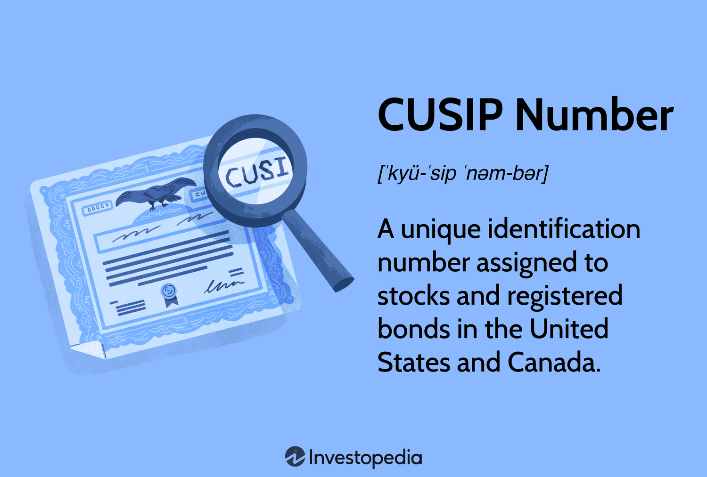

In the fast-paced world of finance, the accurate and efficient identification of securities is fundamental to executing successful trading and investment strategies. Among the myriad identification systems, the CUSIP, or the Committee on Uniform Securities Identification Procedures, code emerges as a pivotal tool in streamlining the trading process. This nine-character alphanumeric code is instrumental in uniquely identifying financial securities, which includes stocks, bonds, and mutual funds, thereby fostering a uniform approach to the trading and recording of securities.

The importance of CUSIP in financial securities is underscored by its role in algorithmic trading—a domain that relies heavily on precision and speed. Algorithmic trading involves using computer algorithms to manage trading decisions and execute orders at speeds and frequencies that are beyond human capability. Within this context, CUSIP codes facilitate the assimilation and verification of securities data that are essential to these algorithmic strategies. The integration of CUSIP in trading algorithms thus reduces errors, enhances operational efficiency, and supports real-time data management.

Understanding the mechanics of CUSIP, its advantages, and its intersection with modern trading technologies can provide financial institutions and traders with a competitive advantage. CUSIP not only aids in simplifying trading and reporting processes but also in ensuring compliance with regulatory standards. As financial markets continue to grow in complexity and the demand for faster and more accurate trading intensifies, the significance of a robust security identifier like CUSIP becomes even more pronounced. By exploring these components, stakeholders can better navigate the algorithmic trading landscape and position themselves strategically within the financial sector.

## Table of Contents

## Understanding CUSIP

CUSIP, an acronym for the Committee on Uniform Securities Identification Procedures, is a pivotal tool in the financial industry, marked by its nine-character alphanumeric code that uniquely identifies financial securities. This system covers a diverse array of securities, encompassing stocks, corporate and government bonds, and mutual funds, thereby ensuring uniformity and efficiency across trading and recording activities. The establishment of the CUSIP system aimed to streamline these processes, addressing the need for a standardized method of identifying securities to facilitate smoother transactions and enhanced record-keeping.

The structure of a CUSIP code is meticulously designed. The first six characters, known as the base or issuer number, are specific to the issuer, which is often a corporation or government entity issuing the security. This portion of the code helps in easily distinguishing the issuing entity. The seventh and eighth characters, referred to as the issue number, differentiate between various issues from the same issuer, such as different classes of stock or bond issues. The ninth character is a check digit, providing an additional layer of accuracy by validating the code against errors.

The significance of CUSIP codes extends beyond mere identification. These codes are integral to trading, settlement, and regulatory compliance processes. In trading, CUSIP codes facilitate the swift and precise execution of transactions, ensuring that the correct security is bought or sold. During the settlement process, CUSIP codes help verify the securities involved, thereby reducing errors and enhancing efficiency. From a regulatory perspective, CUSIP codes provide a standardized methodology for reporting and compliance, aiding regulatory bodies in monitoring and managing financial markets effectively. This standardized approach helps both financial institutions and regulatory authorities achieve greater transparency and consistency in market operations, underscoring the indispensable role of CUSIP in the financial ecosystem.

## Role of CUSIP in Algorithmic Trading

Algorithmic trading, known for its reliance on precision and speed, benefits significantly from the use of CUSIP codes. These nine-character alphanumeric codes streamline the process of identifying and managing securities data—a critical aspect in algorithmic strategies.

CUSIP codes play a vital role in the organization and verification of securities data. In the context of real-time trading environments, these codes allow traders to quickly and accurately identify and fetch specific securities without confusion or delay. This precise identification is crucial for algorithms that operate on predefined parameters and datasets to execute trades at optimal times.

An efficient [algorithmic trading](/wiki/algorithmic-trading) system requires seamless data assimilation and real-time data management. Here, CUSIP's contribution is invaluable. By ensuring consistent and uniform security identification, CUSIP codes help synchronize data across multiple platforms and databases, facilitating up-to-the-second decision-making in trading algorithms. This integration reduces the probability of errors, particularly those arising from mismatched securities during trading operations.

Moreover, the operational efficiency of algorithmic trading systems sees marked improvement with the integration of CUSIP. The codes streamline the entire trade lifecycle—covering everything from order placement to post-trade processing—by circumventing manual entry errors and ensuring that the right securities are traded in real time. For financial institutions, this efficiency translates to increased [volume](/wiki/volume-trading-strategy) capacity and potentially higher profitability.

Several case studies highlight the impact of CUSIP-driven algorithms in the trading world. For example, trading systems that leverage CUSIP can automatically reconcile transactions and maintain transaction records with greater accuracy. Such systems have demonstrated increased trade execution speeds and lower error rates, reinforcing the strategic value of CUSIP codes in algorithmic trading.

In summary, the strategic implementation of CUSIP in algorithmic trading systems enhances precision, boosts operational speed, and minimizes errors, making it a cornerstone for effective trading strategies in the evolving landscape of financial markets.

## Benefits of CUSIP for Financial Institutions

CUSIP, an acronym for the Committee on Uniform Securities Identification Procedures, provides a standardized framework that significantly benefits financial institutions. It enhances data accuracy and reduces processing times, essential elements in the high-speed environment of financial trading. By offering a unique nine-character alphanumeric code for each security, CUSIP minimizes the risk of errors associated with incorrect identification or human input, which can lead to significant financial discrepancies and operational inefficiencies.

One primary advantage of CUSIP is the simplification it brings to the reporting process. Financial institutions must regularly report to regulatory bodies, stakeholders, and clients. The standardized nature of CUSIP codes ensures that the same identification system is universally understood and applied, thereby reducing the complexity of reports and facilitating quicker, more transparent communication with regulatory authorities. Moreover, CUSIP's global reach plays a critical role in enabling smoother cross-border trading and investment management. With over 50 million financial instruments assigned CUSIP identifiers, institutions can engage in international markets with greater confidence, knowing that the securities involved are traceable and identifiable, thus mitigating the risks associated with foreign investment.

The role of CUSIP extends to enhancing risk management and compliance, particularly in times of stringent regulatory requirements. By providing precise and consistent security identification, financial institutions can better monitor portfolios, perform due diligence, and quickly respond to regulatory inquiries or audits. This capability is crucial to maintaining compliance with regulatory frameworks, such as those imposed by the U.S. Securities and Exchange Commission (SEC) and other international regulatory bodies.

Embracing CUSIP codes is indicative of an institution's commitment to industry best practices. As financial markets become increasingly complex, the need for reliable and efficient identification systems is paramount. The adoption of CUSIP not only facilitates operational excellence and compliance but also signals to clients and investors that the institution prioritizes accuracy, reliability, and technological advancement. In a competitive financial landscape, staying updated with such standardized practices could provide a notable edge.

## Challenges and Considerations

The implementation and management of CUSIP codes, while advantageous, do present several challenges for financial institutions. A primary consideration is the cost associated with integrating CUSIP into operational systems. This includes expenses for licensing, setting up necessary IT infrastructure, and ongoing maintenance. The adaptation of robust IT systems is critical to ensure that the integration supports real-time processing and verification of CUSIP data, which is pivotal for effective trading and risk management.

Another significant issue with CUSIP implementation is the potential for code duplication and data discrepancies. These challenges can arise from manual entry errors, system integration hiccups, or inconsistencies in data feeds. Such discrepancies can lead to incorrect securities identification, resulting in trading errors and inefficiencies. It is crucial for institutions to implement stringent data validation and reconciliation processes to mitigate these risks.

Furthermore, the financial landscape is continuously evolving due to regulatory changes and shifts in industry standards. CUSIP systems must adapt to these developments to remain compliant. This requires constant monitoring of regulatory updates and might necessitate periodic system upgrades or changes in operational protocols to align with new standards.

Organizations must strategize effectively to overcome these challenges to harness the full potential of CUSIP. This involves investing in technology and skilled personnel, implementing comprehensive training programs, and maintaining an agile framework that can quickly respond to regulatory and market changes. By addressing these areas, institutions can enhance their operational efficiency and maintain a competitive edge in securities trading.

## Future of CUSIP in Algo Trading

The evolution of digital technologies, particularly [machine learning](/wiki/machine-learning) and blockchain, presents significant prospects for the CUSIP system in algorithmic trading. Machine learning algorithms can leverage the structured format of CUSIP codes to enhance data analysis and trade execution strategies. By efficiently categorizing and analyzing large datasets associated with CUSIP-coded securities, machine learning models can identify patterns and predict market trends with improved accuracy, ultimately leading to more informed and strategic trading decisions.

Blockchain technology offers a revolutionary approach to data management and security for CUSIP information. With blockchain's decentralized and immutable ledger system, the management of CUSIP data can be more transparent and secure. Each CUSIP transaction recorded on a blockchain network ensures data integrity and reduces the risk of fraudulent activities. Additionally, blockchain can facilitate real-time data sharing across financial institutions, improving cooperation and efficiency in trade settlements.

Looking ahead, several innovations and trends could redefine the function of CUSIP codes in trading. One such innovation is the development of decentralized finance (DeFi) platforms, which could incorporate CUSIP codes for standardized asset identification, improving cross-border trading and [liquidity](/wiki/liquidity-risk-premium) management. Moreover, advancements in [artificial intelligence](/wiki/ai-artificial-intelligence) could lead to the development of more sophisticated trading algorithms that use CUSIP data to enhance decision-making processes and trade outcomes.

As financial markets advance, CUSIP codes are expected to remain integral to security identification and trading strategies. The anticipated developments in digital technologies are likely to drive increased transparency, as real-time data validation and verification become more accessible. Enhanced efficiency will result from the automation of trade processes and risk assessments facilitated by enhanced data analytics tools. Furthermore, the adoption of these innovations promises greater reliability in securities transactions, reducing errors and improving compliance with regulatory standards.

In summary, as technology evolves, CUSIP will continue to serve as a fundamental component of the trading infrastructure, adapting to new innovations while maintaining its pivotal role in securities identification and transaction efficiency.

## Conclusion

CUSIP has played a crucial role in the identification and trading of financial securities. This nine-character alphanumeric code provides a standardized method for identifying a vast array of securities, from stocks and bonds to mutual funds, ensuring consistency and reliability in transactions. Its significance has only intensified with the emergence of algorithmic trading, where precision and speed are paramount. CUSIP codes enable high-frequency trading algorithms to accurately track and process large volumes of security data with minimal errors, thereby enhancing operational efficiency.

The integration of CUSIP into modern trading technologies positions it as a vital element within today's rapidly advancing financial markets. It supports data accuracy and processing, which are critical in the execution of complex trading strategies. Despite the challenges associated with its implementation, such as cost and infrastructure requirements, CUSIP continues to offer substantial benefits to financial institutions by facilitating better risk management and compliance.

Moving forward, embracing future innovations like blockchain and machine learning will likely bolster CUSIP's utility, driving further transparency and reliability in securities transactions. These technological advancements have the potential to address current limitations, ensuring more robust data security and reducing discrepancies. For financial organizations aiming to maintain a competitive edge, staying informed about CUSIP developments is imperative. Leveraging its full potential can lead to increased efficiency and enhanced trading capabilities in an ever-evolving market landscape.

## References & Further Reading

[1]: ["CUSIP Global Services (CGS)"](https://www.cusip.com/index.html), the official site providing detailed information on CUSIP and its application in securities identification.

[2]: Harris, L. (2002). ["Trading & Exchanges: Market Microstructure for Practitioners"](https://archive.org/details/tradingexchanges0000harr). Oxford University Press.

[3]: Hasbrouck, J. (2007). ["Empirical Market Microstructure: The Institutions, Economics, and Econometrics of Securities Trading"](https://archive.org/details/empiricalmarketm0000hasb). Oxford University Press.

[4]: Biais, B., Glosten, L., & Spatt, C. (2005). ["Market Microstructure: A Survey of Microfoundations, Empirical Results, and Policy Implications"](https://www.sciencedirect.com/science/article/abs/pii/S1386418104000382). Journal of Financial Markets.

[5]: Nabholz, J. (2015). ["The Use of CUSIP Numbers in Algorithmic Trading"](https://assets.cambridge.org/97811070/91146/frontmatter/9781107091146_frontmatter.pdf). HAL Open Archives.