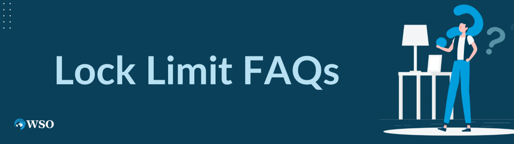

## Table of Contents

## What is a lock limit in financial markets?

A lock limit in financial markets is a rule that stops trading of a stock or commodity when its price moves too much in one day. This is to protect investors from big, sudden changes in price that could cause them to lose a lot of money. For example, if a stock's price goes up or down by a certain percentage, trading might be paused or stopped for the day.

Lock limits are common in futures markets, where prices can be very volatile. They help to calm the market by giving everyone a chance to think and react to new information without making quick, emotional decisions. By setting these limits, exchanges aim to maintain order and fairness in trading, ensuring that the market remains stable and trustworthy.

## How does a lock limit affect trading?

When a lock limit is reached, it stops trading for a while or for the whole day. This means that if you want to buy or sell a stock or commodity, you can't do it right away. The price has moved too much, and the market wants to take a break to make sure everyone has time to think and not make quick decisions they might regret.

This pause can be good because it helps keep the market calm. It gives traders a chance to look at new information and decide what to do next without rushing. But it can also be frustrating if you were planning to trade at that time. You have to wait until trading starts again, and by then, the price might be different.

## What is the purpose of implementing lock limits?

The main reason for lock limits is to keep the market safe and stable. When prices move a lot in a short time, it can scare people and make them do things they might regret later. By stopping trading when prices hit a certain point, lock limits give everyone a chance to calm down and think. This helps prevent big, sudden price changes that could hurt a lot of people.

Lock limits also help keep the market fair. When everyone has to stop and wait, it gives all traders the same chance to look at new information and decide what to do next. This way, no one can take advantage of others by making quick trades during wild price swings. By making the market more stable and fair, lock limits help build trust and make sure trading is done in a good way.

## Can you explain the difference between a daily lock limit and a circuit breaker?

A daily lock limit is a rule that stops trading of a certain stock or commodity if its price goes up or down too much in one day. This is common in futures markets where prices can change a lot. The idea is to give everyone a break so they don't make quick, emotional decisions that could lead to big losses. Once the price hits the limit, trading stops for that day, and people have to wait until the next day to trade again.

A circuit breaker, on the other hand, is a rule that can stop trading for all stocks on an exchange if the whole market moves too much in one day. It's like a big pause button for the entire market. Circuit breakers are used to calm down the market when things get too crazy, giving everyone time to think and reassess. Unlike daily lock limits, which only affect one stock or commodity, circuit breakers affect everything being traded on the exchange.

Both daily lock limits and circuit breakers are used to keep the market stable and protect investors, but they work in different ways. Daily lock limits focus on individual stocks or commodities, while circuit breakers are about the overall market. By using these tools, exchanges try to make sure trading stays fair and orderly, even during times of big price swings.

## How are lock limits set and by whom?

Lock limits are set by the people who run the stock or commodity exchange. These are the folks who make the rules about how trading happens on their exchange. They decide what the lock limit should be based on how much they think prices might change in a normal day. They want to make sure the limit is high enough to let prices move freely but low enough to stop big, sudden changes that could hurt people.

Once the exchange decides on the lock limit, they tell everyone who trades on their exchange what it is. The limit can change over time if the exchange thinks it needs to be different. For example, if the market gets more or less wild, they might adjust the limit to make sure it still works well. By setting and adjusting lock limits, the exchange tries to keep trading safe and fair for everyone.

## What happens when a security hits its lock limit?

When a security hits its lock limit, trading for that security stops right away. This means you can't buy or sell it until the next trading day. The lock limit is there to stop the price from moving too much in one day, so when it's reached, the exchange wants to give everyone a break to think and not make quick decisions they might regret.

This pause can be good because it helps keep the market calm. It gives traders a chance to look at new information and decide what to do next without rushing. But it can also be frustrating if you were planning to trade at that time. You have to wait until trading starts again, and by then, the price might be different.

## How do lock limits impact market volatility?

Lock limits help lower market [volatility](/wiki/volatility-trading-strategies) by stopping trading when prices move too much in one day. When a security hits its lock limit, trading stops, which gives everyone a chance to calm down and think. This pause can prevent prices from swinging wildly, which is good for keeping the market stable. By stopping trading at a certain point, lock limits help make sure that big, sudden price changes don't happen, which can protect investors from losing a lot of money.

However, lock limits can also make the market seem more volatile in the short term. When trading stops because of a lock limit, it can feel like the market is out of control. People might get worried or frustrated because they can't trade right away. But once trading starts again, the market usually calms down. So, while lock limits might make things seem more volatile when they first kick in, they actually help keep things more stable in the long run.

## What are the historical examples of lock limits being triggered?

One big example of lock limits being used was in the futures market for pork bellies in the 1970s. Pork belly prices were going up and down a lot, so the Chicago Mercantile Exchange set lock limits to stop trading when prices moved too much. This helped keep the market calm and stopped people from losing too much money all at once. When prices hit the lock limit, trading would stop for the day, and everyone had to wait until the next day to trade again.

Another example happened in the soybean futures market in the early 2000s. Soybean prices were changing a lot because of weather problems and changes in how much people wanted to buy. The Chicago Board of Trade set lock limits to stop trading when soybean prices moved too much in one day. This helped make sure the market stayed stable and gave traders time to think before making more trades.

## How do traders and investors adjust their strategies around lock limits?

Traders and investors know that lock limits can stop them from trading when prices move a lot. So, they try to be ready for this. They might set their own limits on how much they are willing to buy or sell in one day. This way, they can avoid getting caught when the market hits a lock limit. They also watch the news and other information closely to guess when prices might move a lot and hit a lock limit. If they think a lock limit is coming, they might decide to trade less or wait until the next day to make their moves.

Some traders even try to use lock limits to their advantage. They might buy or sell just before they think a lock limit will be hit, hoping to make money from the price change right before trading stops. But this can be risky because it's hard to guess when a lock limit will happen. Most investors, though, just try to stay calm and not make quick decisions when they see prices moving a lot. They know that lock limits are there to help keep the market stable, so they plan their trades carefully and wait for the right time to act.

## What are the criticisms and controversies surrounding lock limits?

Some people think lock limits are not a good idea because they can make trading harder. When prices hit a lock limit, trading stops, and this can be frustrating for traders who want to buy or sell right away. They might miss out on good chances to make money or lose money if they can't trade when they want to. Also, some say that lock limits can make the market seem more wild than it really is. When trading stops suddenly, it can scare people and make them think the market is out of control, even if it's just taking a break.

Others argue that lock limits might not stop big price changes but just delay them. If prices are going to move a lot, they might still do it, but over a few days instead of all at once. This can make it harder for traders to plan because they don't know when the big moves will happen. There's also the worry that lock limits might not be fair to everyone. Big traders with more information might be able to guess when a lock limit will happen and trade just before it, making more money than smaller traders who can't do this.

## How do lock limits vary across different financial markets globally?

Lock limits can be different in various financial markets around the world. In the United States, for example, the Chicago Mercantile Exchange sets lock limits for futures like corn and soybeans. These limits stop trading if prices go up or down too much in one day. In China, the Dalian Commodity Exchange also uses lock limits for things like soybeans and iron ore, but the exact limits might be different from those in the U.S. Each country and exchange decides what their lock limits should be, based on how much they think prices might change and what they want to do to keep the market stable.

In some places, lock limits might be used more often or be set at different levels than in others. For example, in India, the Multi Commodity Exchange of India Limited (MCX) has lock limits for commodities like gold and silver. These limits can be higher or lower than those in other countries, depending on how the market usually behaves there. The main goal is the same everywhere: to stop big, sudden price changes that could hurt traders. But the way lock limits work and how they are set can vary a lot from one market to another.

## What advanced strategies can be used to navigate markets with frequent lock limit occurrences?

When lock limits happen a lot, traders can use some smart tricks to do well. One way is to watch the market closely and try to guess when a lock limit might happen. If they think prices will hit the limit soon, they might buy or sell just before it happens. This can be risky because it's hard to guess right, but if they do, they can make money from the price change right before trading stops. Another trick is to set their own limits on how much they are willing to trade in one day. This way, they don't get caught when the market hits a lock limit and can plan their trades better.

Traders can also use information like news and weather reports to help them. If they know something big might change prices, they can plan their trades around it. For example, if a big storm is coming that might affect crop prices, they might trade less until they see how things go. It's also important for traders to stay calm and not make quick decisions when prices move a lot. They know lock limits are there to help keep the market stable, so they should take their time and wait for the right moment to trade. By being ready and using these tricks, traders can do better even when lock limits happen a lot.

## References & Further Reading

[1]: Hull, J. C. (2012). ["Options, Futures, and Other Derivatives"](https://www.semanticscholar.org/paper/Options%2C-Futures%2C-and-Other-Derivatives-Hull/89bdee500c8623864fc9eb7a471546aa713acc44). Prentice Hall.

[2]: Aldridge, I. (2013). ["High-Frequency Trading: A Practical Guide to Algorithmic Strategies and Trading Systems,"](https://www.amazon.com/High-Frequency-Trading-Practical-Algorithmic-Strategies/dp/1118343506) 2nd Edition. Wiley.

[3]: MacKenzie, D. (2018). ["Material Signals: A Historical Sociology of Algorithmic Trading"](https://www.sps.ed.ac.uk/sites/default/files/assets/pdf/material-signals.pdf). Politics & Society.

[4]: Financial Industry Regulatory Authority. (2021). ["A Closer Look at Algorithmic Trading."](https://www.finra.org/) FINRA Investor Education.

[5]: Securities and Exchange Commission. (2017). ["SEC Adopts Rule to Address Runaway Algorithmic Trading."](https://www.sec.gov/files/rules/sro/batsbzx/2017/34-80206.pdf) SEC News Press Release.