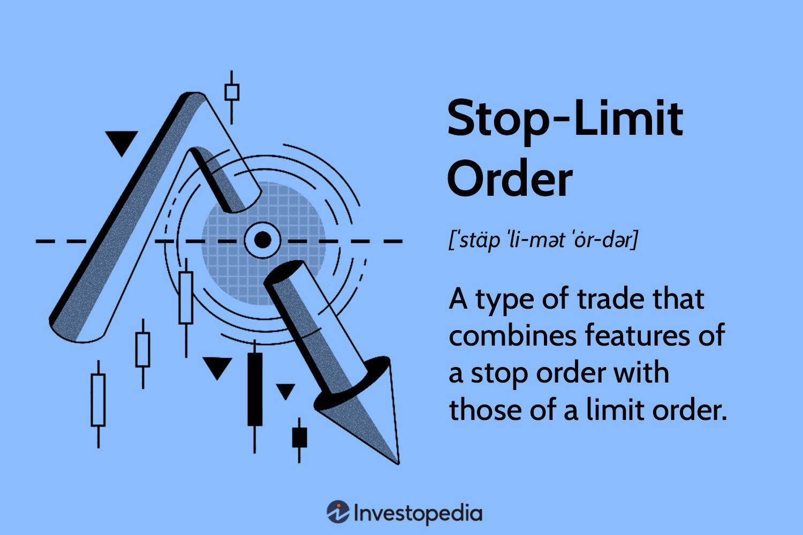

The financial markets are an intricate web of trading activities, governance, and risk management, constantly influenced by numerous external and internal factors. These markets operate on principles designed to balance growth opportunities with potential risks. In this intricate environment, trading restrictions and algorithmic trading algorithms play pivotal roles in shaping market dynamics. 

Trading restrictions, such as lock limits, ensure that markets remain stable, especially during periods of high volatility. These mechanisms are crucial in maintaining orderly trading conditions and preventing disorderly markets that can result from excessive price swings. A lock limit is a specific threshold that, when breached, results in the halting of trading activities for a given period, providing participants the opportunity to reassess their strategies and market positions.

Algorithmic trading represents another significant facet of financial markets today. It employs complex computer algorithms capable of executing trades with high speed and accuracy, minimizing human intervention. This advancement increases market efficiency and reduces transactional costs but also introduces new challenges in terms of regulation and risk management. Understanding both the potential and the pitfalls of algorithmic trading helps in grasping its implications on trader behavior and market stability.

In summary, gaining a solid understanding of these elements—lock limits and algorithmic trading—helps market participants and observers alike in comprehending the complexities of the financial markets. These innovations and restrictions are not merely technical details but foundational blocks ensuring the resilience and integrity of contemporary trading systems.

## Table of Contents

## Understanding Financial Market Trading Restrictions

Trading restrictions are essential mechanisms employed to ensure market stability and protect participants during periods of high volatility. These regulatory measures are critical in maintaining order and preventing extreme fluctuations that could destabilize financial markets. Among the most prominent of these restrictions are circuit breakers and lock limits, especially in the context of futures markets.

Circuit breakers are predefined thresholds that, when breached, trigger a temporary halt in market trading. They are designed to curb panic selling and provide a cooling-off period, allowing traders to absorb vital information and make informed decisions amid turbulent conditions. For example, in the U.S. stock market, different levels of circuit breakers are used depending on the percentage drop in the S&P 500 index, ensuring a measured and informed reaction from market participants.

Lock limits, on the other hand, are specific price boundaries set for futures contracts. When the market price hits these limits, trading on those contracts is halted, either on the upside or downside, depending on market movements. By pausing futures trading, lock limits grant traders the opportunity to reassess market conditions and reduce excessive speculation. This measure mirrors the concept of stock market circuit breakers but is tailored to the unique characteristics and risks associated with futures trading.

Both circuit breakers and lock limits serve as critical components of modern financial markets. They help avert potentially severe market disruptions, enabling a more stable and orderly trading environment. By mitigating the risk of extreme market movements, these restrictions foster confidence among traders and investors, supporting a resilient and sustainable financial system.

## What is a Lock Limit?

Lock limits are predefined thresholds that, when reached, result in a suspension of trading activity in a particular financial instrument, notably in futures markets. These limits are implemented to mitigate excessive [volatility](/wiki/volatility-trading-strategies) and provide a cooling-off period during tumultuous market conditions. Lock limits function by placing a cap on price fluctuations, thereby stabilizing trading frameworks and promoting orderly market behavior.

In essence, when the price of a futures contract moves beyond a preset range—either upwards or downwards—trading is halted to allow market participants to reassess pertinent market information. This mechanism not only alleviates panic-driven trading but also curbs substantial losses or profits that could destabilize the market. For instance, if a given lock limit for a commodity futures contract is set at 5%, any price movement exceeding this limit in one trading session could trigger a temporary trading halt.

The concept shares similarities with stock market circuit breakers, which are designed to halt trading on an exchange to curb panic selling. However, lock limits are specifically tailored for futures markets, where price volatility can significantly impact market equilibrium. By imposing restrictions on price movements, lock limits contribute to maintaining regulatory compliance within exchanges and fostering market stability.

This structural safeguard supports traders in adopting more informed trading strategies and encourages a balanced trading environment where extreme price swings are minimized. The effectiveness of lock limits in stabilizing futures markets underscores their importance as a tool for risk management amid fluctuating economic conditions.

## Mechanics of Lock Limits

Lock limits are a crucial mechanism used to control both upward and downward price movements in trading instruments, particularly in the futures markets. Their primary function is to temporarily suspend trading, creating a pause that allows traders to reassess market information. This pause is essential during periods of high volatility, when rapid price changes can lead to irrational decision-making or panic selling. By halting trading, lock limits provide a buffer period for market participants to regain composure, evaluate market conditions, and adjust strategies accordingly.

The application of lock limits varies based on specific contract terms and can significantly influence trading strategies and decisions. For instance, a futures contract might set a daily price fluctuation limit beyond which trading will be suspended until the next trading session. This limit ensures that price movements remain within a predefined range, reducing the potential for extreme volatility and maintaining market orderliness.

Lock limits are typically defined as a percentage of the previous day's settlement price or a fixed point value, providing a clear boundary for acceptable price movements. These limits can be adjusted based on market conditions, regulatory requirements, and historical volatility of the instrument. In practice, traders must be aware of the lock limit specifications for each contract they engage with, as these can affect trade execution, margin requirements, and overall risk exposure.

The strategic implications of lock limits are significant. For instance, traders might use the knowledge of an impending lock limit to adjust their positions beforehand, anticipating the market's reaction once trading resumes. Alternatively, lock limits can influence the timing of trades, with market participants choosing to enter or [exit](/wiki/exit-strategy) positions before a lock limit is reached to avoid being caught in a trading halt.

In summary, lock limits are key tools in managing the orderly progression of trading. Their ability to temporarily halt trading provides a necessary pause in volatile markets, allowing traders to assimilate and respond to market information more effectively. By understanding and incorporating lock limit specifications into trading strategies, market participants can better navigate the complexities of financial markets while mitigating risks associated with extreme price movements.

## Algorithmic Trading: An Overview

Algorithmic trading employs computer algorithms to execute trades with high speed and large [volume](/wiki/volume-trading-strategy), revolutionizing how financial markets operate. This approach leverages the computational power of machines to handle complex trading strategies, making it possible to process vast amounts of data and execute trades faster than human capabilities. By minimizing human intervention, [algorithmic trading](/wiki/algorithmic-trading) enhances efficiency and reduces transaction costs, offering significant advantages over traditional trading methods.

Algorithms in trading can perform tasks such as analyzing market conditions, monitoring price movements, and determining optimal trade entry and exit points. These algorithms are often developed using programming languages such as Python, C++, or Java, and operate based on predefined criteria, which may include mathematical models, statistical data, and historical market trends.

However, algorithmic trading is not without its challenges. One primary concern is the area of regulation and compliance, as the speed and volume of trades can outpace traditional regulatory frameworks. Ensuring transparency and accountability in algorithmic trading systems requires robust oversight mechanisms. Regulators worldwide, such as the Commodity Futures Trading Commission (CFTC) and the Securities and Exchange Commission (SEC) in the United States, have implemented specific rules to manage the risks associated with automated trading practices.

Furthermore, risk management poses a significant challenge in algorithmic trading. The high degree of automation increases the risk of system failures or errant trades, potentially leading to significant market disruptions. Firms engaged in algorithmic trading must implement stringent risk control measures, such as pre-trade risk assessments and real-time monitoring systems, to prevent accidental losses and maintain market stability.

Despite these challenges, the adoption of algorithmic trading continues to grow, driven by advancements in technology and the demand for more efficient trading solutions. The evolution of this trading approach prompts continuous discussions on balancing innovation with appropriate regulatory structures to protect market integrity.

## Regulatory Framework for Algorithmic Trading

Regulatory bodies such as the Commodity Futures Trading Commission (CFTC) and the Securities and Exchange Commission (SEC) play crucial roles in overseeing algorithmic trading activities to ensure the integrity and stability of financial markets. Algorithmic trading, due to its high-speed nature and potential for rapid market impact, requires stringent oversight to prevent market disruptions and protect investors. 

One of the main frameworks governing algorithmic trading is Regulation Automated Trading (Reg AT), which was proposed by the CFTC. Reg AT aims to enhance the regulatory regime for algorithmic traders by implementing risk controls and transparency measures. Key provisions of Reg AT include the requirement for pre-trade risk and order management controls, standards for algorithmic trading system development and testing, and the maintenance of source code repositories for audits. These measures are designed to minimize the risk of system failures and unauthorized trading, thereby safeguarding market integrity.

The SEC's Market Access Rule, formally known as Rule 15c3-5, mandates that broker-dealers implement risk management controls and supervisory procedures to limit the financial and regulatory risks associated with providing their customers with access to trading in the securities market. This rule requires firms to maintain pre-trade and post-trade risk controls, ensuring that trading activities are consistent with regulatory requirements and the firm's capital position.

Regulatory oversight for algorithmic trading involves the establishment of control systems to monitor trading behaviors and mitigate risks. Such controls include setting thresholds for trading activity, implementing kill switches to halt trading in the event of anomalies, and conducting regular testing and review of trading algorithms. Effective oversight helps prevent erratic trading behaviors that could lead to flash crashes or other market disturbances.

Compliance with these regulatory frameworks necessitates continuous monitoring and assessment of algorithmic trading systems. Firms are required to maintain robust documentation and submit to periodic audits by regulatory bodies to ensure adherence to established guidelines. By imposing these regulations, the CFTC and SEC aim to protect the market from the unintended consequences of automated trading strategies, ensuring that the financial system remains robust and fair for all participants.

Maintaining these regulatory standards requires staying abreast of evolving market technologies and trends. As algorithmic trading continues to advance, regulatory frameworks must adapt to address new challenges, ensuring that trading innovations do not compromise market stability or integrity.

## Risk Management in Algorithmic Trading

Effective risk management is crucial for maintaining the integrity and stability of financial markets, particularly in algorithmic trading, where the speed and complexity of transactions can potentially lead to systemic failures and market manipulations. Implementing robust pre-trade risk controls is vital to detecting and preventing erroneous trades before execution. These controls involve setting parameters around trade sizes, price limits, and order types, effectively minimizing the likelihood of triggering disruptive market events.

Post-trade surveillance is equally important, serving as a critical feedback mechanism for market participants. It involves monitoring executed trades to ensure compliance with regulatory standards and internal policies. This surveillance can identify irregular trading patterns or breaches, enabling timely interventions to rectify potential issues and safeguard market stability.

Firms engaged in algorithmic trading often employ stress testing as a risk management strategy. Stress tests simulate adverse market conditions to evaluate the resilience of trading systems. By analyzing the impact of extreme scenarios, firms can identify vulnerabilities and determine necessary adjustments to their algorithms, thereby mitigating potential adverse effects on trading operations.

Disaster recovery plans are another essential element, designed to ensure business continuity in the event of technical failures or other disruptions. These plans outline procedures for data recovery, system redundancy, and communication protocols, enabling firms to resume operations swiftly and minimize any detrimental effects on the market.

Furthermore, internal audits play a critical role in reinforcing systemic safeguards. Regular audits assess the effectiveness and efficiency of risk management practices, ensuring that they align with evolving regulatory requirements and industry best practices. By identifying deficiencies and recommending corrective actions, audits contribute to enhancing overall resilience and compliance in algorithmic trading.

In conclusion, a comprehensive approach to risk management involves an intricate blend of pre-trade and post-trade measures, continuous stress testing, proactive disaster recovery, and diligent auditing. These processes are imperative to maintain financial market stability and protect against the inherent risks of algorithmic trading.

## Challenges and Future Considerations

As trading technologies evolve, regulatory frameworks must adapt to address emerging risks in financial markets. Technological advancements have revolutionized trading processes, increasing the speed, volume, and complexity of transactions. However, these developments also introduce new challenges and potential vulnerabilities, necessitating continuous oversight and adaptation of regulations.

Ongoing surveillance and audits are essential to identify and mitigate unexpected challenges in algorithmic trading. As algorithms become more sophisticated, the potential for unforeseen behaviors that may disrupt market stability increases. Regulators and market participants must implement robust monitoring systems to ensure that automated trading does not lead to adverse outcomes such as flash crashes or price manipulations. These systems could include [machine learning](/wiki/machine-learning) algorithms capable of detecting anomalies in trading patterns in real-time, enabling quicker reactions to irregular market activities.

The future of trading will likely see enhanced regulations aimed at ensuring a balance between technological innovation and market stability. As algorithms and [artificial intelligence](/wiki/ai-artificial-intelligence) continue to advance, regulatory bodies may require more stringent testing and validation of trading systems before deployment. This could involve a combination of simulated trading environments to assess system behavior under a variety of market conditions, along with standardized stress testing practices to evaluate resilience against extreme market events.

Moreover, the integration of real-time data analytics into regulatory practices can provide deep insights into market behavior. Policymakers may utilize big data and predictive analytics to anticipate market disruptions and craft proactive regulatory measures, ensuring that the benefits of technological advancements are harnessed without compromising financial stability. Collaborative efforts between regulators, industry experts, and technologists will be crucial in crafting regulations that effectively govern the evolving landscape of trading technologies.

In conclusion, as we look to the future, maintaining a dynamic regulatory environment that accommodates innovation while safeguarding market integrity remains paramount. By fostering proactive monitoring, adaptive regulations, and collaborative engagements, financial markets can continue to thrive amidst the rapid technological advancements defining the modern trading ecosystem.

## Conclusion

Trading restrictions and algorithmic trading play a pivotal role in maintaining the health and order of financial markets. The implementation of trading restrictions, such as lock limits, provides a crucial mechanism for tempering market volatility and preventing extreme price fluctuations. These measures safeguard the integrity of financial markets by halting trading activities temporarily, allowing traders and market participants to reassess and digest emerging information, thus preserving market stability.

Algorithmic trading has transformed the landscape of financial markets through its ability to process vast amounts of data and execute trades at unprecedented speeds. While these advancements offer efficiency and cost reductions, they also necessitate robust regulatory frameworks to manage the associated risks. Regulatory measures, including those enforced by bodies such as the Commodity Futures Trading Commission (CFTC) and the Securities and Exchange Commission (SEC), ensure that algorithmic trading systems maintain market integrity by enforcing compliance and risk management protocols.

For traders and market participants, an understanding of these mechanisms—both trading restrictions and the nuances of algorithmic trading—is essential for informed participation in the ever-evolving market environment. Aided by such regulatory initiatives, financial markets are better equipped to adapt to technological advancements, balancing innovation with market stability. As trading technologies and strategies continue to advance, the evolution of regulatory frameworks will remain crucial in addressing emerging challenges and securing the future health of financial markets.

## References & Further Reading

[1]: Hull, J. C. (2012). ["Options, Futures, and Other Derivatives"](https://www.semanticscholar.org/paper/Options%2C-Futures%2C-and-Other-Derivatives-Hull/89bdee500c8623864fc9eb7a471546aa713acc44). Prentice Hall.

[2]: Aldridge, I. (2013). ["High-Frequency Trading: A Practical Guide to Algorithmic Strategies and Trading Systems,"](https://www.amazon.com/High-Frequency-Trading-Practical-Algorithmic-Strategies/dp/1118343506) 2nd Edition. Wiley.

[3]: MacKenzie, D. (2018). ["Material Signals: A Historical Sociology of Algorithmic Trading"](https://www.sps.ed.ac.uk/sites/default/files/assets/pdf/material-signals.pdf). Politics & Society.

[4]: Financial Industry Regulatory Authority. (2021). ["A Closer Look at Algorithmic Trading."](https://www.finra.org/) FINRA Investor Education.

[5]: Securities and Exchange Commission. (2017). ["SEC Adopts Rule to Address Runaway Algorithmic Trading."](https://www.sec.gov/files/rules/sro/batsbzx/2017/34-80206.pdf) SEC News Press Release.