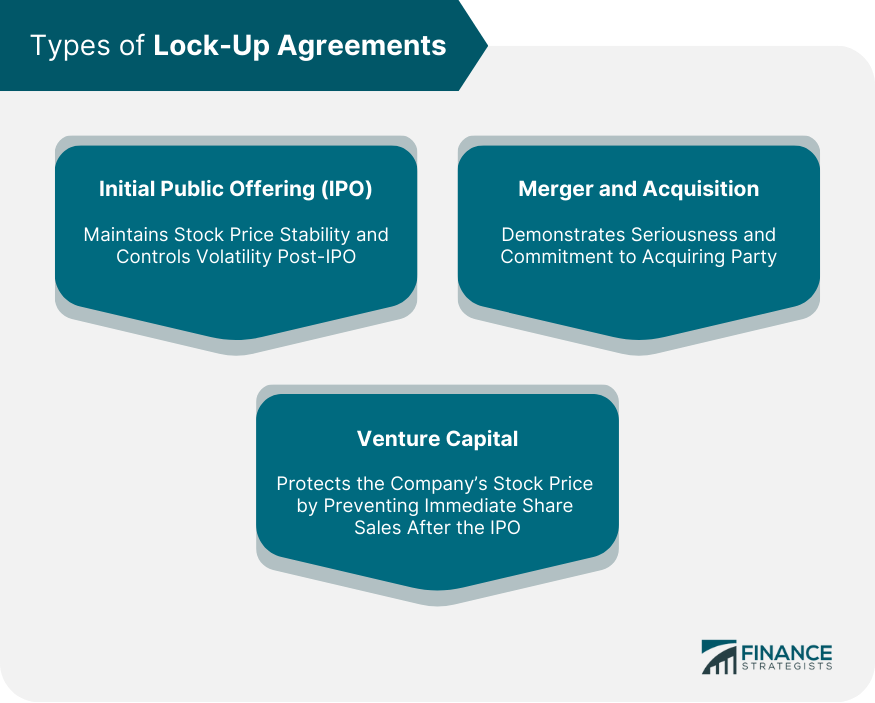

## Table of Contents

## What is a lock-up agreement?

A lock-up agreement is a contract where people who own shares in a company agree not to sell those shares for a certain period of time. This usually happens when a company first sells its stock to the public, which is called an initial public offering (IPO). The purpose of a lock-up agreement is to keep the stock price stable right after the IPO. If lots of people sold their shares right away, it could make the stock price go down a lot.

Lock-up periods usually last for 90 to 180 days, but the exact time can be different for each company. During this time, the shareholders can't sell their shares, even if they want to. This helps the company by making sure that the stock price doesn't drop too much because of too many shares being sold at once. After the lock-up period ends, the shareholders can sell their shares if they want to, and this might affect the stock price depending on how many shares are sold.

## Why are lock-up agreements used in business?

Lock-up agreements are used in business to help keep a company's stock price stable after it goes public. When a company has an initial public offering (IPO), it starts selling its shares to the public for the first time. If the people who already own shares in the company, like founders or early investors, were allowed to sell their shares right away, it could cause the stock price to drop a lot. This is because there would be too many shares available for sale at the same time. By having a lock-up agreement, these shareholders agree not to sell their shares for a certain period, usually between 90 to 180 days, which helps to prevent this from happening.

This stability is important for the company because it helps build trust with new investors. If the stock price stays steady after the IPO, it shows that the company is doing well and that people believe in its future. This can attract more investors and make it easier for the company to raise money in the future. After the lock-up period ends, the shareholders can sell their shares if they want to, but by then, the company's stock price should be more established and less likely to be affected by a sudden increase in shares for sale.

## Who typically signs a lock-up agreement?

A lock-up agreement is usually signed by people who already own shares in a company before it goes public. These people can include the company's founders, early investors, and sometimes even employees who got shares as part of their job. They sign the agreement to promise not to sell their shares for a certain time after the company's initial public offering (IPO).

The reason they sign this agreement is to help keep the stock price stable right after the IPO. If lots of these shareholders sold their shares right away, it could make the stock price drop a lot. By agreeing to wait, they help make sure the stock price doesn't go down too much, which is good for the company and for new investors who buy shares during the IPO.

## How long does a lock-up period usually last?

A lock-up period usually lasts between 90 to 180 days. This is the time after a company goes public when people who already own shares, like founders and early investors, agree not to sell their shares. The exact length can be different for each company, but it's usually around this time frame.

The reason for this lock-up period is to keep the stock price stable right after the company's initial public offering (IPO). If lots of people sold their shares right away, it could make the stock price drop a lot. By waiting, these shareholders help make sure the stock price doesn't go down too much, which is good for the company and for new investors.

## What are the consequences of breaking a lock-up agreement?

If someone breaks a lock-up agreement and sells their shares before the lock-up period ends, they can get in big trouble. The agreement is a legal contract, so breaking it can lead to lawsuits. The company might sue the person who broke the agreement to stop them from selling their shares and to make them pay for any damage they caused. This could mean paying money to cover the costs of the lawsuit and any losses the company had because the stock price went down.

Breaking a lock-up agreement can also hurt the company's reputation. If people see that someone is selling shares early, it might make them think the company is not doing well. This can make the stock price go down even more and make it harder for the company to get new investors in the future. So, it's important for everyone to follow the lock-up agreement to keep things stable and to show that they believe in the company's future.

## Can a lock-up agreement be negotiated or modified?

Yes, a lock-up agreement can be negotiated or modified, but it depends on the company and the people involved. Before a company goes public, the founders, early investors, and sometimes employees might talk with the company's leaders about the lock-up agreement. They might ask for a shorter lock-up period or special rules for certain people. If everyone agrees, they can change the agreement to fit their needs.

However, changing a lock-up agreement after it's already been signed can be tricky. It usually needs everyone who signed the agreement to agree to the changes. If someone breaks the agreement by selling shares early, they could get in trouble and be sued. So, it's important to think carefully about the agreement before signing it and to make sure everyone understands the rules.

## How does a lock-up agreement affect stock prices?

A lock-up agreement helps keep a company's stock price stable right after it goes public. When a company has an initial public offering (IPO), it starts selling its shares to the public for the first time. If the people who already own shares, like the founders or early investors, could sell their shares right away, it might cause the stock price to drop a lot. This is because there would be too many shares for sale at the same time. By having a lock-up agreement, these shareholders agree not to sell their shares for a certain time, usually between 90 to 180 days. This helps keep the stock price steady because there are fewer shares being sold.

When the lock-up period ends, the stock price might change. If a lot of shareholders decide to sell their shares all at once, it could make the stock price go down. But if they sell their shares slowly over time, it might not affect the price as much. The end of the lock-up period can be a big event for the company's stock, and investors watch it closely to see what will happen. Overall, the lock-up agreement is important for keeping the stock price stable and showing that the company and its shareholders believe in its future.

## What is the difference between a lock-up agreement and a standstill agreement?

A lock-up agreement and a standstill agreement are both used to control the actions of shareholders, but they have different purposes. A lock-up agreement is used when a company goes public for the first time. It stops people who already own shares, like founders and early investors, from selling their shares right away. This helps keep the stock price stable after the initial public offering (IPO). The lock-up period usually lasts for 90 to 180 days, and during this time, these shareholders can't sell their shares even if they want to.

A standstill agreement, on the other hand, is used to limit what a shareholder can do with their shares, usually in a private company. It's often used when someone wants to buy a big part of the company but the company doesn't want them to take over. The agreement might stop the shareholder from buying more shares, selling their shares to someone else, or trying to change the company's management. Unlike a lock-up agreement, a standstill agreement is not about keeping stock prices stable but about keeping control of the company in the hands of the current leaders.

## Are there any exceptions or early release conditions in lock-up agreements?

Yes, there can be exceptions or early release conditions in lock-up agreements. These exceptions are usually written into the agreement before it's signed. For example, some agreements might let shareholders sell a small number of shares during the lock-up period if they need money for things like paying taxes or buying a house. Another common exception is if the company gets bought by another company. In that case, the lock-up agreement might end early so shareholders can sell their shares as part of the deal.

These exceptions are important because they give shareholders some flexibility. But, they are usually very specific and only apply in certain situations. The company and the shareholders have to agree on these exceptions before the lock-up agreement is signed. If someone wants to sell their shares early for a reason that's not in the agreement, they might need to ask for special permission from the company. This can be hard to get, and breaking the agreement without permission can lead to big problems, like lawsuits.

## How do lock-up agreements impact investor behavior?

Lock-up agreements can affect how investors act when a company goes public. When people know that the founders and early investors can't sell their shares for a while, it makes them feel more sure about the company. They think that if the people who know the company best are willing to wait, then the company must be doing well. This can make more investors want to buy the stock right after the IPO, because they think the price will stay steady or go up.

But, when the lock-up period ends, it can make investors act differently. Some might want to sell their shares because they think the price might go down if a lot of shares get sold at once. Others might see it as a good time to buy, thinking that the stock is a good deal if the price does drop a little. So, the end of the lock-up period can be a big deal for investors, and they watch it closely to decide what to do with their shares.

## What role do lock-up agreements play in mergers and acquisitions?

Lock-up agreements can be important in mergers and acquisitions (M&A) too, not just when a company goes public. In an M&A deal, a lock-up agreement might be used to make sure that the shareholders of the company being bought don't sell their shares to someone else before the deal is done. This helps the company doing the buying feel more sure about the deal, because they know the shares they want will still be there when it's time to finish the acquisition.

Sometimes, the lock-up agreement in an M&A can also have rules about how long the shareholders have to keep their shares after the deal is done. This can help keep the stock price stable and show that the shareholders believe in the new company. Just like in an IPO, these agreements help make the deal go smoothly and keep things steady during a big change for the company.

## How are lock-up agreements enforced and what legal frameworks support them?

Lock-up agreements are enforced through legal contracts that shareholders sign before a company goes public or during a merger and acquisition. If someone breaks the agreement by selling their shares too soon, the company can take them to court. The company might ask the court to stop the person from selling more shares and to make them pay for any damage they caused. This could mean paying money to cover the costs of the lawsuit and any losses the company had because the stock price went down. Breaking a lock-up agreement can also hurt the company's reputation, making it harder to get new investors in the future.

The legal frameworks that support lock-up agreements are based on contract law. In many countries, when people sign a contract, they have to follow the rules in it, or they can be sued. Lock-up agreements are no different. They are legally binding, which means that if someone doesn't follow the rules, they can be held responsible. The exact laws can be different in each country, but the basic idea is the same: if you sign a lock-up agreement, you have to stick to it, or you might face legal trouble.

## How do lock-up agreements impact the market?

Lock-up agreements play a crucial role in stabilizing a company's stock price following an Initial Public Offering (IPO) by restricting insiders from selling their shares for a defined period. This mechanism is instrumental in preventing excessive sell-offs that could otherwise lead to sharp declines in stock prices. During the lock-up period, the limited availability of shares on the market aids in maintaining stability, which ensures that the initial market valuations reflect genuine investor interest rather than speculative activities.

The stabilization provided by lock-up periods allows the company time to demonstrate its business potential to new investors, while enabling the market to accurately assess the company's value based on performance metrics rather than a rush of insider selling. This controlled environment encourages investor confidence as they perceive a reduced risk of abrupt downward shifts in stock prices due to insider actions.

However, the expiration of lock-up periods can significantly alter market dynamics. As the lock-up period concludes, insiders are permitted to sell their shares, potentially leading to an increased supply in the market. This sudden influx of shares can exert downward pressure on the stock price, especially if the market perceives the insider sales as a lack of confidence in the company's future prospects. 

The effect of lock-up expiration on stock prices can be modeled using supply-demand dynamics. For example, if $S$ represents the supply of shares and $D$ the demand, a sudden increase in $S$ upon expiration can lead to a decrease in the price $P$, assuming demand $D$ remains constant. This relationship can be described as:

$$
P = \frac{D}{S}
$$

where an increase in $S$ due to the sell-off leads to a decrease in $P$ if $D$ does not increase proportionately.

To illustrate, hypothetical data analysis or modeling using Python can provide insights into such dynamics. Consider the following simple Python code snippet for simulating the potential impact of increased supply:

```python
import numpy as np
import matplotlib.pyplot as plt

# Initial supply and demand
supply_initial = 10000  # initial market supply
demand = 12000  # market demand

# Simulate impact over days post-expiration
days = np.arange(0, 30)
supply_post_lockup = supply_initial + 3000  # hypothetical increase in supply

# Calculate prices
price_stable = demand / supply_initial
price_post_lockup = demand / supply_post_lockup

# Plot the impact
plt.plot(days, [price_stable]*len(days), label='Price pre-expiration')
plt.plot(days, [price_post_lockup]*len(days), label='Price post-expiration')
plt.xlabel('Days After Lock-Up Expiration')
plt.ylabel('Stock Price Index')
plt.title('Impact of Lock-Up Expiration on Stock Price')
plt.legend()
plt.show()
```

This script visualizes the potential effects of an increased share supply on stock prices. Lock-up periods, therefore, serve as a stabilizing [factor](/wiki/factor-investing), but awareness of their expiration is crucial for investors and market participants, who must be prepared to respond to resulting fluctuations. Understanding these impacts aids in fostering informed decision-making processes surrounding IPO investments.

## References & Further Reading

1. Aggarwal, R. (2002). "Allocation of Initial Public Offerings and Flipping Activity." Journal of Financial Economics, 68(1), 111-135. This paper discusses the allocation process of IPOs and examines how flipping activity can affect market dynamics during lock-up periods.

2. Brav, A., & Gompers, P. A. (2003). "The Role of Lockups in Initial Public Offerings." Review of Financial Studies, 16(2), 1-29. This study explores the significance of lock-up agreements in IPOs and their impact on the market, offering insights into the balance between share supply and demand post-IPO.

3. Field, L. C., & Hanka, G. (2001). "The Expiration of IPO Share Lockups." Journal of Finance, 56(2), 471-500. This article analyzes the effect of lock-up expirations on stock prices, providing empirical data and insights into investor behavior post-lock-up period.

4. Ljungqvist, A. P. (2007). "IPO Underpricing." In B. E. Eckbo (Ed.), Handbook of Corporate Finance: Empirical Corporate Finance (Vol. 1). North-Holland. This book chapter examines the phenomenon of IPO underpricing and its relation to lock-up agreements, with a focus on market responses and strategic considerations.

5. McLean, R. D., & Zhao, M. (2014). "The Business Cycle, Investor Sentiment, and Costly External Finance." Journal of Finance, 69(3), 1377-1409. This paper assesses the correlation between market cycles, investor sentiment, and the decision-making processes during IPO lock-up periods.

6. Ritter, J. R., & Welch, I. (2002). "A Review of IPO Activity, Pricing, and Allocations." Journal of Finance, 57(4), 1795-1828. This comprehensive review provides a detailed examination of IPO activity and pricing mechanisms, including the role of lock-up agreements in influencing market stability.

7. Zhu, Y., & Huang, G. (2020). "Algorithmic Trading and Its Impact on Stock Market Volatility." International Journal of Financial Studies, 8(2), 32. This article discusses the role of algorithmic trading in handling volatility, particularly during sensitive periods like lock-up expirations, and the strategies used to optimize investment decisions.

8. Patel, J., & Tadross, M. (2017). "Exceptions and Exemptions in IPO Lock-Up Agreements." Journal of Corporate Finance, 45, 50-68. This research investigates into the circumstances under which lock-up agreements might be amended, focusing on the implications for stock prices and investor confidence.

