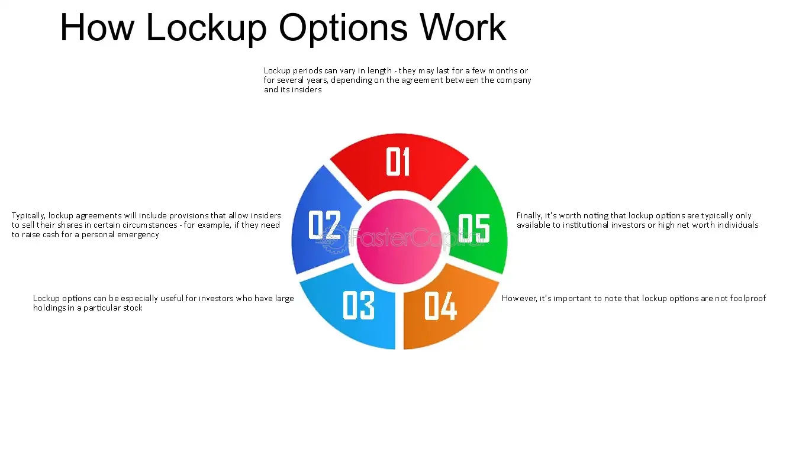

## Table of Contents

## What is a lock-up option?

A lock-up option is a time period when certain shareholders cannot sell their shares. This rule is often used after a company goes public with an initial public offering (IPO). The lock-up period usually lasts for a few months, like 90 to 180 days. It helps keep the stock price stable by preventing too many shares from being sold at once.

During the lock-up period, big investors like company founders, executives, and early investors are not allowed to sell their shares. This can be important because if these people sold a lot of shares right away, it could make the stock price drop. After the lock-up period ends, these shareholders can sell their shares if they want to. This can sometimes cause the stock price to change, depending on how many shares are sold.

## Why are lock-up options used in business and finance?

Lock-up options are used in business and finance to help keep a company's stock price stable after it goes public. When a company has an IPO, it sells shares to the public for the first time. If big shareholders, like the company's founders or early investors, were allowed to sell their shares right away, it could cause the stock price to drop a lot. By having a lock-up period, these shareholders have to wait before they can sell their shares. This helps prevent too many shares from being sold at once, which can keep the stock price more stable.

Lock-up periods also give the market time to understand the company better. When a company first goes public, people might not know much about it. The lock-up period gives investors a chance to learn about the company and its business without worrying about big shareholders selling their shares. After the lock-up period ends, if the company is doing well, the stock price might stay strong even if some shares are sold. But if the company is not doing well, the stock price might drop when the lock-up ends and more shares are sold.

## How does a lock-up option work?

A lock-up option is a rule that stops certain people from selling their shares in a company for a set time. This time is called the lock-up period and usually lasts a few months, like 90 to 180 days. The rule is used after a company goes public with an IPO. The people who can't sell their shares during this time are often big investors, like the company's founders, executives, and early investors.

The lock-up option helps keep the stock price steady by stopping too many shares from being sold all at once. If big shareholders could sell their shares right away, it might make the stock price go down a lot. The lock-up period gives the market time to learn about the company and its business without worrying about big sales of shares. When the lock-up period ends, these shareholders can sell their shares if they want to. This might affect the stock price, depending on how many shares are sold and how well the company is doing.

## What are the typical durations of lock-up periods?

Lock-up periods usually last for a few months. The most common length is between 90 and 180 days. This means that after a company goes public with an IPO, certain shareholders have to wait for 3 to 6 months before they can sell their shares.

The exact length of a lock-up period can be different for each company. It depends on what the company and its underwriters decide. Sometimes, the lock-up period might be shorter or longer than usual. But most of the time, it's around 90 to 180 days.

## Who is usually affected by lock-up options?

Lock-up options usually affect big shareholders of a company that has just gone public with an IPO. These big shareholders often include the company's founders, executives, and early investors. They are the ones who own a lot of shares before the company goes public, and they have to wait before they can sell those shares.

The lock-up period stops these big shareholders from selling their shares right away. This helps keep the stock price stable because if they sold a lot of shares at once, it could make the stock price drop. The lock-up period gives the market time to learn about the company and its business without worrying about big sales of shares.

## Can lock-up options be negotiated or modified?

Yes, lock-up options can be negotiated or modified. When a company is planning to go public, it works with underwriters to decide the terms of the lock-up period. These terms can include how long the lock-up period will last and who it will affect. Sometimes, the company and its big shareholders might want to change these terms. They might ask for a shorter lock-up period or for some shareholders to be allowed to sell their shares earlier.

If everyone agrees, the lock-up period can be changed. This might happen if the company's situation changes, or if the shareholders have a good reason for wanting to sell their shares sooner. But changing the lock-up period can affect the stock price, so it's important for the company and its underwriters to think carefully about any changes.

## What are the potential benefits of lock-up options for companies?

Lock-up options help companies keep their stock price steady after going public. When a company has an IPO, it sells shares to the public for the first time. If big shareholders like the founders or early investors could sell their shares right away, it might make the stock price drop a lot. The lock-up period stops this from happening by making these shareholders wait before they can sell their shares. This helps the stock price stay more stable, which is good for the company and its new public investors.

Lock-up periods also give the market time to learn about the company. When a company first goes public, people might not know much about it. The lock-up period gives investors a chance to understand the company's business and how it's doing without worrying about big shareholders selling their shares. This can help build trust in the company and its stock. After the lock-up period ends, if the company is doing well, the stock price might stay strong even if some shares are sold.

## What are the potential drawbacks of lock-up options for investors?

Lock-up options can be a problem for some investors because they have to wait before they can sell their shares. If an investor wants to sell their shares right after the company goes public, they can't do it if there's a lock-up period. This means they can't get their money out of the investment when they want to. This can be hard if they need the money for something else or if they think the stock price might go down after the lock-up period ends.

Also, when the lock-up period ends, a lot of shares might be sold all at once. This can make the stock price drop because there are more shares for sale. Investors who bought shares after the IPO might see the value of their investment go down if a lot of shares are sold after the lock-up period. So, lock-up options can make things uncertain for investors, especially right after the lock-up period ends.

## How do lock-up options impact stock prices?

Lock-up options help keep stock prices steady right after a company goes public. When a company has an IPO, it sells shares to the public for the first time. Big shareholders like the company's founders and early investors have to wait before they can sell their shares. This wait time is called the lock-up period. By making these big shareholders wait, the lock-up period stops too many shares from being sold at once. This helps the stock price stay more stable because there's less chance of a big drop right after the IPO.

When the lock-up period ends, it can affect the stock price in different ways. If the company is doing well and people like the stock, the price might stay strong even if some shares are sold. But if a lot of shares are sold all at once after the lock-up period, it can make the stock price go down. This is because there are more shares for sale, which can make the price drop. So, the end of the lock-up period can be a time when the stock price might change a lot, depending on how many shares are sold and how the company is doing.

## What are some notable examples of lock-up options in major IPOs?

One famous example of a lock-up option was with Facebook's IPO in 2012. When Facebook went public, they had a lock-up period that lasted for 180 days. This meant that big shareholders like the company's founder, Mark Zuckerberg, and other early investors couldn't sell their shares right away. The lock-up period helped keep the stock price steady at first. But when the lock-up period ended, a lot of shares were sold, and the stock price dropped a bit.

Another example is with Uber's IPO in 2019. Uber had a lock-up period that also lasted for 180 days. This stopped big shareholders from selling their shares for six months after the IPO. The lock-up period helped keep the stock price from dropping too much right away. But when the lock-up period ended, the stock price did go down because a lot of shares were sold. These examples show how lock-up periods can help at first but can also cause changes in the stock price when they end.

## How do lock-up options differ across various jurisdictions?

Lock-up options can be different in different countries because each country has its own rules about going public with an IPO. In the United States, lock-up periods usually last for 90 to 180 days. This means that big shareholders have to wait before they can sell their shares. The rules are set by the company and its underwriters, and they can be changed if everyone agrees. In Europe, the rules can be different. For example, in the UK, lock-up periods might be shorter or longer, depending on what the company decides with its underwriters.

In some countries, like China, the government has more control over lock-up periods. Chinese companies going public might have to follow stricter rules set by the government. These rules can include longer lock-up periods or different rules for who can sell shares and when. The differences in lock-up options across jurisdictions show how important it is for investors to understand the rules in the country where the company is going public. This can help them know when they might be able to sell their shares and how the lock-up period might affect the stock price.

## What strategies can investors use to navigate lock-up expirations?

Investors can use different strategies to handle lock-up expirations. One way is to watch the stock closely as the lock-up period ends. If a lot of shares are sold right after the lock-up period, the stock price might go down. So, investors might want to sell some of their shares before the lock-up period ends to avoid a big drop in the stock price. Another strategy is to look at how the company is doing. If the company is doing well and people like the stock, the price might stay strong even if some shares are sold. This can help investors decide if they should keep their shares or sell them.

Another strategy is to spread out their investments. Instead of putting all their money into one stock, investors can buy shares in different companies. This way, if one stock goes down after a lock-up period ends, it won't hurt their whole investment. Investors can also look at what big shareholders are doing. If the founders or early investors are selling a lot of shares after the lock-up period, it might be a sign that the stock price could go down. By paying attention to these things, investors can make better choices about when to buy or sell their shares.

## References & Further Reading

1. **Books on Lock-Up Options and Corporate Strategy:**
   - **Investment Valuation: Tools and Techniques for Determining the Value of Any Asset** by Aswath Damodaran. This book provides a comprehensive overview of investment strategies, including insights into corporate finance mechanisms like lock-up options.
   - **The Art of M&A: A Merger Acquisition Buyout Guide** by Stanley Foster Reed, Alexandra Reed Lajoux, and H. Peter Nesvold. This book discusses strategies in mergers and acquisitions, providing context for the use of lock-up options.

2. **Papers on Lock-Up Periods and Financial Markets:**
   - **"The Role of Lock-Up Provisions in Underwriting"** by James C. Brau and Stanley E. Fawcett, published in Financial Management. This paper examines the function and impact of lock-up provisions during IPOs.
   - **"Lock-Up Expirations and the Return Performance of IPOs"** by Paul Schultz, provides empirical data on how lock-up period expirations can affect stock performance, particularly in IPO scenarios.

3. **Articles on Algorithmic Trading:**
   - **"Algorithmic Trading and the Market for Liquidity"** published in the Financial Analysts Journal by Joel Hasbrouck and Gideon Saar. This article explores the implications of algorithmic trading on market liquidity and efficiency.

4. **Books on Algorithmic Trading:**
   - **Algorithmic Trading: Winning Strategies and Their Rationale** by Ernest P. Chan. This book covers the fundamental algorithms used in trading and their applications, potentially synergizing with lock-up strategies.

5. **Case Studies:**
   - Detailed analyses can be found in Harvard Business School cases, such as the Viacom and QVC Network acquisition battle for Paramount Communications, which exemplifies the strategic application of lock-up options.

6. **Resources for Advanced Trading Strategies:**
   - **Quantitative Trading: How to Build Your Own Algorithmic Trading Business** by Ernest P. Chan. This resource provides guidance on developing algorithmic trading strategies, which can enhance lock-up option strategies.

7. **Online Resources and Databases:**
   - **SSRN (Social Science Research Network):** Contains a plethora of research papers related to financial mechanisms and trading strategies.
   - **Investopedia:** Offers a broad range of articles elucidating financial concepts, including lock-up options and algorithmic trading dynamics.

These resources provide a solid foundation for understanding and developing strategies involving lock-up options and [algorithmic trading](/wiki/algorithmic-trading), suitable for both beginners and advanced practitioners in finance.

