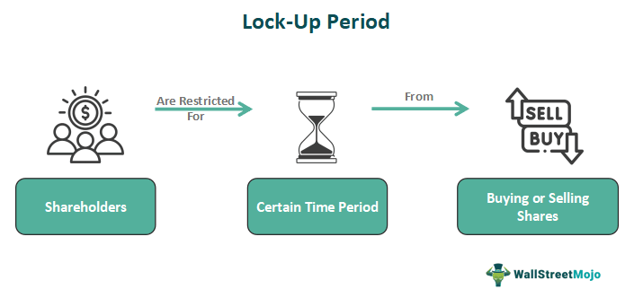

## Table of Contents

## What is a lock-up period?

A lock-up period is a time when certain people, like company insiders or early investors, can't sell their shares. This rule is often used after a company goes public with an initial public offering (IPO). The lock-up period helps keep the stock price stable by stopping a lot of shares from being sold all at once.

Lock-up periods usually last from 90 to 180 days, but the length can change. After the lock-up period ends, these people can sell their shares if they want to. This can sometimes make the stock price go down if a lot of shares are sold at the same time.

## Why are lock-up periods implemented?

Lock-up periods are put in place to help keep a company's stock price steady after it goes public. When a company has an IPO, it's important that the stock price doesn't drop too quickly. If people who own a lot of shares, like the company's founders or early investors, could sell their shares right away, they might all sell at the same time. This could make the stock price fall a lot, which wouldn't be good for the new public company.

So, to stop this from happening, a lock-up period is used. During this time, these important shareholders can't sell their shares. This gives the market time to get used to the new stock and helps the stock price stay more stable. Once the lock-up period is over, these shareholders can sell their shares if they want to, but by then, the stock is usually more settled in the market.

## How long does a typical lock-up period last?

A typical lock-up period lasts from 90 to 180 days. This is the time when people like the company's founders or early investors can't sell their shares after the company goes public.

The length of the lock-up period can change. It depends on what the company and its underwriters decide. But usually, it's between 3 to 6 months. This time helps keep the stock price stable and gives the market a chance to get used to the new stock.

## Who is usually affected by lock-up periods?

Lock-up periods usually affect people like the company's founders, early investors, and some employees who own a lot of shares. These people got their shares before the company went public. They can't sell their shares during the lock-up period to help keep the stock price stable after the company's IPO.

The lock-up period is important because it stops these important shareholders from selling all their shares at once. If they could sell right away, it might make the stock price drop a lot. So, the lock-up period gives the market time to get used to the new stock and helps the stock price stay steady.

## Can you give an example of a lock-up period in a company's IPO?

When a company like Snap Inc. went public in 2017, they had a lock-up period. Snap Inc. is the company that made the app Snapchat. After their IPO, people like the founders and early investors couldn't sell their shares for 180 days. This was to help keep the stock price steady and give the market time to get used to the new stock.

During those 180 days, the stock price of Snap Inc. stayed more stable because the important shareholders couldn't sell their shares all at once. After the lock-up period ended, these people could sell their shares if they wanted to. Sometimes, when a lot of shares are sold after the lock-up period, it can make the stock price go down a bit. But the lock-up period helped Snap Inc. have a smoother start as a public company.

## What are the potential impacts of a lock-up period on stock prices?

A lock-up period can help keep a stock's price steady right after a company goes public. When a company has an IPO, it's important that the stock price doesn't drop too fast. If the founders and early investors could sell their shares right away, they might all sell at the same time. This could make the stock price fall a lot, which wouldn't be good for the new public company. So, the lock-up period stops this from happening by not letting these important shareholders sell their shares for a while, usually 90 to 180 days.

When the lock-up period ends, there can be some effects on the stock price. Once the lock-up is over, the people who couldn't sell their shares before can start selling them. If a lot of them decide to sell at the same time, it can make the stock price go down. But this doesn't always happen. Sometimes, the market is ready for the shares to start being sold, and the stock price might not change much. The lock-up period gives the market time to get used to the new stock, so the end of the lock-up can be less of a shock to the stock price.

## Are there any exceptions or early release conditions for lock-up periods?

Sometimes, there can be exceptions or early release conditions for lock-up periods. These exceptions are usually written into the agreement between the company and its underwriters. For example, if the stock price goes up a lot after the IPO, the company might let some shareholders sell their shares before the lock-up period ends. This can help them make money while the stock price is high.

Another reason for an early release might be if the company needs to raise more money. If the company is doing well and wants to grow, it might let some shareholders sell their shares early to get more cash for the company. But these early releases are not common. Most of the time, the lock-up period stays in place to keep the stock price stable and give the market time to get used to the new stock.

## How do lock-up periods affect investor behavior?

Lock-up periods can change how investors act. When a company goes public, investors know that important people like the founders and early investors can't sell their shares for a while. This can make investors feel more sure about the stock. They might think, "If the people who know the company best are holding onto their shares, maybe it's a good sign." So, during the lock-up period, investors might be more likely to buy the stock because they think it's going to stay stable.

When the lock-up period ends, investors start watching the stock closely. They know that the founders and early investors can now sell their shares. If a lot of shares are sold right after the lock-up ends, it can make the stock price go down. So, some investors might sell their shares before the lock-up period is over to avoid a price drop. Others might wait to see what happens. They might buy more shares if they think the stock will stay strong, or they might sell if they think the price will fall. The end of the lock-up period can make investors more careful and ready to act quickly.

## What are the legal and regulatory considerations surrounding lock-up periods?

Lock-up periods are set up by agreements between the company going public and the underwriters who help with the IPO. These agreements are part of the legal paperwork that everyone involved has to follow. The rules about lock-up periods can be different depending on where the company is and what the stock market rules are. But the main idea is the same everywhere: to keep the stock price from dropping too fast after the IPO. The Securities and Exchange Commission (SEC) in the United States, for example, looks over the IPO paperwork to make sure everything is fair and follows the rules.

Breaking the lock-up agreement can lead to legal problems. If someone sells their shares during the lock-up period when they're not supposed to, they could get in trouble. The company and the underwriters might take them to court, or they might have to pay a fine. So, it's important for everyone to follow the lock-up rules. The lock-up period helps keep the stock price stable, and breaking it could hurt the company and its new investors.

## How do companies strategically use lock-up periods during mergers and acquisitions?

When companies are merging or being bought out, lock-up periods can be a smart tool. They help keep things calm and steady during a time when a lot is changing. If a company is being bought, the people who own shares in that company might agree to a lock-up period. This means they can't sell their shares right away after the merger or acquisition is done. This helps the new, bigger company keep its stock price from dropping too fast. It gives everyone time to see how the new company is doing before any big changes happen.

Lock-up periods during mergers and acquisitions can also help the new company plan for the future. The people who can't sell their shares during the lock-up might be more likely to help the new company do well. They want the stock price to go up, so they might work harder to make the merger or acquisition a success. Once the lock-up period is over, these shareholders can sell their shares if they want to. But by then, the new company is usually more stable, and the stock price might be higher because of the hard work everyone did during the lock-up period.

## What are the differences between lock-up periods in public offerings versus private placements?

Lock-up periods in public offerings and private placements work a bit differently, but they both help keep things steady. When a company goes public with an IPO, a lock-up period stops important people like the founders and early investors from selling their shares right away. This usually lasts from 90 to 180 days. The goal is to keep the stock price from dropping too fast by stopping a lot of shares from being sold all at once. This gives the market time to get used to the new stock and helps the company start off well as a public company.

In private placements, lock-up periods can be used when a company is selling shares to a small group of investors instead of going public. These lock-up periods might be shorter or longer than in public offerings, and the rules can be more flexible. The company might use a lock-up period to make sure the new investors don't sell their shares right away, which could hurt the company's value. This helps the company stay stable and gives the new investors a chance to see how the company does before they can sell their shares.

## How can advanced financial modeling predict the effects of ending lock-up periods on market dynamics?

Advanced financial modeling can help predict what might happen to a stock's price when a lock-up period ends. These models use a lot of information, like how many shares are locked up, how the stock has been doing, and what's happening in the market. They look at past data from other companies that had lock-up periods to see what usually happens when they end. By putting all this information into a computer model, experts can guess if the stock price might go up or down, and by how much. This helps investors make smarter choices about buying or selling the stock before the lock-up period is over.

When the lock-up period ends, the models can show how selling a lot of shares at once might affect the stock price. If a lot of people decide to sell their shares right away, it could make the stock price drop. But if only a few people sell, or if the market is strong, the stock price might not change much. The models can also look at what other investors might do. Some might buy more shares if they think the stock is still a good deal, while others might sell if they think the price will go down. By understanding these different possibilities, financial models can help investors get ready for what might happen when the lock-up period ends.

## References & Further Reading

[1]: Sibley, S. (2012). ["The Effect of Lockup Expirations on Stock Prices: The Case of Venture Capital Backed IPOs."](https://en.wikipedia.org/wiki/Louisa_Hawkins_Canby) Journal of Empirical Finance, 19(2), 203-211.

[2]: Aggarwal, R. (2000). ["Stabilization Activities by Underwriters after Initial Public Offerings."](https://www.jstor.org/stable/222446) Journal of Finance, 55(3), 1075-1103.

[3]: Brav, A., & Gompers, P. A. (2003). ["The Role of Lockups in Initial Public Offerings."](https://www.semanticscholar.org/paper/The-Role-of-Lockups-in-Initial-Public-Offerings-Brav-Gompers/cd34b16d8eb9734b4f46660e2d45ac76bd618ddb) Review of Financial Studies, 16(1), 1-29.

[4]: ["Algorithmic Trading: Winning Strategies and Their Rationale"](https://books.google.com/books/about/Algorithmic_Trading.html?id=WAlFDwAAQBAJ) by Ernest P. Chan

[5]: ["Hedge Funds: Definitive Strategies and Techniques"](https://books.google.com/books/about/Hedge_Funds.html?id=p6AbgXkbKIYC) by Francois-Serge Lhabitant

[6]: Ritter, J. R. (2005). ["Investment Banking and Securities Issuance."](https://www.sciencedirect.com/science/article/pii/S1574010203010094) Handbook of the Economics of Finance, 1, 255-310.