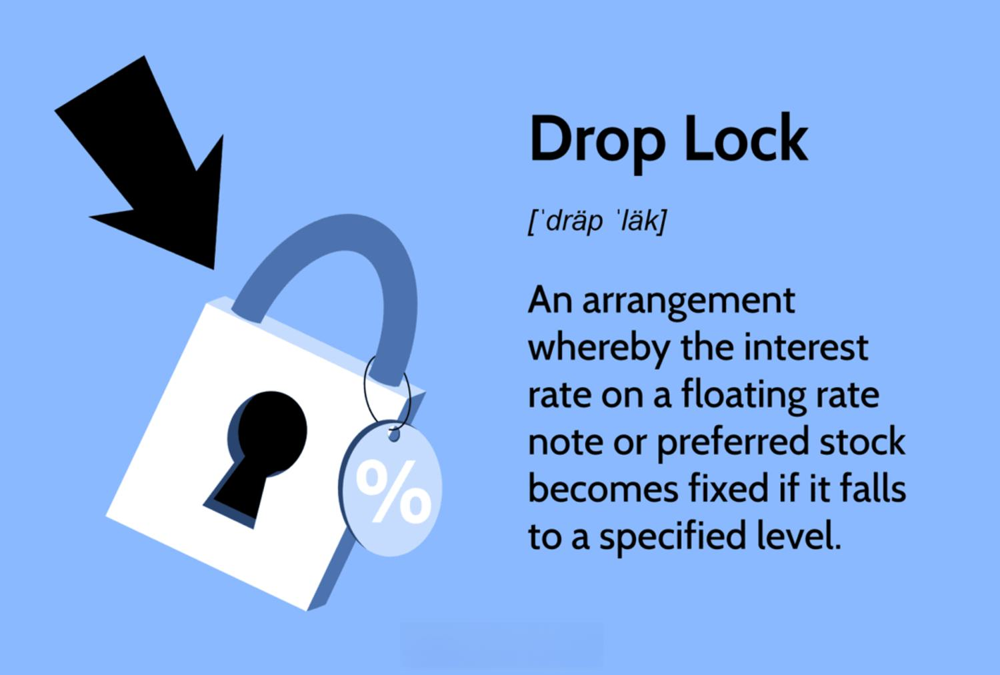

## Table of Contents

## What is the basic definition of a lockdown?

A lockdown is when people are told to stay where they are and not move around. This usually happens because of an emergency or a big problem. For example, during a dangerous situation like a school shooting or a natural disaster, a lockdown might be used to keep everyone safe.

During a lockdown, people might have to stay in their homes, schools, or workplaces. They are not allowed to go outside or move to different places. This helps to control the situation and stop it from getting worse. Lockdowns can last for a short time or a long time, depending on what is happening.

## What are the primary reasons for implementing a lockdown?

Lockdowns are put in place mainly to keep people safe during emergencies. One big reason is to stop the spread of dangerous diseases, like during a pandemic. By telling people to stay at home and not go out, governments can slow down the spread of the illness. This gives doctors and hospitals more time to treat sick people and helps prevent the health system from getting overwhelmed.

Another reason for a lockdown is to protect people from immediate dangers, like during a school shooting or a terrorist attack. When there is a threat, a lockdown can help keep everyone in a safe place until the danger is gone. It stops people from moving around and possibly running into the dangerous situation. This kind of lockdown is usually shorter but very important for keeping everyone safe right away.

## How does a lockdown differ from a curfew?

A lockdown and a curfew are both ways to control where people can go, but they are different. A lockdown usually means that people have to stay where they are and not leave at all. This can happen because of a big problem like a dangerous disease or a threat like a shooting. During a lockdown, everything might close, like schools, shops, and workplaces. People are told to stay inside their homes or wherever they are when the lockdown starts.

A curfew, on the other hand, is a rule that says people can't be outside during certain times, usually at night. During a curfew, people can still go out during the day, but they have to be home by a specific time. Curfews are often used to keep peace and order, like after a big event or to stop crime. So, while a lockdown stops people from going anywhere at any time, a curfew only limits when people can be outside.

## What are the common mechanisms used to enforce a lockdown?

To make sure people follow a lockdown, governments and local leaders use different ways to enforce it. They might use police or soldiers to watch the streets and make sure no one is out without a good reason. Sometimes, they set up checkpoints where they check if people have permission to be outside. If someone breaks the lockdown rules, they might get a warning, a fine, or even be arrested. Governments also use TV, radio, and social media to tell people about the lockdown and why it's important to stay home.

Another way to enforce a lockdown is by closing public places like shops, schools, and parks. This makes it harder for people to go out and helps stop the spread of diseases or other dangers. Governments can also use technology, like tracking people's phones, to see if they are following the rules. By making sure everyone knows the rules and the reasons behind them, and by using these different methods, leaders can help keep people safe during a lockdown.

## Can you explain the stages or phases of a lockdown?

A lockdown usually has different stages or phases that help control the situation and keep people safe. The first stage is often called the initial lockdown or strict lockdown. This is when the rules are very tight, and people have to stay home and not go out unless it's really important, like for medical reasons or to buy food. During this stage, many businesses and public places close down, and the government might use police or soldiers to make sure everyone follows the rules. The goal is to stop the spread of a disease or deal with a big danger quickly.

As things start to get better, the lockdown moves into the easing or relaxation phase. In this stage, the rules start to loosen up a bit. Some businesses and public places might open again, but with rules like wearing masks and keeping distance from others. People might be allowed to go out more, but they still need to be careful. The government keeps watching to see if the situation is getting better or if they need to go back to a stricter lockdown.

The final stage is called the recovery or post-lockdown phase. By this time, the danger or disease is under control, and life starts to go back to normal. Most businesses and public places are open again, and people can go out more freely. But there might still be some rules to follow, like wearing masks or getting vaccinated, to make sure the problem doesn't come back. This stage is about getting back to normal life while still being careful.

## What are the typical impacts of a lockdown on society and the economy?

Lockdowns have big effects on society. People have to stay home and not see their friends or family as much. This can make them feel lonely and sad. Schools close, so kids can't go to class and learn with their teachers and classmates. Many people work from home, which can be hard if they don't have a good place to work or if they have to take care of kids at the same time. Some people lose their jobs or can't work at all, which makes it hard for them to pay for things they need. But, lockdowns also bring people closer together in some ways, like when neighbors help each other out or when families spend more time together at home.

Lockdowns also hurt the economy a lot. When businesses have to close, they don't make money, and their workers might not get paid. This means less money is being spent in the whole country, which can lead to a recession. Stores and restaurants might go out of business if they can't make enough money during the lockdown. The government might try to help by giving money to people and businesses, but it's still a big problem. On the other hand, some businesses, like those that sell things online or deliver food, might do better during a lockdown. It's a hard balance to keep the economy going while also keeping people safe.

## How do governments communicate lockdown policies to the public?

Governments use different ways to tell people about lockdown rules. They use TV, radio, and newspapers to share important news. They also use social media like Facebook, Twitter, and Instagram to reach a lot of people quickly. Governments might send text messages or emails to people's phones to make sure everyone knows the rules. They also put up signs in public places and use loudspeakers to remind people to stay home and follow the lockdown.

It's important for governments to explain why the lockdown is happening and what people need to do. They talk about the dangers, like a disease spreading or a big threat, and why staying home will help keep everyone safe. They tell people which places are closed, like schools and shops, and what they can still do, like going to the doctor or buying food. By sharing clear and simple information, governments help people understand and follow the lockdown rules.

## What legal frameworks support the implementation of lockdowns?

Governments use laws to make lockdowns happen. These laws let them tell people to stay home and close places like schools and shops. In many countries, there are special laws for emergencies that let the government take quick action to keep people safe. These laws can be used during a big problem like a disease spreading fast or a dangerous situation. The government has to follow these laws carefully so they don't break people's rights.

When a lockdown happens, the government might use other laws too. These laws can help them control how people move around and make sure everyone follows the rules. For example, they might use laws about public health or safety to make sure people stay home and don't spread a disease. The government also has to explain why the lockdown is needed and how long it will last. This helps people understand and follow the rules better.

## How do different countries vary in their approach to lockdowns?

Different countries have different ways of doing lockdowns. Some countries, like New Zealand, have very strict lockdowns where everyone has to stay home and only go out for important things like buying food or going to the doctor. They close almost everything, like schools and shops, to stop a disease from spreading. Other countries, like Sweden, might not have a full lockdown but instead ask people to be careful and keep distance from others. They might keep some places open but with rules to follow.

The way countries enforce lockdowns can also be different. In some places, like India, the government might use the police or army to make sure people stay home. They might set up checkpoints and give fines or even arrest people who break the rules. In other countries, like the United States, different states might have different rules, and the government might not be as strict about making people follow them. They might focus more on telling people why it's important to stay home and let them choose to follow the rules.

These differences can come from many things, like the country's laws, how bad the problem is, and what people think about lockdowns. Some countries might have better ways to help people during a lockdown, like giving them money or food, which can make it easier for people to stay home. Other countries might not have as much help, so people might need to go out to work or get what they need. Understanding these differences can help us see why lockdowns can look so different around the world.

## What are some historical examples of lockdowns and their outcomes?

One famous lockdown happened in the Middle Ages during the Black Death. In 1377, the town of Ragusa (now Dubrovnik, Croatia) made people stay away from others for 30 days if they came from places with the plague. This was one of the first times a quarantine was used. Later, they made it 40 days, which is where we get the word "quarantine" from. This helped stop the disease from spreading so much in their town, showing that keeping people apart can work to control a dangerous illness.

In modern times, during the 2003 SARS outbreak, China used lockdowns in some areas. They closed schools and told people to stay home. This helped stop the spread of SARS and showed that lockdowns could be used to control diseases. More recently, during the COVID-19 pandemic, many countries used lockdowns. For example, Italy had a strict lockdown in early 2020. They closed everything and told people to stay home. This helped slow down the spread of the virus, but it also hurt the economy and made life hard for many people. These examples show that lockdowns can help control diseases, but they also have big effects on people's lives and the economy.

## What are the psychological effects of prolonged lockdowns on populations?

Prolonged lockdowns can make people feel sad and lonely. When people have to stay home for a long time, they miss seeing their friends and family. This can lead to feelings of being alone, which is not good for mental health. Kids might feel bored and frustrated because they can't go to school or play with their friends. Adults might worry about their jobs and money, which can add more stress and anxiety.

Being stuck at home can also make people feel stuck in their minds. Some people might feel more anxious or even depressed because they can't do the things they usually enjoy. It's hard to stay positive when life feels so different and limited. But, it's also true that some people find new ways to connect with others online or spend more time with their family, which can help them feel better. Overall, long lockdowns can be tough on people's minds, but finding ways to stay connected and take care of mental health can make a big difference.

## How can technology be utilized to improve the effectiveness of lockdowns?

Technology can help make lockdowns work better in many ways. One way is by using apps on phones to track where people are going. This can help the government see if people are staying home and following the rules. They can also use technology to send quick messages to everyone's phones to tell them about the lockdown and any changes to the rules. This helps make sure everyone knows what they need to do. Another way technology helps is by letting people work from home. With computers and the internet, many people can do their jobs without leaving their houses, which keeps them safe and helps the economy keep going.

Also, technology can help people stay connected during a lockdown. Video calls and social media let people talk to their friends and family even when they can't see them in person. This can make the lockdown easier to handle and help people feel less lonely. Online learning is another big help. Kids can keep learning from home with the help of computers and the internet, so they don't fall behind in school. By using technology in these ways, lockdowns can be more effective and easier for everyone to deal with.

## What are the economic implications of lockdown measures?

Lockdowns implemented during the COVID-19 pandemic were primarily designed to curb the spread of the virus. However, these measures inevitably caused significant disruptions to economic activities. The impact of lockdowns varied significantly depending on their duration, severity, and the specific strategies adopted by different nations.

Examining case studies such as Sweden and the United Kingdom provides insight into how differing levels of lockdown stringency resulted in variable economic and public health outcomes. Sweden opted for a less stringent approach, avoiding full-scale lockdowns and instead relying on public health recommendations and voluntary measures to control the virus spread. As a result, the Swedish economy initially faced fewer disruptions, maintaining some economic stability. However, this approach led to higher infection and mortality rates compared to nations with stricter lockdowns.

In contrast, the United Kingdom enforced more rigorous lockdown measures, including mandatory stay-at-home orders and business closures during various phases of the pandemic. These actions successfully reduced transmission rates but at the substantial cost of economic disruption. The UK's GDP contracted significantly during the early phases of the pandemic, reflecting the immediate economic impact of stringent lockdowns.

The balance between maintaining public health and ensuring economic stability poses a significant challenge for policymakers. On one hand, lockdowns are essential to protect lives and prevent healthcare systems from becoming overwhelmed. On the other hand, stringent lockdowns can trigger severe economic consequences by reducing consumer spending, disrupting supply chains, and increasing unemployment rates. Therefore, policymakers must carefully consider the timing, stringency, and duration of lockdowns to optimize this balance.

Mathematically, the economic cost of lockdowns can be represented by a loss function $L$, which might depend on various factors such as infection rates $I$, stringency level $S$, and duration $D$:

$$
L = f(I, S, D)
$$

The goal for policymakers is to minimize $L$ while simultaneously ensuring that the infection rate $I$ remains below a critical threshold $I_c$ that healthcare facilities can manage. Strategies that dynamically adjust $S$ and $D$ in response to changing epidemiological data can be instrumental in achieving this balance.

Overall, the experience from Sweden and the UK underlines the need for adaptive and context-specific strategies. Effective lockdown measures require not only consideration of immediate public health needs but also the foresight to mitigate long-term economic repercussions. References supporting these insights include studies from Investopedia and the Int J Environ Res Public Health, which analyze the relationship between lockdown stringency and economic outcomes.

## How does algorithmic trading function in a pandemic era?

Algorithmic trading, a vital component of modern financial markets, enhances [liquidity](/wiki/liquidity-risk-premium) and market efficiency by automating the execution of trades using pre-defined criteria. However, the COVID-19 pandemic introduced unprecedented market [volatility](/wiki/volatility-trading-strategies) which fundamentally challenged these systems.

During the pandemic, the drastic increase in market uncertainty altered trading dynamics significantly. Traditionally, [algorithmic trading](/wiki/algorithmic-trading) relies on historical data and established patterns to predict short-term price movements and execute trades. The sudden and unpredictable shifts in market conditions disrupted these patterns, leading to a decline in algorithmic trading volumes initially as traders recalibrated their models to account for heightened volatility. For example, traditional volatility models may employ the GARCH (Generalized Autoregressive Conditional Heteroskedasticity) approach to forecast market variance:

$$

\sigma_t^2 = \alpha_0 + \sum_{i=1}^{q} \alpha_i \epsilon_{t-i}^2 + \sum_{j=1}^{p} \beta_j \sigma_{t-j}^2 
$$

In this formula, $\sigma_t^2$ represents the forecasted variance, while $\epsilon_{t-i}^2$ and $\sigma_{t-j}^2$ denote past squared returns and variances. As the pandemic introduced shocks to these inputs, traders adjusted parameters and incorporated real-time data to improve prediction accuracy.

Despite these challenges, algorithmic traders quickly adapted by employing sophisticated strategies to navigate the drastically shifted landscape. These strategies included the utilization of hidden liquidity and fragmented markets, which became more prominent as traditional trading floors were rendered less effective by social distancing measures. Hidden liquidity, often found in dark pools and alternative trading systems, provided algorithmic traders with the ability to execute large orders without significantly impacting market prices. Moreover, the fragmentation of markets meant algorithms had to be more adept at seeking optimal execution venues across various trading platforms.

These adaptations highlight the resilience and flexibility of algorithmic trading systems in maintaining market operations even during extreme volatility. By leveraging real-time data processing and advanced analytics, these systems continued to provide critical liquidity support, bolstering overall market stability. As algorithmic traders continued to refine their strategies, the importance of incorporating robust risk management practices and predictive analytics became increasingly evident. 

In conclusion, the pandemic underscored the pivotal role of algorithmic trading in modern financial markets and the necessity for continuous adaptation to maintain market functionality in the face of unforeseen global events.

## References & Further Reading

[1]: ["The COVID-19 Government Response Tracker (OxCGRT)"](https://learn.microsoft.com/en-us/azure/open-datasets/dataset-oxford-covid-government-response-tracker) by the Blavatnik School of Government at Oxford University, provides a comprehensive measure of government responses to the COVID-19 pandemic.

[2]: International Monetary Fund. (2020). ["World Economic Outlook, April 2020: The Great Lockdown."](https://www.imf.org/en/Publications/WEO/Issues/2020/04/14/World-Economic-Outlook-April-2020-The-Great-Lockdown-49306)

[3]: Baker, S. R., Bloom, N., Davis, S. J., & Terry, S. J. (2020). ["COVID-Induced Economic Uncertainty."](https://www.nber.org/papers/w26983) National Bureau of Economic Research Working Paper No. 26983.

[4]: ["Global Economic Prospects: Pandemic, Recession: The Global Economy in Crisis"](https://repository.gheli.harvard.edu/repository/13423/) by the World Bank Group.

[5]: Lopez de Prado, M. (2018). ["Advances in Financial Machine Learning."](https://www.amazon.com/Advances-Financial-Machine-Learning-Marcos/dp/1119482089) Wiley.

[6]: Chandler, D. (2020). ["How COVID-19 is Impacting Algorithmic Trading."](https://westminsterresearch.westminster.ac.uk/item/qz094/coronavirus-and-the-end-of-resilience) Nasdaq.

[7]: ["Quantitative Trading: How to Build Your Own Algorithmic Trading Business"](https://github.com/LucindaYa/quant-resources/blob/master/Quantitative%20Trading%20How%20to%20Build%20Your%20Own%20Algorithmic%20Trading%20Business.pdf) by Ernest P. Chan.