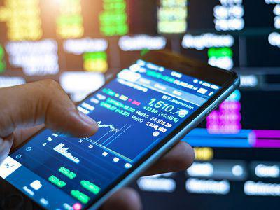

## Table of Contents

## What is a locked market?

A locked market is when a stock's price doesn't change much because there are rules or limits on how much it can move. This often happens in some countries where the government or stock exchange sets rules to keep the market stable. For example, if a stock is going down a lot, the exchange might stop it from falling further for a while.

This can be good because it stops big, sudden changes that could scare people. But it can also be bad because it might hide real problems in the market. If prices can't move freely, it's hard to know what's really happening. So, while a locked market can make things seem calm, it might not always be the best way to handle market ups and downs.

## Why might a market be locked?

A market might be locked to keep things calm and stop big, sudden price changes that could scare people. When prices move too fast, it can make investors worried and cause them to sell their stocks quickly. By setting limits on how much prices can change, the people in charge, like the government or the stock exchange, try to keep the market stable and protect investors from big losses.

But locking a market can also have downsides. It might hide real problems that need to be fixed. If prices can't move freely, it's hard to see what's really going on in the market. This can make it tough for investors to make good decisions because they don't have all the information they need. So, while locking a market can help in the short term, it might not be the best solution for the long term.

## Who typically enforces a locked market?

A locked market is usually enforced by the people who run the stock exchange or by the government. The stock exchange has rules to make sure trading is fair and safe for everyone. If prices start moving too fast, the exchange might step in and set limits to keep things calm. This helps stop big, sudden changes that could scare people and cause them to sell their stocks quickly.

Sometimes, the government might also step in to lock a market. They do this to protect the economy and make sure the market stays stable. Governments have the power to make rules that everyone has to follow, so they can set limits on how much prices can change. This is often done to prevent big losses for investors and to keep the overall economy from getting too shaky.

## What are the common reasons for locking a market?

A market might be locked to stop big, sudden price changes that could scare people. When prices move too fast, it can make investors worried and cause them to sell their stocks quickly. By setting limits on how much prices can change, the people in charge, like the stock exchange or the government, try to keep the market stable. This helps protect investors from big losses and keeps the market from getting too shaky.

But locking a market can also have downsides. It might hide real problems that need to be fixed. If prices can't move freely, it's hard to see what's really going on in the market. This can make it tough for investors to make good decisions because they don't have all the information they need. So, while locking a market can help in the short term, it might not be the best solution for the long term.

## How does a locked market affect investors?

A locked market can make things feel safer for investors because it stops big, sudden price changes. When prices can't move too much, investors don't have to worry about losing a lot of money all at once. This can make them feel more secure and less likely to panic and sell their stocks quickly. It's like having a safety net that keeps the market calm and stable.

But a locked market can also be tricky for investors. When prices are locked, it's hard to see what's really happening in the market. If prices can't move freely, investors might not have all the information they need to make good choices. This can make it tough to know if they should buy or sell their stocks. So, while a locked market can help in the short term, it might not be the best way to help investors in the long run.

## What are the legal implications of a locked market?

When a market is locked, it means there are rules that stop prices from moving too much. These rules are made by the people who run the stock exchange or by the government. They do this to keep the market calm and protect investors from big losses. But these rules also have to follow the law. The government and the stock exchange have to make sure their rules are fair and don't break any laws about how markets should work.

If the rules for a locked market are not fair or if they break the law, people might take the government or the stock exchange to court. Investors might say that the rules stopped them from making money or that they were treated unfairly. This can lead to big legal fights. So, the people in charge have to be very careful when they make rules for a locked market. They need to make sure the rules help keep the market stable but also follow the law and treat everyone fairly.

## Can a locked market be beneficial in any way?

Yes, a locked market can be helpful. It stops big, sudden price changes that can scare people. When prices can't move too much, it makes the market feel safer for everyone. Investors don't have to worry about losing a lot of money all at once. This can help keep the market calm and stable, which is good for the economy.

But a locked market also has its downsides. When prices are locked, it's hard to see what's really happening in the market. If prices can't move freely, investors might not have all the information they need to make good choices. So, while a locked market can be helpful in the short term, it might not be the best way to help the market and investors in the long run.

## How can one identify if a market is locked?

You can tell if a market is locked by watching how the prices move. If you see that the price of a stock stays the same even when there's a lot of news or other things happening that should change it, that's a sign the market might be locked. Another clue is if you hear about rules from the government or the stock exchange that say prices can't go up or down too much in a short time.

Sometimes, you might see messages or alerts from the stock exchange saying that trading is being limited. This means the market is locked to keep things calm. If you're not sure, you can check news websites or talk to someone who knows about the stock market. They can help you understand if the market is locked and why it's happening.

## What strategies can be used to navigate a locked market?

When you're in a locked market, it's important to stay calm and not make quick decisions. Since the prices can't move much, you might want to wait and see what happens next. Keep an eye on the news and any announcements from the stock exchange or government. They might give you clues about when the market will open up again. It's also a good idea to talk to other investors or a financial advisor. They can help you understand what's going on and what you should do.

Another strategy is to focus on the long term. A locked market usually doesn't last forever, so think about your goals for the future. If you believe in the companies you've invested in, you might want to hold onto your stocks until the market unlocks. This can be a good time to do more research and learn more about the market. That way, when the market opens up again, you'll be ready to make smart choices.

## What are the historical examples of locked markets?

One famous example of a locked market happened in China in 2007. The Chinese government set rules to stop the stock market from going down too fast. They did this because they were worried about big losses for investors. The government put limits on how much prices could change each day. This helped keep the market calm for a while, but some people thought it hid real problems that needed to be fixed.

Another example is from the United States in 1987. After the stock market crashed on what's called "Black Monday," the New York Stock Exchange put in place something called "circuit breakers." These are rules that stop trading if prices fall too fast. The idea was to give everyone a break and stop panic selling. While this helped calm things down, it also made it harder for investors to know what was really happening in the market.

## How do locked markets impact global trade?

When a market is locked, it can affect global trade because it changes how people buy and sell things around the world. If a big country's stock market is locked, it can make other countries worried about their own markets. They might start trading less because they're not sure what will happen next. This can slow down global trade because countries might wait to see what happens before they buy or sell things.

But locked markets can also help global trade in some ways. If a locked market stops a big crash from happening, it can keep the world economy from getting too shaky. This can make other countries feel more confident about trading. They might keep buying and selling things because they think the market will stay stable. So, while locked markets can make global trade harder in the short term, they might help keep things calm and stable in the long term.

## What are the future predictions regarding locked markets?

In the future, locked markets might become more common as countries try to keep their economies stable. With more news and information spreading quickly around the world, big changes in the stock market can happen fast. Governments and stock exchanges might use locked markets more often to stop these big changes from scaring people and causing panic. This could help keep things calm, but it might also make it harder for investors to know what's really happening in the market.

On the other hand, some people think that locked markets might be used less in the future. As technology gets better, it might be easier to find other ways to keep the market stable without locking it. New rules and tools could help stop big price changes without stopping prices from moving freely. This would be good for investors because they would have more information to make smart choices. So, while locked markets might still be used sometimes, other ways to keep the market calm could become more popular.

## What are the types of algorithmic trading strategies?

Algorithmic trading strategies encompass various methodologies designed to exploit financial market inefficiencies. These strategies are pivotal for traders seeking to automate their trading processes. Here, we explore some of the most notable [algorithmic trading](/wiki/algorithmic-trading) strategies, including trend-following, [arbitrage](/wiki/arbitrage), market-making, and mean reversion.

### Trend-Following Strategies
Trend-following strategies aim to capitalize on the [momentum](/wiki/momentum) of market prices. These strategies identify and exploit price trends, often relying on technical analysis tools such as moving averages. A simple moving average (SMA) can help determine the direction of a trend by smoothing out price data over a specified period. The formula for an SMA is:

$$
\text{SMA} = \frac{P_1 + P_2 + \cdots + P_n}{n}
$$

where $P$ represents the price at each time period, and $n$ is the total number of periods. Traders execute buy or sell orders when a short-term moving average crosses a long-term moving average, indicating a trend reversal.

### Arbitrage Opportunities
Arbitrage strategies take advantage of price disparities between markets to achieve risk-free profits. This involves buying an asset in one market where it is undervalued and simultaneously selling it in another where it is overvalued. A common example is triangular arbitrage in [forex](/wiki/forex-system) markets, which exploits discrepancies between exchange rates of different currency pairs. Python can be used to identify such opportunities efficiently:

```python
def find_arbitrage_opportunity(rates):
    # rates is a dictionary with currency pairs as keys and exchange rates as values
    for pair1, rate1 in rates.items():
        for pair2, rate2 in rates.items():
            if pair1 != pair2:
                crosses = pair1[1] == pair2[0]
                if crosses and pair1[0] == pair2[1]:
                    # Calculate cross rate and compare to 1
                    cross_rate = rate1 * rate2 
                    if cross_rate > 1:
                        return (pair1, pair2, cross_rate)
    return None
```

### Market-Making
Market-making involves placing simultaneous buy and sell orders for a security to profit from the bid-ask spread. Market makers provide [liquidity](/wiki/liquidity-risk-premium) by continuously quoting bid and ask prices, thus facilitating trade execution for market participants. The bid-ask spread is the difference between the ask price (sell) and the bid price (buy). Successful market-making requires sophisticated algorithms to dynamically adjust prices in response to market conditions.

### Mean Reversion
Mean reversion strategies are predicated on the hypothesis that asset prices will revert to their long-term average. Traders using this strategy buy undervalued securities and sell overvalued ones, expecting prices to return to their mean over time. The z-score is a common tool used to determine the extent of deviation from the average, defined as:

$$
Z = \frac{X - \mu}{\sigma}
$$

where $X$ is the current price, $\mu$ is the mean price, and $\sigma$ is the standard deviation. A high positive or negative z-score suggests that the price may revert to its mean.

Each of these strategies presents unique opportunities and challenges, with their effectiveness largely dependent on market conditions and the robustness of the underlying algorithm. As financial markets continue to evolve, so too will the strategies used to navigate and capitalize on them.

## References & Further Reading

[1]: Bergstra, J., Bardenet, R., Bengio, Y., & Kégl, B. (2011). ["Algorithms for Hyper-Parameter Optimization."](https://dl.acm.org/doi/10.5555/2986459.2986743) Advances in Neural Information Processing Systems 24.

[2]: ["Advances in Financial Machine Learning"](https://www.amazon.com/Advances-Financial-Machine-Learning-Marcos/dp/1119482089) by Marcos Lopez de Prado

[3]: ["Evidence-Based Technical Analysis: Applying the Scientific Method and Statistical Inference to Trading Signals"](https://www.amazon.com/Evidence-Based-Technical-Analysis-Scientific-Statistical/dp/0470008741) by David Aronson

[4]: ["Machine Learning for Algorithmic Trading"](https://github.com/stefan-jansen/machine-learning-for-trading) by Stefan Jansen

[5]: ["Quantitative Trading: How to Build Your Own Algorithmic Trading Business"](https://www.amazon.com/Quantitative-Trading-Build-Algorithmic-Business/dp/1119800064) by Ernest P. Chan