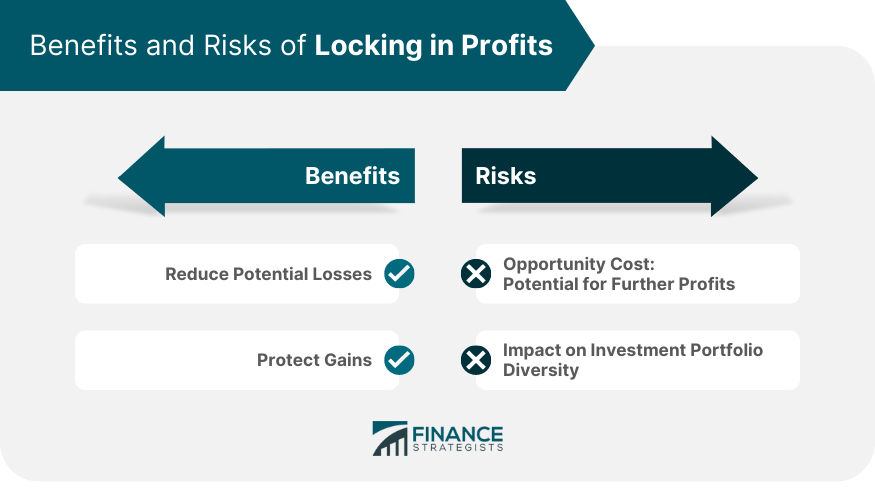

## Table of Contents

## What does 'locking in profits' mean in trading?

Locking in profits in trading means selling an investment that has increased in value to secure the gains you've made. When you buy a stock, cryptocurrency, or any other asset, and its price goes up, you can choose to sell it at that higher price. By doing this, you turn your paper profits, which are just numbers on a screen, into real money that you can use or save.

It's important to lock in profits because the value of investments can go down as well as up. If you don't sell when the price is high, you might see your profits disappear if the market turns against you. Many traders have a strategy for when to sell, often based on reaching a certain profit target or when the market shows signs of reversing. This helps them manage risk and keep the money they've earned.

## Why is it important to lock in profits?

Locking in profits is important because it helps you keep the money you've made from your investments. When you buy something like a stock and its price goes up, you can sell it to turn your gains into real money. If you don't sell and the price drops later, you might lose the profits you had. By selling when the price is high, you make sure you get to keep the money you've earned.

It's also a way to manage risk. The value of investments can go up and down a lot, and no one can predict the market perfectly. By locking in profits, you protect yourself from big losses if the market suddenly turns against you. Many traders have rules about when to sell, like when a stock reaches a certain price or when they see signs that the market might go down. This helps them stay safe and keep the money they've made.

## What are the basic steps to lock in profits?

To lock in profits, first, you need to buy an investment like a stock or cryptocurrency. Watch the price of your investment closely. When the price goes up and you're happy with the profit you've made, that's when you can think about selling.

Next, decide when to sell. You might have a target price in mind, or you might use a tool called a stop-loss order, which automatically sells your investment if the price drops to a certain level. Once you decide it's time to sell, go to your trading platform and place a sell order at your chosen price. When the order goes through, you'll have turned your paper profits into real money that you can use or save.

Remember, locking in profits is about making sure you keep the money you've earned. It's a way to protect yourself from losing those gains if the market goes down. By selling at the right time, you can enjoy the rewards of your investment choices.

## Can you explain the concept of a stop-loss order in relation to locking in profits?

A stop-loss order is a tool that helps you lock in profits by automatically selling your investment if the price starts to drop. When you set a stop-loss order, you choose a price below the current market price. If the price of your investment falls to that level, the order turns into a sell order, and your investment is sold. This helps you protect the money you've made because it stops your profits from turning into losses if the market goes down.

Using a stop-loss order is like having a safety net. Let's say you bought a stock at $50, and it goes up to $70. You might set a stop-loss order at $65. If the price drops to $65, your stock will be sold automatically, and you'll keep most of your profit. This way, even if the price keeps falling after that, you've already locked in a $15 profit per share. Stop-loss orders can help you manage risk and make sure you keep the money you've earned from your investments.

## How does a trailing stop work to lock in profits?

A trailing stop is a special kind of stop-loss order that helps you lock in profits as the price of your investment goes up. When you set a trailing stop, you choose a percentage or a dollar amount below the current price. As the price of your investment rises, the trailing stop moves up with it, always staying the same distance behind. If the price starts to fall, the trailing stop doesn't move down. Instead, it stays where it is until the price hits it, and then it turns into a sell order.

This means that a trailing stop can help you keep more of your profits. Let's say you bought a stock at $50, and it goes up to $70. You set a trailing stop at 10%, which is $63 at that point. If the stock keeps going up to $80, the trailing stop moves up to $72, still 10% below the current price. If the stock then drops to $72, your stock will be sold, locking in a profit of $22 per share. This way, you can enjoy the upward movement of the stock while protecting yourself from big drops.

## What are the psychological benefits of locking in profits?

Locking in profits can make you feel good because it shows that your choices about buying and selling were smart. When you see the money you've made from your investments, it can boost your confidence. Knowing that you've turned a profit can make you feel proud of yourself and more sure about making future investment decisions.

It also helps to reduce stress and worry. The stock market can go up and down a lot, and it can be scary to see your money go down. By locking in profits, you take away some of that fear because you've already made some money. This can help you feel more calm and in control, even when the market is acting crazy.

## What are some common strategies used to lock in profits?

One common strategy to lock in profits is setting a target price. This means you decide on a price at which you will sell your investment. For example, if you buy a stock at $50, you might decide to sell it when it reaches $60. This way, you make sure you get the profit you want before the price might go down. Another strategy is using a stop-loss order. This is like setting a safety net. You choose a price below the current market price, and if the price drops to that level, your investment is sold automatically. This helps protect your profits if the market turns against you.

Another strategy is using a trailing stop. This is a special kind of stop-loss order that moves up as the price of your investment goes up. For example, if you set a trailing stop at 10% below the current price, it will keep moving up as the price rises. If the price starts to fall, the trailing stop stays where it is and sells your investment if it hits that level. This helps you keep more of your profits as the price goes up. Some traders also use a mix of these strategies, like setting a target price and a trailing stop at the same time, to lock in profits while still giving the investment room to grow.

## How can locking in profits affect long-term investment performance?

Locking in profits can help your long-term investment performance by making sure you keep the money you've made. When you sell an investment at a higher price, you turn your paper profits into real money. This means you can use that money to buy other investments or save it. By doing this, you can grow your money over time because you're not losing the gains you've made. It's like taking a step forward and then using that step to take another one.

On the other hand, locking in profits too often might stop you from making even bigger gains. If you sell an investment too soon, you might miss out on more money if the price keeps going up. For example, if you sell a stock at a small profit and then it goes up a lot more, you could have made more money by holding onto it. So, it's important to find a balance. You want to lock in profits to protect your money, but you also want to give your investments time to grow as much as they can.

## What are the potential risks of locking in profits too early?

Locking in profits too early can mean missing out on bigger gains. If you sell your investment when it goes up a little bit, you might not get the chance to make more money if the price keeps going up a lot. For example, if you buy a stock at $50 and it goes to $60, you might sell it to lock in a $10 profit. But if the stock then goes to $80, you would have made a $30 profit if you had waited. So, selling too soon can make you miss out on the best part of the investment's growth.

It can also mess up your long-term investment plan. If you keep selling your investments early, you might not give them enough time to grow as much as they could. Over time, this can mean you end up with less money than if you had been more patient. It's important to think about your goals and how long you want to keep your investments before deciding to lock in profits. Finding the right balance between locking in profits and letting your investments grow is key to doing well in the long run.

## How do professional traders use advanced techniques to lock in profits?

Professional traders often use a strategy called "scaling out" to lock in profits. This means they sell parts of their investment at different times instead of selling it all at once. For example, if a trader buys 100 shares of a stock, they might sell 25 shares when the price goes up a little bit to lock in some profit. Then, they might sell another 25 shares if the price goes up more, and so on. This way, they can keep some of their investment in case the price keeps going up, but they also make sure they get some profit if the price starts to go down.

Another advanced technique professional traders use is called "hedging." Hedging means they buy another investment that moves in the opposite direction of their main investment. For example, if a trader owns a stock that they think might go down, they might buy an option that goes up in value if the stock goes down. This can help them lock in profits because even if the stock goes down, the option might go up, balancing out their losses. Hedging is like having insurance for their investments, making sure they can keep some of their profits no matter what happens in the market.

## Can you provide an example of locking in profits in a volatile market?

In a volatile market, locking in profits can be really important. Let's say you bought a stock for $50, and it goes up to $70 in a short time. The market is moving up and down a lot, so you decide to sell half of your shares at $70 to lock in some profit. By doing this, you turn some of your paper gains into real money. Now you have $35 per share in profit from the half you sold, and you still have the other half of your shares, which could go up even more.

The next day, the stock price drops to $60. Because you sold half your shares at $70, you're still happy with the profit you made. The other half of your shares are now worth less, but you're not as worried because you already locked in some profit. If the stock price goes back up, you can sell the rest of your shares at a higher price. If it keeps going down, you can set a stop-loss order at $55 to protect the rest of your investment. This way, you manage to keep some of your profits even when the market is acting crazy.

## How does tax strategy influence the decision to lock in profits?

Tax strategy can affect when you decide to lock in profits because selling investments can lead to taxes. If you sell an investment and make a profit, you might have to pay capital gains tax. This tax can be different depending on how long you held the investment. If you held it for more than a year, you might pay a lower tax rate than if you held it for less than a year. So, some people might wait to sell their investments until they've held them for over a year to pay less in taxes.

Because of this, you might choose to lock in profits at a time that helps you save on taxes. For example, if you think the stock price won't go up much more but you've held it for less than a year, you might wait a bit longer to sell it. This way, you can lock in your profits and pay a lower tax rate. It's important to think about taxes when deciding when to sell because it can make a big difference in how much money you keep from your investments.

## What are the technical tools and indicators used in algo trading?

Technical indicators play a crucial role in algorithmic trading by providing quantitative data to help identify profitable entry and [exit](/wiki/exit-strategy) points. These tools support traders in making informed decisions based on market trends and potential reversals.

### Moving Averages

Moving averages smooth out price data to identify the direction of a trend. The Simple Moving Average (SMA) is calculated by taking the average of a security's price over a specific number of periods. The formula for a simple moving average is:

$$
\text{SMA} = \frac{P_1 + P_2 + \cdots + P_n}{n}
$$

where $P$ represents the price at each period, and $n$ is the total number of periods.

The Exponential Moving Average (EMA) gives more weight to recent prices, making it more responsive to new information. It is calculated using the formula:

$$
\text{EMA}_t = \alpha \times P_t + (1 - \alpha) \times \text{EMA}_{t-1}
$$

where $\alpha = \frac{2}{n+1}$ is the smoothing factor, $P_t$ is the price at the current period, and $\text{EMA}_{t-1}$ is the EMA of the previous period.

### Relative Strength Index (RSI)

The RSI is a [momentum](/wiki/momentum) indicator that measures the speed and change of price movements. It ranges from 0 to 100 and is typically used to identify overbought or oversold conditions in a market. The RSI is calculated as follows:

$$
\text{RSI} = 100 - \frac{100}{1 + \text{RS}}
$$

where $\text{RS} = \frac{\text{Average Gain}}{\text{Average Loss}}$ over a specified number of periods.

### Moving Average Convergence Divergence (MACD)

The MACD is a trend-following momentum indicator that shows the relationship between two EMAs. It is calculated by subtracting the 26-period EMA from the 12-period EMA. The formula is:

$$
\text{MACD} = \text{EMA}_{12} - \text{EMA}_{26}
$$

A nine-day EMA of the MACD, known as the "signal line," is then plotted on top of the MACD, functioning as a trigger for buy and sell signals.

### Bollinger Bands

Bollinger Bands consist of a middle band (SMA) and two outer bands set at a distance based on standard deviations. They expand and contract based on market [volatility](/wiki/volatility-trading-strategies). The bands are calculated as follows:

- Middle Band = 20-day SMA
- Upper Band = Middle Band + (2 \times \text{20-day standard deviation})
- Lower Band = Middle Band - (2 \times \text{20-day standard deviation})

These bands offer insight into volatility and potential price action, often indicating that prices are about to head back to the median.

Incorporating these technical tools and indicators into algorithmic trading systems allows traders to automate and optimize their strategies, assisting in the timely execution of trades and improving overall market analysis. By analyzing historical data and testing various scenarios, these indicators can significantly enhance the decision-making process in trading.

## How can risk management be effectively implemented in profit realization?

Effective risk management is essential for maintaining and securing gains in trading, especially amidst market volatility. By implementing risk management strategies, investors can protect their profits from potential downturns and unforeseen market events. Two primary approaches in risk management include portfolio diversification and hedging strategies, both of which act to safeguard against adverse market movements.

### Portfolio Diversification

Diversification involves spreading investments across various asset classes, industry sectors, and geographic regions. This strategy reduces the impact of a decline in a single asset or group of assets on the overall portfolio. Through diversification, the risk is distributed, thereby minimizing the potential for significant financial loss. For example, an investor might hold a mix of stocks, bonds, commodities, and real estate. The performance of these assets typically shows low correlation, meaning that a decline in one is less likely to cause a similar decline in another.

Mathematically, diversification can be understood by examining the variance of a portfolio. The variance $\sigma_p^2$ of a portfolio consisting of two assets can be given by:

$$
\sigma_p^2 = w_1^2\sigma_1^2 + w_2^2\sigma_2^2 + 2w_1w_2\rho\sigma_1\sigma_2
$$

where $w_1$ and $w_2$ are the weights of the two assets, $\sigma_1$ and $\sigma_2$ are the standard deviations of the assets, and $\rho$ is the correlation coefficient between the two assets. By carefully selecting weights and seeking uncorrelated assets, an investor can potentially reduce the overall portfolio risk.

### Hedging Strategies

Hedging is another crucial strategy in risk management, involving the use of financial instruments to offset potential losses in investments. This can be achieved through derivatives such as options and futures contracts. For instance, an investor holding a stock might purchase a put option, which grants the right to sell the stock at a predetermined price, thus safeguarding against a price decline below this level. Similarly, futures contracts can lock in selling prices for commodities, protecting against adverse price movements.

### Algorithmic Risk Management 

In algorithmic trading, systems can incorporate specific risk parameters that automatically adjust trading positions in response to market changes. These parameters, often coded into the trading algorithms, include stop-loss limits, leverage constraints, and exposure limits. By employing algorithms, traders can rapidly respond to market shifts, maintaining the desired risk profile without manual intervention.

A simple example in Python for an algorithmic stop-loss strategy might look like this:

```python
class AlgoTrader:
    def __init__(self, initial_investment, stop_loss):
        self.capital = initial_investment
        self.stop_loss = stop_loss

    def execute_trade(self, market_price, initial_price):
        potential_loss = ((initial_price - market_price) / initial_price) * 100
        if potential_loss > self.stop_loss:
            self.sell()

    def sell(self):
        print("Selling asset to prevent further loss.")

trader = AlgoTrader(initial_investment=100000, stop_loss=10)
trader.execute_trade(market_price=85, initial_price=100)
```

### Conclusion 

Incorporating effective risk management workflows within trading strategies is not only a prudent practice but an essential one for preserving profits. Whether through diversification, hedging, or algorithmic adjustments, these methods play a vital role in mitigating potential losses, thereby providing investors with a solid foundation for sustainable market success.

## References & Further Reading

[1]: ["Advances in Financial Machine Learning"](https://www.amazon.com/Advances-Financial-Machine-Learning-Marcos/dp/1119482089) by Marcos Lopez de Prado

[2]: ["Machine Learning for Algorithmic Trading"](https://github.com/stefan-jansen/machine-learning-for-trading) by Stefan Jansen

[3]: ["Quantitative Trading: How to Build Your Own Algorithmic Trading Business"](https://www.amazon.com/Quantitative-Trading-Build-Algorithmic-Business/dp/1119800064) by Ernest P. Chan

[4]: ["Evidence-Based Technical Analysis: Applying the Scientific Method and Statistical Inference to Trading Signals"](https://www.amazon.com/Evidence-Based-Technical-Analysis-Scientific-Statistical/dp/0470008741) by David Aronson

[5]: Pardo, R. (2008). ["The Evaluation and Optimization of Trading Strategies."](https://onlinelibrary.wiley.com/doi/book/10.1002/9781119196969) Wiley Trading.