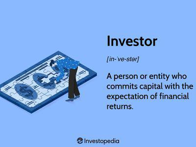

In today's rapidly evolving financial markets, investors and traders face the dual challenge of maximizing profits while minimizing risks. The fusion of technology and finance has played a pivotal role in addressing this challenge, leading to the emergence of algorithmic trading. By leveraging computer algorithms to execute trades at speeds and frequencies impossible for human traders, algorithmic trading has dramatically transformed how transactions are conducted.

One of the primary benefits of algorithmic trading is its ability to systematically lock in profits through well-defined strategies. These strategies are designed to capitalize on market opportunities while adhering to risk management principles, ensuring that profits are realized efficiently. The precision and speed of algorithmic trading allow traders to react swiftly to market changes, securing gains and reducing exposure to volatility.



As this article will explore, various investment strategies utilize profit realization to optimize trading outcomes, with algorithmic trading playing a central role. By setting predefined rules and conditions for trade executions, investors can ensure that their profit targets are met and risks are mitigated, thus enhancing their overall trading performance.

## Table of Contents

## Understanding Profit Realization in Trading

Profit realization is an essential aspect of trading, encompassing the act of converting unrealized, or "paper," gains into actual profits through the sale of securities. This process is integral to any robust trading strategy because it effectively reduces an investor's exposure to the inherent volatility of financial markets and helps secure gains that have been accrued over a period.

The primary objective of profit realization is to solidify profits by executing trades at an opportune time. This is critical: leaving gains unrealized exposes them to market fluctuations, where favorable conditions could rapidly reverse, leading to lost potential profits. By setting clear guidelines and employing systematic approaches, traders can lock in profits and enhance their overall financial performance.

Several methods assist in effective profit realization:

1. **Stop-Loss Orders**: These are automated instructions placed with a broker to buy or sell a security once it reaches a certain price. In profit realization, stop-loss orders are used to protect gains by automatically selling a security if its price drops to a predetermined level, thus preventing further losses.

    ```python
    # Example of a stop-loss order in Python pseudo-code
    def place_stop_loss_order(current_price, stop_loss_price):
        if current_price <= stop_loss_price:
            execute_sell_order()
    ```

2. **Target Prices**: Setting a target price involves determining a specific price level at which a security will be sold to realize profits. Traders identify these targets based on market analysis, technical signals, or predefined strategies. When the target price is achieved, the position is closed, converting paper gains into actual profit.

3. **Trailing Stops**: A trailing stop order is a more dynamic approach, where the stop price follows the market price at a fixed percentage or dollar amount below the current market value. As the market price increases, the stop price adjusts upwards, allowing for profit capture while mitigating potential losses if the market price starts to decline.

    ```python
    # Example of a trailing stop order in Python pseudo-code
    def update_trailing_stop(current_price, trailing_stop_percent):
        stop_price = current_price * (1 - trailing_stop_percent/100)
        return stop_price
    ```

Each of these methods contributes to a disciplined trading approach, mitigating the risks associated with market unpredictability while ensuring profits are not left to chance. By strategically applying these tools, investors can effectively manage their positions and capitalize on favorable market movements, thus achieving their financial goals.

## Algorithmic Trading: An Overview

Algorithmic trading utilizes specialized software to automate the execution of trading strategies, utilizing pre-defined rules and algorithms. This approach transforms the landscape of financial markets by enabling quick and efficient trade execution, often beyond the capabilities of human traders. One of the prominent applications of [algorithmic trading](/wiki/algorithmic-trading) is high-frequency trading ([HFT](/wiki/high-frequency-trading-strategies)), where transactions are completed within fractions of a second. Such rapid execution allows traders to capitalize on minute price changes that are imperceptible and unexploitable in human-paced trading.

The advantages of algorithmic trading include increased speed, accuracy, and reduced transaction costs. By automating the trading process, traders can ensure that their strategies are executed exactly as planned, minimizing the risk of human error. Additionally, algorithms are devoid of emotional influences such as fear and greed, which often lead to poor decision-making among human traders.

Algorithms in trading can range from simple to highly complex, incorporating a mixture of technical indicators and statistical models. For example, a simple moving average crossover strategy might involve buying an asset when a short-term moving average crosses above a long-term moving average, and selling when the opposite occurs. More advanced algorithms may involve intricate mathematical models, such as mean reversion or statistical [arbitrage](/wiki/arbitrage) strategies, which rely on historical price patterns to identify profitable trading opportunities.

In a typical algorithmic trading setup, traders deploy strategies on platforms that offer real-time data and order execution capabilities. These platforms may utilize languages such as Python to code algorithms, given Python's extensive libraries and ease of use for data manipulation and analysis. For instance, a simple Python script could be set up to automatically execute trades based on specific signals derived from market data.

```python
import numpy as np
import pandas as pd

# Example Dataframe of historical prices
data = pd.DataFrame({
    'price': [100, 102, 101, 105, 107, 106]
})

# Calculating short-term and long-term moving averages
short_window = 2
long_window = 3
data['short_mavg'] = data['price'].rolling(window=short_window).mean()
data['long_mavg'] = data['price'].rolling(window=long_window).mean()

# Generating trading signals
data['signal'] = 0
data.loc[data['short_mavg'] > data['long_mavg'], 'signal'] = 1
data.loc[data['short_mavg'] <= data['long_mavg'], 'signal'] = -1

print(data)
```

The above script calculates the short-term and long-term moving averages of a series of prices and generates buy and sell signals when the short-term moving average crosses above or below the long-term moving average. This simplified example demonstrates how algorithmic trading strategies can automate decision-making processes in the trading environment.

By employing algorithmic trading, financial institutions and individual traders can achieve efficiency, execute strategies at scale, and improve consistency in trading outcomes.

## Strategies for Locking in Profits with Algo Trading

In algorithmic trading, effectively locking in profits is crucial for optimizing returns and managing risks. Several strategies can facilitate this process, including the Fixed Threshold Strategy, Trailing Stop Strategy, and Signal-Based Strategy.

**Fixed Threshold Strategy** involves setting predetermined exit points for trades. By establishing a target price at which to sell a security, traders can ensure profits are captured once this threshold is reached. This method relies on a disciplined approach where exit points are defined based on comprehensive analysis, reducing the emotional biases that often come with decision-making under pressure. To implement this strategy in an algorithmic trading environment, the algorithm can be programmed to automatically execute a sell order when the asset price meets or exceeds the specified threshold. This ensures timely and efficient profit realization without requiring constant monitoring by the trader.

**Trailing Stop Strategy** employs a dynamic stop-loss order that adjusts with favorable market movements. The trailing stop is set at a specified percentage or dollar amount below the market price and moves upward as the price of the asset increases. However, it does not move downward. This allows traders to capture profits while providing a buffer against potential losses if the market price declines. For instance, if a trader establishes a trailing stop at 5% for a stock priced at $100, and the price increases to $110, the stop price will rise to $104.50 (5% below $110). This mechanism enables traders to lock in profits as the asset appreciates, automatically selling if the price drops to the stop level.

In a Python-based algorithmic trading system, a trailing stop strategy could be coded as follows:

```python
def trailing_stop(current_price, trail_percent, highest_price):
    stop_price = highest_price * (1 - trail_percent / 100)
    if current_price > highest_price:
        highest_price = current_price
    return max(stop_price, current_price)

# Usage example:
current_price = 110
trail_percent = 5
highest_price = 100

new_stop_price = trailing_stop(current_price, trail_percent, highest_price)
print(f'New Stop Price: {new_stop_price}')
```

**Signal-Based Strategy** utilizes technical and fundamental indicators to determine the optimal exit points for trades. This strategy is reliant on a combination of market analysis tools such as Relative Strength Index (RSI), Moving Average Convergence Divergence (MACD), and other metrics that signal potential market trends and reversals. Algorithms can be designed to scan these indicators and automatically trigger an exit when signals suggest the market is at or nearing a peak, or when conditions indicate a potential downturn. By integrating multiple indicators, traders can enhance their decision-making accuracy and timing for profit realization.

In implementing these strategies, traders benefit from reduced human error and the ability to operate at speeds and efficiencies unattainable in manual trading. Through algorithmic methods, traders can systematically secure profits while adhering to predefined risk parameters and strategic objectives.

## Technical Tools and Indicators in Algo Trading

Technical indicators play a crucial role in algorithmic trading by providing quantitative data to help identify profitable entry and [exit](/wiki/exit-strategy) points. These tools support traders in making informed decisions based on market trends and potential reversals.

### Moving Averages

Moving averages smooth out price data to identify the direction of a trend. The Simple Moving Average (SMA) is calculated by taking the average of a security's price over a specific number of periods. The formula for a simple moving average is:

$$
\text{SMA} = \frac{P_1 + P_2 + \cdots + P_n}{n}
$$

where $P$ represents the price at each period, and $n$ is the total number of periods.

The Exponential Moving Average (EMA) gives more weight to recent prices, making it more responsive to new information. It is calculated using the formula:

$$
\text{EMA}_t = \alpha \times P_t + (1 - \alpha) \times \text{EMA}_{t-1}
$$

where $\alpha = \frac{2}{n+1}$ is the smoothing factor, $P_t$ is the price at the current period, and $\text{EMA}_{t-1}$ is the EMA of the previous period.

### Relative Strength Index (RSI)

The RSI is a [momentum](/wiki/momentum) indicator that measures the speed and change of price movements. It ranges from 0 to 100 and is typically used to identify overbought or oversold conditions in a market. The RSI is calculated as follows:

$$
\text{RSI} = 100 - \frac{100}{1 + \text{RS}}
$$

where $\text{RS} = \frac{\text{Average Gain}}{\text{Average Loss}}$ over a specified number of periods.

### Moving Average Convergence Divergence (MACD)

The MACD is a trend-following momentum indicator that shows the relationship between two EMAs. It is calculated by subtracting the 26-period EMA from the 12-period EMA. The formula is:

$$
\text{MACD} = \text{EMA}_{12} - \text{EMA}_{26}
$$

A nine-day EMA of the MACD, known as the "signal line," is then plotted on top of the MACD, functioning as a trigger for buy and sell signals.

### Bollinger Bands

Bollinger Bands consist of a middle band (SMA) and two outer bands set at a distance based on standard deviations. They expand and contract based on market [volatility](/wiki/volatility-trading-strategies). The bands are calculated as follows:

- Middle Band = 20-day SMA
- Upper Band = Middle Band + (2 \times \text{20-day standard deviation})
- Lower Band = Middle Band - (2 \times \text{20-day standard deviation})

These bands offer insight into volatility and potential price action, often indicating that prices are about to head back to the median.

Incorporating these technical tools and indicators into algorithmic trading systems allows traders to automate and optimize their strategies, assisting in the timely execution of trades and improving overall market analysis. By analyzing historical data and testing various scenarios, these indicators can significantly enhance the decision-making process in trading.

## Real-World Examples of Profit Realization

An investor who seeks to capitalize on market movements might initially purchase shares at a lower price based on detailed market analysis and a comprehensive trading plan. This involves setting a target price— a specific price level at which they intend to sell the shares to lock in profits. For instance, if shares are initially bought at $50 per share with a target price set at $70, the investor aims to sell once the shares reach this predetermined level, achieving a capital gain of $20 per share.

Algorithmic trading strategies can significantly optimize the execution of such plans. These strategies utilize computer programs to automate the trading process, ensuring timely execution of trades without human intervention, thus minimizing the risk of missed opportunities due to emotional decisions or market inattention. The use of algorithms allows for the precise execution of order types like limit orders and market orders, once the target price is reached.

A classic example of algorithmic trade execution is the use of a Python script that employs the `ccxt` library, a popular tool for connecting to various trading exchanges' APIs. Here is an illustrative Python code snippet showcasing how an investor might automate the selling process once the target price is met:

```python
import ccxt
import time

exchange = ccxt.binance()
symbol = 'BTC/USDT'
target_price = 70000
amount = 0.5  # Amount of asset to sell

while True:
    ticker = exchange.fetch_ticker(symbol)
    current_price = ticker['last']

    if current_price >= target_price:
        exchange.create_market_sell_order(symbol, amount)
        print(f'Sold {amount} of {symbol} at {current_price}.')
        break

    time.sleep(60)  # Check every minute
```

In this script, the investor aims to sell a specific quantity of Bitcoin (0.5 BTC) once the price reaches or surpasses $70,000. The script continuously checks the current market price and executes a market sell order when the predefined target price is met. This approach demonstrates how algorithmic strategies provide a structured and efficient manner to lock in profits.

Real-world application of these strategies ensures that investors can capitalize on rapid price movements without being physically present to manually execute trades. This is particularly beneficial in volatile markets where prices can fluctuate quickly, allowing investors to maximize their profit realization by executing trades precisely when their pre-set conditions are fulfilled.

## Risk Management in Profit Realization

Effective risk management is essential for maintaining and securing gains in trading, especially amidst market volatility. By implementing risk management strategies, investors can protect their profits from potential downturns and unforeseen market events. Two primary approaches in risk management include portfolio diversification and hedging strategies, both of which act to safeguard against adverse market movements.

### Portfolio Diversification

Diversification involves spreading investments across various asset classes, industry sectors, and geographic regions. This strategy reduces the impact of a decline in a single asset or group of assets on the overall portfolio. Through diversification, the risk is distributed, thereby minimizing the potential for significant financial loss. For example, an investor might hold a mix of stocks, bonds, commodities, and real estate. The performance of these assets typically shows low correlation, meaning that a decline in one is less likely to cause a similar decline in another.

Mathematically, diversification can be understood by examining the variance of a portfolio. The variance $\sigma_p^2$ of a portfolio consisting of two assets can be given by:

$$
\sigma_p^2 = w_1^2\sigma_1^2 + w_2^2\sigma_2^2 + 2w_1w_2\rho\sigma_1\sigma_2
$$

where $w_1$ and $w_2$ are the weights of the two assets, $\sigma_1$ and $\sigma_2$ are the standard deviations of the assets, and $\rho$ is the correlation coefficient between the two assets. By carefully selecting weights and seeking uncorrelated assets, an investor can potentially reduce the overall portfolio risk.

### Hedging Strategies

Hedging is another crucial strategy in risk management, involving the use of financial instruments to offset potential losses in investments. This can be achieved through derivatives such as options and futures contracts. For instance, an investor holding a stock might purchase a put option, which grants the right to sell the stock at a predetermined price, thus safeguarding against a price decline below this level. Similarly, futures contracts can lock in selling prices for commodities, protecting against adverse price movements.

### Algorithmic Risk Management 

In algorithmic trading, systems can incorporate specific risk parameters that automatically adjust trading positions in response to market changes. These parameters, often coded into the trading algorithms, include stop-loss limits, leverage constraints, and exposure limits. By employing algorithms, traders can rapidly respond to market shifts, maintaining the desired risk profile without manual intervention.

A simple example in Python for an algorithmic stop-loss strategy might look like this:

```python
class AlgoTrader:
    def __init__(self, initial_investment, stop_loss):
        self.capital = initial_investment
        self.stop_loss = stop_loss

    def execute_trade(self, market_price, initial_price):
        potential_loss = ((initial_price - market_price) / initial_price) * 100
        if potential_loss > self.stop_loss:
            self.sell()

    def sell(self):
        print("Selling asset to prevent further loss.")

trader = AlgoTrader(initial_investment=100000, stop_loss=10)
trader.execute_trade(market_price=85, initial_price=100)
```

### Conclusion 

Incorporating effective risk management workflows within trading strategies is not only a prudent practice but an essential one for preserving profits. Whether through diversification, hedging, or algorithmic adjustments, these methods play a vital role in mitigating potential losses, thereby providing investors with a solid foundation for sustainable market success.

## Choosing the Right Algo Trading Platform

Choosing the right algorithmic trading platform is crucial for the successful implementation and management of trading strategies. It requires careful consideration of several features to ensure that the platform aligns with the trader’s goals and technical requirements.

One of the key factors to consider is low latency. Latency refers to the time delay between the execution of a trading command and its confirmation in the market. In the context of algorithmic trading, even millisecond delays can impact the profitability of trades, particularly in high-frequency trading where swift transaction execution is essential. Platforms with low latency provide faster order execution, improving the chances of capturing favorable market opportunities.

Another vital feature is robust [backtesting](/wiki/backtesting) capabilities. Backtesting allows traders to test their trading strategies against historical market data to evaluate their effectiveness before deploying them in live markets. An effective backtesting tool should support comprehensive data analysis, enabling users to simulate different scenarios and optimize their strategies. The ability to conduct backtests with precision ensures that strategies are sound and reduces the risk of losses in live trading.

Real-time data access is similarly critical. In fast-changing markets, having access to the latest market data ensures that decisions are based on current information, minimizing the risk of outdated or incorrect data affecting trading performance. Platforms offering real-time data access help traders make informed decisions quickly, which is crucial for adapting to market volatility and executing trades at the right moment.

For those interested in implementing algorithmic trading, understanding how to optimize these features through code can be beneficial. Below is an example of Python code that outlines a basic framework for a backtest using a popular library called `[backtrader](/wiki/backtrader)`, which can be employed to simulate trading strategies:

```python
import backtrader as bt

class SampleStrategy(bt.Strategy):
    def __init__(self):
        self.sma = bt.indicators.SimpleMovingAverage(self.data, period=15)

    def next(self):
        if self.data.close[0] > self.sma[0]:
            self.buy(size=100)
        elif self.data.close[0] < self.sma[0]:
            self.sell(size=100)

# Create a cerebro object
cerebro = bt.Cerebro()
cerebro.addstrategy(SampleStrategy)

# Load historical data
data = bt.feeds.YahooFinanceData(dataname='AAPL', fromdate='2020-01-01', todate='2020-12-31')
cerebro.adddata(data)

# Run backtest
cerebro.run()
```

This script is a basic template where the moving average crossover strategy is employed on Apple Inc. stock data for the year 2020. The example illustrates the necessity of selecting a platform that supports such programming capabilities, enabling traders to tailor strategies and improve decision-making processes.

In summary, selecting a trading platform with low latency, robust backtesting tools, and real-time data access is paramount for maximizing the advantages of algorithmic trading. Careful consideration of these factors can significantly enhance a trader’s ability to execute strategies effectively and secure potential profits.

## Conclusion

Locking in profits is a fundamental aspect of successful trading, necessitating the use of efficient methods to secure gains effectively. Algorithmic trading offers a potent solution, leveraging automated systems to execute trades swiftly based on predefined strategies. By utilizing algorithmic approaches, traders can eliminate emotional biases, enhance decision-making speed, and systematically realize profits. This is achieved through advanced strategies such as fixed threshold exits, trailing stops, and signal-based decisions, which ensure that profits are captured at optimal points.

Furthermore, algorithmic methods enable traders to integrate comprehensive risk management frameworks, safeguarding their accrued profits against adverse market movements. These systems can dynamically adjust trading positions in response to market conditions, thereby reducing potential losses and stabilizing returns. The inclusion of technical tools and indicators, like moving averages or Bollinger Bands, facilitates a data-driven assessment of market trends, further enhancing the efficacy of profit realization strategies.

The ability to consistently realize gains through algorithmic trading not only improves individual trade outcomes but also contributes to overall portfolio performance over time. By adopting these techniques, investors position themselves to capitalize on market opportunities efficiently, thereby achieving a more consistent and successful trading journey.

## References & Further Reading

[1]: ["Advances in Financial Machine Learning"](https://www.amazon.com/Advances-Financial-Machine-Learning-Marcos/dp/1119482089) by Marcos Lopez de Prado

[2]: ["Machine Learning for Algorithmic Trading"](https://github.com/stefan-jansen/machine-learning-for-trading) by Stefan Jansen

[3]: ["Quantitative Trading: How to Build Your Own Algorithmic Trading Business"](https://www.amazon.com/Quantitative-Trading-Build-Algorithmic-Business/dp/1119800064) by Ernest P. Chan

[4]: ["Evidence-Based Technical Analysis: Applying the Scientific Method and Statistical Inference to Trading Signals"](https://www.amazon.com/Evidence-Based-Technical-Analysis-Scientific-Statistical/dp/0470008741) by David Aronson

[5]: Pardo, R. (2008). ["The Evaluation and Optimization of Trading Strategies."](https://onlinelibrary.wiley.com/doi/book/10.1002/9781119196969) Wiley Trading.