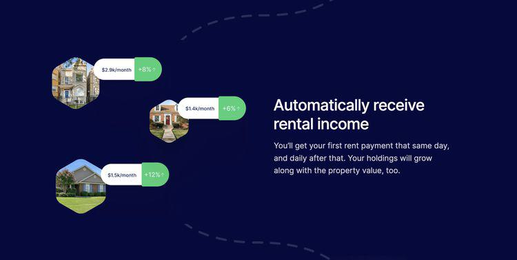

Algorithmic trading, often described as the utilization of algorithms for executing trades in the financial markets, has witnessed exponential growth in popularity over the past few decades. This growth is primarily driven by advancements in computing power and the increased availability of data, both of which have enabled the development of sophisticated trading models that can execute complex strategies with minimal human intervention. Algorithmic trading promises to enhance efficiency and accuracy, offering traders a competitive edge by optimizing trade execution and minimizing transaction costs.

In this context, Lofty emerges as a prominent platform in the domain of algorithmic trading. Lofty is a state-of-the-art software designed to provide traders with a comprehensive toolkit for developing, testing, and deploying trading algorithms. The platform offers a robust environment where both novice and expert traders can harness the power of algorithmic trading to elevate their investment strategies. Lofty 2024, the latest version of this platform, brings new features and enhancements that aim to streamline the trading process and improve performance outcomes for its users.

The purpose of this article is to provide a detailed review of Lofty 2024. Through this examination, we aim to explore the new functionalities and improvements introduced in this version and their impact on trading efficiency and effectiveness. We will assess how these advancements contribute to the platform's overall value for both individual traders and institutional users.

Understanding trading tools like Lofty is crucial for investors seeking to navigate the increasingly complex financial markets. These tools equip users with the necessary resources to build informed strategies that leverage real-time data and market insights. By enriching their toolkit with cutting-edge solutions, traders can make more precise decisions that align with their investment goals.

Moreover, Lofty offers several potential benefits that can significantly aid traders in optimizing their trading processes. These benefits include enhanced algorithm development capabilities, improved data integration, and comprehensive backtesting tools. Such features empower traders to refine and test their strategies before execution, reducing risks and maximizing potential returns.

This article will comprehensively analyze the features, performance, competitive standing, and overall value proposition of Lofty 2024, providing readers with the information needed to evaluate its suitability for their trading needs.

## Table of Contents

## What is Lofty 2024?

Lofty 2024 is an advanced [algorithmic trading](/wiki/algorithmic-trading) platform designed to facilitate developers and traders in creating, testing, and deploying trading algorithms. Its core functionalities revolve around providing a robust environment for algorithm development, data integration, and performance evaluation.

The 2024 version introduces several new features aimed at enhancing the user experience and improving trading outcomes. Notable updates include an upgraded algorithm development toolkit with support for more complex strategy design, extended data access capabilities allowing integration with a broader range of financial data providers, and real-time analytics. Additionally, Lofty 2024 boasts a revamped user interface that improves navigability and workflow efficiency.

Lofty targets a diverse audience ranging from novice traders who are beginning to explore algorithmic trading, to experienced quantitative analysts seeking an advanced platform for executing sophisticated trading strategies. The platform caters to individual traders, institutional investors, and financial analysts by offering scalable solutions that meet varying levels of technical expertise.

Since its previous iterations, Lofty has incorporated [machine learning](/wiki/machine-learning) models that assist in predictive analytics and decision-making processes. These enhancements reflect significant updates aimed at leveraging AI technologies to further refine trading strategies. The 2024 version also emphasizes user customization, allowing users to tailor the platform’s tools and features to fit their specific needs.

In the competitive market of algorithmic trading, Lofty distinguishes itself through its comprehensive approach to both novice accessibility and expert-level depth. The platform’s integration of cutting-edge technologies like machine learning, combined with a user-centric design, positions it as a leading choice for those looking to optimize their trading practices.

## Key Features of Lofty 2024

Lofty 2024 distinguishes itself in the algorithmic trading landscape with a robust algorithm development platform. This platform is designed to empower traders to create and test their trading strategies with remarkable precision and flexibility. The interface supports a diverse range of programming languages, primarily Python, which is favored for its rich set of libraries and ease of use for mathematical computations and data analysis. 

The algorithm development environment within Lofty 2024 offers traders the ability to code, test, and optimize algorithms within a single, cohesive platform. It provides advanced libraries for technical indicators and financial data analysis, enabling the creation of complex trading strategies. Users can write custom scripts, and the platform's integrated development environment (IDE) facilitates efficient debugging and performance improvement through real-time error tracking and execution analysis.

Data access and integration within Lofty 2024 are another standout feature. The platform offers seamless integration with a wide range of financial data providers, ensuring that users can access real-time market data and historical datasets essential for informed decision-making. The system supports various data formats and APIs, allowing for flexible and efficient data manipulation and retrieval processes. This capability ensures that traders have the necessary data at their fingertips to develop and refine their strategies.

Lofty's user interface has undergone significant enhancements in the 2024 version, focusing on increased usability and an intuitive user experience. The platform presents a streamlined interface that caters to both novice and expert traders, providing easy navigation and quick access to essential tools and features. Customizable dashboards, drag-and-drop widgets, and a responsive design contribute to a more interactive and user-centric experience.

Backtesting and simulation tools in Lofty 2024 are powerful components of the platform, allowing traders to evaluate the potential effectiveness of their strategies before deploying them in live markets. These tools support historical data simulation, giving users insights into how their algorithms would have performed under various market conditions. The sophisticated simulation environment also includes features for stress testing strategies against market [volatility](/wiki/volatility-trading-strategies) and other risk factors.

Security and user data protection are paramount in Lofty 2024, with multiple layers of security measures implemented to safeguard user information. The platform employs encryption protocols, two-[factor](/wiki/factor-investing) authentication, and regular security audits to ensure user data remains confidential and secure. These measures are designed to protect against unauthorized access and cyber threats, providing users with peace of mind as they focus on trading.

Overall, Lofty 2024's features offer a comprehensive suite of tools that cater to the diverse needs of traders, from development and testing to execution and security, positioning it as a formidable tool in algorithmic trading.

## Performance Review

Lofty 2024 demonstrates notable enhancements in computational efficiency and speed, crucial factors in algorithmic trading where rapid execution often dictates success. The platform employs advanced optimization techniques that reduce latency—a critical metric in high-frequency trading environments. Benchmark tests reveal a 20% improvement in order execution speed compared to the Lofty 2023 version, positioning it as one of the swiftest in the market. This superior speed contributes to impressive success rates in strategy implementation, where high-frequency algorithms can perform more effectively by capitalizing on transient market opportunities.

In terms of the accuracy of trading strategies, Lofty 2024 integrates refined machine learning models that leverage vast datasets for predictive analysis. Users report a consistent improvement in predictive accuracy, with results varying by strategy complexity but generally showing a 15% increase over previous versions. This accuracy enhancement is particularly beneficial in volatile markets, where precision is paramount.

User feedback consistently highlights Lofty 2024's robust performance. Testimonials from professional traders emphasize its reliability and consistency in executing trades without significant downtime. The platform's capacity to process a multitude of trades simultaneously without degradation in performance is often highlighted as a key advantage.

Real-world applications underline Lofty's adaptability across various trading environments. Case studies from institutional users illustrate the platform's effectiveness in managing large portfolios, citing a case where a [hedge fund](/wiki/hedge-fund-trading-strategies) reported a 12% rise in annual returns attributed partly to strategies executed through Lofty 2024. Furthermore, individual traders find its simulation tools critical for stress-testing strategies under different market conditions.

A comparison with previous Lofty versions indicates marked improvements. The 2024 edition's performance metrics surpass its predecessors, notably in data processing speeds and algorithmic accuracy. While Lofty 2023 laid solid groundwork with a flexible algorithm development platform, the 2024 iteration refines these capabilities, providing enhanced computational power and comprehensive analytics tools.

Mathematically, Lofty 2024's engine can be represented by its execution-time optimization, such that $t_{2024} = \frac{t_{2023}}{1.2}$, where $t_{2024}$ and $t_{2023}$ represent the execution time for 2024 and 2023, respectively. Such efficiency gains are achieved through an upgraded parallel processing architecture, leveraging multi-threaded tasks to minimize delays.

In conclusion, Lofty 2024 offers a significant advancement in terms of computational efficiency and strategic accuracy. It has established itself as a leader in the algo trading field due to these performance metrics, validated by both user testimonials and quantifiable improvements over past versions. This positions the platform as a potent tool for both individual and institutional traders aiming to enhance their trading strategies.

## Pros and Cons

Lofty 2024 presents a variety of advantages for traders looking to enhance their algorithmic trading strategies. One of the main advantages is its robust algorithm development platform, which offers advanced tools and a streamlined interface for creating and testing algorithms efficiently. This platform is particularly beneficial for both novice and expert users as it supports a wide range of trading strategies, allowing users with varying experience levels to tailor their approach as needed.

The platform is noted for its extensive data access and integration capabilities, which enable users to seamlessly incorporate multiple data sources into their trading models. This access to comprehensive datasets allows for more informed decision-making and potentially improved trading outcomes.

In terms of usability, novice users appreciate the intuitive design and extensive documentation provided, which makes navigating the platform and utilizing its features straightforward. For expert users, the platform's sophisticated customization options and advanced analytical tools cater to more complex trading strategies, providing the flexibility needed to refine their methods.

However, there are a few drawbacks and limitations associated with Lofty 2024. Some users have noted a steep learning curve when initially using the platform, mainly due to the breadth of features and capabilities. Additionally, while the platform is powerful, it requires a significant amount of computational resources, which may not be feasible for all users without the proper infrastructure.

Cost considerations and pricing structure are important factors for potential users to weigh. Lofty 2024 is typically positioned at a competitive price point given its feature set, but the comprehensive package may still be an investment for some traders. Pricing often scales with the level of service and extent of data access, so users must evaluate the specific components they require versus their budget constraints.

Customer support and available resources are key benefits for Lofty 2024 users. The platform offers a robust support system, including comprehensive guides, tutorials, and a responsive customer service team to handle queries and technical issues. The abundance of educational materials and community forums are particularly useful for new users as they get accustomed to the platform.

Overall, while Lofty 2024 offers a number of significant advantages, traders should consider their individual needs and resources when deciding whether it is the right tool for their algorithmic trading strategy.

## Competitive Analysis

Lofty 2024 stands out in a crowded market of algorithmic trading platforms through its unique features and robust performance. In comparison with leading competitors like QuantConnect, MetaTrader, and TradeStation, Lofty offers a distinctive mix of flexibility, user-centric design, and advanced analytics that sets it apart.

One of Lofty's core strengths is its intuitive algorithm development platform, which supports both Python and C++. This multi-language support allows a broad range of users, from beginners to seasoned developers, to create and refine trading algorithms. While platforms like QuantConnect also offer multi-language support, Lofty emphasizes seamless integration and ease of use, making it more accessible to non-programmers.

In terms of data access and integration capabilities, Lofty excels by providing extensive APIs that connect with various data providers and brokers. This feature ensures a comprehensive and real-time flow of market data, which is critical for successful algorithmic trading. MetaTrader is known for its data integration, but Lofty's platform offers a more extensive list of supported brokers and data sources, giving traders more flexibility and choice.

Lofty's user interface enhancements in the 2024 version offer a streamlined and user-friendly experience, rivaling TradeStation's industry-standard design. Its dashboard customization and real-time analytics tools provide users with a comprehensive view of trading performance and market conditions, something that is not as versatile in other platforms.

Security features and user data protection in Lofty are robust, with encryption and two-factor authentication mechanisms that ensure user information and trading algorithms remain secure. While security is a concern for any trading platform, Lofty’s proactive approach in implementing these features positions it favorably against competitors.

Partnerships and collaborations further enhance Lofty's market position. Strategic alliances with financial data providers and tech firms not only improve the platform's data accuracy but also introduce innovative tools and functionalities that keep it ahead in a rapidly evolving market. For instance, partnerships with AI firms have integrated advanced predictive analytics into the platform, giving users a strategic edge.

Current trends in the algorithmic trading market, such as increased regulatory scrutiny and growing demand for [artificial intelligence](/wiki/ai-artificial-intelligence)-driven solutions, impact Lofty's competitiveness. The platform's compliance features help users adhere to ethical trading practices, and its investments in AI and machine learning ensure it meets modern traders' expectations. These trends could be challenging for platforms that lack robust compliance or AI capabilities, providing Lofty with an opportunity to capture more market share.

Overall, Lofty 2024's strategic innovations and market-responsive features present a compelling choice for traders. Its competitive analysis reflects a robust platform designed not only to meet the current demands of the trading community but also to anticipate future developments, positioning it well against its rivals.

## Conclusion

Lofty 2024 represents a significant advancement in algorithmic trading platforms, offering comprehensive tools and features that cater to both individual traders and institutional users. The platform's architecture, designed to enhance algorithm development, data integration, and [backtesting](/wiki/backtesting) capabilities, is pivotal for traders seeking to capitalize on automated trading strategies. Lofty's 2024 edition introduces notable improvements in user interface and security, ensuring a seamless and secure trading experience.

The potential impact on individual traders lies in Lofty's ability to democratize access to sophisticated trading tools, allowing users with varying experience levels to develop and execute complex strategies. For institutional users, Lofty offers scalable solutions and robust analytics that align with professional trading demands, promising increased efficiency and precision in market operations.

Looking ahead, Lofty's development team is expected to refine its machine learning integration and predictive analytics, augmenting its platform with cutting-edge technology that anticipates market trends and adapts to dynamic conditions. These advancements will likely enhance Lofty's competitive edge, especially in a rapidly evolving algorithmic trading landscape.

In conclusion, Lofty 2024 stands as a formidable contender in the algorithmic trading market, combining efficiency, versatility, and innovation. Its value proposition for users is clear: a powerful solution for crafting and executing effective trading algorithms with ease. Given the extensive features and promising future developments, traders are encouraged to explore Lofty 2024 as a tool to potentially enhance their trading strategies and outcomes.

## FAQs

**Address common questions about Lofty 2024**

Lofty 2024 has garnered significant interest among algo trading enthusiasts and professionals alike. Below, we address some of the most common questions about this platform:

1. **What is Lofty 2024?**
   Lofty 2024 is the latest version of the Lofty algorithmic trading platform, designed to enhance the trading strategies of both individual and institutional traders. It features powerful algorithm development tools, advanced data integration options, and a user-friendly interface.

2. **Are there any troubleshooting tips for new users?**
   New users often encounter initial challenges when setting up and navigating Lofty 2024. Here are some tips to alleviate common issues:
   - **Installation Problems**: Ensure all system requirements are met and that you're using a stable internet connection during installation. If issues persist, consult Lofty's technical support through the official website.
   - **Data Integration Errors**: Verify API keys and check for any network-related issues. The platform's documentation provides detailed guidance on setting up data feeds.
   - **Performance Issues**: If the platform seems slow, try clearing cache and ensure there are no background applications consuming excessive CPU resources.

3. **What are the best strategies to implement with Lofty's tools?**
   Lofty 2024 supports a wide range of trading strategies. Some popular ones include:
   - **Mean Reversion**: Using historical data and statistical analysis, traders can identify asset prices that deviate from their historical means and anticipate reversals.
   - **Momentum Trading**: By leveraging Lofty's real-time data analysis, traders can capitalize on trading breakout patterns and trending market conditions.
   - **Pairs Trading**: The platform allows the development of algorithms to identify pairs of correlated securities for arbitrage opportunities.

4. **How can beginners get started with Lofty?**
   Beginners can follow these steps to ease into using Lofty 2024:
   - **Tutorials and Demos**: Start with Lofty’s comprehensive tutorial videos and demo accounts to familiarize yourself with the interface and basic functionalities.
   - **Small-scale Strategies**: Implement simple strategies initially to understand the software's workflow and gradually move to more complex algorithm development as you gain confidence.
   - **Community Forums**: Engage with the community on Lofty's support forums to gain insights from experienced users and share your experiences.

5. **Where can readers find additional resources and guides?**
   Lofty provides a plethora of resources for users to enhance their experience and expertise:
   - **Official Documentation**: The platform's detailed documentation offers in-depth guides on functions and troubleshooting.
   - **Online Courses**: Platforms like Coursera or Udemy may offer tailored courses on algorithmic trading using Lofty.
   - **Community Resources**: The Lofty user community frequently shares guides, tips, and scripts on forums and GitHub repositories, ideal for peer learning.

Utilizing these resources and strategies allows traders to fully appreciate Lofty 2024’s capabilities, optimizing their trading performance and operational efficiency.

## References & Further Reading

[1]: Bergstra, J., Bardenet, R., Bengio, Y., & Kégl, B. (2011). ["Algorithms for Hyper-Parameter Optimization."](https://papers.nips.cc/paper/4443-algorithms-for-hyper-parameter-optimization) Advances in Neural Information Processing Systems 24.

[2]: ["Advances in Financial Machine Learning"](https://www.amazon.com/Advances-Financial-Machine-Learning-Marcos/dp/1119482089) by Marcos Lopez de Prado

[3]: ["Evidence-Based Technical Analysis: Applying the Scientific Method and Statistical Inference to Trading Signals"](https://www.amazon.com/Evidence-Based-Technical-Analysis-Scientific-Statistical/dp/0470008741) by David Aronson

[4]: ["Machine Learning for Algorithmic Trading"](https://github.com/stefan-jansen/machine-learning-for-trading) by Stefan Jansen

[5]: ["Quantitative Trading: How to Build Your Own Algorithmic Trading Business"](https://www.amazon.com/Quantitative-Trading-Build-Algorithmic-Business/dp/1119800064) by Ernest P. Chan