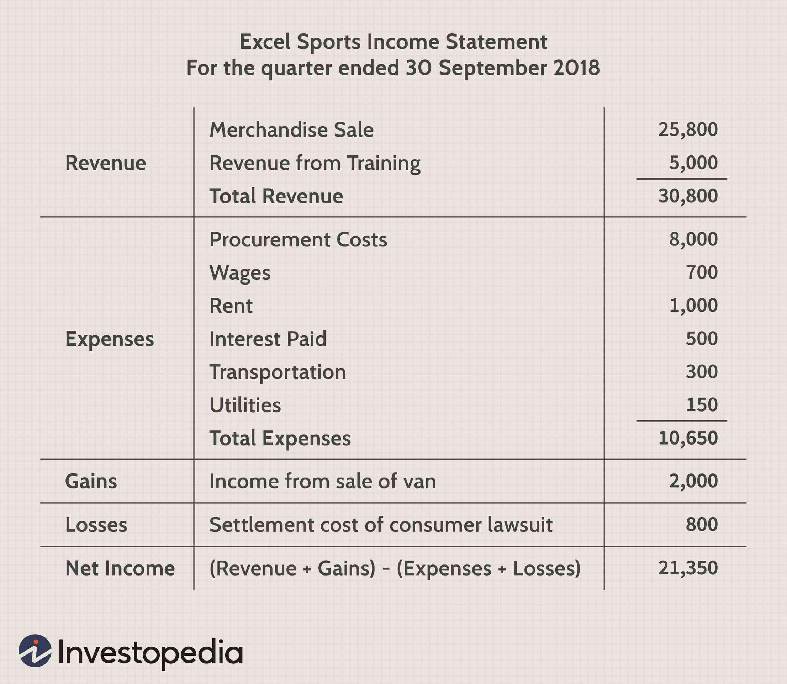

Algorithmic trading utilizes statistical and mathematical models to execute trading decisions in financial markets. These models analyze large datasets to identify patterns and trends that can provide competitive advantages. A vital component of modern trading strategies is the evaluation of model predictions, which ensures that decisions made by these algorithms are robust and reliable. This evaluation is critical as it directly impacts the quality of trading decisions and ultimately, the financial success of the strategy.

One of the key tools used to assess and refine these predictions is the log loss metric. Logarithmic Loss, or log loss, allows traders to quantify the confidence of prediction models beyond simple accuracy. By penalizing models that make incorrect predictions with high confidence, log loss provides a nuanced understanding of model performance.



As financial markets continue to become more complex and competitive, the ability to accurately measure and improve model confidence becomes increasingly crucial for traders and algorithms alike. This article examines the significance of log loss in the context of algorithmic trading and how it can be applied to develop more effective trading strategies.

## Table of Contents

## Understanding Log Loss

Logarithmic Loss, often referred to as Log Loss or Cross-Entropy Loss, is a crucial performance metric for assessing the efficacy of classification models. It serves as a sophisticated measure that quantifies the accuracy of predictions by calculating the deviation between the actual outcomes and predicted probabilities. Unlike simple accuracy, which merely counts the number of correct predictions, Log Loss offers a more nuanced approach by incorporating the confidence level of those predictions.

The fundamental goal of Log Loss is to penalize predictions that are both incorrect and overconfident. It leverages a probability-based framework to achieve this, ensuring that the punishment is proportionate to the confidence level of a wrong prediction. The mathematical expression for Log Loss in binary classification scenarios is:

$$
\text{Log Loss} = -\frac{1}{N} \sum_{i=1}^{N} \left[ y_i \log(p_i) + (1-y_i) \log(1-p_i) \right]
$$

In this formula:
- $N$ represents the total number of observations.
- $y_i$ is the true label for the $i$-th observation (either 0 or 1).
- $p_i$ is the predicted probability that the label is 1.

Log Loss assesses the precision with which the model predicts the probability that each instance belongs to a particular class. By focusing on the certainty aspect of predictions, it becomes especially relevant in contexts like [algorithmic trading](/wiki/algorithmic-trading), where not just the accuracy but the confidence in predictions significantly influences decision-making processes. High Log Loss indicates that the model makes overly confident incorrect predictions, while a lower Log Loss suggests well-calibrated and accurate probability predictions.

This performance metric is vital for trading scenarios because accurate market predictions with aligned confidence levels can lead to more reliable trading strategies and, potentially, better financial outcomes. Hence, incorporating Log Loss in evaluating trading models ensures that the models are not only predicting accurately but are also calibrated in terms of prediction confidence, directly impacting the robustness and success of trading strategies.

## Importance of Log Loss in Algorithmic Trading

In trading, prediction models require not only accuracy but also a strong degree of confidence in their predictions. In this context, Logarithmic Loss, or Log Loss, provides a nuanced evaluation metric that is vital for algorithmic trading strategies. Log Loss measures a model's predictive performance by examining how well probabilistic forecasts correspond to actual outcomes. This approach emphasizes not just achieving correct predictions but also producing well-calibrated probabilities that reflect the true likelihood of these predictions.

The significance of Log Loss in algorithmic trading lies in its ability to reward models that are correct while punishing those that make overly confident incorrect predictions. This is particularly critical given the potential financial repercussions associated with trading models that misjudge market movements. A slight miscalculation can lead to substantial monetary losses due to the high-stakes nature of trading environments.

Mathematically, Log Loss is calculated using the formula:

$$
\text{Log Loss} = -\frac{1}{n} \sum_{i=1}^{n} [y_i \log(p_i) + (1-y_i) \log(1-p_i)]
$$

where $n$ represents the number of observations, $y_i$ is the actual binary outcome, and $p_i$ is the predicted probability of the outcome being positive.

By focusing on Log Loss as a key metric, algorithmic trading models are guided towards producing predictions that not only aim for correctness but also accurately express the probability of being correct. This leads to more informed decision-making, enabling traders to allocate resources efficiently and manage risk effectively. Consequently, Log Loss becomes an indispensable tool for refining trading strategies and achieving robust financial outcomes.

## How Log Loss Affects Trading Models

Log Loss plays a crucial role in refining trading models by discouraging overconfident incorrect predictions, which are particularly detrimental in high-risk financial environments. Unlike mere accuracy, Log Loss evaluates the certainty of predictions, ensuring models not only predict outcomes but also express confidence levels accurately. The metric operates by assigning a greater penalty to predictions that confidently miss the mark, thereby fostering models that provide well-calibrated probabilities.

For trading strategies, where decision reliability is paramount, the use of Log Loss encourages the development of models that better align their probabilistic forecasts with actual market behaviors. This alignment ensures that when a model predicts a market movement with high confidence, it has a substantial basis for that confidence. This feature is vital because a model that consistently outputs high-confidence yet incorrect predictions could lead to significant financial setbacks.

The formula for Log Loss is:

$$
\text{Log Loss} = -\frac{1}{N} \sum_{i=1}^{N} \left[ y_i \log(\hat{y}_i) + (1 - y_i) \log(1 - \hat{y}_i) \right]
$$

where $N$ is the number of observations, $y_i$ is the actual outcome, and $\hat{y}_i$ is the predicted probability of the positive class. This formula reflects how Log Loss penalizes predictions with high confidence that deviate from actual outcomes.

By utilizing Log Loss, trading models are trained to produce probabilities that reflect the true likelihood of market movements, leading to enhanced decision-making capabilities. Well-calibrated predictions mean traders can more accurately determine the probabilities of market trends, making informed strategic moves and reducing the risk of financial losses. In high-stakes trading, the precision of these predictions is critical, as it underpins every trading decision made by algorithmic strategies.

## Calculating Log Loss in Trading Algorithms

Log Loss is a critical metric for evaluating the performance of prediction models, especially in binary classification scenarios, such as predicting whether a stock price will go up or down. Calculating Log Loss in trading algorithms involves leveraging libraries that make the process efficient and accurate. Python's scikit-learn library, a powerful tool for [machine learning](/wiki/machine-learning), offers an accessible method for implementing Log Loss calculations. 

To calculate Log Loss, you follow a systematic approach:

1. **Data Preparation**: Ensure that data is clean and correctly formatted. This involves separating feature variables (e.g., historical stock price indicators) and labels (e.g., actual stock movements). The labels need to be in a binary format, typically represented as 0 for "down" and 1 for "up". 

2. **Predicting Probabilities**: Utilize a predictive model (e.g., logistic regression, decision trees) to estimate the probability of each class for all instances in your dataset. Rather than outputting a single class prediction, the model should output probabilities for each class. For instance, a model might predict a 0.7 probability of the stock price going up and 0.3 probability of it going down.

3. **Computing Log Loss**: Use scikit-learn's `log_loss` function to compute Log Loss. This function takes the true labels and the predicted probabilities as inputs and returns the Log Loss value. The formula for Log Loss is given by:
$$
   \text{Log Loss} = -\frac{1}{N} \sum_{i=1}^{N} \left[ y_i \log(p_i) + (1-y_i) \log(1-p_i) \right]

$$

   where $N$ is the number of samples, $y_i$ is the actual label of sample $i$, and $p_i$ is the predicted probability of label 1 for sample $i$.

Here is an example implementation in Python using scikit-learn:

```python
from sklearn.linear_model import LogisticRegression
from sklearn.metrics import log_loss
from sklearn.model_selection import train_test_split
import numpy as np

# Sample data
X, y = np.random.rand(100, 10), np.random.randint(0, 2, 100)

# Train-test split
X_train, X_test, y_train, y_test = train_test_split(X, y, test_size=0.2, random_state=42)

# Model initialization and training
model = LogisticRegression()
model.fit(X_train, y_train)

# Predict probabilities
y_pred_prob = model.predict_proba(X_test)

# Calculate Log Loss
loss = log_loss(y_test, y_pred_prob)
print(f'Log Loss: {loss}')
```

This step-by-step method not only facilitates the computation of Log Loss but also integrates seamlessly into broader trading algorithm frameworks, helping tune models toward better predictive performance by penalizing overconfident false predictions. Regular evaluation using Log Loss can guide iterative improvements, leading to more robust trading strategies.

## Practical Example of Log Loss in Trading

Consider a trading model designed to predict the probability of stock movements, either an increase or decrease, using historical price data and market indicators. This model outputs a probability score for each movement direction. For instance, it might predict a 70% likelihood that a stock will increase in value and a 30% probability it will decrease.

Log Loss plays an instrumental role in refining such predictive models by evaluating the accuracy and confidence of these probabilistic outcomes. The formula for Log Loss for binary classification is given by:

$$
\text{Log Loss} = -\frac{1}{N} \sum_{i=1}^{N} [y_i \log(p_i) + (1-y_i) \log(1-p_i)],
$$

where $N$ represents the total number of predictions, $y_i$ is the actual binary outcome (1 for up and 0 for down), and $p_i$ is the predicted probability of the outcome being 1.

In practice, consider using a dataset of historical stock prices to train a model. Once trained, the model will output predicted probabilities for stock price movements. Using a programming language like Python and the `scikit-learn` library, the Log Loss can be calculated for these predictions:

```python
from sklearn.metrics import log_loss

# Example true outcomes (1: stock goes up, 0: stock goes down)
y_true = [1, 0, 1, 1, 0]

# Predicted probabilities of stock going up
y_pred_prob = [0.8, 0.2, 0.6, 0.75, 0.1]

# Calculating Log Loss
log_loss_value = log_loss(y_true, y_pred_prob)
print("Log Loss:", log_loss_value)
```

Iterative adjustments to the trading model are essential, as lowering the Log Loss score often indicates improvements in how well the predicted probabilities correspond to actual outcomes. This iterative process involves tweaking algorithmic parameters and recalibrating the model with new data, thereby gradually enhancing prediction confidence and, ultimately, the strategic quality of trades. Over time, this leads to a finely tuned model that more accurately reflects market dynamics, assisting traders in making more informed decisions aligned with market conditions.

## Best Practices for Optimizing Log Loss in Algorithmic Trading

Calibration of predicted probabilities is crucial to optimizing log loss within trading models. Accurate calibration ensures that the predicted probabilities of trading outcomes closely reflect the actual likelihoods, thereby improving decision-making reliability.

Two effective techniques to achieve proper calibration are Platt scaling and isotonic regression. Platt scaling, a method initially developed for support vector machines, helps adjust the output scores to probability estimates. This technique involves fitting a logistic regression model to the scored data, which transforms scores into probabilities expressed as:

$$
P(y=1|x) = \frac{1}{1 + \exp(-(Ax + B))}
$$

Here, $A$ and $B$ are parameters determined from the data. Platt scaling is computationally efficient and works well for binary classification problems.

Isotonic regression, on the other hand, is a non-parametric approach that seeks to find a monotonic function which best fits the data, providing a flexible method to align probabilities. By sorting predicted probabilities and fitting a piecewise constant function, this technique adjusts predictions to reduce log loss, especially effective when data lacks a linear relationship.

Regularization is another key practice in optimizing log loss. It introduces a penalty term to the loss function, discouraging overly complex models that might fit the training data too closely—a phenomenon known as overfitting. Regularization leads to models that generalize better to unseen data, thereby producing more stable and accurate predictions. Common regularization techniques include L1 and L2 regularization, often incorporated as penalty terms in machine learning models. The regularized loss function can be expressed as:

$$
\text{Regularized Loss} = \text{Log Loss} + \lambda \sum_{i=1}^{n} \lvert w_i \rvert^p
$$

where $\lambda$ is the regularization parameter and $p$ is 1 for L1 regularization or 2 for L2 regularization. A balance between adequate model complexity and overfitting prevention is achieved by selecting an appropriate value for $\lambda$.

These methodologies collectively aid in producing trading models that are not only accurate but also reliable in their confidence levels, thereby optimizing log loss and ensuring more effective algorithmic trading strategies.

## Conclusion

Log Loss serves as an essential metric in assessing and boosting both the reliability and confidence of financial models used in algorithmic trading. It provides a framework for not only measuring the accuracy of predictions but also ensuring that models maintain appropriate levels of confidence in their outputs, which is crucial in the high-stakes environment of financial markets.

By focusing on minimizing Log Loss, traders can craft models that go beyond outputting accurate predictions. These models become adept at expressing confidence levels that align closely with reality, thereby reducing the risk of overconfident, erroneous predictions that could lead to substantial financial losses. This balance ensures that decision-making processes within trading algorithms remain robust and resilient against market [volatility](/wiki/volatility-trading-strategies).

Furthermore, continuous efforts to achieve better Log Loss scores enable the refinement of trading strategies. These refinements can lead to more adaptive and sophisticated approaches in navigating market dynamics, potentially resulting in improved financial performance. A focus on reducing Log Loss fosters an iterative cycle of evaluation and adjustment, driving model improvements that resonate with actual market conditions.

In light of ongoing market fluctuations and uncertainties, it is imperative for traders to regularly implement these best practices. Consistently striving for optimized Log Loss scores provides the flexibility and insight required to adapt proactively to market transitions. By doing so, traders can maintain a competitive advantage in the ever-evolving landscape of algorithmic trading, ensuring that their strategies remain effective and ahead of industry trends.

## References & Further Reading

[1]: Bergstra, J., Bardenet, R., Bengio, Y., & Kégl, B. (2011). ["Algorithms for Hyper-Parameter Optimization."](https://papers.nips.cc/paper/4443-algorithms-for-hyper-parameter-optimization) Advances in Neural Information Processing Systems 24.

[2]: ["Advances in Financial Machine Learning"](https://www.amazon.com/Advances-Financial-Machine-Learning-Marcos/dp/1119482089) by Marcos Lopez de Prado

[3]: ["Evidence-Based Technical Analysis: Applying the Scientific Method and Statistical Inference to Trading Signals"](https://www.amazon.com/Evidence-Based-Technical-Analysis-Scientific-Statistical/dp/0470008741) by David Aronson

[4]: ["Machine Learning for Algorithmic Trading"](https://github.com/stefan-jansen/machine-learning-for-trading) by Stefan Jansen

[5]: ["Quantitative Trading: How to Build Your Own Algorithmic Trading Business"](https://books.google.com/books/about/Quantitative_Trading.html?id=j70yEAAAQBAJ) by Ernest P. Chan