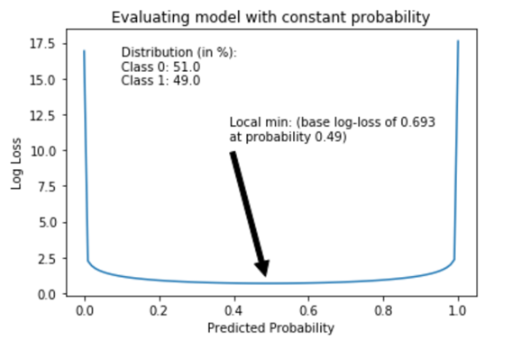

## Table of Contents

## What is log loss scoring?

Log loss, also known as logarithmic loss or cross-entropy loss, is a way to measure how well a model predicts outcomes. It's used a lot in machine learning, especially when the model is trying to guess the chance of something happening. The idea is simple: if the model's guess is close to what actually happens, the log loss score will be low, which is good. But if the model's guess is way off, the log loss score will be high, showing that the model needs to improve.

To calculate log loss, you take the actual outcome and compare it to the predicted probability. If the actual outcome is 1 (meaning the event happened) and the model predicted a high chance, the log loss will be small. But if the model predicted a low chance and the event still happened, the log loss will be big. This method encourages models to be more confident when they're right and less confident when they're wrong, helping them learn and get better over time.

## How is log loss calculated?

Log loss is calculated by taking the negative average of the logarithm of the predicted probabilities. If you have a bunch of predictions and you know what actually happened, you can figure out the log loss. For each prediction, you look at the actual outcome, which is either 0 or 1, and the probability the model predicted. If the actual outcome is 1, you take the log of the predicted probability. If the actual outcome is 0, you take the log of one minus the predicted probability. Then, you multiply this log by -1 to make it positive, because logarithms of numbers between 0 and 1 are negative.

After you do this for all your predictions, you add up all these values and divide by the total number of predictions. This gives you the average log loss, which tells you how well your model is doing. A lower log loss means your model's predictions are closer to what actually happened. A higher log loss means your model's predictions are further away from the truth. So, the goal is to keep tweaking your model to make the log loss as small as possible.

## Why is log loss used in machine learning?

Log loss is used in machine learning because it's a great way to see how good a model is at guessing the chances of things happening. It's especially useful when we want our model to give us a number between 0 and 1 that shows how likely something is. Log loss helps the model learn by giving it a score that goes up when it's wrong and goes down when it's right. This score pushes the model to get better at making accurate guesses over time.

The reason log loss works so well is that it punishes the model more for being very wrong than for being a little wrong. If the model says something is very unlikely to happen and it does happen, the log loss will be big. This makes the model try harder to be more accurate. By using log loss, we can train our models to be more confident when they're right and less confident when they're wrong, which makes them better at predicting things in the real world.

## What does a lower log loss score indicate?

A lower log loss score means that the model is doing a better job at predicting the right outcomes. When the log loss is low, it shows that the model's guesses about the chances of things happening are close to what actually happens. This is good because it means the model is accurate and can be trusted more.

Log loss is all about comparing what the model thinks will happen with what really does happen. If the model says something is very likely to happen and it does, the log loss will be small. But if the model says it's very unlikely and it still happens, the log loss will be big. So, a lower log loss score means the model is making fewer big mistakes and is getting things right more often.

## How does log loss differ from other loss functions like mean squared error?

Log loss and mean squared error (MSE) are both used to measure how good a model is, but they do it in different ways. Log loss is used a lot when we want to know the chance of something happening. It looks at how close the model's guesses are to what really happens, and it cares a lot about how confident the model is. If the model is wrong but very sure about it, log loss will be high. This pushes the model to be careful and not too sure unless it's really right.

On the other hand, mean squared error is used when we want to predict a number, not a chance. It looks at how far off the model's guess is from the real number, and it squares the difference to make big mistakes even bigger. MSE doesn't care about how sure the model is; it just cares about how close the guess is to the right answer. So, while log loss is great for models that guess chances, MSE is better for models that predict numbers.

## Can you explain the mathematical formula for log loss?

The formula for log loss is a way to figure out how good a model is at guessing the chance of something happening. If you have a bunch of predictions and you know what actually happened, you can use this formula. For each prediction, you look at the actual outcome, which is either 0 or 1, and the probability the model predicted. If the actual outcome is 1, you take the log of the predicted probability. If the actual outcome is 0, you take the log of one minus the predicted probability. Then, you multiply this log by -1 to make it positive, because logarithms of numbers between 0 and 1 are negative. After you do this for all your predictions, you add up all these values and divide by the total number of predictions. This gives you the average log loss.

Here's the formula in simple math terms: If you have n predictions, and for each prediction i, the actual outcome is y_i (which is either 0 or 1) and the predicted probability is p_i, then the log loss is calculated as: Log Loss = -1/n * Σ(y_i * log(p_i) + (1 - y_i) * log(1 - p_i)). The Σ means you add up all the values inside it for all the predictions. This formula helps you see how close the model's guesses are to what actually happened, and a lower number means the model is doing a better job.

## What are the common pitfalls when using log loss as a metric?

One common pitfall when using log loss is that it can be sensitive to very small or very large predicted probabilities. If a model predicts a probability very close to 0 or 1, and the actual outcome is the opposite, the log loss can become very large. This can make the model's performance look worse than it really is, especially if these extreme predictions happen a lot. It's important to keep an eye on these extreme cases and maybe adjust the model or the data to avoid them.

Another issue is that log loss can be hard to understand and explain to people who aren't used to it. The numbers can seem confusing because they're based on logarithms, which aren't something everyone is familiar with. This can make it tough to explain why a model is good or bad based on its log loss score. It's helpful to use other, simpler metrics alongside log loss to give a clearer picture of how well the model is doing.

Lastly, log loss might not be the best choice for every kind of problem. It works great for models that predict probabilities, but if you're trying to predict something else, like a number or a category, other metrics might be more useful. It's important to pick the right metric for the job, and sometimes log loss isn't the best fit. Always think about what you're trying to achieve with your model and choose your metrics carefully.

## How can log loss be used to compare different models?

Log loss is a great way to see which model is better at guessing the chances of things happening. You can use it to compare different models by looking at their log loss scores. The model with the lower log loss score is doing a better job because it means its guesses are closer to what really happens. So, if you have two models and one has a log loss of 0.3 and the other has a log loss of 0.5, the first model is better because its score is lower.

But, it's important to use log loss the right way when comparing models. Make sure you're using the same data to test both models, so it's a fair comparison. Also, remember that log loss can be tricky because it can get very high if a model makes a big mistake. So, don't just look at the log loss score alone. It's good to use other ways to check how good the models are too, like looking at how often they get things right or wrong. This way, you'll get a better idea of which model is really the best.

## What impact does class imbalance have on log loss?

Class imbalance can make log loss tricky to use. When you have a lot more examples of one thing than another, like way more 'no' answers than 'yes' answers, the log loss can be misleading. If your model is good at guessing the more common thing but bad at guessing the less common thing, the log loss might still look okay because it's doing well on most of the data. But this can hide the fact that the model isn't good at guessing the less common thing, which can be a big problem if that's what you really care about.

To deal with class imbalance when using log loss, you can try a few things. One way is to make sure your data has a more even mix of the different things you're trying to guess. You can do this by adding more examples of the less common thing or taking away some examples of the more common thing. Another way is to change how you calculate the log loss so it pays more attention to the less common thing. This can help make sure your model is good at guessing both the common and less common things, so your log loss score gives you a better idea of how well your model is really doing.

## How does log loss handle probabilities in classification tasks?

Log loss is a way to see how good a model is at guessing the chances of something happening in classification tasks. When a model predicts the chance of something, like whether it will rain or not, it gives a number between 0 and 1. If the model says it's very likely to rain and it does rain, the log loss will be small, which is good. But if the model says it's very unlikely to rain and it does rain, the log loss will be big, which is bad. This makes the model try harder to guess the right chance, so it learns to be more accurate over time.

Class imbalance can make log loss tricky to use. If there are a lot more examples of one thing than another, like way more days when it doesn't rain than days when it does, the log loss might not show how well the model is doing on the less common thing. The model might be good at guessing when it won't rain but bad at guessing when it will, and the log loss might still look okay because it's doing well on most of the days. To fix this, you can make sure your data has a more even mix of the different things you're trying to guess, or you can change how you calculate the log loss to pay more attention to the less common thing.

## What are some advanced techniques for optimizing models using log loss?

One advanced technique for optimizing models using log loss is to use gradient descent. This is a way to make the model better by slowly changing its guesses to make the log loss smaller. You start with some guesses, then you look at how much the log loss changes when you change those guesses a little bit. If changing a guess makes the log loss go down, you keep changing it that way. If it makes the log loss go up, you change it the other way. By doing this over and over, the model can learn to make better guesses and get a lower log loss score.

Another technique is to use regularization. This helps stop the model from guessing too confidently about things it's not sure about. Sometimes, a model can get a lower log loss by being very sure about its guesses, even if it's wrong sometimes. Regularization adds a little bit to the log loss if the model is too sure, which makes it try to be more careful. This can help the model be more accurate overall and not just good at getting a low log loss score.

## How can log loss be implemented in popular machine learning libraries like scikit-learn?

In scikit-learn, you can use log loss by using the `log_loss` function from the `metrics` module. When you train your model, you make it guess the chances of things happening. Then, you can use `log_loss` to see how good those guesses are. You give it two things: the real outcomes, which are either 0 or 1, and the model's guesses, which are numbers between 0 and 1. The `log_loss` function will then give you a number that tells you how close the model's guesses are to what really happened. A smaller number means the model is doing a better job.

For example, if you have a model that's trying to guess if it will rain or not, you can use `log_loss` to see how well it's doing. You would give `log_loss` the real data about whether it rained (0 for no rain, 1 for rain) and the model's guesses about the chance of rain. If the model's guesses are close to the real outcomes, the log loss score will be low. This helps you know if your model needs to be changed to make better guesses.

## What is Understanding Log Loss?

Logarithmic Loss, often referred to as Log Loss or Cross-Entropy Loss, is a crucial performance metric for assessing the efficacy of classification models. It serves as a sophisticated measure that quantifies the accuracy of predictions by calculating the deviation between the actual outcomes and predicted probabilities. Unlike simple accuracy, which merely counts the number of correct predictions, Log Loss offers a more nuanced approach by incorporating the confidence level of those predictions.

The fundamental goal of Log Loss is to penalize predictions that are both incorrect and overconfident. It leverages a probability-based framework to achieve this, ensuring that the punishment is proportionate to the confidence level of a wrong prediction. The mathematical expression for Log Loss in binary classification scenarios is:

$$
\text{Log Loss} = -\frac{1}{N} \sum_{i=1}^{N} \left[ y_i \log(p_i) + (1-y_i) \log(1-p_i) \right]
$$

In this formula:
- $N$ represents the total number of observations.
- $y_i$ is the true label for the $i$-th observation (either 0 or 1).
- $p_i$ is the predicted probability that the label is 1.

Log Loss assesses the precision with which the model predicts the probability that each instance belongs to a particular class. By focusing on the certainty aspect of predictions, it becomes especially relevant in contexts like [algorithmic trading](/wiki/algorithmic-trading), where not just the accuracy but the confidence in predictions significantly influences decision-making processes. High Log Loss indicates that the model makes overly confident incorrect predictions, while a lower Log Loss suggests well-calibrated and accurate probability predictions.

This performance metric is vital for trading scenarios because accurate market predictions with aligned confidence levels can lead to more reliable trading strategies and, potentially, better financial outcomes. Hence, incorporating Log Loss in evaluating trading models ensures that the models are not only predicting accurately but are also calibrated in terms of prediction confidence, directly impacting the robustness and success of trading strategies.

## What is the importance of log loss in algorithmic trading?

In trading, prediction models require not only accuracy but also a strong degree of confidence in their predictions. In this context, Logarithmic Loss, or Log Loss, provides a nuanced evaluation metric that is vital for algorithmic trading strategies. Log Loss measures a model's predictive performance by examining how well probabilistic forecasts correspond to actual outcomes. This approach emphasizes not just achieving correct predictions but also producing well-calibrated probabilities that reflect the true likelihood of these predictions.

The significance of Log Loss in algorithmic trading lies in its ability to reward models that are correct while punishing those that make overly confident incorrect predictions. This is particularly critical given the potential financial repercussions associated with trading models that misjudge market movements. A slight miscalculation can lead to substantial monetary losses due to the high-stakes nature of trading environments.

Mathematically, Log Loss is calculated using the formula:

$$
\text{Log Loss} = -\frac{1}{n} \sum_{i=1}^{n} [y_i \log(p_i) + (1-y_i) \log(1-p_i)]
$$

where $n$ represents the number of observations, $y_i$ is the actual binary outcome, and $p_i$ is the predicted probability of the outcome being positive.

By focusing on Log Loss as a key metric, algorithmic trading models are guided towards producing predictions that not only aim for correctness but also accurately express the probability of being correct. This leads to more informed decision-making, enabling traders to allocate resources efficiently and manage risk effectively. Consequently, Log Loss becomes an indispensable tool for refining trading strategies and achieving robust financial outcomes.

## How does log loss affect trading models?

Log Loss plays a crucial role in refining trading models by discouraging overconfident incorrect predictions, which are particularly detrimental in high-risk financial environments. Unlike mere accuracy, Log Loss evaluates the certainty of predictions, ensuring models not only predict outcomes but also express confidence levels accurately. The metric operates by assigning a greater penalty to predictions that confidently miss the mark, thereby fostering models that provide well-calibrated probabilities.

For trading strategies, where decision reliability is paramount, the use of Log Loss encourages the development of models that better align their probabilistic forecasts with actual market behaviors. This alignment ensures that when a model predicts a market movement with high confidence, it has a substantial basis for that confidence. This feature is vital because a model that consistently outputs high-confidence yet incorrect predictions could lead to significant financial setbacks.

The formula for Log Loss is:

$$
\text{Log Loss} = -\frac{1}{N} \sum_{i=1}^{N} \left[ y_i \log(\hat{y}_i) + (1 - y_i) \log(1 - \hat{y}_i) \right]
$$

where $N$ is the number of observations, $y_i$ is the actual outcome, and $\hat{y}_i$ is the predicted probability of the positive class. This formula reflects how Log Loss penalizes predictions with high confidence that deviate from actual outcomes.

By utilizing Log Loss, trading models are trained to produce probabilities that reflect the true likelihood of market movements, leading to enhanced decision-making capabilities. Well-calibrated predictions mean traders can more accurately determine the probabilities of market trends, making informed strategic moves and reducing the risk of financial losses. In high-stakes trading, the precision of these predictions is critical, as it underpins every trading decision made by algorithmic strategies.

## How do you calculate log loss in trading algorithms?

Log Loss is a critical metric for evaluating the performance of prediction models, especially in binary classification scenarios, such as predicting whether a stock price will go up or down. Calculating Log Loss in trading algorithms involves leveraging libraries that make the process efficient and accurate. Python's scikit-learn library, a powerful tool for [machine learning](/wiki/machine-learning), offers an accessible method for implementing Log Loss calculations. 

To calculate Log Loss, you follow a systematic approach:

1. **Data Preparation**: Ensure that data is clean and correctly formatted. This involves separating feature variables (e.g., historical stock price indicators) and labels (e.g., actual stock movements). The labels need to be in a binary format, typically represented as 0 for "down" and 1 for "up". 

2. **Predicting Probabilities**: Utilize a predictive model (e.g., logistic regression, decision trees) to estimate the probability of each class for all instances in your dataset. Rather than outputting a single class prediction, the model should output probabilities for each class. For instance, a model might predict a 0.7 probability of the stock price going up and 0.3 probability of it going down.

3. **Computing Log Loss**: Use scikit-learn's `log_loss` function to compute Log Loss. This function takes the true labels and the predicted probabilities as inputs and returns the Log Loss value. The formula for Log Loss is given by:
$$
   \text{Log Loss} = -\frac{1}{N} \sum_{i=1}^{N} \left[ y_i \log(p_i) + (1-y_i) \log(1-p_i) \right]

$$

   where $N$ is the number of samples, $y_i$ is the actual label of sample $i$, and $p_i$ is the predicted probability of label 1 for sample $i$.

Here is an example implementation in Python using scikit-learn:

```python
from sklearn.linear_model import LogisticRegression
from sklearn.metrics import log_loss
from sklearn.model_selection import train_test_split
import numpy as np

# Sample data
X, y = np.random.rand(100, 10), np.random.randint(0, 2, 100)

# Train-test split
X_train, X_test, y_train, y_test = train_test_split(X, y, test_size=0.2, random_state=42)

# Model initialization and training
model = LogisticRegression()
model.fit(X_train, y_train)

# Predict probabilities
y_pred_prob = model.predict_proba(X_test)

# Calculate Log Loss
loss = log_loss(y_test, y_pred_prob)
print(f'Log Loss: {loss}')
```

This step-by-step method not only facilitates the computation of Log Loss but also integrates seamlessly into broader trading algorithm frameworks, helping tune models toward better predictive performance by penalizing overconfident false predictions. Regular evaluation using Log Loss can guide iterative improvements, leading to more robust trading strategies.

## What is a Practical Example of Log Loss in Trading?

Consider a trading model designed to predict the probability of stock movements, either an increase or decrease, using historical price data and market indicators. This model outputs a probability score for each movement direction. For instance, it might predict a 70% likelihood that a stock will increase in value and a 30% probability it will decrease.

Log Loss plays an instrumental role in refining such predictive models by evaluating the accuracy and confidence of these probabilistic outcomes. The formula for Log Loss for binary classification is given by:

$$
\text{Log Loss} = -\frac{1}{N} \sum_{i=1}^{N} [y_i \log(p_i) + (1-y_i) \log(1-p_i)],
$$

where $N$ represents the total number of predictions, $y_i$ is the actual binary outcome (1 for up and 0 for down), and $p_i$ is the predicted probability of the outcome being 1.

In practice, consider using a dataset of historical stock prices to train a model. Once trained, the model will output predicted probabilities for stock price movements. Using a programming language like Python and the `scikit-learn` library, the Log Loss can be calculated for these predictions:

```python
from sklearn.metrics import log_loss

# Example true outcomes (1: stock goes up, 0: stock goes down)
y_true = [1, 0, 1, 1, 0]

# Predicted probabilities of stock going up
y_pred_prob = [0.8, 0.2, 0.6, 0.75, 0.1]

# Calculating Log Loss
log_loss_value = log_loss(y_true, y_pred_prob)
print("Log Loss:", log_loss_value)
```

Iterative adjustments to the trading model are essential, as lowering the Log Loss score often indicates improvements in how well the predicted probabilities correspond to actual outcomes. This iterative process involves tweaking algorithmic parameters and recalibrating the model with new data, thereby gradually enhancing prediction confidence and, ultimately, the strategic quality of trades. Over time, this leads to a finely tuned model that more accurately reflects market dynamics, assisting traders in making more informed decisions aligned with market conditions.

## What are the best practices for optimizing log loss in algorithmic trading?

Calibration of predicted probabilities is crucial to optimizing log loss within trading models. Accurate calibration ensures that the predicted probabilities of trading outcomes closely reflect the actual likelihoods, thereby improving decision-making reliability.

Two effective techniques to achieve proper calibration are Platt scaling and isotonic regression. Platt scaling, a method initially developed for support vector machines, helps adjust the output scores to probability estimates. This technique involves fitting a logistic regression model to the scored data, which transforms scores into probabilities expressed as:

$$
P(y=1|x) = \frac{1}{1 + \exp(-(Ax + B))}
$$

Here, $A$ and $B$ are parameters determined from the data. Platt scaling is computationally efficient and works well for binary classification problems.

Isotonic regression, on the other hand, is a non-parametric approach that seeks to find a monotonic function which best fits the data, providing a flexible method to align probabilities. By sorting predicted probabilities and fitting a piecewise constant function, this technique adjusts predictions to reduce log loss, especially effective when data lacks a linear relationship.

Regularization is another key practice in optimizing log loss. It introduces a penalty term to the loss function, discouraging overly complex models that might fit the training data too closely—a phenomenon known as overfitting. Regularization leads to models that generalize better to unseen data, thereby producing more stable and accurate predictions. Common regularization techniques include L1 and L2 regularization, often incorporated as penalty terms in machine learning models. The regularized loss function can be expressed as:

$$
\text{Regularized Loss} = \text{Log Loss} + \lambda \sum_{i=1}^{n} \lvert w_i \rvert^p
$$

where $\lambda$ is the regularization parameter and $p$ is 1 for L1 regularization or 2 for L2 regularization. A balance between adequate model complexity and overfitting prevention is achieved by selecting an appropriate value for $\lambda$.

These methodologies collectively aid in producing trading models that are not only accurate but also reliable in their confidence levels, thereby optimizing log loss and ensuring more effective algorithmic trading strategies.

## References & Further Reading

[1]: Bergstra, J., Bardenet, R., Bengio, Y., & Kégl, B. (2011). ["Algorithms for Hyper-Parameter Optimization."](https://papers.nips.cc/paper/4443-algorithms-for-hyper-parameter-optimization) Advances in Neural Information Processing Systems 24.

[2]: ["Advances in Financial Machine Learning"](https://www.amazon.com/Advances-Financial-Machine-Learning-Marcos/dp/1119482089) by Marcos Lopez de Prado

[3]: ["Evidence-Based Technical Analysis: Applying the Scientific Method and Statistical Inference to Trading Signals"](https://www.amazon.com/Evidence-Based-Technical-Analysis-Scientific-Statistical/dp/0470008741) by David Aronson

[4]: ["Machine Learning for Algorithmic Trading"](https://github.com/stefan-jansen/machine-learning-for-trading) by Stefan Jansen

[5]: ["Quantitative Trading: How to Build Your Own Algorithmic Trading Business"](https://books.google.com/books/about/Quantitative_Trading.html?id=j70yEAAAQBAJ) by Ernest P. Chan