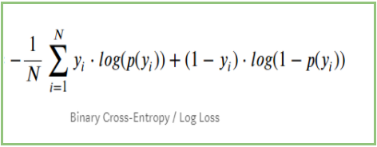

## Table of Contents

## What is Log Loss in the context of machine learning?

Log Loss, also known as logarithmic loss or cross-entropy loss, is a type of loss function used in machine learning, especially for classification problems. It measures the performance of a classification model where the prediction is a probability value between 0 and 1. The goal of Log Loss is to penalize the model more heavily for being very wrong and less for being slightly wrong. This helps the model to improve its predictions over time by minimizing the Log Loss value. The formula for Log Loss for a single example is given by $$-\left[y \cdot \log(p) + (1 - y) \cdot \log(1 - p)\right]$$, where $y$ is the true label (0 or 1), and $p$ is the predicted probability of the positive class.

In practical terms, if a model predicts a probability of 0.9 for a positive class when the true label is actually positive, the Log Loss will be small. However, if the same model predicts a probability of 0.1 for a positive class when the true label is positive, the Log Loss will be much larger. This characteristic makes Log Loss particularly useful in scenarios where understanding the confidence of predictions is important, such as in medical diagnoses or fraud detection. By using Log Loss, machine learning models can be trained to not only predict the correct class but also to provide more accurate probability estimates.

## How is Log Loss calculated?

Log Loss, or logarithmic loss, is a way to measure how well a machine learning model predicts the right answer when it gives a probability. Imagine you're guessing if it will rain. If you say there's a 90% chance it will rain and it actually does rain, you're pretty close, so your Log Loss is small. But if you say there's only a 10% chance and it rains, you're very wrong, and your Log Loss will be big. The formula for Log Loss for one guess is $$-\left[y \cdot \log(p) + (1 - y) \cdot \log(1 - p)\right]$$. Here, $y$ is 1 if the thing you're predicting is true (like rain), and 0 if it's not true. $p$ is your guess about how likely it is to happen.

To calculate Log Loss for many guesses, you add up the Log Loss for each guess and then divide by the number of guesses. This gives you an average Log Loss, which tells you how good your model is overall. If your average Log Loss is small, it means your model is pretty good at guessing the right probabilities. If it's big, your model needs to improve. By using Log Loss, you can make your model better at predicting not just if something will happen, but how likely it is to happen, which is super useful in many situations.

## Why is Log Loss used as a metric in classification problems?

Log Loss is used as a metric in classification problems because it helps measure how well a model's predictions match the actual outcomes, especially when the predictions are given as probabilities. Imagine you're trying to guess if it will rain or not. If you say there's a 90% chance of rain and it actually rains, your guess was pretty good. But if you said there's only a 10% chance and it rains, your guess was way off. Log Loss captures this by giving a higher penalty for being very wrong and a lower penalty for being slightly off. This encourages the model to not just guess the right answer, but to be confident in its guesses when it's right.

The formula for Log Loss for a single guess is $$-\left[y \cdot \log(p) + (1 - y) \cdot \log(1 - p)\right]$$, where $y$ is 1 if the event happens (like rain) and 0 if it doesn't, and $p$ is the probability your model predicts. When you add up the Log Loss for all your guesses and divide by the number of guesses, you get an average Log Loss. A smaller average Log Loss means your model is doing a good job at predicting not just whether something will happen, but how likely it is to happen. This is super important in situations like medical diagnoses or fraud detection, where knowing the probability can be as important as the prediction itself.

## What are the advantages of using Log Loss over other metrics?

Log Loss is great because it really cares about how confident your guesses are. Imagine you're guessing if it will rain. If you say there's a 90% chance and it actually rains, Log Loss says you did pretty well. But if you say there's only a 10% chance and it rains, Log Loss tells you you were way off. This helps your model learn to not just guess right, but to be sure when it's right. The formula for Log Loss for one guess is $$-\left[y \cdot \log(p) + (1 - y) \cdot \log(1 - p)\right]$$, where $y$ is 1 if the thing you're predicting happens and 0 if it doesn't, and $p$ is your guess about how likely it is to happen.

Another advantage of Log Loss is that it works well when you have more than two things to guess between. For example, if you're trying to guess what type of flower a picture shows and there are three types, Log Loss can handle that easily. Other metrics might not be as good at dealing with more than two choices. Plus, Log Loss pushes your model to give you the actual chances of each thing happening, which can be really helpful in making decisions, like in medicine or finance where knowing the odds is important.

## Can you explain the mathematical formula for Log Loss?

The mathematical formula for Log Loss helps us understand how good a guess is when we're predicting if something will happen or not. Imagine you're guessing if it will rain. The formula is $$-\left[y \cdot \log(p) + (1 - y) \cdot \log(1 - p)\right]$$. Here, $y$ is 1 if it actually rains and 0 if it doesn't. $p$ is your guess about how likely it is to rain. If you guess there's a 90% chance of rain and it does rain, the Log Loss will be small because you were pretty close. But if you guess there's only a 10% chance and it rains, the Log Loss will be big because you were way off.

When you're guessing for many different situations, you add up the Log Loss for each guess and then divide by the number of guesses to get an average Log Loss. This average tells you how good your guesses are overall. A smaller average Log Loss means your guesses are pretty good at predicting not just if something will happen, but how likely it is to happen. This is really useful in situations where knowing the chances is important, like in medical diagnoses or predicting if someone will buy something.

## How does Log Loss penalize incorrect predictions?

Log Loss penalizes incorrect predictions by giving a higher penalty when a model's guess is far from the actual outcome. Imagine you're guessing if it will rain. If you say there's a 90% chance of rain and it actually rains, the Log Loss is small because you were close. But if you say there's only a 10% chance of rain and it does rain, the Log Loss is much bigger because you were very wrong. The formula for Log Loss for one guess is $$-\left[y \cdot \log(p) + (1 - y) \cdot \log(1 - p)\right]$$, where $y$ is 1 if it rains and 0 if it doesn't, and $p$ is your guessed chance of rain.

This way, Log Loss encourages the model to not just guess right, but to be confident when it's right. If a model predicts a high chance for something that happens, it gets a small penalty. But if it predicts a low chance for something that happens, it gets a big penalty. This helps the model learn to give better guesses over time, making it more useful in situations where knowing the chances is important, like in medicine or finance.

## What is the range of Log Loss values, and what do they indicate?

Log Loss values can range from 0 to infinity. A Log Loss of 0 means your model's predictions are perfect. Imagine you're guessing if it will rain. If you always guess the right chance, like saying there's a 100% chance when it does rain and a 0% chance when it doesn't, your Log Loss is 0. As your guesses get worse, the Log Loss gets bigger. If you're very wrong, like saying there's a 0% chance of rain when it actually does rain, the Log Loss can get really big, going towards infinity.

The size of the Log Loss tells you how good your model is at guessing the right chance of something happening. A smaller Log Loss means your model is doing a good job at predicting not just if something will happen, but how likely it is to happen. For example, if your average Log Loss is small, it means your model is pretty accurate. But if it's big, your model needs to improve its guesses. The formula for Log Loss for one guess is $$-\left[y \cdot \log(p) + (1 - y) \cdot \log(1 - p)\right]$$, where $y$ is 1 if the thing you're predicting happens and 0 if it doesn't, and $p$ is your guess about how likely it is to happen.

## How can Log Loss be used to compare different models?

Log Loss is a great way to compare different models because it tells you how good each model is at guessing the right chance of something happening. Imagine you have two models guessing if it will rain. Model A says there's a 90% chance of rain when it actually does rain, and Model B says there's only a 60% chance. The Log Loss for Model A will be smaller than for Model B because Model A was closer to the truth. The formula for Log Loss for one guess is $$-\left[y \cdot \log(p) + (1 - y) \cdot \log(1 - p)\right]$$, where $y$ is 1 if it rains and 0 if it doesn't, and $p$ is your guessed chance of rain. By calculating the average Log Loss for all your guesses, you can see which model has the smaller Log Loss and is therefore better at predicting the right chances.

When you compare models using Log Loss, you're looking at how confident each model is in its guesses. If one model has a smaller average Log Loss, it means that model is better at not just guessing if something will happen, but also how likely it is to happen. This is really useful in situations where knowing the chances is important, like in medicine or finance. So, by using Log Loss, you can pick the model that gives you the most accurate and confident predictions, helping you make better decisions.

## What are some common pitfalls when using Log Loss?

One common pitfall when using Log Loss is that it can be sensitive to extreme predictions. If a model predicts a probability very close to 0 or 1 and gets it wrong, the Log Loss can become very large. This can make the model seem worse than it is if it's just overconfident sometimes. Imagine you're guessing if it will rain, and you say there's a 99% chance it won't rain, but it does. The Log Loss for that guess would be huge because you were so sure and so wrong. The formula for Log Loss for one guess is $$-\left[y \cdot \log(p) + (1 - y) \cdot \log(1 - p)\right]$$, where $y$ is 1 if it rains and 0 if it doesn't, and $p$ is your guessed chance of rain.

Another pitfall is that Log Loss can be hard to interpret for people who aren't used to it. Unlike other metrics like accuracy, which is easy to understand because it's just the percentage of correct guesses, Log Loss gives you a number that's not as straightforward. A Log Loss of 0.1 might seem good, but without knowing what's typical for your problem, it's hard to tell if it's really good or not. This can make it tricky to explain to others why one model is better than another based on Log Loss alone.

## How does Log Loss relate to other loss functions like Mean Squared Error?

Log Loss and Mean Squared Error (MSE) are both used to measure how well a model is doing, but they work in different ways. Log Loss is used for classification problems where the model predicts the chance of something happening, like guessing if it will rain. The formula for Log Loss for one guess is $$-\left[y \cdot \log(p) + (1 - y) \cdot \log(1 - p)\right]$$, where $y$ is 1 if the thing happens and 0 if it doesn't, and $p$ is your guessed chance. Log Loss gives a bigger penalty if the model is very wrong about the chance, which helps the model learn to be more accurate about how likely something is to happen.

Mean Squared Error, on the other hand, is often used for regression problems where the model predicts a number, like guessing the temperature. The formula for MSE is $$\frac{1}{n} \sum_{i=1}^{n} (y_i - \hat{y}_i)^2$$, where $y_i$ is the actual number, $\hat{y}_i$ is the predicted number, and $n$ is the number of guesses. MSE measures the average of the squared differences between the predicted and actual numbers. While Log Loss focuses on the accuracy of probability predictions, MSE focuses on how close the predicted numbers are to the actual numbers. Both are useful, but they're used in different situations depending on what you're trying to predict.

## Can Log Loss be used for multi-class classification problems? If so, how?

Yes, Log Loss can be used for multi-class classification problems. In multi-class classification, you're guessing which one of several things will happen, like [picking](/wiki/asset-class-picking) the right type of flower from many types. To use Log Loss here, you need to change the formula a bit. Instead of guessing the chance of one thing happening, you guess the chance for each thing. The formula for Log Loss in multi-class problems is $$-\frac{1}{N} \sum_{i=1}^{N} \sum_{k=1}^{K} y_{ik} \log(p_{ik})$$, where $N$ is the number of guesses, $K$ is the number of classes, $y_{ik}$ is 1 if the guess $i$ belongs to class $k$ and 0 otherwise, and $p_{ik}$ is the predicted chance that guess $i$ belongs to class $k$. This formula adds up the Log Loss for each class and each guess, then averages it out.

Using Log Loss for multi-class problems helps the model learn to give good chances for each class. If the model guesses a high chance for the right class and low chances for the wrong classes, the Log Loss will be small. But if it guesses wrong, like giving a low chance to the right class, the Log Loss will be big. This encourages the model to not just pick the right class, but to be confident when it's right. This is really useful in situations where knowing the chances for each class can help make better decisions, like in medicine or finance.

## How can one optimize a model to minimize Log Loss?

To optimize a model to minimize Log Loss, you need to make the model's guesses as close as possible to the actual outcomes. This means adjusting the model so that when it predicts a high chance for something that happens, it gets a small penalty. The formula for Log Loss for one guess is $$-\left[y \cdot \log(p) + (1 - y) \cdot \log(1 - p)\right]$$, where $y$ is 1 if the thing happens and 0 if it doesn't, and $p$ is your guessed chance. By tweaking the model's parameters, like weights in a [neural network](/wiki/neural-network) or coefficients in a logistic regression, you can make the model's guesses more accurate. This process often involves using an optimization algorithm like gradient descent, which adjusts the parameters to minimize the Log Loss.

During training, you feed the model lots of examples and calculate the Log Loss for each guess. Then, you use the average Log Loss to guide the optimization. If the Log Loss is high, it means the model's guesses are off, so you adjust the parameters to lower the Log Loss. This might involve changing the learning rate or the number of training iterations to find the best balance. Over time, as the model learns from its mistakes, the Log Loss should get smaller, meaning the model is getting better at predicting the right chances. This approach helps the model not just guess right, but be confident when it's right, which is super important in many situations like medical diagnoses or fraud detection.

## References & Further Reading

[1]: Bishop, C. M. (2006). ["Pattern Recognition and Machine Learning"](https://www.cs.uoi.gr/~arly/courses/ml/tmp/Bishop_book.pdf). Springer.

[2]: Murphy, K. P. (2012). ["Machine Learning: A Probabilistic Perspective"](https://www.cs.ubc.ca/~murphyk/MLbook/pml-toc-1may12.pdf). The MIT Press.

[3]: Hastie, T., Tibshirani, R., & Friedman, J. (2009). ["The Elements of Statistical Learning: Data Mining, Inference, and Prediction, Second Edition"](https://link.springer.com/book/10.1007/978-0-387-84858-7). Springer.

[4]: Brier, G. W. (1950). ["Verification of forecasts expressed in terms of probability"](https://journals.ametsoc.org/view/journals/mwre/78/1/1520-0493_1950_078_0001_vofeit_2_0_co_2.xml). Monthly Weather Review, 78(1), 1-3.

[5]: ["The Cross-Entropy Method: A Unified Approach to Combinatorial Optimization, Monte-Carlo Simulation and Machine Learning"](https://link.springer.com/book/10.1007/978-1-4757-4321-0) by Reuven Y. Rubinstein and Dirk P. Kroese.