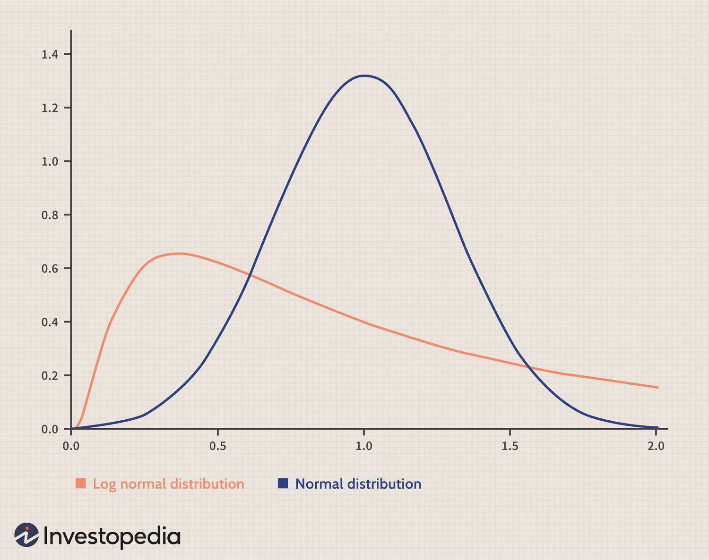

## Table of Contents

## What is the log-normal distribution?

The log-normal distribution is a type of statistical distribution where the natural logarithm of a random variable is normally distributed. This means if you take the log of the values, they will follow a normal (bell-shaped) curve. It's useful for describing data that cannot be negative and often has a long tail on the right side, like income or the size of particles.

In simple terms, if you have a set of numbers where most are small but a few are very large, a log-normal distribution might fit well. For example, in a city, most people might earn a modest salary, but a few might earn a lot more. When you plot these salaries on a graph, it will be skewed to the right. But if you take the log of these salaries, the graph will look more like a normal distribution. This makes it easier to analyze and understand such data.

## How does the log-normal distribution differ from the normal distribution?

The log-normal distribution and the normal distribution are different in some key ways. The normal distribution, often called the bell curve, is symmetric. This means if you fold the curve in the middle, both sides will match up perfectly. It's great for things like height or test scores where most values are around the middle and fewer are on the extremes. On the other hand, the log-normal distribution is not symmetric. It's skewed, usually to the right, meaning it has a long tail on one side. This makes it better for describing things like income or the time it takes to complete a task, where you have many small values and a few very large ones.

Another big difference is that the log-normal distribution only works for positive numbers. If you have data that can't be negative, like weights or prices, the log-normal distribution can be a good fit. In contrast, the normal distribution can include negative numbers, which might not make sense for some types of data. The log-normal distribution comes from taking the logarithm of the data and finding that the log values follow a normal distribution. This transformation helps to handle data that's spread out in a way that a normal distribution can't easily capture.

## What are the parameters of a log-normal distribution?

The log-normal distribution has two main parameters: the mean and the standard deviation of the logarithm of the data. These are often called mu (μ) and sigma (σ). Mu is the average of the log of the data, and sigma is how spread out the log of the data is. These parameters help to shape the log-normal distribution curve.

When you know mu and sigma, you can figure out things like the median and the mode of the original data. The median of the log-normal distribution is just e raised to the power of mu, or exp(mu). The mode, which is the most common value, is a bit more complicated but can also be calculated using mu and sigma. These parameters are important because they let you describe and work with data that has a lot of small values and a few very large ones in a useful way.

## How can one calculate the mean and variance of a log-normal distribution?

The mean of a log-normal distribution can be calculated using its parameters, mu and sigma. If you know these, you can find the mean by using the formula: exp(mu + 0.5 * sigma^2). Here, exp means the exponential function, which is the same as e raised to a power. So, you take mu, add half of sigma squared to it, and then use that as the power for e. This gives you the average value of your data, which will always be bigger than the median because of the way the log-normal distribution is shaped.

The variance of a log-normal distribution tells you how spread out your data is. You can find it using the formula: (exp(sigma^2) - 1) * exp(2 * mu + sigma^2). This looks complicated, but it's just a way to figure out how much your data varies around the mean. The variance will always be positive because log-normal distributions only work with positive numbers. Both the mean and variance help you understand and describe data that has a lot of small values and a few very large ones.

## What are some common real-world applications of the log-normal distribution?

The log-normal distribution is often used to model things like income and wealth. In most places, many people earn a little money, but a few earn a lot. This makes the data spread out with a long tail on the right side. When you take the log of everyone's income, it fits a normal curve better. This helps economists and researchers understand how money is shared among people and plan things like taxes or social programs.

Another place where the log-normal distribution is useful is in studying the size of particles, like dust or pollution in the air. Most particles are tiny, but there are always some bigger ones. This fits the shape of a log-normal distribution. Scientists use this to figure out how harmful the air is and how to clean it up. It's also used in medicine to look at the size of cells or the time it takes for a drug to work in different people's bodies.

In business, the log-normal distribution can help with understanding how long projects might take. Most tasks might finish quickly, but a few might take a lot longer. By using the log-normal distribution, managers can predict how long a project might take overall and plan better. It's also used in finance to look at stock prices, where most days might see small changes but big jumps happen sometimes.

## How can the log-normal distribution be used to model stock prices?

The log-normal distribution is a good way to model stock prices because it can handle the way prices change over time. Stock prices often go up and down a little bit most days, but sometimes they jump a lot. This makes the data spread out with a long tail on the right side. When you take the log of the stock prices, they fit a normal curve better. This helps people in finance understand how prices move and predict what might happen next. They can use this to figure out how risky a stock is and make better decisions about buying or selling.

For example, if you're looking at a stock that usually goes up or down by a small amount each day, but sometimes it makes big jumps, a log-normal distribution can help you see this pattern. By using the log-normal distribution, you can calculate things like the average price over time and how much the price might vary. This is useful for figuring out how much you might gain or lose if you invest in the stock. It helps investors and traders plan their moves and manage their money more wisely.

## What is the process for fitting a log-normal distribution to a dataset?

Fitting a log-normal distribution to a dataset means finding the best values for mu and sigma that make the log-normal curve match your data well. First, you take the natural logarithm of all your data points. This turns your original data into a new set of numbers that should look more like a normal distribution. Then, you use these log values to calculate the mean and standard deviation. The mean of the log values becomes mu, and the standard deviation of the log values becomes sigma. These are the parameters you need for your log-normal distribution.

Once you have mu and sigma, you can use them to describe your original data. You can calculate things like the average value of your data using the formula exp(mu + 0.5 * sigma^2). You can also find out how spread out your data is by calculating the variance with the formula (exp(sigma^2) - 1) * exp(2 * mu + sigma^2). This process helps you understand and work with data that has a lot of small values and a few very large ones, like income or stock prices.

## How do you calculate the probability density function (PDF) of a log-normal distribution?

The probability density function (PDF) of a log-normal distribution tells you how likely it is to get different values in your data. To find it, you first need to know the two parameters of the log-normal distribution: mu and sigma. These are the mean and standard deviation of the logarithm of your data. Once you have mu and sigma, you can use them in a special formula to calculate the PDF. The formula looks a bit complicated, but it's just a way to describe how the data is spread out.

The formula for the PDF of a log-normal distribution is f(x) = (1 / (x * sigma * sqrt(2 * pi))) * exp(-((ln(x) - mu)^2) / (2 * sigma^2)). In this formula, f(x) is the probability density at a specific value x. The ln(x) part means you take the natural logarithm of x. The exp part means you use the exponential function. This formula helps you see how likely it is to get different values in your data, which is useful for understanding things like income or stock prices that often fit a log-normal distribution.

## What are the limitations of using the log-normal distribution in statistical modeling?

Using a log-normal distribution in statistical modeling can be tricky because it assumes that the data fits a certain pattern. If the data doesn't really follow this pattern, using a log-normal distribution can give you wrong answers. For example, if your data has a lot of zeros or negative numbers, a log-normal distribution won't work because it only works with positive numbers. Also, if the data is not skewed enough or is skewed in the wrong way, the log-normal distribution might not be a good fit.

Another problem with the log-normal distribution is that it can be hard to work with. The formulas for calculating things like the mean and variance can be complicated, which might make it harder to understand what the numbers mean. This can be a problem if you need to explain the results to people who aren't experts in statistics. Plus, because the log-normal distribution can have a very long tail, small changes in the data can lead to big changes in the results, which can make it hard to predict things accurately.

## How does the log-normal distribution relate to the central limit theorem?

The log-normal distribution is linked to the central limit theorem, but in a special way. The central limit theorem says that if you take a lot of samples from any kind of data and add them up, the total will look more and more like a normal distribution as you take more samples. But, if you multiply a bunch of numbers together instead of adding them, and those numbers come from a certain kind of distribution, the result will look like a log-normal distribution. This is because when you take the log of the product of numbers, it turns into the sum of the logs of those numbers. So, if the logs of the numbers you're multiplying follow a normal distribution, the product itself will follow a log-normal distribution.

This connection is really useful in real life. For example, if you're looking at things like the growth of money in a bank account or the spread of a disease, you might be multiplying numbers a lot. If those numbers follow certain patterns, the final result will fit a log-normal distribution. This helps scientists and economists predict what might happen next, even if the data is all over the place. It's a powerful tool that comes from understanding how the central limit theorem works with multiplication instead of addition.

## Can you explain the use of the log-normal distribution in environmental science?

In environmental science, the log-normal distribution is often used to study things like the size of particles in the air or water. For example, when scientists look at dust or pollution, they find that most particles are tiny, but there are always some bigger ones. This pattern fits the log-normal distribution well. By using this distribution, scientists can figure out how harmful the air or water might be and how to clean it up. It helps them understand how the particles are spread out and plan ways to make the environment safer.

Another way the log-normal distribution is used in environmental science is to look at things like the amount of a certain chemical in different places. For example, if you're studying how much of a pollutant is in different rivers, you might find that most rivers have a little bit, but a few have a lot more. This kind of data often fits a log-normal distribution. By using this distribution, scientists can predict where the pollution might be worst and how it might spread. This helps them make better plans to protect the environment and keep people safe.

## How can one use software tools like R or Python to simulate and analyze log-normal distributions?

In R, you can use the `rlnorm` function to simulate a log-normal distribution. First, you decide on the values for mu and sigma, which are the mean and standard deviation of the log of your data. Then, you use `rlnorm` to create a bunch of numbers that follow a log-normal distribution with those parameters. For example, if you type `rlnorm(1000, meanlog = 0, sdlog = 1)`, R will give you 1000 numbers that fit a log-normal distribution with mu equal to 0 and sigma equal to 1. After you have these numbers, you can use other R functions like `mean` and `var` to find the average and how spread out the numbers are. You can also make a graph of the numbers using `hist` to see if it looks like the shape you expect.

In Python, you can use the `numpy` library to simulate a log-normal distribution. You start by importing numpy and then use the `numpy.random.lognormal` function to create your data. For example, if you write `import numpy as np` and then `data = np.random.lognormal(mean=0, sigma=1, size=1000)`, Python will give you 1000 numbers that follow a log-normal distribution with mu equal to 0 and sigma equal to 1. After you have these numbers, you can use `numpy` functions like `np.mean` and `np.var` to find the average and how spread out the numbers are. You can also use a library like `matplotlib` to make a graph of the numbers and see if it matches the log-normal shape you're looking for.

## What is the understanding of probability distributions?

Probability distributions are essential constructs in [statistics](/wiki/bayesian-statistics) and data analysis, serving as a mathematical function that offers probabilities of various outcomes for a random variable. This concept allows statisticians and analysts to understand and model the behavior of random phenomena systematically.

A probability distribution is defined by its probability density function (PDF) for continuous variables or its probability mass function (PMF) for discrete variables. These functions are crucial for determining how probabilities are spread across possible outcomes.

Normal and log-normal distributions are prominent examples of such probability distributions, frequently utilized in the finance sector due to their distinct properties and applications.

### The Normal Distribution

The normal distribution, often referred to as the Gaussian distribution, is characterized by its symmetric bell-shaped curve. It is defined by two parameters: the mean ($\mu$) and the standard deviation ($\sigma$). The PDF of a normal distribution is given by:

$$

f(x|\mu, \sigma^2) = \frac{1}{\sqrt{2\pi\sigma^2}} e^{ -\frac{(x-\mu)^2}{2\sigma^2} }
$$

The symmetry of the normal distribution implies that it is suitable for modeling phenomena where outcomes are equally likely to occur above or below the mean. This property makes it ideal for representing a wide array of naturally occurring datasets and financial variables like interest rates and asset returns under stable market conditions.

### The Log-Normal Distribution

In contrast, a log-normal distribution is one where the logarithm of the random variable is normally distributed. This relation implies that parameters characterizing a log-normal distribution are actually those of the associated normal distribution of the logarithm of the variable. If $Y$ is log-normally distributed, then $X = \log(Y)$ follows a normal distribution. Consequently, the log-normal distribution is skewed to the right and only takes positive values, making it particularly useful for modeling financial quantities that cannot be negative, such as stock prices.

The PDF of a log-normal distribution is given by:

$$
f(y|\mu, \sigma^2) = \frac{1}{y \sqrt{2\pi\sigma^2}} e^{ -\frac{(\log(y)-\mu)^2}{2\sigma^2} }
$$

### Applications in Finance

Each distribution's characteristics make it suitable for specific applications within the financial domain. The normal distribution's symmetry is beneficial for modeling scenarios where fluctuations equally deviate around a central value, useful in analyzing financial returns and noise.

On the other hand, the log-normal distribution's positive skewness aligns with the unidirectional growth observed in stock prices and certain asset returns. This makes it indispensable for tasks involving pricing and risk modeling of financial instruments.

Understanding these distributions equips traders and financial analysts with tools to model market behaviors more accurately, thereby aiding in the development of robust trading strategies and risk management practices.

## What are the Basics of Log-Normal Distribution?

A log-normal distribution describes a statistical distribution of a random variable whose logarithm is normally distributed. If a variable $X$ follows a log-normal distribution, the natural logarithm of $X$, denoted as $\ln(X)$, is a normal distribution. This characteristic implies that the variable itself, $X$, can only take positive values, a crucial property for applications in financial markets where negative prices do not exist.

Mathematically, if $Y = \ln(X)$ follows a normal distribution with a mean $\mu$ and variance $\sigma^2$, then $X$ is log-normally distributed. The probability density function (PDF) of a log-normal distribution is given by:

$$

f(x; \mu, \sigma) = \frac{1}{x \sigma \sqrt{2\pi}} e^{-\frac{(\ln x - \mu)^2}{2\sigma^2}} 
$$

for $x > 0$. Here, $\mu$ and $\sigma$ are the parameters of the underlying normal distribution.

In financial contexts, many variables such as stock prices, asset returns, and growth rates are modeled using the log-normal distribution. This modeling choice is due to the necessity of capturing the multiplicative behavior of financial returns and the non-negativity constraint of the variables. For instance, if stock prices are assumed to follow a geometric Brownian motion, their continuous compounding leads to log-normal returns.

The characteristics of the log-normal distribution provide significant insights into financial market dynamics. One distinct feature is its positive skewness, resulting in a long right tail, which reflects the potential for large upward movements in market prices and asset values. This property is particularly beneficial in option pricing models and risk assessment, where capturing the asymmetry and skewness of return distribution is vital.

Furthermore, understanding the properties of the log-normal distribution aids in evaluating the likelihood of various market scenarios and plays a pivotal role in the construction of probabilistic financial models. This insight helps traders and analysts in predicting price movements, evaluating investment risks, and developing robust trading strategies. Overall, the log-normal distribution forms a foundational concept in quantitative finance, aligning mathematical modeling with realistic financial phenomena.

## What are the differences between Normal and Log-Normal Distributions?

Normal and log-normal distributions are fundamental concepts in statistical modeling, each with distinct characteristics suitable for different financial applications. At the core of these distributions is their shape and symmetry, which define their applicability across various scenarios.

Normal distributions, characterized by the bell curve, are symmetric around their mean. This symmetry indicates that values equidistant from the mean occur with equal probability. The normal distribution is defined by two parameters: the mean ($\mu$) and standard deviation ($\sigma$). Its probability density function (PDF) is given by:

$$

f(x | \mu, \sigma^2) = \frac{1}{\sqrt{2\pi\sigma^2}} \exp\left(-\frac{(x-\mu)^2}{2\sigma^2}\right) 
$$

This symmetry is ideal for modeling financial phenomena where the distribution of values is expected to be balanced around the mean, such as certain interest rates or financial returns on a short timescale. 

In contrast, log-normal distributions are skewed to the right, with a long tail, implying that they describe data that can have unusually high values relative to the mean. A variable $X$ is log-normally distributed if $\log(X)$ follows a normal distribution. Therefore, a log-normal distribution is suitable for modeling financial variables constrained to be non-negative, such as stock prices or real estate values, where large upward movements are more pronounced than downward ones. The PDF for a log-normal distribution is:

$$

g(x | \mu, \sigma^2) = \frac{1}{x\sigma\sqrt{2\pi}} \exp\left(-\frac{(\ln(x) - \mu)^2}{2\sigma^2}\right) 
$$

These skewed distributions are often preferred in financial applications where negative values are not just uncommon but impossible by definition. For instance, stock prices, by their nature, cannot fall below zero, making the log-normal model a realistic choice when assessing future price movements.

In practice, choosing between normal and log-normal distributions requires careful consideration of the asset being modeled and the nature of the data. Understanding these differences is essential for algorithmic traders to select the appropriate model, ensuring predictions and assessments reflect market realities.

## What are the implications for risk management?

Log-normal distributions offer substantial advantages in risk management by accurately capturing [volatility](/wiki/volatility-trading-strategies) and price movements. This distribution is particularly beneficial for estimating Value at Risk (VaR), a critical measure for assessing the risk of loss on a portfolio. VaR quantifies the potential loss in value of a portfolio over a defined period for a given confidence interval. Since many asset returns approximate a log-normal distribution, employing it allows for more accurate VaR calculations, which are essential for making informed risk management decisions.

In financial markets, the characteristic that the log-normal distribution captures—non-negative values and positively skewed returns—makes it a fitting model for calculating potential losses. By accurately modeling the distribution of returns, traders can estimate the probability of extreme losses occurring, which aids in determining appropriate capital reserves and risk hedging strategies. For instance, if daily returns $R$ of an asset are log-normally distributed, one can use:

$$
\text{VaR}_{\alpha}(R) = e^{\mu + \sigma \Phi^{-1}(\alpha)} - 1
$$

where $\Phi^{-1}(\alpha)$ is the inverse cumulative distribution function (quantile function) for a standard normal distribution, $\mu$ is the mean, and $\sigma$ is the standard deviation of the log returns. This formula provides a basis for estimating the worst expected loss under normal market conditions at a given confidence level $\alpha$.

Moreover, log-normal distributions assist in developing effective hedging strategies by offering insights into the price increments of assets. Through accurate modeling of expected returns, traders can design hedging mechanisms to protect against adverse price movements. For example, options strategies often rely on the assumption that the underlying asset follows a log-normal process, leading to more effective hedging positions like protective puts or covered calls.

The robustness of log-normal models in capturing volatility ensures that risk managers are better equipped to mitigate risks in fast-moving and volatile markets. This ability to represent the market's behavior more faithfully helps institutions prepare for potential adverse scenarios and adjust their portfolios to optimize returns while minimizing risk exposure.

Understanding the implications of log-normal distributions is critical in the context of risk management. These distributions enable better modeling of financial variables, leading to improved prediction and mitigation of risks, thereby enhancing the stability and performance of trading strategies in volatile market conditions.

## References & Further Reading

[1]: Aitchison, J., & Brown, J. A. C. (1957). "The Lognormal Distribution." Cambridge University Press.

[2]: Hull, J. C. (2015). "Options, Futures, and Other Derivatives." Pearson Education Limited.

[3]: Taleb, N. N. (2010). "The Black Swan: The Impact of the Highly Improbable." Random House Trade Paperbacks.

[4]: Tsay, R. S. (2010). "Analysis of Financial Time Series." Wiley.

[5]: Black, F., & Scholes, M. (1973). "The Pricing of Options and Corporate Liabilities." Journal of Political Economy, 81(3), 637-654.

[6]: Campbell, J. Y., Lo, A. W., & MacKinlay, A. C. (1997). "The Econometrics of Financial Markets." Princeton University Press.

[7]: Wilmott, P. (2006). "Paul Wilmott on Quantitative Finance." Wiley.

[8]: Cont, R., & Tankov, P. (2004). "Financial Modelling with Jump Processes." CRC Press.

[9]: Bouchaud, J.-P., & Potters, M. (2003). "Theory of Financial Risk and Derivative Pricing: From Statistical Physics to Risk Management." Cambridge University Press.