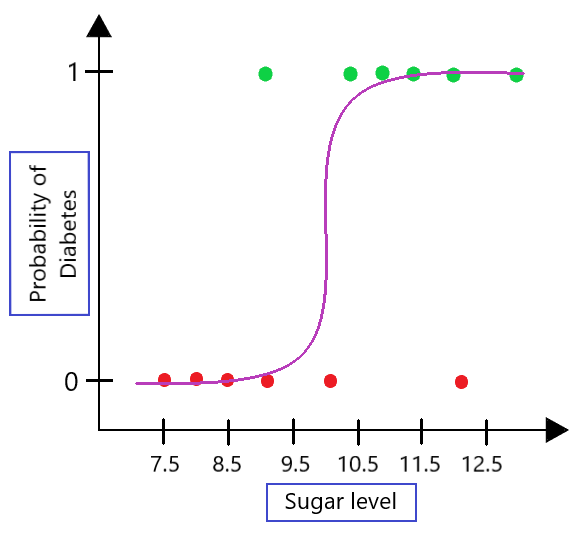

## Table of Contents

## What are log-odds and how are they used in machine learning?

Log-odds, or logits, are a way to express probabilities in a different form. Instead of using a number between 0 and 1, like a probability, log-odds use any number from negative infinity to positive infinity. This is done by taking the logarithm of the odds, which is the ratio of the probability of something happening to the probability of it not happening. For example, if the probability of an event is 0.8, the odds are 0.8/0.2 = 4, and the log-odds would be $$ \log(4) \approx 1.39 $$. Log-odds are useful because they make it easier to work with probabilities in certain mathematical models.

In machine learning, log-odds are often used in models like logistic regression. These models predict the probability of an event, like whether an email is spam or not. The model calculates the log-odds of the event and then converts it back to a probability using a special function called the sigmoid function. This function squashes the log-odds back into a number between 0 and 1. Using log-odds makes the math simpler and helps the model learn better from the data. For example, in a logistic regression model, the output might be a log-odds value, which is then transformed to a probability to make a prediction.

## How do log-odds relate to probability in the context of classification models?

In classification models, log-odds are a way to represent the likelihood of a certain class or event happening. Instead of directly using probabilities, which are numbers between 0 and 1, log-odds use numbers that can range from negative infinity to positive infinity. This is helpful because it makes the math easier for the model to work with. For example, if a model calculates the log-odds, it can use a function called the sigmoid function to turn that number back into a probability. The sigmoid function, which looks like $$ \sigma(x) = \frac{1}{1 + e^{-x}} $$, takes the log-odds and squashes it into a number between 0 and 1.

Log-odds are especially useful in models like logistic regression. In these models, the output of the model is the log-odds of the event happening. For instance, if you're trying to predict if an email is spam, the model might output a log-odds value. To get the actual probability that the email is spam, you would use the sigmoid function on that log-odds value. This way, the model can work with easier-to-handle numbers during its calculations, and then convert them back to probabilities for making predictions.

## What is the mathematical formula for converting probabilities to log-odds?

To convert a probability to log-odds, you first need to find the odds. The odds are the ratio of the probability of an event happening to the probability of it not happening. If the probability of an event is $$ p $$, then the odds are $$ \frac{p}{1-p} $$. Once you have the odds, you take the natural logarithm of that number to get the log-odds. So, the formula for converting a probability $$ p $$ to log-odds is $$ \log\left(\frac{p}{1-p}\right) $$.

For example, if the probability of an event is 0.75, the odds would be $$ \frac{0.75}{1-0.75} = \frac{0.75}{0.25} = 3 $$. Then, to find the log-odds, you take the natural logarithm of 3, which is about 1.10. So, a probability of 0.75 converts to log-odds of about 1.10. This process makes it easier for mathematical models to work with probabilities in a more straightforward way.

## Why are log-odds preferred over probabilities in some machine learning models?

Log-odds are preferred over probabilities in some machine learning models because they make the math easier. When working with probabilities, which are always between 0 and 1, the calculations can become complicated. But with log-odds, you can use any number from negative infinity to positive infinity. This makes it easier for the model to do its calculations and learn from the data. For example, in a logistic regression model, the model calculates the log-odds and then uses the sigmoid function $$ \sigma(x) = \frac{1}{1 + e^{-x}} $$ to convert it back to a probability. This way, the model can work with easier numbers during its calculations and then convert them back to probabilities for making predictions.

Another reason log-odds are preferred is that they can help the model learn better. When a model works with probabilities directly, small changes in the probability can lead to big changes in the model's predictions. But with log-odds, small changes in the log-odds lead to more gradual changes in the predictions. This makes the model more stable and easier to train. For example, if a model is trying to predict if an email is spam, using log-odds can make the model's learning process smoother and more reliable.

## How can log-odds be used to improve the performance of logistic regression models?

Log-odds help improve the performance of logistic regression models by making the math easier to work with. In logistic regression, the model calculates the log-odds of an event happening, like whether an email is spam or not. This means the model can use numbers that range from negative infinity to positive infinity, which is simpler than working with probabilities that are always between 0 and 1. The log-odds are then converted back to probabilities using the sigmoid function, $$ \sigma(x) = \frac{1}{1 + e^{-x}} $$. This makes the model's calculations smoother and more manageable.

Using log-odds also helps the model learn better. When a model works directly with probabilities, small changes in the probability can lead to big changes in the model's predictions. But with log-odds, small changes lead to more gradual changes in the predictions. This makes the model more stable and easier to train. For example, if a model is trying to predict if an email is spam, using log-odds can make the learning process smoother and more reliable. This can lead to better performance because the model can adjust its predictions more smoothly as it learns from the data.

## What are the advantages of using log-odds in decision-making processes in machine learning?

Log-odds make decision-making in machine learning easier and more reliable. Instead of using probabilities, which are always between 0 and 1, log-odds can be any number from negative infinity to positive infinity. This makes the math simpler for the model to handle. For example, in a logistic regression model, the model calculates the log-odds of an event happening, like whether an email is spam or not. Then it uses a special function called the sigmoid function, $$ \sigma(x) = \frac{1}{1 + e^{-x}} $$, to turn the log-odds back into a probability. This makes the model's calculations smoother and easier to manage.

Using log-odds also helps the model learn better and make more stable decisions. When a model works directly with probabilities, small changes in the probability can lead to big changes in the model's predictions. But with log-odds, small changes lead to more gradual changes in the predictions. This makes the model more stable and easier to train. For example, if a model is trying to predict if an email is spam, using log-odds can make the learning process smoother and more reliable. This can lead to better decision-making because the model can adjust its predictions more smoothly as it learns from the data.

## How do log-odds help in handling class imbalance problems in classification?

Log-odds help with class imbalance problems in classification by making it easier for the model to learn from imbalanced data. In a class imbalance situation, one class might have many more examples than the other. When using probabilities directly, the model might struggle to predict the less common class correctly because it sees fewer examples of it. But with log-odds, the model can work with numbers that can be any value from negative infinity to positive infinity. This makes it easier for the model to adjust its predictions and learn from the data, even when the classes are imbalanced.

For example, in a logistic regression model, the model calculates the log-odds of an event happening and then converts it back to a probability using the sigmoid function, $$ \sigma(x) = \frac{1}{1 + e^{-x}} $$. This conversion helps the model handle imbalanced classes better because it can adjust the log-odds more smoothly. By working with log-odds, the model can better understand the relationship between the features and the less common class, leading to more accurate predictions even when the data is imbalanced.

## Can you explain the concept of log-odds ratio and its application in feature selection?

The log-odds ratio is a way to compare the odds of something happening in one group to the odds of it happening in another group. It's used a lot in statistics and machine learning to see how different features affect the outcome. To find the log-odds ratio, you first calculate the odds for each group, then divide one by the other, and finally take the natural logarithm of that number. For example, if you want to know how much more likely it is for people with a certain feature to have a disease compared to people without that feature, you can use the log-odds ratio. The formula for the log-odds ratio is $$ \log\left(\frac{\text{odds}_1}{\text{odds}_2}\right) $$. This helps to understand the strength of the relationship between the feature and the outcome.

In feature selection for machine learning, the log-odds ratio can be really helpful. It helps you figure out which features are most important for predicting the outcome. By looking at the log-odds ratio for each feature, you can see which ones have the biggest impact on the odds of the outcome happening. For example, if you're trying to predict whether a customer will buy a product, you might look at different features like age, income, and past purchases. The log-odds ratio can tell you which of these features has the strongest effect on the likelihood of a purchase. This way, you can choose the most important features to include in your model, making it simpler and more accurate.

## How do log-odds contribute to the interpretability of machine learning models?

Log-odds help make machine learning models easier to understand by turning probabilities into numbers that can be any value from negative infinity to positive infinity. This makes it simpler for people to see how different features affect the model's predictions. For example, in a logistic regression model, the model calculates the log-odds of an event happening, like whether a customer will buy a product. By looking at the log-odds, you can see how much each feature changes the likelihood of the event. This makes it easier to explain why the model makes certain predictions.

Using log-odds also helps with comparing the importance of different features. The log-odds ratio, which is calculated as $$ \log\left(\frac{\text{odds}_1}{\text{odds}_2}\right) $$, shows how much more likely an event is to happen in one group compared to another. This can be really useful for figuring out which features have the biggest impact on the model's predictions. By understanding the log-odds ratio for each feature, you can see which ones are most important for the model's decisions, making it easier to explain the model's behavior to others.

## What are the challenges and limitations of using log-odds in machine learning?

Using log-odds in machine learning can be tricky because they can sometimes make things more complicated instead of simpler. Even though log-odds help with math, they can be hard to understand for people who are not used to working with them. For example, if you tell someone that the log-odds of an event happening are 1.5, they might not know what that means without converting it back to a probability. Also, log-odds can make it harder to explain the model's predictions to people who are not experts in math or machine learning.

Another challenge is that log-odds can be sensitive to small changes in the data. If the data has a lot of noise or if it changes a little bit, the log-odds can change a lot, which can make the model's predictions less reliable. For example, if the probability of an event is close to 0 or 1, the log-odds can become very large or very small, which can cause problems in the model's calculations. This is because the formula for converting probabilities to log-odds is $$ \log\left(\frac{p}{1-p}\right) $$, and when $$ p $$ is close to 0 or 1, the log-odds can go to negative or positive infinity. So, while log-odds can help in many ways, they also have some limitations that need to be carefully managed.

## How can log-odds be integrated with other advanced machine learning techniques like deep learning?

Log-odds can be integrated with deep learning by using them as the output of the final layer in a neural network. In a deep learning model, the last layer often uses a function like the sigmoid function to turn the model's output into a probability. But before that, the model can calculate log-odds. For example, if the model is trying to predict if an image is of a cat or a dog, it can calculate the log-odds of it being a cat. The formula for converting the model's output to log-odds is $$ \log\left(\frac{p}{1-p}\right) $$, where $$ p $$ is the probability of the event. Then, the sigmoid function $$ \sigma(x) = \frac{1}{1 + e^{-x}} $$ can be used to turn the log-odds back into a probability. This way, the model can work with easier numbers during its calculations and then convert them back to probabilities for making predictions.

Using log-odds in deep learning can also help the model learn better. When a deep learning model works directly with probabilities, small changes in the probability can lead to big changes in the model's predictions. But with log-odds, small changes lead to more gradual changes in the predictions. This makes the model more stable and easier to train. For example, if a deep learning model is trying to predict if a text message is spam, using log-odds can make the learning process smoother and more reliable. This can lead to better performance because the model can adjust its predictions more smoothly as it learns from the data.

## What are some real-world examples or case studies where log-odds have significantly impacted the outcome of a machine learning project?

In a healthcare project, researchers used log-odds to predict the likelihood of patients developing a certain disease based on their medical history and lifestyle factors. By using log-odds in a logistic regression model, they were able to see how different factors like age, diet, and exercise affected the odds of getting the disease. The log-odds helped the model learn better from the data, even though some factors were more common than others. This made the predictions more accurate and helped doctors understand which factors were most important for preventing the disease. The formula they used to convert probabilities to log-odds was $$ \log\left(\frac{p}{1-p}\right) $$, where $$ p $$ is the probability of the event.

In another case, a company used log-odds to improve their email spam filter. They built a logistic regression model that calculated the log-odds of an email being spam based on features like the sender's email address, the email's content, and the time it was sent. Using log-odds made the model more stable and easier to train, especially since spam emails were much less common than non-spam emails. This helped the model handle the class imbalance problem better and make more accurate predictions. As a result, the spam filter became much better at identifying and filtering out spam emails, improving the user experience.