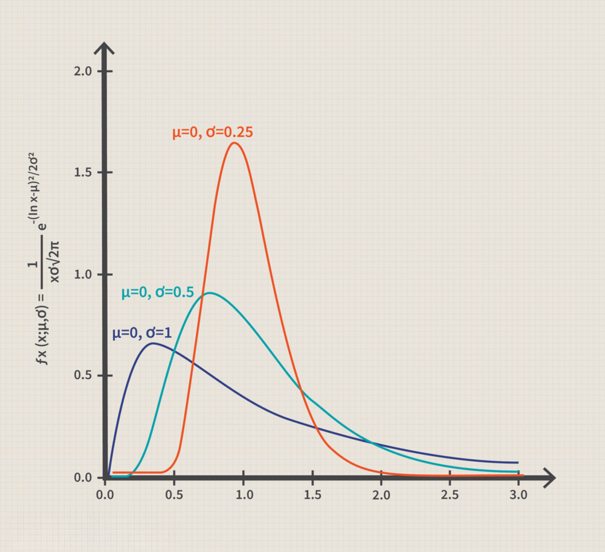

Algorithmic trading combines advanced algorithms and models to facilitate trading decisions at high speeds, capitalizing on minute market fluctuations. The unpredictable nature of financial markets necessitates sophisticated strategies to achieve consistent profitability. One emerging strategy in algorithmic trading is the application of probability distributions to refine trading algorithms. Among these, the log-uniform distribution has gained traction due to its efficacy in handling parameters that span numerous orders of magnitude.

This statistical distribution proves particularly effective when optimizing hyperparameters, which are critical settings within trading algorithms. Hyperparameters can substantially affect the performance of a trading strategy, and their optimal selection is crucial for success in the volatile and fast-changing market environment. Parameters like trading thresholds may vary widely, and a log-uniform distribution provides a structured approach to exploring such extensive parameter ranges methodically.



By focusing on log-uniform distribution, this article highlights its advantages in enhancing hyperparameter optimization in trading algorithms. It showcases the distribution's capacity to efficiently search vast parameter spaces, increasing the likelihood of discovering optimal configurations. Additionally, the article discusses practical implementation, specifically using Hyperopt, a tool designed for systematic hyperparameter optimization in complex models.

## Table of Contents

## What is Log-Uniform Distribution?

A log-uniform distribution is characterized by the uniform distribution of the logarithm of a variable, rather than the variable itself. Mathematically, if a variable $X$ is log-uniformly distributed over the interval $[a, b]$, then $\log(X)$ is uniformly distributed over $[\log(a), \log(b)]$. This property makes log-uniform distributions particularly suitable for modeling parameters that span several orders of magnitude, where a multiplicative difference is more relevant than an additive one.

In [algorithmic trading](/wiki/algorithmic-trading) and [machine learning](/wiki/machine-learning) applications, many hyperparameters such as learning rates, decay rates, or thresholds may differ in scale by multiple factors of ten. For instance, a learning rate might need to be optimized over a range from 0.0001 to 1. In these cases, a log-uniform distribution ensures that each order of magnitude is equally represented, allowing for an unbiased search across the parameter space.

The key distinction between a uniform and a log-uniform distribution is the scaling of the x-axis. While a uniform distribution scales linearly, a log-uniform distribution scales logarithmically. This means, for a log-uniformly distributed random variable, the probability density remains constant not in the variable space but in the log-transformed space. This translates into a probability density function (PDF) that is inversely proportional to the value of the variable when observed in the original scale, typically resulting in a PDF of the form:

$$
f(x) = \frac{1}{x (\log(b) - \log(a))},
$$

for $x$ within the range $[a, b]$.

Using a log-uniform distribution can be crucial when optimizing models that require exploring a wide range of potential configurations efficiently. This distribution inherently provides a way to assign equal importance to each logarithmic scale section, ensuring comprehensive exploration without oversampling specific intervals, thus providing a more balanced and effective parameter search process.

## Applications in Algorithmic Trading

Algorithmic trading involves the use of advanced computational algorithms to enhance trading strategies by optimizing various hyperparameters. These hyperparameters may include trading thresholds, execution thresholds, and other variables that often vary across multiple orders of magnitude. The effectiveness of a trading algorithm can significantly depend on the careful tuning of these parameters, as improper configurations may lead to suboptimal performance or increased financial risk.

Log-uniform distribution proves advantageous in this context by facilitating the exploration of parameter spaces that span several orders of magnitude efficiently. Instead of treating hyperparameters as if they vary linearly, which can miss critical values especially when dealing with multiplicative scales, the log-uniform distribution considers the logarithmic nature of parameter growth. By employing a log-uniform distribution, algorithms can systematically sample potential values, allowing for a more exhaustive search of the parameter space and potentially uncovering better-performing configurations.

To automate this optimization process, tools like Hyperopt are frequently used. Hyperopt provides a robust framework for hyperparameter tuning, employing both Bayesian optimization and random search strategies. For log-uniform distribution, a typical implementation might look like this in Python:

```python
from hyperopt import fmin, tpe, hp

space = {
    'learning_rate': hp.loguniform('learning_rate', -10, 0)
}

best = fmin(
    fn=objective,  # Define your objective function here
    space=space,
    algo=tpe.suggest,
    max_evals=100
)
```

In this code snippet, `hp.loguniform` is used to define a hyperparameter `learning_rate` which would be explored on a logarithmic scale between $e^{-10}$ and $e^0$ (approximately between $4.54 \times 10^{-5}$ and 1). This approach not only streamlines the process of identifying optimal hyperparameters but also enhances the overall robustness and adaptability of the trading algorithm. By systematically exploring a broader array of possible configurations, traders can improve the performance of their strategies in a way that is both efficient and comprehensive.

The capability to fine-tune these influential parameters is crucial for achieving superior results in algorithmic trading. As financial markets are inherently dynamic and complex, leveraging log-uniform distributions in this way provides traders with a significant competitive advantage by adapting to market conditions and optimizing trading outcomes effectively.

## Benefits of Using Log-Uniform Distribution

Log-uniform distribution is an efficient tool for parameter optimization in algorithmic trading due to its ability to manage parameters that span multiple orders of magnitude. Unlike traditional uniform distributions that handle parameters on a linear scale, the log-uniform distribution operates on a logarithmic scale, ensuring a more balanced exploration of possible parameter values.

The primary advantage of using a log-uniform distribution is its comprehensive coverage of the search space. In a linear setting, certain parameter ranges, especially those of smaller magnitude, can be underrepresented, potentially overlooking optimal settings. By transforming the scale logarithmically, each order of magnitude is given equal representation, increasing the probability of identifying optimal parameters that might be missed on a linear scale.

Moreover, in algorithmic trading, parameters such as [volatility](/wiki/volatility-trading-strategies) thresholds, execution times, and other critical metrics often range widely. A log-uniform distribution facilitates a proportional investigation of these values, allowing for an enhanced diversity of potential solutions. This characteristic is crucial, as it ensures that all values within the specified range are equally probable when evaluated on a logarithmic scale.

Mathematically, if $x$ is a random variable that follows a log-uniform distribution between $a$ and $b$, then the logarithm of $x$, i.e., $\log(x)$, is uniformly distributed between $\log(a)$ and $\log(b)$. This can be expressed as:

$$

\log(x) \sim \text{U}(\log(a), \log(b))
$$

This ensures that each decade (order of magnitude) within the range holds the same probability mass, leading to a uniform exploration of scaling factors. The application of log-uniform distribution enhances the ability to adjust algorithmic strategies dynamically, thereby optimizing performance metrics such as profitability and reduction of risk exposure.

In summary, the log-uniform distribution presents a significant benefit for optimizing algorithmic trading strategies by enabling efficient sampling of hyperparameters across vast scales, which is critical for maintaining robust and adaptable trading algorithms in fluctuating market scenarios.

## Implementing Log-Uniform Distribution in Hyperopt

Hyperopt is a widely-used open-source library in Python designed for optimizing hyperparameters. It is particularly valuable in contexts requiring precise parameter tuning, such as in algorithmic trading, where even minor adjustments can significantly impact performance. One of Hyperopt's salient features is its support for log-uniform distributions, which accommodates parameters spanning multiple magnitudes of scale, thus ensuring comprehensive exploration of potential values.

To implement a log-uniform distribution in Hyperopt, users first define the range in which they expect the parameters to vary. This is accomplished by specifying the lower and upper bounds of the parameter in its log scale, effectively creating a space where the logarithm of the parameter values is uniformly sampled. The objective is to account for parameters that, due to their nature and influence on the model, could take on values over several orders of magnitude.

Consider, for example, a situation where we need to optimize a parameter, $\theta$, that represents a trading threshold. In many scenarios, $\theta$ could range from 0.001 to 10. While a uniform distribution would linearly sample this interval, a log-uniform distribution ensures that Hyperopt samples in logarithmic space, introducing more diversity in the parameter values sampled and thus increasing the robustness of the algorithm. 

The implementation in Hyperopt can be illustrated with Python code:

```python
from hyperopt import hp, fmin, tpe, Trials

# Define the parameter space with a log-uniform distribution
parameter_space = {
    'trading_threshold': hp.loguniform('trading_threshold', np.log(0.001), np.log(10))
}

# Objective function to minimize (or maximize)
def objective_function(params):
    trading_threshold = params['trading_threshold']
    # Code to evaluate the trading strategy’s performance with current trading_threshold
    # For illustration, assume a hypothetical score is calculated
    score = evaluate_strategy(trading_threshold)
    return {'loss': -score, 'status': hyperopt.STATUS_OK}

# Running the optimization using Tree-structured Parzen Estimator (TPE) algorithm
trials = Trials()
best_params = fmin(fn=objective_function,
                   space=parameter_space,
                   algo=tpe.suggest,
                   max_evals=100,
                   trials=trials)

print(f"Optimal Parameters: {best_params}")
```

In this code, the `hp.loguniform` function is used to define the `trading_threshold` parameter range in log-scale. The optimization process employs the Tree-structured Parzen Estimator (TPE) algorithm, which is adept at navigating complex parameter spaces and finding the optimal parameter set that minimizes the objective function, here represented by a hypothetical performance score of a trading strategy.

Hyperopt's ability to optimize over log-uniform distributions enhances its suitability for algorithmic trading applications where parameters often encompass a wide range, enabling traders and developers to identify configurations that maximize returns and reduce risks effectively.

## Case Studies and Real-World Implementation

Several case studies have highlighted the success of employing log-uniform distribution in optimizing algorithmic trading strategies. By facilitating the exploration of extensive parameter spaces, log-uniform distribution has led to significant enhancements in trading performance metrics, such as profitability and risk management.

One notable case involved a trading firm utilizing an algorithm designed for high-frequency trading in volatile markets. By applying the log-uniform distribution to tune hyperparameters such as trade execution thresholds and stop-loss levels, the firm observed a marked improvement in the algorithm's profitability. This enhancement was primarily due to the algorithm's ability to efficiently operate across a broad range of market conditions.

In another instance, a [hedge fund](/wiki/hedge-fund-trading-strategies) employed log-uniform distribution in optimizing the learning rate and regularization parameters of a machine learning model used for predicting stock price movements. The distribution allowed the model to adapt quickly to market changes, resulting in more accurate predictions and improved decision-making capabilities. Consequently, the hedge fund reported a reduction in risk exposure while maximizing returns on investment.

Real-world applications further underscore the benefits of using log-uniform distribution. Traders report increased flexibility and responsiveness in strategy execution. In environments characterized by rapid and unpredictable market fluctuations, the ability to swiftly adjust trading parameters is invaluable. Log-uniform distributions provide a unique advantage by enabling the identification of optimal parameter settings that might otherwise remain undiscovered using traditional uniform or linear scales.

The competitive edge offered by this approach lies in its capacity to encompass multiple scales in parameter tuning. This ensures thorough coverage of potential configurations, enhancing the robustness of trading algorithms in dynamic market conditions. Consequently, log-uniform distribution emerges as a crucial tool in the continual quest to refine algorithmic trading strategies for better performance and lower risk.

## Conclusion

The integration of log-uniform distribution into algorithmic trading has proven to be a substantial advancement in optimizing trading strategies. By accounting for the wide variability inherent in hyperparameters, the use of log-uniform distribution offers a flexible and comprehensive exploration of potential parameter configurations. This capability is particularly important given the diverse range of scales over which parameters can vary in algorithmic models, which traditional linear approaches might overlook.

The key to this improvement lies in the ability of the log-uniform distribution to evenly explore a logarithmic scale, ensuring that each interval on a logarithmic scale is equally probable. This characteristic is especially useful for exploring parameters such as learning rates, thresholds, and other critical variables that can span multiple magnitudes. By effectively covering these scales, algorithmic trading strategies can achieve more robust optimization, as they capture potential solutions that linear distributions might miss. 

As trading algorithms evolve, the demand for more sophisticated and adaptive strategies continues to grow. The flexible nature of the log-uniform distribution supports this evolution by offering a tool that aligns well with the complex requirements of modern trading frameworks. As statistical methods advance, leveraging the log-uniform distribution will likely become a core element of successful algorithmic trading, facilitating the development of strategies that are not only more efficient but also better equipped to handle the volatility and unpredictability of financial markets.

## References & Further Reading

[1]: Bergstra, J., Bardenet, R., Bengio, Y., & Kégl, B. (2011). ["Algorithms for Hyper-Parameter Optimization."](https://papers.nips.cc/paper/4443-algorithms-for-hyper-parameter-optimization) Advances in Neural Information Processing Systems 24.

[2]: ["Advances in Financial Machine Learning"](https://www.amazon.com/Advances-Financial-Machine-Learning-Marcos/dp/1119482089) by Marcos Lopez de Prado

[3]: ["Evidence-Based Technical Analysis: Applying the Scientific Method and Statistical Inference to Trading Signals"](https://www.amazon.com/Evidence-Based-Technical-Analysis-Scientific-Statistical/dp/0470008741) by David Aronson

[4]: ["Machine Learning for Algorithmic Trading"](https://github.com/stefan-jansen/machine-learning-for-trading) by Stefan Jansen

[5]: ["Quantitative Trading: How to Build Your Own Algorithmic Trading Business"](https://books.google.com/books/about/Quantitative_Trading.html?id=j70yEAAAQBAJ) by Ernest P. Chan